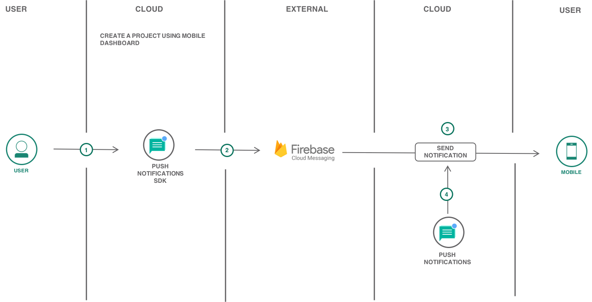
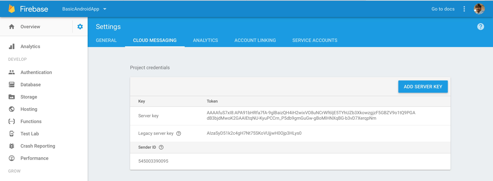
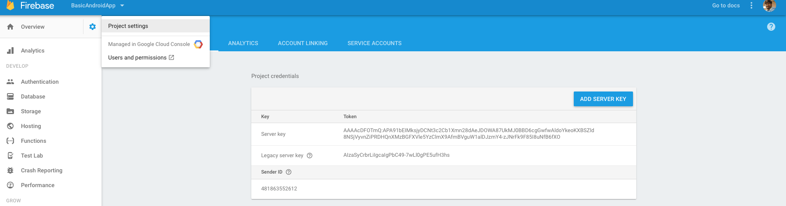
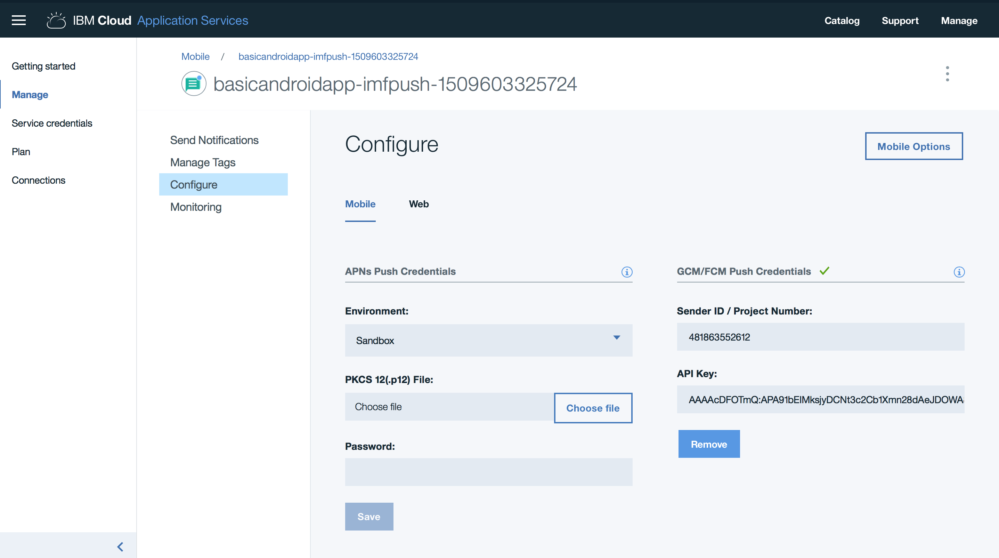
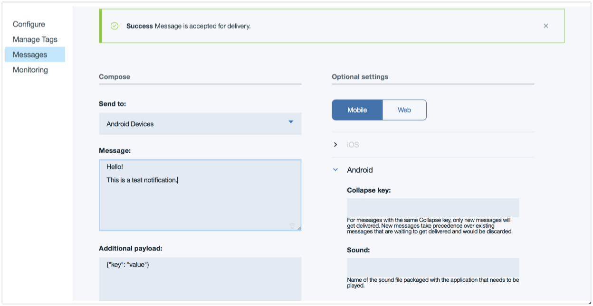
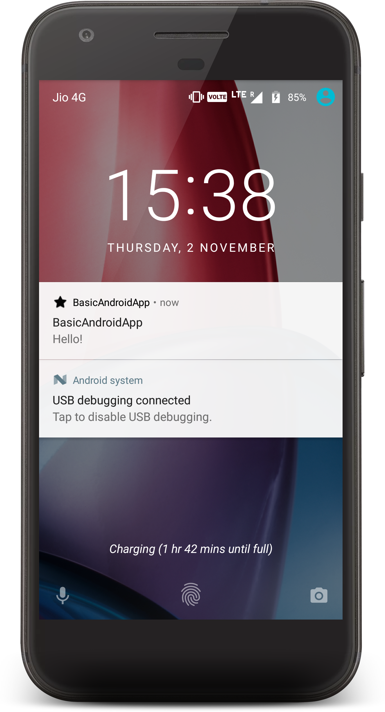
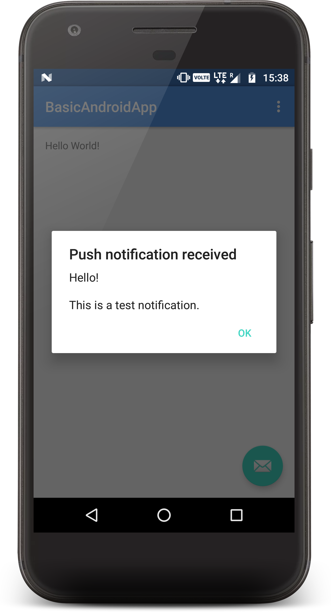
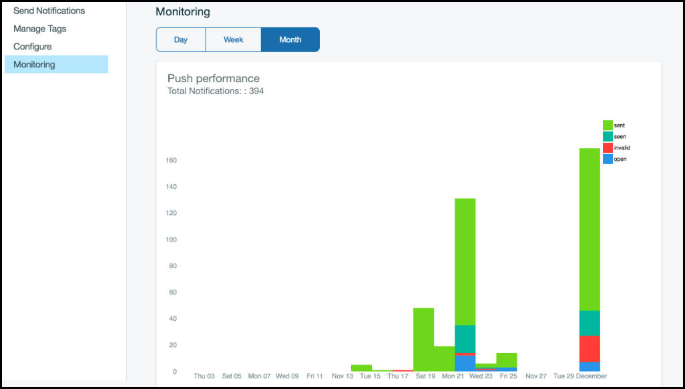

{:shortdesc: .shortdesc}
{:new_window: target="_blank"}
{:codeblock: .codeblock}
{:screen: .screen}
{:tip: .tip}
{:pre: .pre}

# Android native mobile application with Push Notifications
{: #android-mobile-push-analytics}

Learn how easy it is to quickly create a native Android application with high-value mobile service like {{site.data.keyword.mobilepushshort}} on {{site.data.keyword.Bluemix_notm}}.

This tutorial walks you through the creation of a mobile starter application, adding a mobile service, setting up client SDK, importing the code to Android Studio and then further enhancing the application.

## Objectives
{: #objectives}

* Create a mobile app with {{site.data.keyword.mobilepushshort}} service.
* Obtain FCM credentials.
* Download the code and complete required setup.
* Configure, send, and monitor {{site.data.keyword.mobilepushshort}}.

## Services
{: #services}

This tutorial uses the following runtimes and services:
* [{{site.data.keyword.pushfull}}](https://{DomainName}/catalog/services/push-notifications)

## Architecture
{:#architecture}

1. The user creates a project on the App Development page.
2. Adds and configures the push notifications SDK to interact with FCM.
3. Sends a push notification.
4. The {{site.data.keyword.mobilepushshort}} service sends the notification to FCM.
5. The notification is received on the device and monitored.

## Before you begin
{: #prereqs}

- [Android Studio](https://developer.android.com/studio/index.html) for importing and enhancing your code.
- Google account to log into Firebase console for Sender ID and Server API Key.

## Create Android mobile app from starter kit
{: #get_code}
The {{site.data.keyword.Bluemix_notm}} App Development allows you to fast-track your mobile app development by creating your app from a Starter Kit.
1. Navigate to [App Development](https://{DomainName}/appservice/dashboard) and click on **Get Started**.
2. Scroll and click on **Mobile App with Push Notifications** starter kit.
3. Click **Create app** and enter an app name(this will be your android project name as well) > select a resource group.
4. Select **Android** as your platform.
5. Under **Service details** section,
    - Select {{site.data.keyword.pushfull}} region
    - Select a resource group
    - Select a **Lite** plan.
6. Click **Create**. A new App will be created under **Apps** of [Resource list](https://{DomainName}/resources).

In the next step, you will obtain Firebase Cloud Messaging (FCM) credentials.

## Obtain FCM credentials
{: #obtain_fcm_credentials}

Firebase Cloud Messaging (FCM) is the gateway used to deliver {{site.data.keyword.mobilepushshort}} to Android devices, Google Chrome browser, and Chrome Apps & Extensions. To set up the {{site.data.keyword.mobilepushshort}} service on the console, you need to get your FCM credentials (Sender ID and API key).

The API key is stored securely and used by the {{site.data.keyword.mobilepushshort}} service to connect to the FCM server and the sender ID (project number) is used by the Android SDK and the JS SDK for Google Chrome and Mozilla Firefox on the client side. To set up FCM and obtain your credentials, complete the steps:

1. Visit the [Firebase Console](https://console.firebase.google.com/?pli=1)  -  A Google user account is required.
2. Click **Create a project**.
3. In the **Add a project** window, provide a project name, leave the other options to default and click **Create project**.
4. On the left navigation pane, select **Settings** (Click on Settings Icon next to **Overview**)> **Project settings**.
5. Choose the Cloud Messaging tab to obtain your project credentials - Server API Key and a Sender ID.
    **Note:**  Server key listed in FCM is the same as Server API Key.
    

You would also need to generate the `google-services.json` file. Complete the following steps:

1. In the Firebase console, click the **Project Settings** icon > **General** tab  under the project you created above and select **Add Firebase to your Android App**

    
2. In **Add Firebase to your Android** app modal window, add **com.ibm.mobilefirstplatform.clientsdk.android.push** as the Package Name to register {{site.data.keyword.mobilepushshort}} android sdk. The App nickname and SHA-1 fields are optional. Click **REGISTER APP** > **Continue** > **Finish**.

3. Click **ADD APP** > **Add Firebase to your app**.  Include the package name of your application by entering the package name **com.ibm.mysampleapp** then proceed to add Firebase to your Android app window. The App nickname and SHA-1 fields are optional. Click **REGISTER APP** > Continue > Finish.
     **Note:** You can find the package name of your application in `AndroidManifest.xml` file once you download the code.
4. Download the latest config file `google-services.json` under **Your apps**.

    **Note**: FCM is the new version of Google Cloud Messaging (GCM). Ensure that you use FCM credentials for new apps. Existing apps would continue to function with GCM configurations.

*The steps and Firebase console UI is subject to change, refer to Google documentation for the Firebase part if needed*

In the next step, you will download the scaffolded code and setup the Push Android SDK.

## Download the code and complete required setup
{: #download_code}

If you haven't downloaded the code yet, then use {{site.data.keyword.Bluemix_notm}} App Development to get the code by clicking on the  **Download Code** button under Apps > **Your Mobile App**.
The downloaded code comes with **{{site.data.keyword.mobilepushshort}}** client SDK included. The client SDK is available on Gradle and Maven. For this tutorial, you will use **Gradle**.

1. Launch Android Studio > **Open an existing Android Studio project** and point to the downloaded code.
1. **Gradle** build will automatically be triggered and all the dependencies will be downloaded.
1. Copy the `google-services.json` file that you have created and downloaded to your Android application module root directory. Note that the `google-service.json` file includes the added package names.
1. The required permissions are all inside the `AndroidManifest.xml` file and dependencies. Push and Analytics are included in **build.gradle (Module: app)**.
1. **Firebase Cloud Messaging (FCM)** intent service and intent filters for the `RECEIVE` and `REGISTRATION` event notifications are included in `AndroidManifest.xml`

## Configure, send and monitor {{site.data.keyword.mobilepushshort}}
{: #configure_push}

1. {{site.data.keyword.mobilepushshort}} SDK is already imported into the app and Push initialization code can be found in `MainActivity.java` file.

    **Note:** The service credentials are part of `/res/values/credentials.xml` file.
2. Registration for notifications happens in `MainActivity.java`.  (Optional) Provide a unique USER_ID.
3. Run the app on a physical device or Emulator to receive notifications.
4. Open {{site.data.keyword.mobilepushshort}} service under **App details** on {{site.data.keyword.Bluemix_notm}} App Development and to send basic {{site.data.keyword.mobilepushshort}}, complete the following steps:
   - Click **Manage** > **Configure**.
   - Select **Mobile** and then update the GCM/FCM Push Credentials tab with the Sender ID/Project number and API Key(Server Key) which you initially created on Firebase console.

     
   - Click **Save**. The {{site.data.keyword.mobilepushshort}} service is now configured.
   - Select **Send Notifications**, and compose a message by choosing a send option. The supported options are device by tag, device id, user id, android devices, IOS devices, web notifications, and all devices.
     **Note:** When you select the **All Devices** option, all devices subscribed to {{site.data.keyword.mobilepushshort}} will receive notifications.
   - In the **Message** field, compose your message. Choose to configure the optional settings as required.
   - Click **Send** and verify that your physical device has received the notification.

     
5. You should see a notification on your Android device.

         
6. You can monitor your sent notifications by navigating to **Monitoring** on the {{site.data.keyword.mobilepushshort}} Service.
     The IBM {{site.data.keyword.mobilepushshort}} service now extends capabilities to monitor the push performance by generating graphs from your user data. You can use the utility to list all the sent {{site.data.keyword.mobilepushshort}}, or to list all the registered devices and to analyze information on a daily, weekly, or monthly basis.
      

## Related Content
{: #related_content}
- [Customize the {{site.data.keyword.mobilepushshort}} settings](https://{DomainName}/docs/services/mobilepush?topic=mobile-pushnotification-push_step_4#push_step_4_Android)
- [Tag-based notifications](https://{DomainName}/docs/services/mobilepush?topic=mobile-pushnotification-tag_based_notifications#tag_based_notifications)
- [{{site.data.keyword.mobilepushshort}} APIs](https://{DomainName}/docs/services/mobilepush?topic=mobile-pushnotification-apis-for-push-notification#apis-for-push-notification)
- [Security in {{site.data.keyword.mobilepushshort}}](https://{DomainName}/docs/services/mobilepush?topic=mobile-pushnotification-security-in-push-notifications#overview-push)

