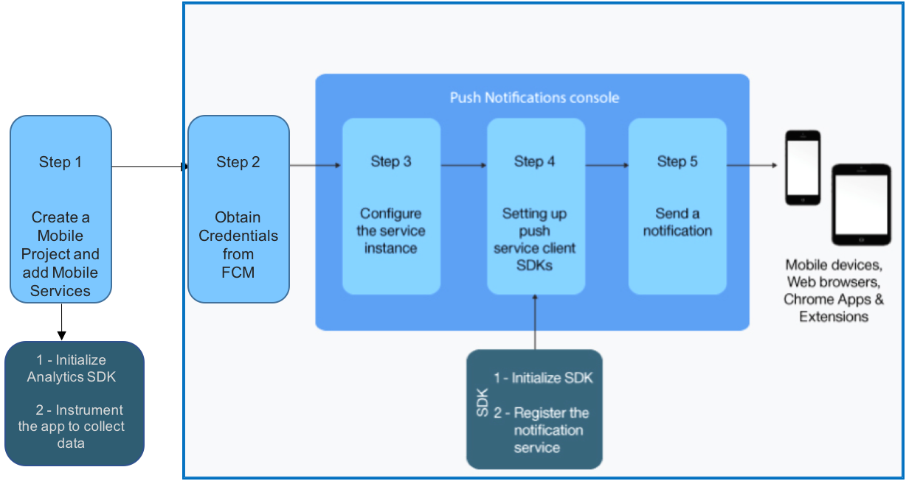

---
copyright:
  years: 2017
lastupdated: "2017-10-27"

---

{:shortdesc: .shortdesc}
{:new_window: target="_blank"}
{:codeblock: .codeblock}
{:screen: .screen}
{:tip: .tip}
{:pre: .pre}

# Android Native Mobile Application with Push and Analytics

Learn how easy it is to quickly create an Android native application with high-value mobile services - Push Notifications and Mobile Analytics on IBM Cloud.

This solution walks you through the creation of a mobile starter application, adding mobile services, setting up client SDKs, Importing the code to Android Studio and then further enhance the application.

## Objectives

* Create a mobile project from Basic Android native starter kit.
* Add Push Notifications and Mobile Analytics services.
* Obtain FCM credentials and configure Push Notifications service instance.
* Download the code and setup client SDKs.
* Instrumenting the app to use Mobile Analytics.
* Send and monitor push notifications.
* Monitoring the app with Mobile Analytics.

  

## Before you begin
{: #prereqs}

- Android Studio for importing and enhancing your code.
- Gmail account to log into FCM console.

## Create a mobile project from basic starter kit.

{: #get_code}

1. Navigate to [Mobile Dashboard](https://console.bluemix.net/developer/mobile/dashboard) to create your `Project` from pre-defined `Starter Kits`.
2. Click on `Starter Kits` and scroll down to select `Basic` Starter Kit.
    
3. Enter a project name which will be your app name as well.
4. Select `Android` as your language.

    
5. Click on `Create Project` to scaffold an Android native(Java) App.
6. A new `Project` will be created under Projects tab on the left pane.

In the next step, you will add mobile services like Push notifications and Mobile Analytics to accelerate your app.

## Add Push Notifications and Mobile Analytics services.
{: #create_cos}

**Note:** Push Notifications and Mobile Analytics Services should be added with the Basic Starter. If not, Please follow the below steps.
Also, Following the below steps you can add other value-add services.

1. Click on `Add Service` and select Mobile to accelerate your app with Mobile services. Click Next to see the available services.
2. Select `Push Notifications` and Click Next.
3. Select Lite plan and Click `Create` to provision a Push Notifications service. To understand the pricing, Click on `pricing details`.
4. Now, you should see Push Notifications service added to your project and also the Credentials.
5. To add Mobile Analytics service, click on `Add Service` and Select Basic plan.Once you click `Create`, you should see both the Mobile services with credentials.

## Obtain FCM credentials and configure Push Notifications service instance.

Firebase Cloud Messaging (FCM) is the gateway used to deliver push notifications to Android devices, Google Chrome browser and Chrome Apps & Extensions. To set up the Push Notifications service on the console, you need to get your FCM credentials (Sender ID and API key).

The API key is stored securely and used by the Push Notifications service to connect to the FCM server and the sender ID (project number) is used by the Android SDK and the JS SDK for Google Chrome and Mozilla Firefox on the client side.

To set up FCM and obtain your credentials, complete the steps:

1. Visit the [Firebase Console ](https://console.firebase.google.com/?pli=1). A Google user account is required.
2. Select `Add project`.
3. In the Create a project window, provide a project name, choose a country/region and click `Create project`.
4. On the left navigation pane, select `Settings` (Click on Settings Icon next to **Overview**)> `Project settings`.
5. Choose the Cloud Messaging tab to obtain your project credentials - Server API Key and a Sender ID. 
  **Note:**  Server key listed in FCM is the same as Server API Key.
    