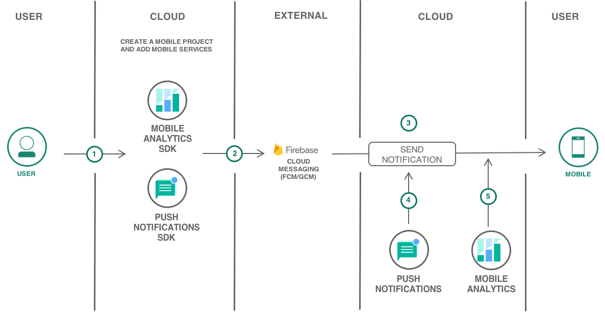

---
copyright:
  years: 2017
lastupdated: "2017-11-29"

---

{:shortdesc: .shortdesc}
{:new_window: target="_blank"}
{:codeblock: .codeblock}
{:screen: .screen}
{:tip: .tip}
{:pre: .pre}

# Android Native Mobile Application with Push and Analytics

Learn how easy it is to quickly create a native Android application with high-value mobile services like push notifications and mobile analytics on IBM Cloud.

This tutorial walks you through the creation of a mobile starter application, adding mobile services, setting up client SDKs, importing the code to Android Studio and then further enhancing the application.

## Objectives

* Create a mobile project with Push Notifications and Mobile Analytics services.
* Obtain FCM credentials.
* Download the code and complete required setup.
* Instrumenting the app to use mobile analytics.
* Configure, send, and monitor push notifications.
* Monitoring the app with mobile analytics.

 

## Products

This tutorial uses the following products:
   * [Mobile Analytics](https://console.bluemix.net/catalog/services/mobile-analytics)
   * [Push Notifications](https://console.bluemix.net/catalog/services/push-notifications)

## Before you begin
{: #prereqs}

- [Android Studio](https://developer.android.com/studio/index.html) for importing and enhancing your code.
- Google account to log into Firebase console for Sender ID and Server API Key.

## Create Android mobile project from starter kit
{: #get_code}
The IBM Cloud Mobile Dashboard allows you to fast-track your mobile app development by creating your project from a Starter Kit.
1. Navigate to [Mobile Dashboard](https://console.bluemix.net/developer/mobile/dashboard)
2. Click on **Starter Kits** and scroll down to select the **Basic** Starter Kit.
    
3. Enter a project name, this can be your app name as well.
4. Select **Android** as your language and check the mobile services on the right pane.

    
5. Click on **Create Project** to scaffold an Android (Java) App.
6. A new Project will be created under **Projects** tab on the left pane.
    **Note:** Push Notifications and Mobile Analytics Services should be added with the Basic Starter.
In the next step, you will obtain Firebase Cloud Messaging (FCM) credentials.

## Obtain FCM credentials

Firebase Cloud Messaging (FCM) is the gateway used to deliver push notifications to Android devices, Google Chrome browser, and Chrome Apps & Extensions. To set up the Push Notifications service on the console, you need to get your FCM credentials (Sender ID and API key).

The API key is stored securely and used by the Push Notifications service to connect to the FCM server and the sender ID (project number) is used by the Android SDK and the JS SDK for Google Chrome and Mozilla Firefox on the client side. To set up FCM and obtain your credentials, complete the steps:

1. Visit the [Firebase Console ](https://console.firebase.google.com/?pli=1)  -  A Google user account is required.
2. Select **Add project**.
3. In the **Create a project** window, provide a project name, choose a country/region and click **Create project**.
4. On the left navigation pane, select **Settings** (Click on Settings Icon next to **Overview**)> **Project settings**.
5. Choose the Cloud Messaging tab to obtain your project credentials - Server API Key and a Sender ID.
    **Note:**  Server key listed in FCM is the same as Server API Key.
    

You would also need to generate the `google-services.json` file. Complete the following steps:

1. In the Firebase console, click the **Project Settings** icon > **General** tab  under the project you created above and select **Add Firebase to your Android App**

    
2. In **Add Firebase to your Android** app modal window, add **com.ibm.mobilefirstplatform.clientsdk.android.push** as the Package Name to register push notifications android sdk. The App nickname and SHA-1 fields are optional. Click **REGISTER APP** > **Continue** > **Finish**.

    

3. Click **ADD APP** > **Add Firebase to your app**.  Include the package name of your application by entering the package name **com.ibm.mysampleapp** then proceed to add Firebase to your Android app window. The App nickname and SHA-1 fields are optional. Click **REGISTER APP** > Continue > Finish.
     **Note:** You can find the package name of your application in `AndroidManifest.xml` file once you download the code.
4. Download the latest config file `google-services.json` under **Your apps**.

    

    **Note**: FCM is the new version of Google Cloud Messaging (GCM). Ensure that you use FCM credentials for new apps. Existing apps would continue to function with GCM configurations.

*The steps and Firebase console UI is subject to change, refer to Google documentation for the Firebase part if needed*

In the next step, you will download the scaffolded code and setup the Push and Analytics Android SDKs.

## Download the code and complete required setup

If you haven't downloaded the code yet, then use IBM Cloud Mobile dashboard to get the code by clicking on the  **Download Code** button under Projects > **Your Mobile Project**.
The downloaded code comes with **Push Notifications** and **Mobile Analytics** client SDKs included. The client SDKs is available on Gradle and Maven. For this tutorial, you will use **Gradle**.

1. Launch Android Studio > **Open an existing Android Studio project** and point to the downloaded code.
2. **Gradle** build will automatically be triggered and all the dependencies will be downloaded.
3. Add the **Google Play services** dependency to your Module level `build.gradle (Module: app)` file at the end, after the `dependencies{.....}`
   ```
   apply plugin: 'com.google.gms.google-services'
   ```
4. Copy the `google-services.json` file that you have created and downloaded to your Android application module root directory. Note that the `google-service.json` file includes the added package names.
5. The required permissions are all inside the `AndroidManifest.xml` file and dependencies. Push and Analytics are included in **build.gradle (Module: app)**.
6. **Firebase Cloud Messaging (FCM)** intent service and intent filters for the `RECEIVE` and `REGISTRATION` event notifications are included in `AndroidManifest.xml`

## Instrumenting the app to use Mobile Analytics.

1. In Android Studio, navigate to `MainActivity.java`. You should see the following `import` statements already added
2. The code includes `BMSClient` initialization code with the `Region` parameter. In the initializer, the `Region` value specifies which IBM Cloud deployment you are using, for example, `BMSClient.REGION_US_SOUTH` and `BMSClient.REGION_UK`.
    **Note:** Core SDK must be initialized to interact with IBM Cloud Mobile services.
3. In this code snippet, Analytics is configured to record lifecycle events. Both `app_name` and `apiKey` are pre-configured as part of the code generation process.
   ```
   Analytics.init(getApplication(), "your_app_name_here", apiKey, hasUserContext, Analytics.DeviceEvent.ALL);
   ```
    **Note:** The service credentials are part of `/res/values/credentials.xml` file.
4. The code below enables `Logger` (disabled by default), and sets the logLevel to ERROR (DEBUG by default).
   ```
   Logger.storeLogs(true);
   Logger.setLogLevel(Logger.LEVEL.ERROR);
   ```

For advanced Analytics and logging capabilities, Refer [Gathering usage Analytics](https://console.bluemix.net/docs/services/mobileanalytics/sdk.html#app-monitoring-gathering-analytics) and [logging](https://console.bluemix.net/docs/services/mobileanalytics/sdk.html#enabling-configuring-and-using-logger)
{:tip}


## Configure, send and monitor push notifications.

1. Push notifications SDK is already imported into the project and Push initialization code can be found in `MainActivity.java` file.

    **Note:** The service credentials are part of `/res/values/credentials.xml` file.
2. Registration for notifications happens in `MainActivity.java`.  (Optional) Provide an unique USER_ID.
3. Run the app on a physical device or Emulator to receive notifications.
4. Open Push Notifications service under **Mobile Services** > **Existing services** on IBM Cloud Mobile dashboard and to send basic push notifications, complete the following steps:
   - Click **Manage** > **Configure**.
   - Select **Mobile** and then update the GCM/FCM Push Credentials tab with the Sender ID/Project number and API Key(Server Key) which you initially created on Firebase console.

     
   - Click **Save**. The push notifications service is now configured.
   - Select **Send Notifications**, and compose a message by choosing a send option. The supported options are device by tag, device id, user id, android devices, IOS devices, web notifications, and all devices.
     **Note:** When you select the **All Devices** option, all devices subscribed to Push Notifications will receive notifications.
   - In the **Message** field, compose your message. Choose to configure the optional settings as required.
   - Click **Send** and verify that your physical device has received the notification.

     
5. You should see a notification on your Android device.

         
6. You can monitor your sent notifications by navigating to **Monitoring** on the Push Notifications Service.
     The IBM Push Notifications service now extends capabilities to monitor the push performance by generating graphs from your user data. You can use the utility to list all the sent push notifications, or to list all the registered devices and to analyze information on a daily, weekly, or monthly basis.
      

## Monitoring the app with Mobile Analytics.

You can record application logs and monitor data with the Mobile Analytics Client SDK. Developers can control when to send this data to the Mobile Analytics Service. When data is delivered to Mobile Analytics, you can use the Mobile Analytics console to get analytics insights about your mobile applications, devices, and application logs.
1. Open the **Mobile Analytics** service from the mobile project you created or click on the three vertical dots next to the service and select **Open Dashboard**.
2. You should see LIVE Users, Sessions and other App Data by disabling **Demo Mode**. You can filter the analytics information by
   - Date.
   - Application.
   - Operating System.
   - Version of the app.

     
3. [Click here](https://console.bluemix.net/docs/services/mobileanalytics/app-monitoring.html#monitoringapps) to set alerts, monitor app crashes, and monitor network requests.

## Related Content

[Customize the Push Notifications settings](https://console.bluemix.net/docs/services/mobilepush/push_step_4.html#push_step_4_Android)

[Tag-based notifications](https://console.bluemix.net/docs/services/mobilepush/push_step_4_nf_tag.html#tag_based_notifications)

[Push Notifications REST APIs](https://console.bluemix.net/docs/services/mobilepush/push_restapi.html#push-api-rest)

[Security in Push Notifications](https://console.bluemix.net/docs/services/mobilepush/push_security.html#overview-push)

[Exporting Analytics data to Db2 Warehouse](https://console.bluemix.net/docs/services/mobileanalytics/app-monitoring.html#dashdb)
