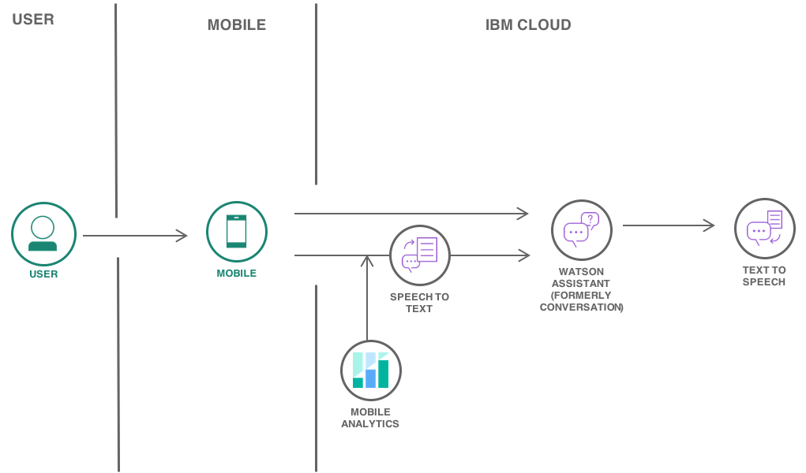
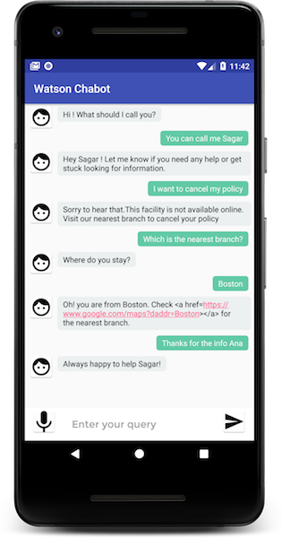
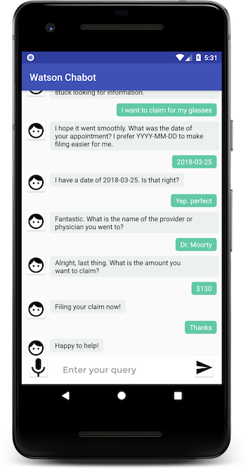

{:step: data-tutorial-type='step'}
{:java: #java .ph data-hd-programlang='java'}
{:swift: #swift .ph data-hd-programlang='swift'}
{:ios: #ios data-hd-operatingsystem="ios"}
{:android: #android data-hd-operatingsystem="android"}
{:shortdesc: .shortdesc}
{:new_window: target="_blank"}
{:codeblock: .codeblock}
{:screen: .screen}
{:tip: .tip}
{:pre: .pre}

# Build a voice-enabled Android chatbot
{: #android-watson-chatbot}
{: toc-content-type="tutorial"}
{: toc-services="assistant, speech-to-text, text-to-speech"}
{: toc-completion-time="1h"}

<!--##istutorial#-->
This tutorial may incur costs. Use the [Cost Estimator](https://{DomainName}/estimator/review) to generate a cost estimate based on your projected usage.
{: tip}
<!--#/istutorial#-->

Learn how easy it is to quickly create a voice-enabled Android-native chatbot with {{site.data.keyword.conversationshort}}, {{site.data.keyword.texttospeechshort}} and {{site.data.keyword.speechtotextshort}} services on {{site.data.keyword.Bluemix_short}}.
{: shortdesc}

This tutorial walks you through the process of defining intents and entities and building a dialog flow for your chatbot to respond to customer queries. You will learn how to enable {{site.data.keyword.speechtotextshort}} and {{site.data.keyword.texttospeechshort}} services for easy interaction with the Android app.

## Objectives
{: #android-watson-chatbot-objectives}

- Use {{site.data.keyword.conversationshort}} to customize and deploy a chatbot.
- Allow end users to interact with chatbot using voice and audio.
- Configure and run the Android app.


{: class="center"}
{: style="text-align: center;"}

1. User launches the mobile application on an Android device.
2. User sends a text message to {{site.data.keyword.conversationfull}}.
3. User sends a voice input.The audio is transcribed to text with {{site.data.keyword.speechtotextfull}}.The text is then passed to {{site.data.keyword.conversationfull}}.
4. The reply from {{site.data.keyword.conversationfull}} is converted to audio by {{site.data.keyword.texttospeechfull}}
5. The response from {{site.data.keyword.conversationfull}} is sent back to the mobile application.

## Before you begin
{: #android-watson-chatbot-prereqs}

- Download and install [Android Studio](https://developer.android.com/studio/index.html).

## Create services
{: #android-watson-chatbot-setup}
{: step}

In this section, you will create the services required by the tutorial starting with {{site.data.keyword.conversationshort}} to build cognitive virtual assistants that help your customers.

1. Go to the [**{{site.data.keyword.Bluemix_notm}} Catalog**](https://{DomainName}/catalog/) and select [{{site.data.keyword.conversationshort}}](https://{DomainName}/catalog/services/watson-assistant) service
   1. Select a region and **Lite** as your pricing plan
   2. Set a unique **Name** for the service, such as `<your-initials>-android-chatbot-assistant` and select a resource group
   3. Click **Create** to provision
2. Click **Service credentials** on the left pane and expand the auto-generated credentials. Make note of the **API Key** and **URL**, you will need it for the mobile application.

   If you don't see an auto-generated service credential, click **New credential**, set **Name** to **for-android-app**, select **Writer** as the role, and click **Add** to create a new credential.
   {: tip}

The {{site.data.keyword.speechtotextshort}} service converts the human voice into the written word that can be sent as an input to {{site.data.keyword.conversationshort}} service on {{site.data.keyword.Bluemix_short}}.

1. Select [{{site.data.keyword.speechtotextshort}}](https://{DomainName}/catalog/services/speech-to-text) service
   1. Select a region and **Lite** as your pricing plan
   2. Set a unique **Name** for the service, such as `<your-initials>-android-chatbot-stt` and select a resource group
   3. Click **Create** to provision
2. Click **Service credentials** on the left pane and expand the auto-generated credentials. Make note of the **API Key** and **URL**, you will need it for the mobile application.

   If you don't see an auto-generated service credential, click **New credential**, set **Name** to **for-android-app**, select **Writer** as the role, and click **Add** to create a new credential.
   {: tip}

The {{site.data.keyword.texttospeechshort}} service processes text and natural language to generate synthesized audio output complete with appropriate cadence and intonation. The service provides several voices and can be configured in the Android app.

1. Select [{{site.data.keyword.texttospeechshort}}](https://{DomainName}/catalog/services/text-to-speech) service
   1. Select a region and **Lite** as your pricing plan
   2. Set a unique **Name** for the service, such as `<your-initials>-android-chatbot-tts` and select a resource group
   3. Click **Create** to provision
2. Click **Service credentials** on the left pane and expand the auto-generated credentials. Make note of the **API Key** and **URL**, you will need it for the mobile application.

   If you don't see an auto-generated service credential, click **New credential**, set **Name** to **for-android-app**, select **Writer** as the role, and click **Add** to create a new credential.
   {: tip}

## Create a skill
{: #android-watson-chatbot-create_workspace}
{: step}

A skill is a container for the artifacts that define the conversation flow.

For this tutorial, you will save and use [Ana_skill.json](https://github.com/IBM-Cloud/chatbot-watson-android/raw/master/training/Ana_skill.json) file with predefined intents, entities and dialog flow to your machine.

1. In the {{site.data.keyword.conversationshort}} service details page, navigate to **Manage** on the left pane, click on **Launch {{site.data.keyword.conversationshort}}** to see the {{site.data.keyword.conversationshort}} dashboard.
1. On the left navigation pane, Click on **Skills**.
1. Click **Create skill**, select **Dialog skill** and **Next**.
1. Under **Upload skill**, click **Choose the JSON File** to select the `Ana_skill.json`file and click **Upload**.
1. Go back to the list of Skills. Select the action menu on the `Ana` skill to **View API Details**.

### Define an intent
{: #android-watson-chatbot-define_intent}

An intent represents the purpose of a user's input, such as answering a question or processing a bill payment. You define an intent for each type of user request you want your application to support. By recognizing the intent expressed in a user's input, the {{site.data.keyword.conversationshort}} service can choose the correct dialog flow for responding to it. In the tool, the name of an intent is always prefixed with the `#` character.

Simply put, intents are the intentions of the end-user. The following are examples of intent names.
 - `#weather_conditions`
 - `#pay_bill`
 - `#escalate_to_agent`

1. Click on the newly created skill - **Ana**.

   Ana is an insurance bot for users to query their health benefits and file claims.
   {: tip}
2. Click on **Create intent** under Intents. Enter `cancel_policy` as your intent name and provide an optional description.
3. Click **Create intent**.
4. Add user examples when requested to cancel a policy
   - `I want to cancel my policy`
   - `Drop my policy now`
   - `I wish to stop making payments on my policy.`
   - `How do I cancel my policy?`
   - `What's the procedure to cancel my policy?`
5. Add user examples one after another and click **Add example**. Repeat this for all the other user examples.

   Remember to add at least 5 user examples to train your bot better.
   {: tip}

6. Click the **back** button to save the intent.
7. Click on **Content Catalog** and select **General**. Click **Add to skill**.

   Content catalog helps you in getting started faster by adding existing intents (banking, customer care, insurance, telco, e-commerce and many more). These intents are trained on common questions that users may ask.
   {: tip}

### Define an entity
{: #android-watson-chatbot-define_entity}

An entity represents a term or object that is relevant to your intents and that provides a specific context for an intent. You list the possible values for each entity and synonyms that users might enter. By recognizing the entities that are mentioned in the user's input, the {{site.data.keyword.conversationshort}} service can choose the specific actions to take to fulfill an intent. In the tool, the name of an entity is always prefixed with the `@` character.

The following are examples of entity names
 - `@location`
 - `@menu_item`
 - `@product`

   System entities can be used to recognize a broad range of values for the object types they represent. For example, the `@sys-number` system entity matches any numerical value, including whole numbers, decimal fractions, or even numbers written out as words.Click **System entities** under **Entities** to check the common entities created by {{site.data.keyword.IBM_notm}} that could be used across any use case.
   {: tip}

1. Click **Entities** on the left pane to see the existing entities.
2. Click **Create entity** and enter the name of the entity as `location`. Click **Create entity**.
3. Enter `address` as the value name and select **Synonyms**.
4. Add `place` as a synonym and click the **+** icon. Repeat with synonyms `office`, `centre`, `branch` etc., and click **Add Value**.

   You can use the **Recommend synonyms** button for synonym recommendations. Either select all or individual suggestions as synonyms by clicking **Add selected**.
   {: tip}

5. Click **back** button to save the changes.

### Build the dialog flow
{: #android-watson-chatbot-build_dialog}

A dialog is a branching conversation flow that defines how your application responds when it recognizes the defined intents and entities. You use the dialog builder in the tool to create conversations with users, providing responses based on the intents and entities that you recognize in their input.

1. Click on **Dialog** to see the existing dialog flow with intents and entities.
2. Click **Add node** to add a new node to the dialog.
3. Under **if assistant recognizes**, enter `#cancel_policy`.
4. Under **Assistant responds**, select **Text** and enter the response `This facility is not available online. Please visit our nearest branch to cancel your policy.`
5. Close the node editor, it saves the node.
6. Scroll to find the `#greeting` node. Click on the node to see the details.
7. Click the **+** icon to **add a new condition**. Select `or` from the dropdown and enter `#General_Greetings` as the intent. **Assistant responds** shows the assistant's response when greeted by the user. Click on close icon to save the changes.

   A context variable is a variable that you define in a node, and optionally specify a default value for. Other nodes or application logic can subsequently set or change the value of the context variable. The application can pass information to the dialog, and the dialog can update this information and pass it back to the application, or to a subsequent node. The dialog does so by using context variables.
   {: tip}

8. Test the dialog flow using the **Try it** button.

## Link the skill to an assistant
{: #android-watson-chatbot-4}
{: step}

An **assistant** is a cognitive bot that you can customize for your business needs, and deploy across multiple channels to bring help to your customers where and when they need it. You customize the assistant by adding to it the **skills** it needs to satisfy your customers' goals.

1. In the {{site.data.keyword.conversationshort}} tool, switch to **Assistants** on the left navigation pane and use **Create assistant**.
   1. Set **Name** to **android-chatbot-assistant**
   2. Click on **Create assistant**
2. Use **Add dialog skill** under **Add a dialog skill to design your conversation flow** to select the skill created in the previous sections.
   1. Click on **Add dialog skill**
   2. Select **Ana**
3. Select the action menu on the Assistant > **Settings** > **API Details**, make note of the **Assistant ID**, you will need to reference it from the mobile application( in the `config.xml` file of the Android app).

## Configure and run the Android app
{: #android-watson-chatbot-configure_run_android_app}
{: step}

The repository contains Android application code with required gradle dependencies.

1. Run the below command to clone the [GitHub repository](https://github.com/IBM-Cloud/chatbot-watson-android) to your machine:
   ```sh
   git clone https://github.com/IBM-Cloud/chatbot-watson-android
   ```
   {: pre}

2. Launch Android Studio on your machine. Choose **Open an existing Android Studio project** from the options and point to the cloned code on your machine.**Gradle** build will automatically be triggered and all the dependencies will be downloaded.
3. From the left pane of Android Studio or from the cloned folder, Open the `config.xml` file under the path `app/src/main/res/values` to see the placeholders(`ASSISTANT_ID_HERE`) for service credentials. Enter the service credentials (you saved earlier) in their respective placeholders and save the file.

   You can find the ASSISTANT URL in the {{site.data.keyword.conversationshort}} service credentials you noted while provisioning the service. The Assistant URL is NOT same as the workspace URL.
   {: tip}

   ```xml
   <?xml version="1.0" encoding="UTF-8"?>
   <resources>
      <!--Watson Assistant service credentials-->
      <!-- REPLACE `ASSISTANT_ID_HERE` with ID of the Assistant to use -->
      <string name="assistant_id">ASSISTANT_ID_HERE</string>

      <!-- REPLACE `ASSISTANT_API_KEY_HERE` with Watson Assistant service API Key-->
      <string name="assistant_apikey">ASSISTANT_API_KEY_HERE</string>

      <!-- REPLACE the URL with the one provided in the credentials of the service you created-->
      <string name="assistant_url">ASSISTANT_URL_HERE</string>

      <!--Watson Speech To Text(STT) service credentials-->
      <!-- REPLACE `STT_API_KEY_HERE` with Watson Speech to Text service API Key-->
      <string name="STT_apikey">STT_API_KEY_HERE</string>

      <!-- REPLACE the URL with STT URL provided in the service credentials -->
      <string name="STT_url">STT_URL_HERE</string>

      <!--Watson Text To Speech(TTS) service credentials-->
      <!-- REPLACE `TTS_API_KEY_HERE` with Watson Text to Speech service API Key-->
      <string name="TTS_apikey">TTS_API_KEY_HERE</string>

      <!-- REPLACE the URL with TTS URL provided in the service credentials -->
      <string name="TTS_url">TTS_URL_HERE</string>
   </resources>
   ```

4. Build and Run the project by clicking **Run** from the Android studio menu > click **Run app** and start the application on a real Android device or with a simulator.

   
   

   For detailed instructions to run your app on a real Android device or on an emulator, follow the [instructions here](https://developer.android.com/training/basics/firstapp/running-app). To build your app from the command line, follow the instructions [provided here](https://developer.android.com/studio/build/building-cmdline)
   {: tip}

5. In the **Enter your query** space provided below, interact with your chatbot by typing `Hi` and click the arrow icon to send the query to {{site.data.keyword.conversationshort}} service.
6. The response will be passed to {{site.data.keyword.texttospeechshort}} service and you should hear a voice reading out the response.
7. Click the **mic** icon in the left bottom corner of the app to input speech that gets converted to text and then can be sent to {{site.data.keyword.conversationshort}} service by clicking the arrow icon.


## Remove resources
{: #android-watson-chatbot-6}
{: removeresources}
{: step}

1. Navigate to [Resource List,](https://{DomainName}/resources/)
1. Delete the services you have created:
   - {{site.data.keyword.conversationfull}}
   - {{site.data.keyword.speechtotextfull}}
   - {{site.data.keyword.texttospeechfull}}

Depending on the resource it might not be deleted immediately, but retained (by default for 7 days). You can reclaim the resource by deleting it permanently or restore it within the retention period. See this document on how to [use resource reclamation](https://{DomainName}/docs/account?topic=account-resource-reclamation).
{: tip}

## Related content
{: #android-watson-chatbot-7}
{: related}

- [Creating entities, Synonyms, System entities](https://{DomainName}/docs/assistant?topic=assistant-entities#entities-creating-task)
- [Context Variables](https://{DomainName}/docs/assistant?topic=assistant-dialog-runtime#dialog-runtime-context-variables)
- [Building a complex dialog](https://{DomainName}/docs/assistant?topic=assistant-tutorial#tutorial)
- [Gathering information with slots](https://{DomainName}/docs/assistant?topic=assistant-dialog-slots#dialog-slots)
- [Deployment options](https://{DomainName}/docs/assistant?topic=assistant-deploy-integration-add#deploy-integration-add)
- [Improve your skill](https://{DomainName}/docs/assistant?topic=assistant-logs)
