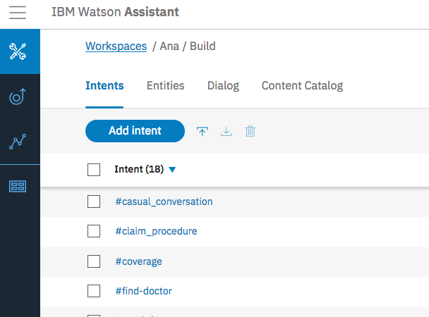
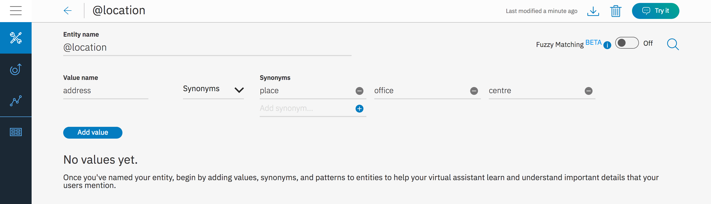
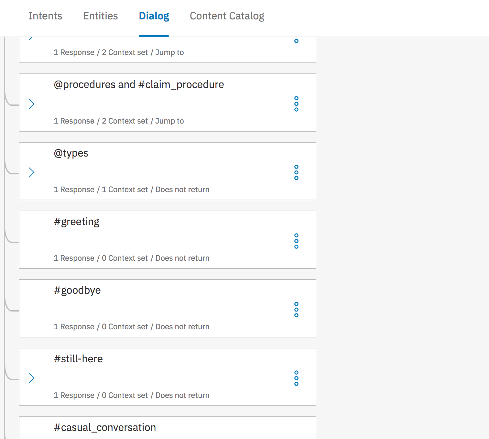
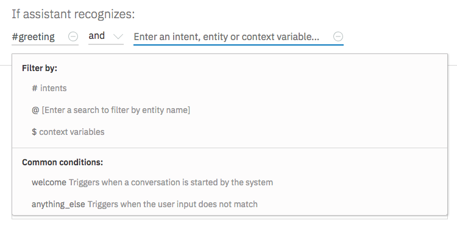

---
copyright:
  years: 2018, 2019
lastupdated: "2019-03-07"
---

{:java: #java .ph data-hd-programlang='java'}
{:swift: #swift .ph data-hd-programlang='swift'}
{:ios: #ios data-hd-operatingsystem="ios"}
{:android: #android data-hd-operatingsystem="android"}
{:shortdesc: .shortdesc}
{:new_window: target="_blank"}
{:codeblock: .codeblock}
{:screen: .screen}
{:tip: .tip}
{:pre: .pre}

# Build a voice-enabled Android chatbot
{: #android-watson-chatbot}

Learn how easy it is to quickly create a voice-enabled Android-native chatbot with {{site.data.keyword.conversationshort}}, {{site.data.keyword.texttospeechshort}} and {{site.data.keyword.speechtotextshort}} services on {{site.data.keyword.Bluemix_short}}.

This tutorial walks you through the process of defining intents and entities and building a dialog flow for your chatbot to respond to customer queries. You will learn how to enable {{site.data.keyword.speechtotextshort}} and {{site.data.keyword.texttospeechshort}} services for easy interaction with the Android app.
{:shortdesc}

## Objectives
{: #objectives}

- Use {{site.data.keyword.conversationshort}} to customize and deploy a chatbot. 
- Allow end users to interact with chatbot using voice and audio.
- Configure and run the Android app.

## Services used
{: #services}

This tutorial uses the following products:

- [{{site.data.keyword.conversationfull}}](https://{DomainName}/catalog/services/watson-assistant-formerly-conversation)
- [{{site.data.keyword.speechtotextfull}}](https://{DomainName}/catalog/services/speech-to-text)
- [{{site.data.keyword.texttospeechfull}}](https://{DomainName}/catalog/services/text-to-speech)

## Architecture
{: #architecture}

<p style="text-align: center;">


</p>

* Users interact with a mobile application using their voice.
* The audio is transcribed to text with {{site.data.keyword.speechtotextfull}}.
* The text is passed to {{site.data.keyword.conversationfull}}.
* The reply from {{site.data.keyword.conversationfull}} is converted to audio by {{site.data.keyword.texttospeechfull}} and the result sent back to the mobile application.

## Before you begin
{: #prereqs}

- Download and install [Android Studio](https://developer.android.com/studio/index.html).

## Create services
{: #setup}

In this section, you will create the services required by the tutorial starting with {{site.data.keyword.conversationshort}} to build cognitive virtual assistants that help your customers.

1. Go to the [**{{site.data.keyword.Bluemix_notm}} Catalog**](https://{DomainName}/catalog/) and select [{{site.data.keyword.conversationshort}}](https://{DomainName}/catalog/services/watson-assistant-formerly-conversation) service > **Lite** plan:
   1. Set **Name** to **android-chatbot-assistant**
   1. **Create**.
2. Click **Service credentials** on the left pane and click **New credential**.
   1. Set **Name** to **for-android-app**.
   1. **Add**.
3. Click **View Credentials** to see the credentials. Make note of the **API Key** and **URL**, you will need it for the mobile application.

The {{site.data.keyword.speechtotextshort}} service converts the human voice into the written word that can be sent as an input to {{site.data.keyword.conversationshort}} service on {{site.data.keyword.Bluemix_short}}.

1. Go to the [**{{site.data.keyword.Bluemix_notm}} Catalog**](https://{DomainName}/catalog/) and select [{{site.data.keyword.speechtotextshort}}](https://{DomainName}/catalog/services/speech-to-text) service > **Lite** plan.
   1. Set **Name** to **android-chatbot-stt**.
   1. **Create**.
2. Click **Service credentials** on the left pane and click **New credential** to add a new credential.
   1. Set **Name** to **for-android-app**.
   1. **Add**.
3. Click **View Credentials** to see the credentials. Make note of the **API Key** and **URL**, you will need it for the mobile application.

The {{site.data.keyword.texttospeechshort}} service processes text and natural language to generate synthesized audio output complete with appropriate cadence and intonation. The service provides several voices and can be configured in the Android app.

1. Go to the [**{{site.data.keyword.Bluemix_notm}} Catalog**](https://{DomainName}/catalog/) and select [{{site.data.keyword.texttospeechshort}}](https://{DomainName}/catalog/services/text-to-speech) service > **Lite** plan.
   1. Set **Name** to **android-chatbot-tts**.
   1. **Create**.
2. Click **Service credentials** on the left pane and click **New credential** to add a new credential.
   1. Set **Name** to **for-android-app**.
   1. **Add**.
3. Click **View Credentials** to see the credentials. Make note of the **API Key** and **URL**, you will need it for the mobile application.

## Create a skill
{: #create_workspace}

A skill is a container for the artifacts that define the conversation flow.

For this tutorial, you will save and use [Ana_skill.json](https://github.com/IBM-Cloud/chatbot-watson-android/raw/master/training/Ana_skill.json) file with predefined intents, entities and dialog flow to your machine.

1. In the {{site.data.keyword.conversationshort}} service details page, navigate to **Manage** on the left pane, click on **Launch tool** to see the {{site.data.keyword.conversationshort}} dashboard.
1. Click on **Skills** tab.
1. **Create new** then **Import skill** and choose the JSON file downloaded above.
1. Select **Everything** option and click **Import**. A new skill is created with predefined intents, entities and dialog flow.
1. Go back to the list of Skills. Select the action menu on the `Ana` skill to **View API Details**.

### Define an intent
{:#define_intent}

An intent represents the purpose of a user's input, such as answering a question or processing a bill payment. You define an intent for each type of user request you want your application to support. By recognizing the intent expressed in a user's input, the {{site.data.keyword.conversationshort}} service can choose the correct dialog flow for responding to it. In the tool, the name of an intent is always prefixed with the `#` character.

Simply put, intents are the intentions of the end-user. The following are examples of intent names.
 - `#weather_conditions`
 - `#pay_bill`
 - `#escalate_to_agent`

1. Click on the newly create skill - **Ana**.

   Ana is an insurance bot for users to query their health benefits and file claims.
   {:tip}
2. Click on the first tab to see all the **Intents**.
3. Click on **Add intent** to create a new intent. Enter `Cancel_Policy` as your intent name after `#`and provide an optional description.
   
4. Click **Create intent**.
5. Add user examples when requested to cancel a policy
   - `I want to cancel my policy`
   - `Drop my policy now`
   - `I wish to stop making payments on my policy.`
6. Add user examples one after another and click **add example**. Repeat this for all the other user examples.

   Remember to add at least 5 user examples to train your bot better.
   {:tip}

7. Click the **close**  button next to the intent name to save the intent.
8. Click on **Content Catalog** and select **General**. Click **Add to skill**.

   Content catalog helps you in getting started faster by adding existing intents (banking, customer care, insurance, telco, e-commerce and many more). These intents are trained on common questions that users may ask.
   {:tip}

### Define an entity
{:#define_entity}

An entity represents a term or object that is relevant to your intents and that provides a specific context for an intent. You list the possible values for each entity and synonyms that users might enter. By recognizing the entities that are mentioned in the user's input, the {{site.data.keyword.conversationshort}} service can choose the specific actions to take to fulfill an intent. In the tool, the name of an entity is always prefixed with the `@` character.

The following are examples of entity names
 - `@location`
 - `@menu_item`
 - `@product`

1. Click **Entities** tab to see the existing entities.
2. Click **Add entity** and enter the name of the entity as `location` after `@`. Click **Create entity**.
3. Enter `address` as the value name and select **Synonyms**.
4. Add `place` as a synonym and click the icon. Repeat with synonyms `office`, `centre`, `branch` etc., and click **Add Value**.
   
5. Click **close**  to save the changes.
6. Click **System entities** tab to check the common entities created by IBM that could be used across any use case.

   System entities can be used to recognize a broad range of values for the object types they represent. For example, the `@sys-number` system entity matches any numerical value, including whole numbers, decimal fractions, or even numbers written out as words.
   {:tip}
7. Toggle the **Status** from off to `on` for @sys-person and @sys-location system entities.

### Build the dialog flow
{:#build_dialog}

A dialog is a branching conversation flow that defines how your application responds when it recognizes the defined intents and entities. You use the dialog builder in the tool to create conversations with users, providing responses based on the intents and entities that you recognize in their input.

1. Click on **Dialog** tab to see the existing dialog flow with intents and entities.
2. Click **Add node** to add a new node to the dialog.
3. Under **if assistant recognizes**, enter `#Cancel_Policy`.
4. Under **Then respond with**, enter the response `This facility is not available online. Please visit our nearest branch to cancel your policy.`
5. Click on  to close and save the node.
6. Scroll to see the `#greeting` node. Click on the node to see the details.
   
7. Click the  icon to **add a new condition**. Select `or` from the dropdown and enter `#General_Greetings` as the intent. **Then respond with section** shows the assistant's response when greeted by the user.
   

   A context variable is a variable that you define in a node, and optionally specify a default value for. Other nodes or application logic can subsequently set or change the value of the context variable. The application can pass information to the dialog, and the dialog can update this information and pass it back to the application, or to a subsequent node. The dialog does so by using context variables.
   {:tip}

8. Test the dialog flow using the **Try it** button.

## Link the skill to an assistant

An **assistant** is a cognitive bot that you can customize for your business needs, and deploy across multiple channels to bring help to your customers where and when they need it. You customize the assistant by adding to it the **skills** it needs to satisfy your customers' goals.

1. In the {{site.data.keyword.conversationshort}} tool, switch to **Assistants** and use **Create new**.
   1. Set **Name** to **android-chatbot-assistant**
   1. **Create**
1. Use **Add Dialog skill** to select the skill created in the previous sections.
   1. **Add existing skill** 
   1. Select **Ana**
1. Under **View API Details** for the assistant, make note of the **Assistant ID**, you will need to reference it from the mobile application( in the `config.xml` file of the Android app).

## Configure and run the Android app
{:#configure_run_android_app}

The repository contains Android application code with required gradle dependencies.

1. Run the below command to clone the [GitHub repository](https://github.com/IBM-Cloud/chatbot-watson-android):
   ```bash
   git clone https://github.com/IBM-Cloud/chatbot-watson-android
   ```
   {: codeblock}

2. Launch Android Studio > **Open an existing Android Studio project** and point to the downloaded code.**Gradle** build will automatically be triggered and all the dependencies will be downloaded.
3. Open `app/src/main/res/values/config.xml` to see the placeholders(`ASSISTANT_ID_HERE`) for service credentials. Enter the service credentials (you saved earlier) in their respective placeholders and save the file.
   ```xml
   <?xml version="1.0" encoding="utf-8"?>
   <resources>
       <!--Watson Assistant service credentials-->
       <!-- REPLACE `ASSISTANT_ID_HERE` with ID of the Assistant to use -->
       <string name="assistant_id">ASSISTANT_ID_HERE</string>
   
       <!-- REPLACE `ASSISTANT_API_KEY_HERE` with Watson Assistant service API Key-->
       <string name="assistant_apikey">ASSISTANT_API_KEY_HERE</string>
   
       <!-- REPLACE `ASSISTANT_URL_HERE` with Watson Assistant service URL-->
       <string name="assistant_url">ASSISTANT_URL_HERE</string>
       
       <!--Watson Speech To Text(STT) service credentials-->
       <!-- REPLACE `STT_API_KEY_HERE` with Watson Speech to Text service API Key-->
       <string name="STT_apikey">STT_API_KEY_HERE</string>
   
       <!-- REPLACE `STT_URL_HERE` with Watson Speech to Text service URL-->
       <string name="STT_url">STT_URL_HERE</string>
   
       <!--Watson Text To Speech(TTS) service credentials-->
       <!-- REPLACE `TTS_API_KEY_HERE` with Watson Text to Speech service API Key-->
       <string name="TTS_apikey">TTS_API_KEY_HERE</string>
   
       <!-- REPLACE `TTS_URL_HERE` with Watson Text to Speech service URL-->
       <string name="TTS_url">TTS_URL_HERE</string>
   </resources>
   ```
4. Build the project and start the application on a real device or with a simulator.
   <p style="text-align: center; width:200">
   

    </p>
5. **Enter your query** in the space provided below and click the arrow icon to send the query to {{site.data.keyword.conversationshort}} service.
6. The response will be passed to {{site.data.keyword.texttospeechshort}} service and you should hear a voice reading out the response.
7. Click the **mic** icon in the left bottom corner of the app to input speech that gets converted to text and then can be sent to {{site.data.keyword.conversationshort}} service by clicking the arrow icon.


## Remove resources
{:removeresources}

1. Navigate to [Resource List,](https://{DomainName}/resources/)
1. Delete the services you have created:
   - {{site.data.keyword.conversationfull}}
   - {{site.data.keyword.speechtotextfull}}
   - {{site.data.keyword.texttospeechfull}}

## Related content
{:related}

- [Creating entities, Synonyms, System entities](https://{DomainName}/docs/services/assistant?topic=assistant-entities#creating-entities)
- [Context Variables](https://{DomainName}/docs/services/assistant?topic=assistant-dialog-runtime#dialog-runtime-context-variables)
- [Building a complex dialog](https://{DomainName}/docs/services/assistant?topic=assistant-tutorial#tutorial)
- [Gathering information with slots](https://{DomainName}/docs/services/assistant?topic=assistant-dialog-slots#dialog-slots)
- [Deployment options](https://{DomainName}/docs/services/assistant?topic=assistant-deploy-integration-add#deploy-integration-add)
- [Improve your skill](https://{DomainName}/docs/services/assistant?topic=assistant-logs-intro#logs-intro)
