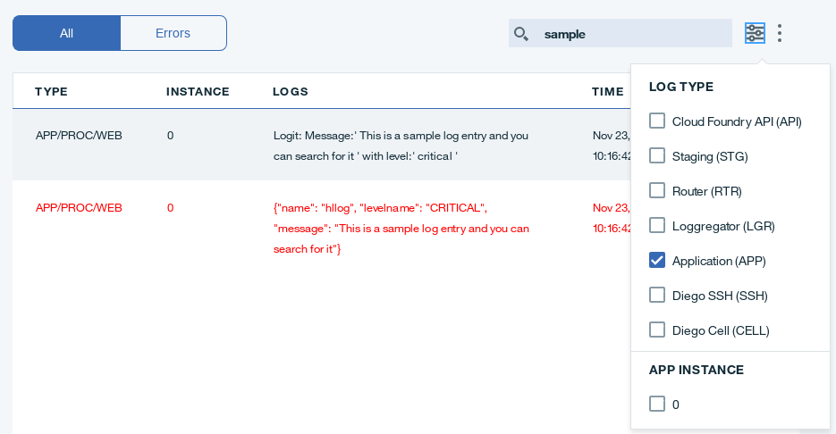
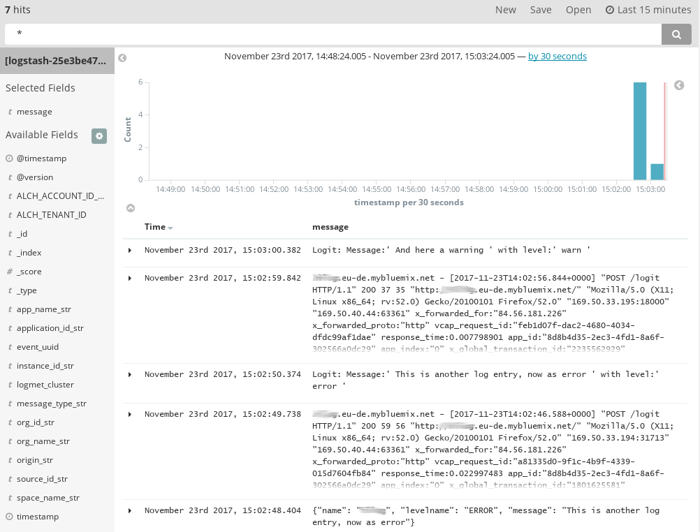
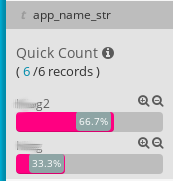
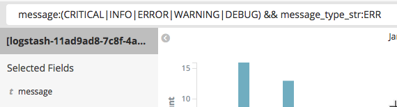
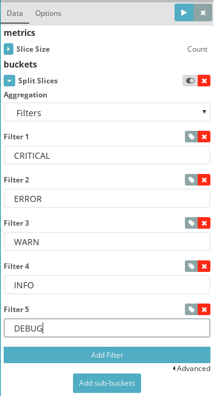
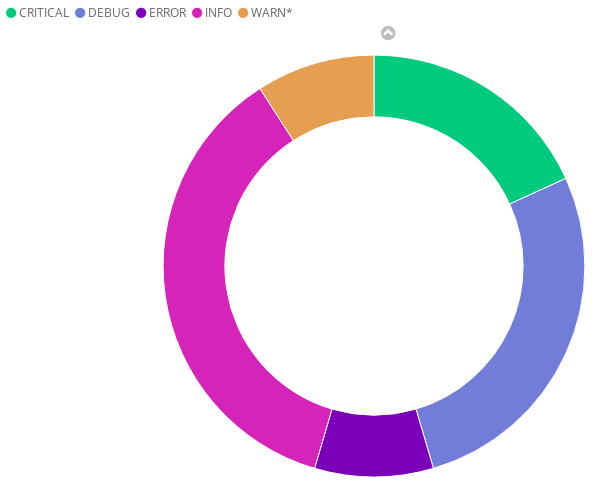
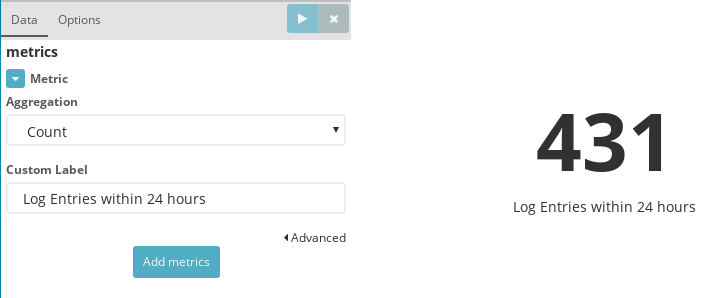
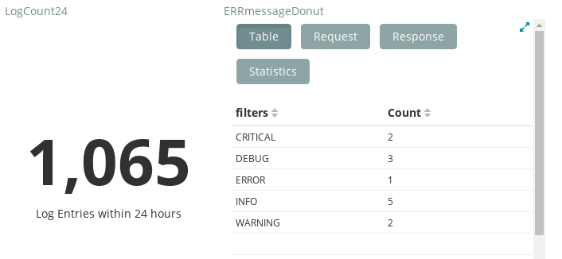
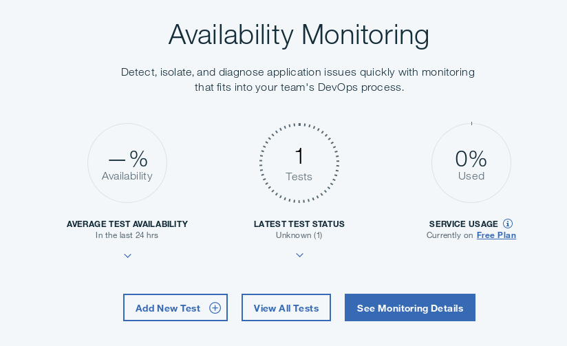

---
copyright:
  years: 2017, 2018
lastupdated: "2018-06-11"

---

{:shortdesc: .shortdesc}
{:new_window: target="_blank"}
{:codeblock: .codeblock}
{:screen: .screen}
{:tip: .tip}
{:pre: .pre}

# Analyze logs and monitor health of a Cloud Foundry application
This tutorial shows how the [{{site.data.keyword.loganalysislong_notm}}](https://console.bluemix.net/catalog/services/log-analysis) service can be used to understand and diagnose activities of a Cloud Foundry app that is deployed on {{site.data.keyword.Bluemix_notm}}. You will deploy a Python Cloud Foundry application, generate different types of logs. Then, you will search, analyze and visualize those logs by using Kibana, an open-source tool that is offered by the {{site.data.keyword.loganalysisshort}} service. Optionally, you will also setup the [{{site.data.keyword.prf_hubshort}}](https://console.bluemix.net/catalog/services/availability-monitoring) service to track availability of the deployed application, so that you get notified in the case of application health issues.

## Objectives
* Provision the {{site.data.keyword.loganalysisshort}} service
* Deploy a Python Cloud Foundry application
* Generate different types of log entries
* Access application logs
* Search and analyze logs
* Visualize logs
* Setup {{site.data.keyword.prf_hubshort}}

## Services used
{: #services}

This tutorial uses the following runtimes and services:
* [{{site.data.keyword.loganalysisshort}}](https://console.bluemix.net/catalog/services/log-analysis)
* [{{site.data.keyword.prf_hubshort}}](https://console.bluemix.net/catalog/services/availability-monitoring)

This tutorial may incur costs. Use the [Pricing Calculator](https://console.bluemix.net/pricing/) to generate a cost estimate based on your projected usage.

## Architecture
{: #architecture}

{{site.data.keyword.Bluemix_notm}} offers three complementary services that help to obtain insights into application health, stability and usage:
* The [{{site.data.keyword.loganalysisshort}}](https://console.bluemix.net/catalog/services/log-analysis) service provides an easy-to-use interface to logs generated by applications running in the {{site.data.keyword.Bluemix_notm}}. In the premium plans, external log events can also be fed into the service for consolidated storage and analysis.
* The [{{site.data.keyword.prf_hubshort}}](https://console.bluemix.net/catalog/services/availability-monitoring) service can be used to perform regular tests on an application to check availability, including speed.
* Last, the [{{site.data.keyword.cloudaccesstraillong_notm}}](https://console.bluemix.net/catalog/services/activity-tracker) has the capability to capture, store and visualize activities performed by {{site.data.keyword.Bluemix_notm}} users and services in your account. Captured events can be stored and analyzed, e.g., to investigate security breaches or unauthorized access.

<p style="text-align: center;">

  
</p>

In this tutorial, you are going to generate, access and analyze application logs. The [documentation for {{site.data.keyword.loganalysisshort}}](https://console.bluemix.net/docs/services/CloudLogAnalysis/index.html) already includes a [tutorial on how to analyze logs for an app deployed in a Kubernetes cluster](https://console.bluemix.net/docs/services/CloudLogAnalysis/containers/tutorials/kibana_tutorial_1.html). Therefore, in this guide, the focus is on a Cloud Foundry application. Moreover, this tutorial covers how to optionally add [{{site.data.keyword.prf_hubshort}}](https://console.bluemix.net/docs/services/AvailabilityMonitoring/avmon_about.html#avmon_about) to the application environment.

## Provision {{site.data.keyword.loganalysisshort}}
Applications running in the {{site.data.keyword.Bluemix_notm}} generate diagnostic output, i.e. logs, that can be accessed without any additional service. By using the {{site.data.keyword.loganalysisshort}} service, it is possible to aggregate logs from various sources and retain them as long as needed. This allows to analyze the "big picture" when required and to troubleshoot more complex situations.

{{site.data.keyword.loganalysisshort}} is found in the [{{site.data.keyword.Bluemix_notm}} Catalog in the DevOps category](https://console.bluemix.net/catalog/?category=devops). Click on it and select the region, organization and space to which you want to provision the service. This should be the same as for the app you are going to deploy in the next step. Once the correct values are set, click on **Create**.

By default the **Lite** plan is selected which allows for 500 MB of daily logs for the past 3 days. The **Premium** plans feature higher data volumes and longer log retention.

## Deploy a Cloud Foundry app
The ready-to-run [code for the logging app is located in this Github repository](https://github.com/IBM-Cloud/application-log-analysis). Clone or download the repository, then push the app to {{site.data.keyword.Bluemix_notm}}.

1. Clone the Github repository:
   ```bash
   git clone https://github.com/IBM-Cloud/application-log-analysis
   cd application-log-analysis
   ```
   {:codeblock }
2. Push the application to {{site.data.keyword.Bluemix_notm}}. You need to be logged in to the region, org and space in which the {{site.data.keyword.loganalysisshort}} service was created. Copy and paste these commands one line at a time.
   ```bash
   ibmcloud login
   ibmcloud target --cf
   ibmcloud cf push your-app-name
   ```
   {:codeblock }

## Generate application logs
Next, in order to work with application logs, you first need to generate some. The push process above already generated many log entries. Because applications deployed in {{site.data.keyword.Bluemix_notm}} are automatically linked with the {{site.data.keyword.loganalysisshort}} service, nothing extra needs to be done from our side.

1. Visit the web app using the route listed in the **urls** line at the end of the output generated by the push process. The application URL is also shown in the [{{site.data.keyword.Bluemix_notm}} dashboard (console)](https://console.bluemix.net).
2. The application allows you to log a message at a chosen log level. The available log levels are **critical**, **error**, **warn**, **info** and **debug**. The application's logging infrastructure is configured to allow only log entries on or above a set level to pass. Initially, the logger level is set to **warn**. Thus, a message logged at **info** with a server setting of **warn** would not show up in the diagnostic output. The UI allows to change the logger setting for the server log level as well. Try it and generate several log entries.
3. Take a look at the code in the file [**cloud-logging.py**](https://github.com/IBM-Cloud/application-log-analysis/blob/master/cloud-logging.py). The code contains **print** statements as well as calls to **logger** functions. Printed messages are written to the **stdout** stream (regular output, application console / terminal), logger messages appear in the **stderr** stream (error log).
4. Back in the application, generate several log entries by submitting messages at different levels. Change the server-side log level in-between to make it more interesting.

## Access application logs
{{site.data.keyword.Bluemix_notm}} offers multiple ways of accessing application logs, in our case for a Cloud Foundry app.

1. The first is using the command line. The following displays the recent logs. It is a great method to investigate errors when an app after the push is not starting:
```bash
ibmcloud cf logs your-app-name --recent
```
2. The second method is to use the [{{site.data.keyword.Bluemix_notm}} console](https://console.bluemix.net). In the overview, navigate to your app, click on its entry to open the details and then go to **Logs**. Current logs are shown with the most recent at the bottom. On the upper right you can search for an entry or filter by log type. Selecting **Application (APP)**

3. The {{site.data.keyword.loganalysisshort}} service offers access to the logs. In contrast to the first two, more historial logs from all the apps in a space are available. The logs can be accessed, searched and visualized using a browser-based UI (Kibana dashboard). Using the {{site.data.keyword.Bluemix_notm}} dashboard, navigate to **App Name > Logs > View in Kibana** view. [For details see this section in the {{site.data.keyword.loganalysisshort}} documentation](https://console.bluemix.net/docs/services/CloudLogAnalysis/kibana/analyzing_logs_Kibana.html#launch_Kibana).   

## Search and analyze logs
The {{site.data.keyword.loganalysisshort}} / Kibana dashboard, by default shows all available log entries from the past 15 minutes. Most recent entries are shown on the top and automatic refresh is turned off by default. The visible bar chart represents the count of messages per 30 seconds over those 15 minutes. In this section, you will modify what and how much is displayed and save this as **search query** for future use.

1. Available fields that can be displayed and queried are shown on the left. Locate and click on **message > add**.  

2. If you are seeing logs for more than one application, filter them based on the **app_name_str** field. Instead of **add** use the **+** next to an app name to only see entries for that application or the **-** to exclude the app's logs from the list.   

3. Adjust the displayed interval by navigating to the upper right and clicking on **Last 15 minutes**. Adjust the value to **Last 24 hours**.
4. Next to the configuration of the interval is the auto-refresh setting. By default it is switched off, but you can change it.  
5. Below the configuration is the search field. Here you can [enter and define search queries](https://console.bluemix.net/docs/services/CloudLogAnalysis/kibana/define_search.html#define_search). To filter for all logs reported as app errors and containing one of the defined log levels, enter the following:   
```
message:(CRITICAL|INFO|ERROR|WARNING|DEBUG) && message_type_str:ERR
```   
It should look like shown below. The displayed log entries are now filtered based on the search criteria.   
   
6. Store the search criteria for future use by clicking **Save** in the configuration bar. Use **ERRlogs** as name.


## Visualize logs
Now that you have a query defined, in this section you will use it as foundation for a chart, a visualization of that data. You will first create visualizations and then use them to compose a dashboard.

### Pie chart as donut
1. Click on **Visualize** in the left navigation bar.
2. In the list of offered visualizations Locate **Pie chart** and click on it.
3. Select the query **ERRlogs** that you saved earlier.
4. On the next screen, under **Select buckets type**, select **Split Slices**, then for **Aggregation** choose **Filters**. Add 5 filters having the values of **CRITICAL**, **ERROR**, **WARNING**, **INFO** and **DEBUG** as shown here:   
   
6. Click on **Options** (right to **Data**) and activate **Donut** as view option. Finally, click on the **play** icon to apply all changes to the chart. Now you should see a **Donut Pie Chart** similar to this one:   
   
7. Adjust the displayed interval by navigating to the upper right and clicking on **Last 15 minutes**. Adjust the value to **Last 24 hours**.
8. Save the visualization as **DonutERR**.

### Metric
Next, create another visualization for **Metric**.
1. Pick **Metric** from the list of offered visualizations. In step 2, on the left side, click on the name beginning with **[logstash-]**.
2. On the next screen, expand **Metric** to be able to enter a custom label. Add **Log Entries within 24 hours** and click on the **play** icon to update the shown metric.   
   
3. Save the visualization as **LogCount24**.

### Dashboard
Once you have added visualizations, they can be used to compose a dashboard. A dashboard is used to display all important metrics and to help indicate the health of your apps and services.
1. Click on **Dashboard** in the left navigation panel, then on **Add** to start placing existing visualizations onto the empty dashboard.
2. Add the log count on the left and the donut chart on the right. Change the size of each component and to move them as desired.
3. Click on the arrow in the lower left corner of a component to view changes to a table layout and additional information about the underlying request, response and execution statistics are offered.
   
4. Save the dashboard for future use.

## Optional: Add {{site.data.keyword.prf_hubshort}}
In the following, you are going to add {{site.data.keyword.prf_hubshort}} to the application. The service regularly checks the availability and response time of the app. It can be configured to raise alerts of different severity when thresholds are passed.
1. Add the {{site.data.keyword.prf_hubshort}} by accessing the dashboard in the [{{site.data.keyword.Bluemix_notm}} console](https://console.bluemix.net) and then either provision it as a new service in your organization and space, or by clicking on the application to open the details page and then clicking on **Monitoring**. Use the approach via the application details. The following shows that no tests have been run, but one default test is present.   
   
2. Click on **View All Tests** to switch to the monitoring dashboard.
3. On the tile with the default test click on the menu in the upper right to **Edit** the test.
4. In the settings change the interval from 15 minutes to 1 hour. Add another test location by clicking on a city name. Also **Add Condition** to check the header response code for anything greater or equal to 400. Click **Finish** to be taken back to the monitoring dashboard.
5. Click the **configure** icon on the upper right. In the pop out you can access the account usage, enable alter notification and change the dashboard refresh rate. Alert notifications allow to set up notification rules and integrations with various communication tools.

## Expand the tutorial
Do you want to learn more? Here are some ideas of what you can do next:
* Push the same app again with a different name or use the [app deployed in a Kubernetes cluster](https://console.bluemix.net/docs/services/CloudLogAnalysis/containers/tutorials/kibana_tutorial_1.html). Then, the {{site.data.keyword.loganalysisshort}} dashboard (Kibana) will show the combined logs of all apps.
* Filter by a single app.
* Add a saved search and metric only for critical and error events.
* Build a dashboard for all your apps.
* Add more availability tests.
* Configure alert notifications.


## Related content
{:related}

* [Documentation for {{site.data.keyword.loganalysislong_notm}}](https://console.bluemix.net/docs/services/CloudLogAnalysis/index.html)
* [Logging facility for Python](https://docs.python.org/3/library/logging.html)
* [IBM Cloud Log Collection API](https://console.bluemix.net/apidocs/948-ibm-cloud-log-collection-api?&language=node#introduction)
* Kibana User Guide: [Discovering Your Data](https://www.elastic.co/guide/en/kibana/5.1/tutorial-discovering.html)
* Kibana User Guide: [Visualizing Your Data](https://www.elastic.co/guide/en/kibana/5.1/tutorial-visualizing.html)
* Kibana User Guide: [Putting it all Together with Dashboards](https://www.elastic.co/guide/en/kibana/5.1/tutorial-dashboard.html)
