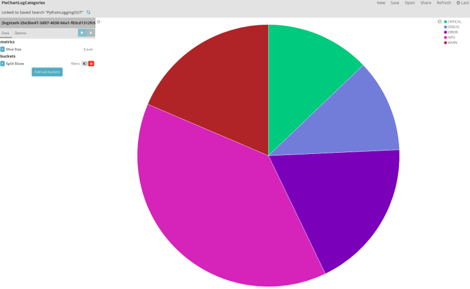

---
copyright:
  years: 2017
lastupdated: "2017-11-22"

---

{:shortdesc: .shortdesc}
{:new_window: target="_blank"}
{:codeblock: .codeblock}
{:screen: .screen}
{:tip: .tip}
{:pre: .pre}

# Generate, Access and Analyze Application Logs
This tutorial shows how the [IBM Cloud Log Analysis](https://console.bluemix.net/catalog/services/log-analysis) service can be used to understand and diagnose activities of an app deployed in the IBM Cloud. We are going to deploy a Python-based Cloud Foundry app, generate different types of logs, and search, analyze and visualize them using Elasticsearch and Kibana, two of the components offered by the IBM Cloud Log Analysis service.

## Objectives
* Provision the IBM Cloud Log Analysis service
* Deploy a Python-based Cloud Foundry app
* Generate different kind of log entries
* Access application logs
* Search and analyze logs
* Visualize logs

## Introduction
IBM Cloud offers three complementary services that help to obtain insights into application health, stability and usage:
* The [IBM Cloud Log Analysis](https://console.bluemix.net/catalog/services/log-analysis) service provides an easy-to-use interface to logs generated by applications running in the IBM Cloud. In the premium plans, even external log events can be fed into the service for consolidated storage and analysis.
* The [Availability Monitoring](https://console.bluemix.net/catalog/services/availability-monitoring) service can be used to perform regular tests on an application to check availability, including speed.
* Last, the [IBM Cloud Activity Tracker](https://console.bluemix.net/catalog/services/activity-tracker) has the capability to capture, store and visualize activities performed by IBM Cloud users and services in your account. Captured events can be stored and analyzed, e.g., to investigate security breaches or unauthorized access.

In this tutorial, we are going to take a look at how to generate, access and analyze application logs. The [documentation for IBM Cloud Log Analysis](https://console.bluemix.net/docs/services/CloudLogAnalysis/index.html) already includes a [tutorial on how to analyze logs for an app deployed in a Kubernetes cluster](https://console.bluemix.net/docs/services/CloudLogAnalysis/containers/tutorials/kibana_tutorial_1.html). Therefore, in this guide, we are going to use a Cloud Foundry app.

## Provision the Log Analysis Service
Applications running in the IBM Cloud generate diagnostic output, i.e. logs, that can be accessed without any additional service. By using the Log Analysis service it is possible to aggregate logs from various sources and retain them as long as needed. This allows to analyze the "big picture" when required and to troubleshoot more complex situations.

The Log Analysis service is found in the [IBM Cloud service catalog in the DevOps category](https://console.bluemix.net/catalog/?category=devops). Click on it and it the dialog select the region, organization and space to which you want to provision the service. This should be the same as for the app we are going to deploy in the next step. Once the correct values are set, click on `Create`.

By default the `Lite` plan is selected which allows for 500 MB of daily logs for the past 3 days. The `Premium` plans feature higher data volumes and longer log retention.

## Deploy a Cloud Foundry app
The ready-to-run [code for the database app is located in this Github repository](https://github.com/IBM-Bluemix/UPDATE_NAME). Clone or download the repository, then push the app to the IBM Cloud.

1. Clone the Github repository:
   ```bash
   git clone https://github.com/IBM-Bluemix/UPDATE_NAME
   cd UPDATE_NAME
   ```
2. Push the application to the IBM Cloud. You need to be logged in to the region, org and space in which the Log Analysis service was created. Copy and paste these commands one line at a time.
   ```bash
   bx login
   bx target --cf
   bx cf push your-app-name
   ```
3. Once the push process is finished you should be able to access the app.

## Generate Application Logs
Next, in order to work with application logs, is to create them. Did you know that the push process above already generated many log entries? Because apps deployed in the IBM Cloud are automatically linked with the Log Analysis service, nothing needs to be done from our side.

1. Now visit the web app. Its URI is listed under `urls` at the end of the diagnostic output generated by the push process. You can also find the application URI in the [IBM Cloud dashboard (console)](console.bluemix.net).

2. The application web UI allows to log a message at a chosen log level. The available log levels are `critical`, `error`, `warn`, `info` and `debug`. The application's logging infrastructure is configured to allow only log entries on or above a set level to pass. Initially, the level is set to `warn`. Thus, a message logged at `info` with a server setting of `warn` would not show up in the diagnostic output. The UI allows to change the server-side setting for the log level. Try it and generate log entries.

3. Take a look at the code in the file [`cloud-logging.py`](http://github.com/IBM-Bluemix/UPDATE_PATH/cloud-logging.py). The code contains `print` statements as well as calls to `logger` functions. Printed messages are written to the `stdout` stream (regular output, application console / terminal), logger messages appear in the `stderr` stream (error log).

4. Back in the application, generate several log entries by submitting messages at different levels. Change the server-side log level in-between to make it more interesting.

## Access Application logs
IBM Cloud offers multiple ways of accessing application logs, in our case for a Cloud Foundry app.

1. The first is using the command line. The following displays the recent logs. It is a great method to investigate errors when an app after the push is not starting:
```bash
bx cf logs your-app-name --recent
```

2. The second method is to use the [IBM Cloud console](https://console.bluemix.net). In the overview, navigate to your app, click on its entry to open the details and then go to `Logs`. Current logs are shown with the most recent at the bottom. On the upper right you can search for an entry or filter by log type. Selecting `Application (APP)`


UI for app
Kibana

## Search and Analyze Logs
log entries, different values, save/open
row vs. json formatter
compose query, search for specific events


## Visualize Logs
charts and dashboard



## Expand the Tutorial
Do you want to learn more? Here are some ideas of what you can do next:
* Push the same app again with a different name or use the [app deployed in a Kubernetes cluster](https://console.bluemix.net/docs/services/CloudLogAnalysis/containers/tutorials/kibana_tutorial_1.html). Then, the Log Analysis dashboard (Kibana) will show the combined logs of all apps. Filter by app.
*


## Related Content
* [Documentation for IBM Cloud Log Analysis](https://console.bluemix.net/docs/services/CloudLogAnalysis/index.html)
* [Logging facility for Python](https://docs.python.org/3/library/logging.html)
