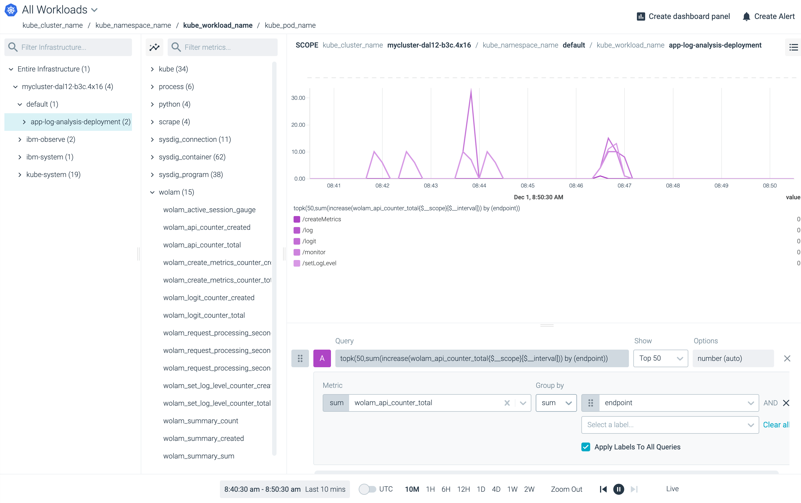

{:step: data-tutorial-type='step'}
{:shortdesc: .shortdesc}
{:new_window: target="_blank"}
{:codeblock: .codeblock}
{:screen: .screen}
{:tip: .tip}
{:pre: .pre}

# Analyze logs and monitor application health 
{: #application-log-analysis}
{: toc-content-type="tutorial"}
{: toc-services="containers, Log-Analysis-with-LogDNA, Registry, Monitoring-with-Sysdig"}
{: toc-completion-time="2h"}

<!--##istutorial#-->
This tutorial may incur costs. Use the [Cost Estimator](https://{DomainName}/estimator/review) to generate a cost estimate based on your projected usage.
{: tip}

<!--#/istutorial#-->

This tutorial shows how the [{{site.data.keyword.la_full_notm}}](https://{DomainName}/observe/logging) service can be used to configure and access logs of a Kubernetes application that is deployed on {{site.data.keyword.Bluemix_notm}}. You will deploy a Python application to a cluster provisioned on {{site.data.keyword.containerlong_notm}}, configure a logging agent, generate different levels of application logs and access worker logs, pod logs or network logs. Then, you will search, filter and visualize those logs through {{site.data.keyword.la_short}} Web UI.
{: shortdesc}

Moreover, you will also setup the [{{site.data.keyword.mon_full_notm}}](https://{DomainName}/observe/monitoring) service and configure monitoring agent to monitor the performance and health of your application and your {{site.data.keyword.containerlong_notm}} cluster.

## Objectives
{: #application-log-analysis-objectives}

* Deploy an application to a Kubernetes cluster to generate log entries.
* Access and analyze different types of logs to troubleshoot problems and pre-empt issues.
* Gain operational visibility into the performance and health of your app and the cluster running your app.


{: class="center"}
{: style="text-align: center;"}

1. User connects to the application and generates log entries.
1. The application runs in a Kubernetes cluster from an image stored in the {{site.data.keyword.registryshort_notm}}.
1. The user will configure {{site.data.keyword.la_full_notm}} service agent to access application and cluster-level logs.
1. The user will configure {{site.data.keyword.mon_full_notm}} service agent to monitor the health and performance of the {{site.data.keyword.containerlong_notm}} cluster and also the app deployed to the cluster.

<!--##istutorial#-->
## Before you begin
{: #application-log-analysis-prereqs}

This tutorial requires:
* {{site.data.keyword.cloud_notm}} CLI,
   * {{site.data.keyword.containerfull_notm}} plugin (`kubernetes-service`),
   * {{site.data.keyword.registryshort_notm}} plugin (`container-registry`),
* `kubectl` to interact with Kubernetes clusters,
* `git` to clone source code repository.

You will find instructions to download and install these tools for your operating environment in the [Getting started with tutorials](/docs/solution-tutorials?topic=solution-tutorials-tutorials) guide.

Note: To avoid the installation of these tools you can use the [{{site.data.keyword.cloud-shell_short}}](https://{DomainName}/shell) from the {{site.data.keyword.cloud_notm}} console.
{: tip}

In addition, make sure you:
- [grant permissions to a user to view logs](/docs/log-analysis?topic=log-analysis-work_iam#user_logdna)
* and [grant permissions to a user to view monitoring metrics](/docs/monitoring?topic=monitoring-iam#iam_users)
<!--#/istutorial#-->

<!--##isworkshop#-->
<!--
## Start a new {{site.data.keyword.cloud-shell_notm}}
{: #application-log-analysis-2}
{: step}
1. From the {{site.data.keyword.cloud_notm}} console in your browser, select the account where you have been invited.
1. Click the button in the upper right corner to create a new [{{site.data.keyword.cloud-shell_short}}](https://{DomainName}/shell).

-->
<!--#/isworkshop#-->

<!--##istutorial#-->
## Create a Kubernetes cluster
{: #application-log-analysis-create_cluster}
{: step}

{{site.data.keyword.containershort_notm}} provides an environment to deploy highly available apps in Docker containers that run in Kubernetes clusters.

A minimal cluster with one (1) zone, one (1) worker node and the smallest available size (**Flavor**) is sufficient for this tutorial. The name `mycluster` will be used in this tutorial.

- For Kubernetes on VPC infrastructure, you are required to create a VPC and subnet(s) prior to creating the Kubernetes cluster. You may follow the instructions provided under the [Creating a standard VPC cluster](https://{DomainName}/docs/containers?topic=containers-clusters#clusters_vpcg2).
   - Make sure to attach a Public Gateway for each of the subnet that you create as it is required for accessing cloud services.
- For Kubernetes on Classic infrastructure follow the [Creating a standard classic cluster](https://{DomainName}/docs/containers?topic=containers-clusters#clusters_standard) instructions.
<!--#/istutorial#-->

<!--##isworkshop#-->
<!--
## Configure the access to your cluster
{: #application-log-analysis-access-cluster}
{: step}

In this step, you'll configure `kubectl` to point to the cluster assigned to you.

1. Navigate to your cluster from the [cluster list](https://{DomainName}/kubernetes/clusters) and click on the **Access** tab under the cluster name.
1. Under **After your cluster provisions, gain access** section, follow instructions to log into your cluster on a terminal.
1. Run the below command to see all the namespaces in your cluster:
   ```sh
   kubectl get namespaces
   ```
   {: pre}
    
-->
<!--#/isworkshop#-->

## Deploy and configure a Kubernetes app to forward logs
{: #application-log-analysis-deploy_configure_kubernetes_app}
{: step}

The ready-to-run [code for the logging app is located in this GitHub repository](https://github.com/IBM-Cloud/application-log-analysis). The application is written using [Django](https://www.djangoproject.com/), a popular Python server-side web framework. Clone or download the repository, then deploy the app to {{site.data.keyword.containershort_notm}} on {{site.data.keyword.Bluemix_notm}}.

### Clone the application
{: #application-log-analysis-build}

In a terminal window:
1. Clone the GitHub repository:
   ```sh
   git clone https://github.com/IBM-Cloud/application-log-analysis
   ```
   {: pre}
   
1. Change to the application directory
   ```sh
   cd application-log-analysis
   ```
   {: pre}

### Deploy the application
{: #application-log-analysis-8}

1. Gain access to your cluster as described under the **Access** section of your cluster.

   For more information on gaining access to your cluster and to configure the CLI to run kubectl commands, check the [CLI configure](/docs/containers?topic=containers-cs_cli_install#cs_cli_configure) section
   {: tip}

2. Define an environment variable named `MYCLUSTER` with your cluster name:
   ```sh
   MYCLUSTER=mycluster
   ```
   {: pre}

3. Make sure to be logged in. Retrieve the cluster ingress subdomain:
   ```sh
   ibmcloud ks cluster get --cluster $MYCLUSTER
   ```
   {: pre}

4. Define a variable pointing to the subdomain:
   ```sh
   MYINGRESSSUBDOMAIN=<Ingress Subdomain value>
   ```
   {: pre}

5. Initialize the `kubectl` cli environment

   ```bash
   ibmcloud ks cluster config --cluster $MYCLUSTER
   ```
   {: pre}

6. Edit `app-log-analysis.yaml` and replace the placeholder (`$MYINGRESSSUBDOMAIN`) with the value captured in the previous step. *Check the table in this section below for more details*.
7. Once the `yaml` is updated, deploy the app with the following command:
   ```sh
   kubectl apply -f app-log-analysis.yaml
   ```
   {: pre}

8. You can now access the application at `http://$MYINGRESSSUBDOMAIN/`.


   | **Variable**        | **Value**                                                            | **Description**                                                                                             |
   |---------------------|----------------------------------------------------------------------|-------------------------------------------------------------------------------------------------------------|
   | $MYINGRESSSUBDOMAIN | mycluster\-1234\-d123456789\.us\-south\.containers\.appdomain\.cloud | Retrieve from the cluster overview page or with ibmcloud ks cluster get \-\-cluster  &lt;your\-cluster\-name&gt;\. |


## Connect a {{site.data.keyword.la_short}} instance
{: #application-log-analysis-connect_logna_instance}
{: step}

Applications deployed to an {{site.data.keyword.containerlong_notm}} cluster in {{site.data.keyword.Bluemix_notm}} will likely generate some level of diagnostic output, i.e. logs. As a developer or an operator, you may want to access and analyze different types of logs such as worker logs, pod logs, app logs, or network logs to troubleshoot problems and pre-empt issues.

By using the {{site.data.keyword.la_short}} service, it is possible to aggregate logs from various sources and retain them as long as needed. This allows to analyze the "big picture" when required and to troubleshoot more complex situations.

To provision and connect a {{site.data.keyword.la_short}} service,

1. From the [Kubernetes clusters](https://{DomainName}/kubernetes/clusters), click on the name of the Kubernetes cluster you just created and click **Overview** on the left pane.
2. Click the Logging **Connect** button.  Use an existing {{site.data.keyword.la_short}} instance or create a new instance as shown below:
   1. Leave **Use private endpoint** checked if possible and click **Create and connect**.
   2. Select a region where you have your cluster created.
   3. Select **7 day Log Search** as your plan.
   4. Create a unique **Service name** such as `<your-initials>-logging`.
   5. Use the resource group associated with your cluster and click **Create**.

   The service provides a centralized log management system where log data is hosted on IBM Cloud. Connect simplifies the installation of *logdna-agent* pod on each node of your cluster. The logging agent reads log files from the pod where it is installed, and forwards the log data to your logging instance.

3. Launch the {{site.data.keyword.la_short}} UI by clicking **Launch** (*the connect button should have changed to Launch*). It may take a few minutes before you start seeing logs.
4. To check whether the `logdna-agent` pods on each node of your cluster are in **Running** status, run the below command in a shell:
   ```sh
   kubectl get pods --namespace ibm-observe
   ```
   {: pre}

   You should see an output similar to this

   ```sh
   NAME                 READY   STATUS    RESTARTS   AGE
   logdna-agent-4nlsw   1/1     Running   0          39s
   logdna-agent-lgq9f   1/1     Running   0          39s
   logdna-agent-ls6dc   1/1     Running   0          39s
   ```

## Generate and access application logs
{: #application-log-analysis-7}
{: generate_application_logs}
{: step}

In this section, you will generate application logs and review them in {{site.data.keyword.la_short}}.

### Generate application logs
{: #application-log-analysis-11}

The application deployed in the previous steps allows you to log a message at a chosen log level. The available log levels are **critical**, **error**, **warn**, **info** and **debug**. The application's logging infrastructure is configured to allow only log entries on or above a set level to pass. Initially, the logger level is set to **warn**. Thus, a message logged at **info** with a server setting of **warn** would not show up in the diagnostic output.

Take a look at the code in the file [**views.py**](https://github.com/IBM-Cloud/application-log-analysis/blob/master/app/views.py). The code contains **print** statements as well as calls to **logger** functions. Printed messages are written to the **stdout** stream (regular output, application console / terminal), logger messages appear in the **stderr** stream (error log).

1. Open the web app at `http://$MYINGRESSSUBDOMAIN/` and click on the `Logging` tab.
1. Generate several log entries by submitting messages at different levels. The UI allows to change the logger setting for the server log level as well. Change the server-side log level in-between to make it more interesting. For example, you can log a "500 internal server error" as an **error** or "This is my first log entry" as an **info**.

### Access application logs
{: #application-log-analysis-access}

You can access the application specific log in the {{site.data.keyword.la_short}} UI using the filters.

1. On the top bar, click on **All Apps**.
1. Under containers, check **app-log-analysis**. A new unsaved view is shown with application logs of all levels. You can also type `app:app-log-analysis` in the *Search...* field.
1. To see logs of specific log level(s), Click on **All Levels** and select multiple levels like Error, info, warning etc.,

## Search and filter logs
{: #application-log-analysis-search_filter_logs}
{: step}

The {{site.data.keyword.la_short}} UI, by default, shows all available log entries(Everything). Most recent entries are shown on the bottom through an automatic refresh.
In this section, you will modify what and how much is displayed and save this as a **View** for future use.

### Search logs
{: #application-log-analysis-14}

1. In the **Search** input box located at the bottom of the page in the {{site.data.keyword.la_short}} UI,
   - you can search for lines that contain a specific text like **"This is my first log entry"** or **500 internal server error**.
   - or a specific log level by entering `level:info` where level is a field that accepts string value.

   For more search fields and help, click the syntax help icon next to the search input box
   {: tip}

1. To jump to a specific timeframe, enter **5 mins ago** in the **Jump to timeframe** input box. Click the icon next to the input box to find the other time formats within your retention period.
1. To highlight the terms, click on **Toggle Viewer Tools** icon.
1. Enter **error** as your highlight term in the first input box, **container** as your highlight term in the second input box and check the highlighted lines with the terms.
1. Click on **Toggle Timeline** icon to see lines with logs at a specific time of a day.

### Filter logs
{: #application-log-analysis-15}

You can filter logs by tags, sources, apps or levels.

1. On the top bar, click **All Tags** and select the checkbox next to your cluster name to see Kubernetes related logs specific to your cluster.
2. Click **All Sources** and select the name of the host (worker node) you are interested in checking the logs. Works well if you have multiple worker nodes in your cluster.
3. To check container or file logs, click **All Apps** and select the checkbox(s) you are interested in seeing the logs.

### Create a view
{: #application-log-analysis-16}

Views are saved shortcuts to a specific set of filters and search queries.

As soon as you search or filter logs, you should see **Unsaved View** in the top bar. To save this as a view:
1. Click **All Apps** and select the checkbox next to **app-log-analysis**
1. Click on **Unsaved View** > click **save as new view / alert** and name the view as **app-log-analysis-view**. Leave the **Category** as empty.
1. Click **Save View** and new view should appear on the left pane showing logs for the app.

### Visualize logs with graphs and breakdowns
{: #application-log-analysis-17}

In this section, you will create a board and then add a graph with a breakdown to visualize the app level data. A board is a collection of graphs and breakdowns.

1. On the left pane, click on the **board** icon (above the settings icon) > click **NEW BOARD**.
1. Click **Edit** on the top bar and let's name this **app-log-analysis-board**. Click **Save**.
1. Click **Add Graph**:
   - Select **app** under **Graph a field**.
   - Choose **app-log-analysis** as the field value.
   - Click **Add Graph**.
1. Select **Counts** as your metric to see the number of lines in each interval over last 24 hours.
1. To add a breakdown, click on the arrow below the graph:
   - Choose **Histogram** as your breakdown type.
   - Choose **level** as your field type.
   - Click **Add Breakdown** to see a breakdown with all the levels you logged for the app.

## Connect {{site.data.keyword.mon_full_notm}} and monitor your cluster
{: #application-log-analysis-monitor_cluster_sysdig}
{: step}

In the following, you are going to add {{site.data.keyword.mon_full_notm}} to the application. The service regularly checks the availability and response time of the app.

1. From the [Kubernetes clusters](https://{DomainName}/kubernetes/clusters), click on the name of the Kubernetes cluster you just created and click **Overview** on the left pane.
2. click the Monitoring **Connect** button. Use an existing {{site.data.keyword.monitoringshort_notm}} instance or create a new instance as shown below:
   1. Leave **Use private endpoint** checked if possible and click **Create and connect**.
   2. Select a region where you have your cluster created.
   3. Select **Graduated Tier** as your plan.
   4. Create a unique **Service name** such as `<your-initials>-monitoring`.
   5. Use the resource group associated with your cluster.
   6. Leave IBM platform metrics to `Disable` and click **Create**.
3. Click **Launch** and you should see the monitoring UI. It may take few minutes for the monitoring information to appear.
4. To check whether the `sysdig-agent` pods on each node of your cluster are in **Running** status, run the below command in a shell:
   ```sh
   kubectl get pods --namespace ibm-observe
   ```
   {: pre}

   You should see the `sysdig-agent` installed
   ```sh
   sysdig-agent-m6k9w   1/1     Running   0          73s
   sysdig-agent-mp4d6   1/1     Running   0          73s
   sysdig-agent-q2s55   1/1     Running   0          73s
   ```

Note: The agent installation as provided by the IBM Cloud script includes the enablement of the Prometheus metrics feature by default. The deployment configuration `app-log-analysis.yaml` used for the example Python application in this tutorial [here](#application-log-analysis-deploy_configure_kubernetes_app) includes the appropriate annotations to `scrape` for Prometheus metrics.
   ```yaml
   spec:
     template:
       metadata:
         annotations:
           prometheus.io/scrape: "true"
           prometheus.io/port: "8002"
   ```

Finally, the application includes a Prometheus library `prometheus_client`, which is used by the sample app in this tutorial to generate custom metrics.  You can find a Prometheus client to use for most programming languages. See the [Prometheus metrics](https://sysdig.com/blog/prometheus-metrics/) for details.
{: tip}

### Monitor your cluster
{: #application-log-analysis-19}

To check the health and performance of your app and cluster you can review the default (out-of-the-box) and/or custom application generated metrics that are captured.

Note: Change the interval to **5 M** or **1 M** on the bottom bar of the UI.
{: tip}

1. Go back to the application running at `http://$MYINGRESSSUBDOMAIN/` and click on the **Monitoring** tab, generate several metrics.
2. Back to the UI, under `Explore` choose `Deployments` for `My Groupings`
   
3. Expand your cluster name on the left pane > expand **default** namespace > click on **app-log-analysis-deployment**.
4. To check **default metrics** such as the HTTP request-response codes, select `HTTP` under `Applications` in the `Metrics and Dashboards` dropdown.
5. To monitor the latency of the application,
   - From the Explore tab, select `Deployments`.
   - Select `Metrics` > `Network` in the `Metrics and Dashboards` dropdown.
   - Select **net.http.request.time**.
   - Select Time: **Sum** and Group: **Average**.
   - Click **More options** and then click **Topology** icon.
   - Click **Done** and Double click the box to expand the view.
6. To monitor the Kubernetes namespace where the application is running,
   - From the Explore tab, select `Deployments`.
   - On the left pane, click on the name of the namespace under which the app is running. _If you haven't set a namespace, the app will be running under `default` namespace_
   - Click the arrow next to `net.http.request.time`.
   - Select `Troubleshooting Views` > `Kubernetes`.
   - Select `Kubernetes Namespace Overview`.

This sample application includes code to generate **custom metrics**. These custom metrics are provided using a Prometheus client and mock multiple access to API endpoints.

{: class="center"}
{: style="text-align: center;"}

1. Expand your cluster name on the left pane > expand **default** namespace > click on **app-log-analysis-deployment**.
2. To monitor the calls to a given api endpoint of the application,
   - From the Explore tab, select `Deployments`.
   - Select `Metrics` > `Prometheus` > `wolam_api_counter_total` in the `Metrics and Dashboards` dropdown.
   - Select Time: **Average**, Group: **Sum**, Segment: **endpoint**
3. Go back to the application running at `http://$MYINGRESSSUBDOMAIN/` and click on the **Monitoring** tab, generate a few metrics after changing the region.
4. To monitor the calls to a given api endpoint of the application by region,
   - Select Time: **Average**, Group: **Sum**, Segment: **region**

### Create a custom dashboard
{: #application-log-analysis-20}

Along with the pre-defined dashboards, you can create your own custom dashboard to display the most useful/relevant views and metrics for the containers running your app in a single location. Each dashboard is comprised of a series of panels configured to display specific data in a number of different formats.

To create a dashboard with a first panel:
1. Click on **Dashboards** on the left most pane > click **+** (add dashboard).
2. In the New Panel, set the **Metrics** to **net.http.request.time**.
3. Set **Segmentation** to **container.id**.
4. In the scope, uncheck **Inherit Dashboard Scope** and set the filter to **container.image**, **is** and the _the application image_ you built earlier, e.g., `us.icr.io/<namespace>/initials-app-log-analysis-latest`.
5. Save the dashboard.

To add another panel:
1. Use the **Add Panel** button in the dashboard.
2. Change the panel type from **Timechart** to **Number**
3. Set the **Metric** to **net.http.request.count**.
4. Set the **Time Aggregation** to **Rate**.
5. Set the **Group Rollup** to **Sum**.
6. In the scope, uncheck **Inherit Dashboard Scope** and set the filter to **container.image**, **is** and the _the application image_ you built earlier, e.g., `us.icr.io/<namespace>/initials-app-log-analysis-latest`.
7. Enable **Compare To** and set the value to **1 Hour ago**.
8. Save the dashboard.

To focus the dashboard on your cluster:
1. To edit the scope of this dashboard,
2. Set the filter to **kubernetes.cluster.name**, **is**, and your cluster name.
3. Click **Save**.

## Remove resources
{: #application-log-analysis-remove_resource}
{: step}

- Remove the logging and monitoring instances from [Observability](https://{DomainName}/observe) page.
<!--##istutorial#-->
- Delete the cluster including worker node, app and containers. This action cannot be undone.
   ```sh
   ibmcloud ks cluster rm --cluster $MYCLUSTER -f
   ```
   {: pre}

<!--#/istutorial#-->

Depending on the resource it might not be deleted immediately, but retained (by default for 7 days). You can reclaim the resource by deleting it permanently or restore it within the retention period. See this document on how to [use resource reclamation](https://{DomainName}/docs/account?topic=account-resource-reclamation).
{: tip}

## Expand the tutorial
{: #application-log-analysis-expand_tutorial}

- Use the [{{site.data.keyword.at_full}} service](/docs/activity-tracker?topic=activity-tracker-getting-started) to track how applications interact with IBM Cloud services.
- [Add alerts](/docs/activity-tracker?topic=activity-tracker-alerts) to your view.
- [Export logs](/docs/activity-tracker?topic=activity-tracker-export) to a local file.
- Examine `views.py` in the sample application and experiment updating the application to capture additional custom metrics. Create an updated image version and update and apply `app-log-analysis.yaml` to redeploy your updates.

## Related content
{: #application-log-analysis-12}
{: related}

- [Resetting the ingestion key used by a Kubernetes cluster](/docs/log-analysis?topic=log-analysis-kube-reset)
- [Archiving logs to IBM Cloud Object Storage](/docs/log-analysis?topic=log-analysis-archiving#archiving)
- [Working with monitoring alerts](/docs/monitoring?topic=monitoring-alerts)
- [Working with monitoring notification channels](/docs/monitoring?topic=monitoring-notifications#notifications)
