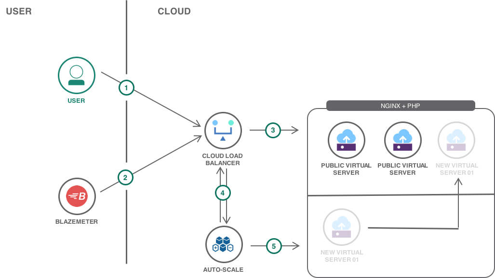

---
copyright:
  years: 2017, 2018
lastupdated: "2018-03-14"
---

{:shortdesc: .shortdesc}
{:new_window: target="_blank"}
{:codeblock: .codeblock}
{:screen: .screen}
{:tip: .tip}
{:pre: .pre}

# Use Auto-Scale service to automatically scale virtual servers on IBM Cloud

In this tutorial, you will learn how to configure the Auto-Scale service to automatically scale the infrastructure resources for a highly available web application. You will create a provisioning script to add and remove infrastructure resources set the autoscaling policies.

## Objectives

- Provision one server for the database
- Install and configure MySQL
- Create a file storage for database backups
- Provision two servers for the PHP application
- Create a file storage to share files between the application servers
- Install and configure the PHP application on the application servers
- Provision one load balancer in front of the application servers

## Products
{: #products}

This tutorial uses the following products:
* [Load Balancer](https://console.bluemix.net/catalog/infrastructure/ibm-bluemix-load-balancer)
* [Virtual Server](https://console.bluemix.net/catalog/infrastructure/virtual-server-group)
* [File Storage](https://console.bluemix.net/catalog/infrastructure/file-storage)
* Auto-Scale

<p style="text-align: center;">

</p>

1. The user connects to the application.
2. Blazemeter creates performance test, send traffic spike to the server.
3. The Load Balancer selects one of the healthy servers to handle the request.
4. Auto Scale policy set to add/remove a new virtual servers, then sync the load balancer list of servers that a new server added or removed.
5. Run provisioning script to add/remove new virtual servers. 

## Cost

{: #cost}

This tutorial uses billable components of IBM Cloud Platform, including: 

- Virtual Server
- Cloud Load Balancer 
- Auto Scale
- BlazeMeter

Use the [Pricing Calculator](https://console.bluemix.net/pricing/) to generate a cost estimate based on your projected usage.  

## Before you begin
{: #prereqs}

### Configure the SoftLayer VPN

In this tutorial, the load balancer is the front door for the application users. The virtual servers do not need to be visible on the public Internet. Thus they will be provisioned with only a private IP address and you will use your SoftLayer VPN connection to work on the servers.

1. [Ensure your VPN Access is enabled](https://knowledgelayer.softlayer.com/procedure/getting-started-softlayer-vpn).

     You should be a **Master User** to enable VPN access or contact master user for access.
     {:tip}
2. Obtain your VPN Access credentials in [your profile page](https://control.softlayer.com/account/user/profile).
3. Log in to the VPN through [the web interface](https://www.softlayer.com/VPN-Access) or use a VPN client for [Linux](https://knowledgelayer.softlayer.com/procedure/ssl-vpn-linux), [macOS](https://knowledgelayer.softlayer.com/procedure/ssl-vpn-mac-os-x-1010) or [Windows](https://knowledgelayer.softlayer.com/procedure/ssl-vpn-windows).

You can choose to skip this step and make all your servers visible on the public Internet (although keeping them private provide an additional level of security). To make them public, select **Public and Private Network Uplink** when provisioning virtual servers.
{: tip}

### Check account permissions

Contact your Infrastructure master user to get the following permissions:
- **Network** so that you can create virtual servers with **Public and Private Network Uplink** (this permission is not required if you use the VPN to connect to the servers)
- Access to the **Auto Scale** options in the customer portal requires a special user permissions beyond the ability to order and manage Virtual Servers. In order to access the auto scale features you must have the permissions to manage all of the virtual servers on the account in addition to the any future virtual devices added. After this permission is added, you would have the access to the auto scale options in the **Device** menu.

## Provision two servers for the PHP application
{: app_servers}

1. Go to the catalog in the {{site.data.keyword.Bluemix}} console, and select the [Virtual Server](https://console.bluemix.net/catalog/infrastructure/virtual-server-group) service from the Infrastructure section.
2. Select **Public Virtual Server** and then click **Create**.
3. Configure the server with the following:
   - Set **Name** to **app1**
   - Select the same location where want to provision the server. Note the **datacenter location** selected, this would be needed forwarder down the solution.
   - Select the **Ubuntu Minima** image
   - Keep the default compute flavor.
   - Under **Network Interface**, select the **100Mbps Private Network Uplink** option.

     If you did not configure the VPN Access, select the **100Mbps Public and Private Network Uplink** option.
     {: tip}
   - Review the other configuration options and click **Provision** to provision the server.
     [Configure virtual server](images/solution14/db-server.png)
4. Repeat steps 1-3 to provision another virtual server named **app2**

## Install and configure the PHP application on the application servers
{: php_application}

This tutorial sets up a Wordpress blog. All Wordpress files will be installed on the shared file storage so that both application servers can access them. Before installing Wordpress, a web server and a PHP runtime need to be configured. **Run below commands on both app1 and app2 servers.**

### Install nginx and PHP

Repeat the following steps on each application server:

1. Update the package list

   ````
   apt-get update
   ````

2. Install nginx

   ```
   apt-get install nginx
   ```

3. Install PHP 
   ```sh
   apt-get -y install php-fpm 
   ```

4. Stop PHP service and nginx
   ```sh
   systemctl stop php7.0-fpm
   systemctl stop nginx
   ```

5. Replace the content using: `echo "" > /etc/nginx/sites-available/default`  then nano into it using: `nano /etc/nginx/sites-available/default` and add the following:
   ```sh
   server {
          listen 80 default_server;
          listen [::]:80 default_server;

          root /mnt/www/html;

          index index.php;

          server_name _;

          location = /favicon.ico {
                  log_not_found off;
                  access_log off;
          }

          location = /robots.txt {
                  allow all;
                  log_not_found off;
                  access_log off;
          }

          location / {
                  # following https://codex.wordpress.org/Nginx
                  try_files $uri $uri/ /index.php?$args;
          }

          # pass the PHP scripts to the local FastCGI server
          location ~ \.php$ {
                  include snippets/fastcgi-php.conf;
                  fastcgi_pass unix:/run/php/php7.0-fpm.sock;
          }

          location ~* \.(js|css|png|jpg|jpeg|gif|ico)$ {
                  expires max;
                  log_not_found off;
          }

          # deny access to .htaccess files, if Apache's document root
          # concurs with nginx's one
          location ~ /\.ht {
                  deny all;
          }
   }
   ```

6. Create a `www amd html` folder inside the `/mnt` using

   ```shell
   cd /mnt
   mkdir www
   mkdir www/html
   ```

7. Create an index.php file to add some php code to display app name.

   ```bash
   cd /mnt/www/html
   touch index.php
   nano index.php
   ```

8. Add some PHP script to the newly created index.php file to display the server ip. Edit the index.php using `nano index.php` 

   ```bash
   <?php
   $hostname = "App1";
   echo $hostname;
   ?>
   ```

   For server app2 and change the hostname to app2. 

9. Start back PHP service and nginx

   ```bash
   systemctl start php7.0-fpm
   systemctl start nginx
   ```

## Provision one load balancer server in front of the application servers

{: load_balancer}

At this point, we have two application servers with separate IP addresses. They might even not be visible on the public Internet if you choose to only provision Private Network Uplink. Adding a Load Balancer in front of these servers will make the application public. The load balancer will also hide the underlying infrastructure to the users. The Load Balancer will monitor the health of the application servers and dispatch incoming requests to healthly servers.

1. Go to the catalog to create a [IBM Cloud Load Balancer](https://console.bluemix.net/catalog/infrastructure/ibm-cloud-load-balancer)
2. In the **Plan** step, select the same data center as *app1* and *app2*
3. In **Network Settings**,
   1. Select the same subnet as the one where *app1* and *app2* where provisioned
   2. Use the default IBM system pool for the load balancer public IP.
4. In **Basic**,
   1. Name the load balancer, e.g. **app-lb-1**
   2. Keep the default protocol configuration - by default the load balancer is configured for HTTP.
      SSL protocol is supported with your own certificates. Refer to [Import your SSL certificates in the load balancer](https://knowledgelayer.softlayer.com/procedure/access-ssl-certificates-screen)
      {: tip}
5. In **Server Instances**, add *app1* and *app2* servers
6. Review and Create to complete the wizard.

### Test the Load Balancer behavior

The Load Balancer is configured to check the health of the servers and to redirect users only to healthy servers. **Note:** it may take some time before the Load Balancer address becomes active due to DNS propagation.

1. Open the Load Balancer URL in the browser to see the PHP application displaying. Refresh the browser few times to see different server IP showing, this proves that the load balancer is working as expected. 
2. Test the load balancer by stopping app1 and after a short while reload the browser, notice all hits are going to *app2* and app2 IP only showing.
3. Start back *app1*.
4. Once the Load Balancer detects *app1* as healthy, it will redirect traffic to this server.
5. The health of the applications can be also viewed from the Load Balancer heath dashboard. 

## Clean up resources

1. Delete the Load Balancer
2. Cancel *db1*, *app1* and *app2*
3. Delete the BlazeMeter

## Related information

- Static content served by your application may benefit from a Content Delivery Network in front of the Load Balancer to reduce the load on your backend servers. Refer to [Accelerate delivery of static files using a CDN - Object Storage](static-files-cdn.html) for a tutorial implementing a Content Delivery Network.
- In this tutorial we provision two servers, more servers could be added automatically to handle additional load. [SoftLayer Auto Scale](https://knowledgelayer.softlayer.com/learning/introduction-softlayer-auto-scale) provides you with the ability to automate the manual scaling process associated with adding or removing virtual servers to support your business applications.
- To increase availability and disaster recovery options, File Storage can be configured to perform [automatic regular snapshots](https://console.bluemix.net/docs/infrastructure/FileStorage/snapshots.html#working-with-snapshots) of the content and [replication](https://console.bluemix.net/docs/infrastructure/FileStorage/replication.html#working-with-replication) to another data center.
- Add database server and file storage to store application files between different applications. Check the solution [Use Virtual Servers to build highly available and scalable web app](highly-available-and-scalable-web-application.html) for detailed steps for setting up file storage and database server.

