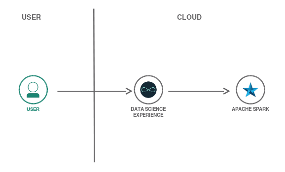
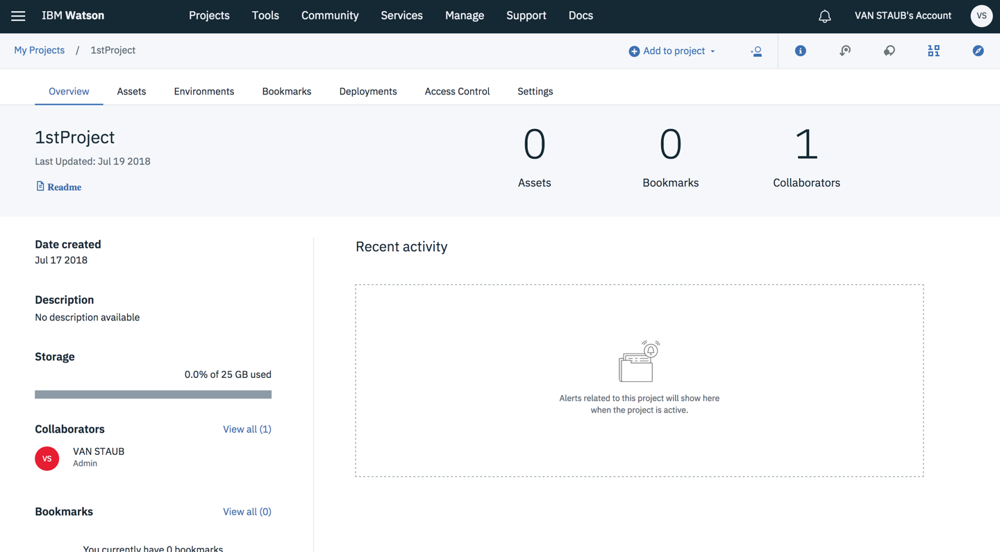
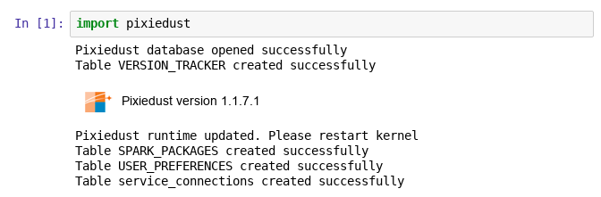

{:shortdesc: .shortdesc}
{:new_window: target="_blank"}
{:codeblock: .codeblock}
{:screen: .screen}
{:tip: .tip}
{:pre: .pre}

# Analyze and visualize open data with Apache Spark
{: #big-data-analytics-spark}

In this tutorial, you will analyze and visualize open data sets using {{site.data.keyword.DSX_full}}, a Jupyter Notebook and Apache Spark. You'll start by combining data that describes population growth, life expectancy and country ISO codes into a single data frame. To discover insights, you'll then use a Python library called Pixiedust to query and visualize data in a variety of ways.

<p style="text-align: center;">

  
</p>

## Objectives
{: #objectives}

* Deploy {{site.data.keyword.iae_short}} and {{site.data.keyword.DSX_short}} on {{site.data.keyword.cloud_notm}}
* Work with a Jupyter Notebook and a Python kernel
* Import, transform, analyze and visualize data sets

## Services used
{: #services}

This tutorial uses the following runtimes and services:
   * [{{site.data.keyword.iae_full_notm}}](https://{DomainName}/catalog/services/analytics-engine)
   * [{{site.data.keyword.DSX_full}}](https://{DomainName}/catalog/services/watson-studio)
   * [{{site.data.keyword.cos_full_notm}}](https://{DomainName}/catalog/services/cloud-object-storage)

This tutorial may incur costs. Use the [Pricing Calculator](https://{DomainName}/estimator/review) to generate a cost estimate based on your projected usage.

## Service and Environment Setup
Start by provisioning the services used in this tutorial and create a project within {{site.data.keyword.DSX_short}}.

You can provision services for {{site.data.keyword.cloud_notm}} from the [Resource List](https://{DomainName}/resources) and [catalog](https://{DomainName}/catalog/). Alternatively {{site.data.keyword.DSX_short}} allows you to create or add existing Data & Analytics services from its dashboard and project settings.
{:tip}

1. From the [{{site.data.keyword.cloud_notm}} catalog](https://{DomainName}/catalog) navigate to the **AI** section. Create the **{{site.data.keyword.DSX_short}}** service. Click on the **Get Started** button to launch the **{{site.data.keyword.DSX_short}}** dashboard.
2. In the dashboard, click on the **Create a project** tile > Select **Data Science** > Create project. In the **Name** field, enter `1stProject` as the name. You can leave the description empty.
3. On the right side of the page, you can **Define storage**. If you have already provisioned storage, select an instance from the list. If not, click on **Add** and follow the instructions in the new browser tab. Once done with service creation, click **Refresh** to see the new service.
4. Click on the **Create** button to create the project. You will be redirected to the project's overview page.  
   
5. On the overview page, click **Settings**.
6. From the **Associated services** section, click **Add Service** and select **Analytics Engine** from the menu. In the resulting screen, you can choose an existing service instance or create a new one. Create a new one and make sure that the **Software package** includes **Spark**.

   The Lite plan for {{site.data.keyword.iae_full_notm}} [is available only to institutions](https://{DomainName}/docs/services/AnalyticsEngine?topic=AnalyticsEngine-general-faqs#free-usage) that have signed up with IBM to try out the Lite plan. 
   {:tip}

## Create and prepare a notebook
The [Jupyter Notebook](http://jupyter.org/) is an open-source web application that allows you to create and share documents that contain live code, equations, visualizations and narrative text. Notebooks and other resources are organized in projects.
1. Click the **Add to project** button and in the **Choose asset type** dialog select **Notebook**.
2. Use **Blank** notebook. Enter `MyNotebook` as the **Name**.
3. From the **Select runtime** menu, choose the **Spark Python** instance with the highest version number. Click **Create Notebook** to complete the process.
4. The field where you enter text and commands is called a **Cell**. Copy the following code into the empty cell to import the [**Pixiedust** package](https://pixiedust.github.io/pixiedust/use.html). Execute the cell by either clicking on the **Run** icon in the toolbar or by pressing **Shift+Enter** on the keyboard.
   ```Python
   import pixiedust
   ```
   {:codeblock}
   

If you've never worked with Jupyter Notebooks, click on the **Docs** icon on the upper right menu. Navigate to **Analyze data**, then the [**Notebooks** section](https://dataplatform.ibm.com/docs/content/analyze-data/notebooks-parent.html?context=analytics) to learn more about [notebooks and their parts](https://dataplatform.ibm.com/docs/content/analyze-data/parts-of-a-notebook.html?context=analytics&linkInPage=true).
{:tip}

## Load data
Next load three open data sets and make them available within the notebook. The **Pixiedust** library allows you to easily [load **CSV** files using an URL](https://pixiedust.github.io/pixiedust/loaddata.html).

1.  Copy the following line into the next empty cell in your notebook, but don't run it yet.
   ```Python
   df_pop = pixiedust.sampleData('YourAccessURI')
   ```
   {:codeblock}
2. In another browser tab go to the [Community](https://dataplatform.ibm.com/community?context=analytics) section. Under **Data Sets** search for [**Total population by country**](https://dataplatform.ibm.com/exchange/public/entry/view/889ca053a19986a4445839358a91963e) and click on the tile. On the upper right click on the **link** icon to obtain an access URI. Copy the URI and replace the text **YourAccessURI** in the notebook cell with the link. Click on the **Run** icon in the toolbar or **Shift+Enter**.
3. Repeat the step for another data set. Copy the following line into the next empty cell in your notebook.
   ```Python
   df_life = pixiedust.sampleData('YourAccessURI')
   ```
   {:codeblock}
4. In the other browser tab with the **Data Sets**, search for [**Life expectancy at birth by country in total years**](https://dataplatform.ibm.com/exchange/public/entry/view/f15be429051727172e0d0c226e2ce895). Obtain the link again and use it to replace **YourAccessURI** in the notebook cell and **Run** to start the load process.
5. For the last of three data sets, load a list of country names and their ISO codes from a collection of open data sets on Github. Copy the code into the next empty notebook cell and run it.
   ```Python
     df_countries = pixiedust.sampleData('https://raw.githubusercontent.com/datasets/country-list/master/data.csv')
   ```
   {:codeblock}

The list of country codes will be used later to simplify data selection by using a country code instead of the exact country name.

## Transform data
After the data is made available, transform it slightly and combine the three sets into a single data frame.
1. The following code block will redefine the data frame for the population data. This is done with a SQL statement that renames the columns. A view is then created and schema printed. Copy this code into the next empty cell and run it.
   ```Python
   sqlContext.registerDataFrameAsTable(df_pop, "PopTable")
   df_pop = sqlContext.sql("SELECT `Country or Area` as Country, Year, Value as Population FROM PopTable")
   df_pop.createOrReplaceTempView('population')
   df_pop.printSchema()
   ```
   {:codeblock}
2. Repeat the same for the Life Expectancy data. Instead of printing the schema, this code prints the first 10 rows.  
   ```Python
   sqlContext.registerDataFrameAsTable(df_life, "lifeTable")
   df_life = sqlContext.sql("SELECT `Country or Area` as Country, Year, Value as Life FROM lifeTable")
   df_life = df_life.withColumn("Life", df_life["Life"].cast("double"))
   df_life.createOrReplaceTempView('life')
   df_life.show(10)
   ```
   {:codeblock}

3. Repeat the transformation of the schema for the country data.
   ```Python
   sqlContext.registerDataFrameAsTable(df_countries, "CountryTable")
   df_countries = sqlContext.sql("SELECT `Name` as Country, Code as CountryCode FROM CountryTable")
   df_countries.createOrReplaceTempView('countries')
   ```
   {:codeblock}

4. The column names are now simpler and the same across data sets, which can be combined into a single data frame. Perform an **outer** join on the life expectancy and population data. Then, in the same statement, **inner** join to add the country codes. Everything will be ordered by country and year. The output defines the data frame **df_all**. By utilizing an inner join the resulting data contains only countries which are found in the ISO list. This process removes regional and other entries from the data.
   ```Python
   df_all = df_life.join(df_pop, ['Country', 'Year'], 'outer').join(df_countries, ['Country'], 'inner').orderBy(['Country', 'Year'], ascending=True)
   df_all.show(10)
   ```
   {:codeblock}

5. Change the data type for **Year** to an integer.
   ```Python
   df_all = df_all.withColumn("Year", df_all["Year"].cast("integer"))
   df_all.printSchema()
   ```
   {:codeblock}

Your combined data is ready to be analyzed.

## Analyze data
In this part, use [Pixiedust to visualize the data in different charts](https://pixiedust.github.io/pixiedust/displayapi.html). Start by comparing life expectancy for some countries.

1. Copy the code into the next empty cell and run it.
   ```Python
   df_all.createOrReplaceTempView('l2')
   dfl2=spark.sql("SELECT Life, Country, Year FROM l2 where CountryCode in ('CN','DE','FR','IN','US')")
   display(dfl2)
   ```
   {:codeblock}
2. A scrollable table is shown. Click on the chart icon directly under the code block and select **Line Chart**. A popup dialog with the **Pixiedust: Line Chart Options** will appear. Enter a **Chart Title** like "Comparison of Life Expectancy". From the offered **Fields**, drag **Year** into the **Keys** box, **Life** into the **Values** area. Enter **1000** for **# of Rows to Display** and leave **Aggregation** as **SUM**. Press **OK** to have the line chart plotted. On the right side, make sure that **mapplotlib** is selected as **Renderer**. Click on the **Cluster By** selector and choose **Country**. A chart similar to the following will be shown.
   

3. Create a chart focusing on the year 2010. Copy the code into the next empty cell and run it.
   ```Python
   df_all.createOrReplaceTempView('life2010')
   df_life_2010=spark.sql("SELECT Life, Country FROM life2010 WHERE Year=2010 AND Life is not NULL ")
   display(df_life_2010)
   ```
   {:codeblock}
4. In the chart selector choose **Map**. In the configuration dialog drag **Country** into the **Keys** area. Move **Life** into the **Values** box. Similar to the first chart, increase the **# of Rows to Display** to **1000**. Press **OK** plot the map. Choose **brunel** as **Renderer**. A world map colored relative to the life expectancy is shown. You can use the mouse to zoom into the map.
   

## Remove resources
{:removeresources}

To remove resource, follow these steps:
1. Visit the [{{site.data.keyword.cloud_notm}} Resource List](https://{DomainName}/resources).
2. Locate the services each by using the **Offering** filter, then choose **Delete** from the context menu.

## Expand the tutorial
Below are some ideas and suggestions to enhance this tutorial.
* Create and visualize a query showing the life expectancy rate relative to population growth for a country of your choice
* Compute and visualize the population growth rates per country on a world map
* Load and integrate additional data from the catalog of data sets
* Export the combined data to a file or database

## Related content
{:related}
Provided below are links related to the topics covered in this tutorial.
* [Watson Data Platform](https://dataplatform.ibm.com): Use Watson Data Platform to collaborate and build smarter applications. Quickly visualize and discover insights from your data and collaborate across teams.
* [PixieDust](https://www.ibm.com/cloud/pixiedust): Open source productivity tool for Jupyter Notebooks
* [Cognitive Class.ai](https://cognitiveclass.ai/): Data Science and Cognitive Computing Courses
* [IBM Watson Data Lab](https://ibm-watson-data-lab.github.io/): Things we made with data, so you can too
* [Analytics Engine service](https://{DomainName}/catalog/services/analytics-engine): Develop and deploy analytics applications using open source Apache Spark and Apache Hadoop
