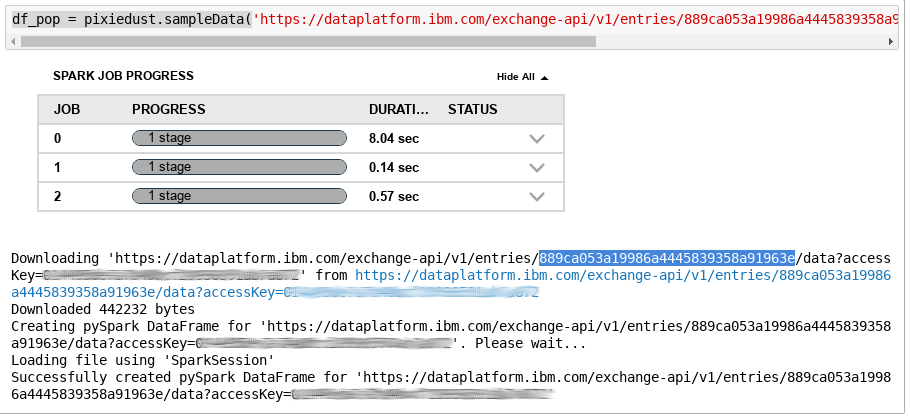

---
copyright:
  years: 2018
lastupdated: "2018-06-11"

---

{:shortdesc: .shortdesc}
{:new_window: target="_blank"}
{:codeblock: .codeblock}
{:screen: .screen}
{:tip: .tip}
{:pre: .pre}

# Analyze and visualize open data with Apache Spark

In this tutorial, you will analyze and visualize open data sets using a Jupyter Notebook on {{site.data.keyword.DSX_full}} and Apache Spark service for processing. For this use case, you will start by combining data about population growth, life expectancy and country ISO codes into a single data frame. Then, query and visualize that data in several ways using the Pixiedust library for Python.

<p style="text-align: center;">

  
</p>

## Objectives
{: #objectives}

* Deploy Apache Spark and {{site.data.keyword.DSX_short}} on IBM Cloud.
* Work with a Jupyter Notebook and a Python kernel.
* Import, transform, analyze and visualize data sets.

## Services used
{: #services}

This tutorial uses the following runtimes and services:
   * {{site.data.keyword.sparkl}}
   * {{site.data.keyword.DSX_full}}
   * {{site.data.keyword.cos_full_notm}}

This tutorial may incur costs. Use the [Pricing Calculator](https://console.bluemix.net/pricing/) to generate a cost estimate based on your projected usage.

## Service and Environment Setup
First, you need to provision the services you are using for this tutorial and create a project within the {{site.data.keyword.DSX_short}}.

You can provision services for  {{site.data.keyword.Bluemix_short}} from the dashboard and catalog. Another way is to use {{site.data.keyword.DSX_short}}. It allows to directly create Data & Analytics services from within its dashboard.
{:tip}   

1. From the [{{site.data.keyword.Bluemix_short}} catalog](https://console.bluemix.net/catalog) navigate to the **Watson** section. Create the **{{site.data.keyword.DSX_short}}** service. Click on the **Get Started** button to launch the **{{site.data.keyword.DSX_short}}** dashboard.
2. In the dashboard, click on the **New project** tile. In the **Name** field, enter `1stProject` as new name. You can leave the description empty.
3. On the right side of the page, there are sections to **Define storage** and **Define compute engine**. If you already had provisioned storage or compute services, they should  be shown and selected. If not, click on **Add** and follow the instructions in the new browser tab. Once done with the service creation, click **Refresh** to see the new service.
4. Once all necessary information is filled in, you can click on **Create**. The project is created and you are taken to the project overview.  
   

## Create and prepare a notebook
The [Jupyter Notebook](http://jupyter.org/) is an open-source web application that allows you to create and share documents that contain live code, equations, visualizations and narrative text. Notebooks and other resources are organized in projects.
1. From the project Overview page, click on the **Assets** tab and then **New notebook**.
2. Use **Blank** notebook. Enter `MyNotebook` as **Name**. You can leave the description empty. Keep the **Language** selected as **Python**. Also, leave the **Spark version** as suggested. At the bottom, you can pick the preferred Spark service if more than one has been provisioned. Complete the process by clicking **Create Notebook**.
If you have never worked with Jupyter Notebooks, then click on the **Docs** icon on the upper right menu. Navigate to the **Analyze data**, then [**Notebooks** section](https://dataplatform.ibm.com/docs/content/analyze-data/notebooks-parent.html?context=analytics) to learn more about [notebooks and their parts](https://dataplatform.ibm.com/docs/content/analyze-data/parts-of-a-notebook.html?context=analytics&linkInPage=true). In short, the field where you can enter text and commands is called a **Cell**. You can execute the content of a cell by either clicking on the **Run** icon in the toolbar or by pressing **Shift+Enter** on the keyboard.
{:tip}
3. Copy the following code into the empty cell. It is used to import the [**Pixiedust** package](https://ibm-watson-data-lab.github.io/pixiedust/use.html).
   ```Python
   import pixiedust
   ```
   {:codeblock}
   Run the cell, i.e., execute the **import pixiedust** command.
   

## Load data
Next, you will load three open data sets and make them available within the notebook. **Pixiedust** library allows you to easily [load **CSV** files using an URL](https://ibm-watson-data-lab.github.io/pixiedust/loaddata.html).

1.  Copy the following line into the next empty cell in your notebook, but don't run it yet.   
   ```Python
   df_pop = pixiedust.sampleData('YourAccessURI')
   ```
   {:codeblock}
In another browser tab go to the [Community](https://dataplatform.ibm.com/community?context=analytics) section. Under **Data Sets** search for [**Total population by country**](https://dataplatform.ibm.com/exchange/public/entry/view/889ca053a19986a4445839358a91963e) and click on that tile. On the upper right click on the green **link** icon to obtain an access URI. Copy that URI and replace the **YourAccessURI** in the notebook cell with that link. Click on the **Run** icon in the toolbar (Keyboard shortcut: **Shift+Enter**). The load process should start and look similar to this:   
   

2. Repeat the step for another data set. Copy the following line into the next empty cell in your notebook.
   ```Python
   df_life = pixiedust.sampleData('YourAccessURI')
   ```
   {:codeblock}
   In the other browser tab with the **Data Sets** search for [**Life expectancy at birth by country in total years**](https://dataplatform.ibm.com/exchange/public/entry/view/f15be429051727172e0d0c226e2ce895). Obtain the link again and use it to replace **YourAccessURI** in the notebook cell and **Run** to start the load process.

3. For the last of three data sets, load a list of country names and their ISO codes from a collection of open data sets on Github:   
   ```Python
     df_countries = pixiedust.sampleData('https://raw.githubusercontent.com/datasets/country-list/master/data.csv')
   ```
   {:codeblock}
   Copy the code into the next empty notebook cell and run it.

The list of country codes comes in handy later on. It allows to simplify data selection by using a country code instead of the written, exact country name.

## Transform data
After the data is made available, transform it slightly and combine the three sets into a single data frame.
1. The following code block will redefine the data frame for the population data. This is done with a SQL statement which renames the columns. Then, a view is created and schema is printed. Copy this code into the next empty cell and run it.
   ```Python
   sqlContext.registerDataFrameAsTable(df_pop, "PopTable")
   df_pop = sqlContext.sql("SELECT `Country or Area` as Country, Year, Value as Population FROM PopTable")
   df_pop.createOrReplaceTempView('population')
   df_pop.printSchema()
   ```
   {:codeblock}
2. Repeat the same for the Life Expectancy data. Instead of printing the schema, this code will print first 10 rows.  
   ```Python
   sqlContext.registerDataFrameAsTable(df_life, "lifeTable")
   df_life = sqlContext.sql("SELECT `Country or Area` as Country, Year, Value as Life FROM lifeTable")
   df_life = df_life.withColumn("Life", df_life["Life"].cast("double"))
   df_life.createOrReplaceTempView('life')
   df_life.show(10)
   ```
   {:codeblock}

3. Last, repeat the transformation of the schema for the country data.
   ```Python
   sqlContext.registerDataFrameAsTable(df_countries, "CountryTable")
   df_countries = sqlContext.sql("SELECT `Name` as Country, Code as CountryCode FROM CountryTable")
   df_countries.createOrReplaceTempView('countries')
   ```
   {:codeblock}

4. The column names are now simpler and similar across the data sets. Next, combine them into one data frame. First, perform an **outer** join on the life expectancy and population data. Then, in the same statement, **inner** join to bring the combined data together with the country codes. Everything is ordered by country and year. The output defines the data frame **df_all**. By utilizing an inner join the resulting data contains only countries which are found in the ISO list. Thereby, cleansing the data from regional and other entries.
   ```Python
   df_all = df_life.join(df_pop, ['Country', 'Year'], 'outer').join(df_countries, ['Country'], 'inner').orderBy(['Country', 'Year'], ascending=True)
   df_all.show(10)
   ```
   {:codeblock}

5. Next, change the data type for **Year** and make it an integer.
   ```Python
   df_all = df_all.withColumn("Year", df_all["Year"].cast("integer"))
   df_all.printSchema()
   ```
   {:codeblock}
   The combined data is ready now to be analyzed.

## Analyze data
In this part, use [Pixiedust to visualize the data in different charts](https://ibm-watson-data-lab.github.io/pixiedust/displayapi.html). Start by comparing life expectancy for some countries.

1. Copy the code into the next empty cell and run it.
   ```Python
   df_all.createOrReplaceTempView('l2')
   dfl2=spark.sql("SELECT Life, Country, Year FROM l2 where CountryCode in ('CN','DE','FR','IN','US')")
   display(dfl2)
   ```
   {:codeblock}   
2. Initially, a scrollable table is shown. Click on chart icon directly under the code block and select **Line Chart**. Then, a popup dialog with the **Pixiedust: Line Chart Options** should appear. Enter a **Chart Title** like "Comparison of Life Expectancy". From the offered **Fields**, drag **Year** into the **Keys** box, **Life** into the **Values** area. Enter **1000** for **# of Rows to Display**. Press **OK** to have the line chart plotted. On the right side, make sure that **mapplotlib** is selected as **Renderer**. Moreover, click on the **Cluster By** selector and choose **Country**. Finally, something like the following should be shown:   
      

3. Next create a chart focusing on the year 2010. Copy the code into the next empty cell and run it.
   ```Python
   df_all.createOrReplaceTempView('life2010')
   df_life_2010=spark.sql("SELECT Life, Country FROM life2010 WHERE Year=2010 AND Life is not NULL ")
   display(df_life_2010)
   ```
   {:codeblock}   
4. In the chart selector choose **Map**. In the configuration dialog drag **Country** into the **Keys** area. Thereafter, move **Life** into the **Values** box. Similar to the first chart, increase **# of Rows to Display** to **1000**. Press **OK** to have the map plotted. Choose **brunel** as **Renderer**. A world map colored relative to the life expectancy
should be shown. You can use the mouse to zoom into the map.   
   


## Expand the tutorial
Want to add to or change this tutorial? Here are some ideas:
1. Create and visualize a query showing the life expectancy rate relative to population growth for a country of your choice.
2. Compute and visualize the population growth rates per country on a world map.
3. Load and integrate further data from the catalog of data sets.
4. Export the combined data to a file or database.   

## Related content
{:related}
Here are links to additional information on the topics covered in this tutorial.
   * [Watson Data Platform](https://dataplatform.ibm.com): Use Watson Data Platform to collaborate and build smarter applications. Quickly visualize and discover insights from your data and collaborate across teams.
   * [PixieDust](https://www.ibm.com/cloud/pixiedust): Open source productivity tool for Jupyter Notebooks
   * [Cognitive Class.ai](https://cognitiveclass.ai/): Data Science and Cognitive Computing Courses
   * [IBM Watson Data Lab](https://ibm-watson-data-lab.github.io/): Things we made with data, so you can too
   * [Analytics Engine service](https://console.bluemix.net/catalog/services/analytics-engine): Develop and deploy analytics applications using open source Apache Spark and Apache Hadoop
