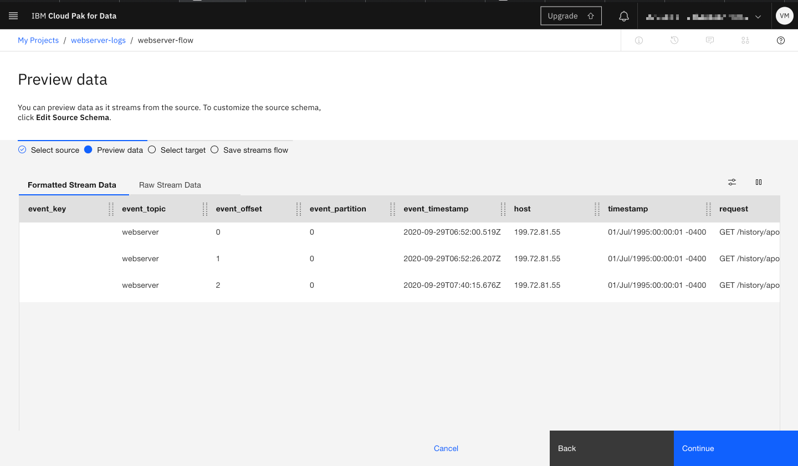
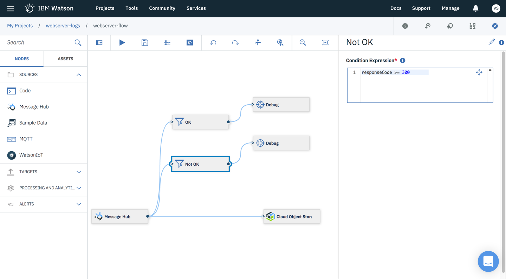
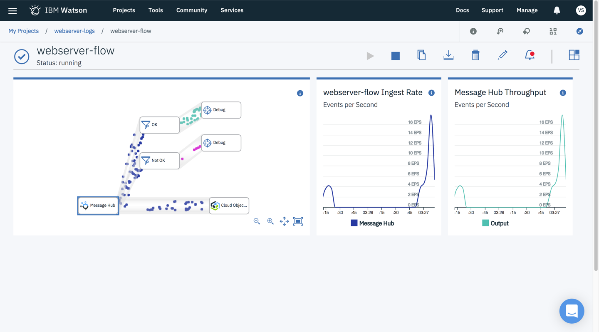

---
copyright:
  years: 2018
lastupdated: "2018-06-28"
---

{:shortdesc: .shortdesc}
{:new_window: target="_blank"}
{:codeblock: .codeblock}
{:screen: .screen}
{:tip: .tip}
{:pre: .pre}

# Big data logs with streaming analytics and SQL

Due to a known issue with Streams Designer, this tutorial has been hidden. New users will be unable to access the Streams Designer tool from Watson Data Platform and unable to complete a primary objective. This tutorial will be re-published once Streams Designer is available again.
{: tip}

In this tutorial, you will build a log analysis pipeline designed to collect, store and analyze log records to support regulatory requirements or aid information discovery. This solution leverages several services available in {{site.data.keyword.cloud_notm}}: {{site.data.keyword.messagehub}}, {{site.data.keyword.cos_short}}, SQL Query and {{site.data.keyword.streaminganalyticsshort}}. A program will assist you by simulating transmission of web server log messages from a static file to {{site.data.keyword.messagehub}}.

With {{site.data.keyword.messagehub}} the pipeline scales to receive millions of log records from a variety of producers. By applying {{site.data.keyword.streaminganalyticsshort}} log data can be inspected in realtime to integrate business processes. Log messages can also be easily redirected to long term storage using {{site.data.keyword.cos_short}} where developers, support staff and auditors can work directly with data using SQL Query.

While this tutorial focuses on log analysis, it is applicable to other scenarios: storage-limited IoT devices can similarly stream messages to {{site.data.keyword.cos_short}} or marketing professionals can segment and analyze customer events across digital properties with SQL Query.
{:shortdesc}

## Objectives

{: #objectives}

* Understand Apache Kafka publish-subscribe messaging
* Store log data for audit and compliance requirements
* Monitor logs to create exception handling processes
* Conduct forensic and statistical analysis on log data

## Services used

{: #services}

This tutorial uses the following runtimes and services:

* [{{site.data.keyword.cos_short}}](https://console.bluemix.net/catalog/services/cloud-object-storage)
* [{{site.data.keyword.messagehub}}](https://console.bluemix.net/catalog/services/message-hub)
* [SQL Query](https://console.bluemix.net/catalog/services/sql-query)
* [{{site.data.keyword.streaminganalyticsshort}}](https://console.bluemix.net/catalog/services/streaming-analytics)

This tutorial may incur costs. Use the [Pricing Calculator](https://console.bluemix.net/pricing/) to generate a cost estimate based on your projected usage.

## Architecture

{: #architecture}

<p style="text-align: center;">

  
</p>

1. Application generates log events to {{site.data.keyword.messagehub}}
2. Log event is intercepted and analyzed by {{site.data.keyword.streaminganalyticsshort}}
3. Log event is appended to a CSV file located in {{site.data.keyword.cos_short}}
4. Auditor or support staff issues SQL job
5. SQL Query executes on log file in {{site.data.keyword.cos_short}}
6. Result set is stored in {{site.data.keyword.cos_short}} and delivered to auditor and support staff

## Before you begin

{: #prereqs}

* [Install Git](https://git-scm.com/)
* [Install {{site.data.keyword.Bluemix_notm}} CLI](https://console.bluemix.net/docs/cli/reference/bluemix_cli/get_started.html#getting-started)
* [Download Kafka 0.10.2.X client](https://www.apache.org/dyn/closer.cgi?path=/kafka/0.10.2.1/kafka_2.11-0.10.2.1.tgz)

## Create services

{: #setup}

In this section, you will create the services required to perform analysis of log events generated by your applications.

This section uses the command line to create service instances. Alternatively, you may do the same from the service page in the catalog using the provided links.
{: tip}

1. Login to {{site.data.keyword.cloud_notm}} via the command line and target your Cloud Foundry account. See [CLI Getting Started](https://console.bluemix.net/docs/cli/reference/bluemix_cli/get_started.html#getting-started).
    ```sh
    ibmcloud login
    ```
    {: pre}
    ```sh
    ibmcloud target --cf
    ```
    {: pre}
2. Create a Lite instance of [{{site.data.keyword.cos_short}}](https://console.bluemix.net/catalog/services/cloud-object-storage).
    ```sh
    ibmcloud resource service-instance-create log-analysis-cos cloud-object-storage \
    lite global
    ```
    {: pre}
3. Create a Beta instance of [SQL Query](https://console.bluemix.net/catalog/services/sql-query).
    ```sh
    ibmcloud resource service-instance-create log-analysis-sql sql-query beta \
    us-south
    ```
    {: pre}
4. Create a Standard instance of [{{site.data.keyword.messagehub}}](https://console.bluemix.net/catalog/services/message-hub).
    ```sh
    ibmcloud service create messagehub standard log-analysis-hub
    ```
    {: pre}

## Create a messaging topic and {{site.data.keyword.cos_short}} bucket

{: #topics}

Begin by creating a {{site.data.keyword.messagehub}} topic and {{site.data.keyword.cos_short}} bucket. Topics define where applications deliver messages in publish-subscribe messaging systems. After messages are received and processed, they will be stored within a file located in an {{site.data.keyword.cos_short}} bucket.

1. In your browser, access the `log-analysis-hub` service instance from the [Dashboard](https://console.bluemix.net/dashboard).
2. Click the **+** button to create a topic.
3. Enter the **Topic Name** `webserver` and click the **Create topic** button.
4. Back in the [Dashboard](https://console.bluemix.net/dashboard), select the `log-analysis-cos` service instance.
5. Click **Create bucket**.
    * Enter a unique **Name** for the bucket.
    * Click **Create**.

## Create a Streams flow source

{: #streamsflow}

In this section, you will begin configuring a Streams flow that receives log messages. The {{site.data.keyword.streaminganalyticsshort}} service is powered by {{site.data.keyword.streamsshort}}, which can analyze millions of events per second, enabling sub-millisecond response times and instant decision-making.

1. In your browser, access [Watson Data Platform](https://dataplatform.ibm.com).
2. Select the **New project** tile, then the **Basic** tile and click **OK**.
    * Enter the **Name** `webserver-logs`.
    * The **Storage** option should be set to `log-analysis-cos`.
    * Click the **Create** button.
3. On the resulting page, click the **Tools** then **Streams Designer** from the top navigation bar.
    * Select the **Project Name** you just created from the dropdown list.
    * Click the **Associate an IBM Streaming Analytics instance**.
    * Create a new {{site.data.keyword.streaminganalyticsshort}} instance by selecting the **Lite** radio button and clicking **Create**.
    * Provide the **Service name** as `streaming-analytics-dsx` and click **Confirm**.
    * Enter the streams flow **Name** as `webserver-flow`.
    * Finish by clicking **Create**.
4. On the resulting page, select the **{{site.data.keyword.messagehub}}** tile.
    * Click **Add Connection** and select your `log-analysis-hub` {{site.data.keyword.messagehub}} instance.
    * Click **Create** to create the connection.
    * Select `webserver` from the **Topic** dropdown.
    * Select **Start with the first new message** from the **Initial Offset** dropdown.
    * Click **Continue**.
5. Leave the **Preview Data** page open; it will be used in the next section.

## Using Kafka console tools with {{site.data.keyword.messagehub}}

{: #kafkatools}

The `webserver-flow` is currently idle and awaiting messages. In this section, you will configure Kafka console tools to work with {{site.data.keyword.messagehub}}. Kafka console tools allow you to produce arbitrary messages from the terminal and send them to {{site.data.keyword.messagehub}}, which will trigger the `webserver-flow`.

1. Download and unzip the [Kafka 0.10.2.X client](https://www.apache.org/dyn/closer.cgi?path=/kafka/0.10.2.1/kafka_2.11-0.10.2.1.tgz).
2. Change directory to `bin` and create a text file named `message-hub.config` with the following contents.
    ```sh
    sasl.jaas.config=org.apache.kafka.common.security.plain.PlainLoginModule required username="USER" password="PASSWORD";
    security.protocol=SASL_SSL
    sasl.mechanism=PLAIN
    ssl.protocol=TLSv1.2
    ssl.enabled.protocols=TLSv1.2
    ssl.endpoint.identification.algorithm=HTTPS
    ```
    {: pre}
3. Access the `log-analysis-hub` service instance from the [Dashboard](https://console.bluemix.net/dashboard).
4. Select **Service Credentials** from the side navigation and then **View Credentials** dropdown for the `apsx-data` key. This key was created automatically when you created your Streams flow.
5. Replace `USER` and `PASSWORD` in your `message-hub.config` file with the `user` and `password` values seen in **Service Credentials**. Save `message-hub.config`.
6. From the `bin` directory, run the following command. Replace `KAFKA_BROKERS_SASL` with the `kafka_brokers_sasl` value seen in **Service Credentials**. An example is provided.
    ```sh
    ./kafka-console-producer.sh --broker-list KAFKA_BROKERS_SASL \
    --producer.config message-hub.config --topic webserver
    ```
    {: pre}
    ```sh
    ./kafka-console-producer.sh --broker-list \
    kafka04-prod02.messagehub.services.us-south.bluemix.net:9093,\
    kafka05-prod02.messagehub.services.us-south.bluemix.net:9093,\
    kafka02-prod02.messagehub.services.us-south.bluemix.net:9093,\
    kafka01-prod02.messagehub.services.us-south.bluemix.net:9093,\
    kafka03-prod02.messagehub.services.us-south.bluemix.net:9093 \
    --producer.config message-hub.config --topic webserver
    ```
7. The Kafka console tool is awaiting input. Copy and paste the log message from below into the terminal. Hit `enter` to send the log message to {{site.data.keyword.messagehub}}. Notice the sent messages also display on the `webserver-flow` **Preview Data** page.
    ```javascript
    { "host": "199.72.81.55", "timestamp": "01/Jul/1995:00:00:01 -0400", "request": "GET /history/apollo/ HTTP/1.0", "responseCode": 200, "bytes": 6245 }
    ```
    {: pre}


## Create a Streams flow target

{: #streamstarget}

In this section, you will complete the streams flow configuration by defining a target. The target will be used to store incoming log messages in the {{site.data.keyword.cos_short}} bucket created earlier. The process of storing and appending incoming log messages to a file will be done automatically by {{site.data.keyword.streaminganalyticsshort}}.

1. On the `webserver-flow` **Preview Page**, click the **Continue** button.
2. Select the **{{site.data.keyword.cos_full_notm}}** tile as a target.
    * Click **Add Connection** and select `log-analysis-cos`.
    * Click **Create**.
    * Enter the **File path** `/YOUR_BUCKET_NAME/http-logs_%TIME.csv`. Replace `YOUR_BUCKET_NAME` with the one used in the first section.
    * Select **csv** in the **Format** dropdown.
    * Check the **Column header row** checkbox.
    * Select **File Size** in the **File Creation Policy** dropdown.
    * Set the limit to be 100MB by entering `102400` in the **File Size (KB)** textbox.
    * Click **Continue**.
3. Click **Save**.
4. Click the play button to **Start the streams flow**.
5. After the flow is started, again send multiple log messages from the Kafka console tool. You can watch as messages arrive by viewing the `webserver-flow` in Streams Designer.
    ```javascript
    { "host": "199.72.81.55", "timestamp": "01/Jul/1995:00:00:01 -0400", "request": "GET /history/apollo/ HTTP/1.0", "responseCode": 200, "bytes": 6245 }
    ```
    {: pre}
6. Return to your bucket in {{site.data.keyword.cos_short}}. A new `log.csv` file will exist after enough messages have entered the flow.


## Add conditional behavior to Streams flows

{: #streamslogic}

Up to now, the Streams flow is a simple pipe - moving messages from {{site.data.keyword.messagehub}} to {{site.data.keyword.cos_short}}. More than likely, teams will want to know events of interest in realtime. For example individual teams might benefit from alerts when HTTP 500 (application error) events occur. In this section, you will add conditional logic to the flow to identify HTTP 200 (OK) and non HTTP 200 codes.

1. Use the pencil button to **Edit the streams flow**.
2. Create a filter node that handles HTTP 200 responses.
    * From the **Nodes** palette, drag the **Filter** node from **PROCESSING AND ANALYTICS** to the canvas.
    * Type `OK` in the name textbox, which currently contains `Filter`.
    * Enter the following statement in the **Condition Expression** text area.
      ```sh
      responseCode == 200
      ```
      {: pre}
    * With your mouse, draw a line from the **{{site.data.keyword.messagehub}}** node's output (right side) to your **OK** node's input (left side).
    * From the **Nodes** palette, drag the **Debug** node found under **TARGETS** to the canvas.
    * Connect the **Debug** node to the **OK** node by drawing a line between the two.
3. Repeat the process to create a `Not OK` filter using the same nodes and the following condition statement.
    ```sh
    responseCode >= 300
    ```
    {: pre}
4. Click the play button to **Save and run the streams flow**.
5. If prompted click the link to **run the new version**.



## Increasing message load

{: #streamsload}

To view conditional handling in your Streams flow, you will increase the message volume sent to {{site.data.keyword.messagehub}}. The provided Node.js program simulates a realistic flow of messages to {{site.data.keyword.messagehub}} based on traffic to the webserver. To demonstrate the scalability of {{site.data.keyword.messagehub}} and {{site.data.keyword.streaminganalyticsshort}}, you will increase the throughput of log messages.

1. Clone the log simulator from [IBM-Cloud on GitHub](https://github.com/IBM-Cloud/kafka-log-simulator).
    ```sh
    git clone https://github.com/IBM-Cloud/kafka-log-simulator.git
    ```
    {: pre}
2. Download and unzip the [Jul 01 to Jul 31, ASCII format, 20.7 MB gzip compressed](http://ita.ee.lbl.gov/html/contrib/NASA-HTTP.html) log file from NASA.
3. Retrieve your {{site.data.keyword.messagehub}} **Service Credentials**.
    * Access the `log-analysis-hub` service instance from the [Dashboard](https://console.bluemix.net/dashboard).
    * Select **Service Credentials** from the side navigation and the **View Credentials** dropdown for the `apsx-data` key.
4. Change to the simulator's directory and run the following commands to setup the simulator and produce log event messages. Replace `LOGFILE` with the file you downloaded. Replace `BROKERLIST` and `APIKEY` with the corresponding **Service Credentials**. An example is provided.
    ```sh
    npm install
    ```
    ```sh
    npm run build
    ```
    ```sh
    node dist/index.js --file LOGFILE --parser httpd --broker-list BROKERLIST \
    --api-key APIKEY --topic webserver --rate 100
    ```
    {: pre}
    ```sh
    node dist/index.js --file /Users/ibmcloud/Downloads/NASA_access_log_Jul95 \
    --parser httpd --broker-list \
    "kafka04-prod02.messagehub.services.us-south.bluemix.net:9093,\
    kafka05-prod02.messagehub.services.us-south.bluemix.net:9093,\
    kafka02-prod02.messagehub.services.us-south.bluemix.net:9093,\
    kafka01-prod02.messagehub.services.us-south.bluemix.net:9093,\
    kafka03-prod02.messagehub.services.us-south.bluemix.net:9093" \
    --api-key Np15YZKN3SCdABUsOpJYtpue6jgJ7CwYgsoCWaPbuyFbdM4R \
    --topic webserver --rate 100
    ```
5. In your browser, return to your `webserver-flow` after the simulator begins producing messages.
6. Stop the simulator after a desired number of messages have gone through the conditional branches using `control+C`.
7. Experiment with {{site.data.keyword.messagehub}} scaling by increasing or decreasing the `--rate` value.

The simulator will delay sending the next message based on the elapsed time in the webserver log. Setting `--rate 1` sends events in realtime. Setting `--rate 100` means that for every 1 second of elapsed time in the webserver log a 10ms delay between messages is used.
{: tip}



## Investigating log data using SQL Query

{: #sqlquery}

Depending on the number of messages sent by the simulator, the log file on {{site.data.keyword.cos_short}} has certainly grown in file size. You will now act as an investigator answering audit or compliance questions by combining SQL Query with your log file. The benefit of using SQL Query is that the log file is directly accessible - no additional transformations or database servers are necessary.

If you prefer not to wait for the simulator to send all log messages, upload the [complete CSV file](https://ibm.box.com/s/dycyvojotfpqvumutehdwvp1o0fptwsp) to {{site.data.keyword.cos_short}} to get started immediately.
{: tip}

1. Access the `log-analysis-sql` service instance from the [Dashboard](https://console.bluemix.net/dashboard). Select **Open UI** to launch SQL Query.
2. Enter the following SQL into the **Type SQL here ...** text area.
    ```sql
    -- What are the top 10 web pages on NASA from July 1995?
    -- Which mission might be significant?
    SELECT REQUEST, COUNT(REQUEST)
    FROM cos://us-geo/YOUR_BUCKET_NAME/http-logs_TIME.csv
    WHERE REQUEST LIKE '%.htm%'
    GROUP BY REQUEST
    ORDER BY 2 DESC
    LIMIT 10
    ```
    {: pre}
3. Retrieve the Object SQL URL from the logs file.
    * From the [Dashboard](https://console.bluemix.net/dashboard), select the `log-analysis-cos` service instance.
    * Select the bucket you created previously.
    * Click the overflow menu on the `http-logs_TIME.csv` file and select **Object SQL URL**.
    * **Copy** the URL to the clipboard.
4. Update the `FROM` clause with your Object SQL URL and click **Run**.
5. The result can be seen on the **Result** tab. While some pages - like the Kennedy Space Center home page - are expected one mission is quite popular at the time.
6. Select the **Query Details** tab to view additional information such as the location where the result was stored on {{site.data.keyword.cos_short}}.
7. Try the following question and answer pairs by adding them individually to the **Type SQL here ...** text area.
    ```sql
    -- Who are the top 5 viewers?
    SELECT HOST, COUNT(*)
    FROM cos://us-geo/YOUR_BUCKET_NAME/http-logs_TIME.csv
    GROUP BY HOST
    ORDER BY 2 DESC
    LIMIT 5
    ```
    {: pre}

    ```sql
    -- Which viewer has suspicious activity based on application failures?
    SELECT HOST, COUNT(*)
    FROM cos://us-geo/YOUR_BUCKET_NAME/http-logs_TIME.csv
    WHERE `responseCode` == 500
    GROUP BY HOST
    ORDER BY 2 DESC;
    ```
    {: pre}

    ```sql
    -- Which requests showed a page not found error to the user?
    SELECT DISTINCT REQUEST
    FROM cos://us-geo/YOUR_BUCKET_NAME/http-logs_TIME.csv
    WHERE `responseCode` == 404
    ```
    {: pre}

    ```sql
    -- What are the top 10 largest files?
    SELECT DISTINCT REQUEST, BYTES
    FROM cos://us-geo/YOUR_BUCKET_NAME/http-logs_TIME.csv
    WHERE BYTES > 0
    ORDER BY CAST(BYTES as Integer) DESC
    LIMIT 10
    ```
    {: pre}

    ```sql
    -- What is the distribution of total traffic by hour?
    SELECT SUBSTRING(TIMESTAMP, 13, 2), COUNT(*)
    FROM cos://us-geo/YOUR_BUCKET_NAME/http-logs_TIME.csv
    GROUP BY 1
    ORDER BY 1 ASC
    ```
    {: pre}

    ```sql
    -- Why did the previous result return an empty hour?
    -- Hint, find the malformed hostname.
    SELECT HOST, REQUEST
    FROM cos://us-geo/YOUR_BUCKET_NAME/http-logs_TIME.csv
    WHERE SUBSTRING(TIMESTAMP, 13, 2) == ''
    ```
    {: pre}

FROM clauses are not limited to a single file. Use `cos://us-geo/YOUR_BUCKET_NAME/` to run SQL queries on all files in the bucket.
{: tip}

## Expand the tutorial

{: #expand}

Congratulations, you have built a log analysis pipeline with {{site.data.keyword.cloud_notm}}. Below are additional suggestions to enhance your solution.

* Use [SendGrid](https://console.bluemix.net/catalog/services/sendgrid) with the Streams flow's email node to alert on-call engineers
* Follow the [Build a data lake using Object Storage](https://console.bluemix.net/docs/tutorials/smart-data-lake.html#build-a-data-lake-using-object-storage) tutorial to add a dashboard to log data
* Integrate additional systems with {{site.data.keyword.messagehub}} using [{{site.data.keyword.appconserviceshort}}](https://console.bluemix.net/catalog/services/app-connect).

## Remove services

{: #removal}

From the [Dashboard](https://console.bluemix.net/dashboard), use the **Delete** or **Delete service** menu item in the overflow menu to remove the following service instances.

* streaming-analytics-dsx
* log-analysis-hub
* log-analysis-sql
* log-analysis-cos

## Related content

{:related}

* [Apache Kafka](https://kafka.apache.org/)
