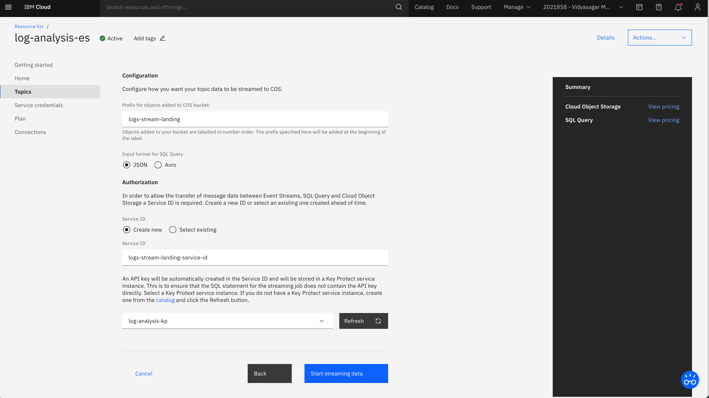

{:step: data-tutorial-type='step'}
{:shortdesc: .shortdesc}
{:new_window: target="_blank"}
{:codeblock: .codeblock}
{:screen: .screen}
{:tip: .tip}
{:pre: .pre}

# Process big data logs with SQL
{: #big-data-log-analytics}
{: toc-content-type="tutorial"}
{: toc-services="cloud-object-storage, EventStreams, AnalyticsEngine, sql-query, key-protect"}
{: toc-completion-time="3h"}

<!--##istutorial#-->
This tutorial may incur costs. Use the [Cost Estimator](https://{DomainName}/estimator/review) to generate a cost estimate based on your projected usage.
{: tip}
<!--#/istutorial#-->

In this tutorial, you will build a log analysis pipeline designed to collect, store and analyze log records to support regulatory requirements or aid information discovery. This solution leverages several services available in {{site.data.keyword.cloud_notm}}: {{site.data.keyword.messagehub}}, {{site.data.keyword.cos_short}}, {{site.data.keyword.sqlquery_short}}, {{site.data.keyword.keymanagementserviceshort}}, and {{site.data.keyword.iae_full_notm}}. A program will assist you by simulating transmission of web server log messages from a static file to {{site.data.keyword.messagehub}}.
{: shortdesc}

With {{site.data.keyword.messagehub}} the pipeline scales to receive millions of log records from a variety of producers. Using a combination of {{site.data.keyword.sqlquery_short}} or {{site.data.keyword.iae_full_notm}}, log data can be inspected in realtime to integrate business processes. Log messages can also be easily redirected to long term storage using {{site.data.keyword.cos_short}} where developers, support staff and auditors can work directly with data.

While this tutorial focuses on log analysis, it is applicable to other scenarios: storage-limited IoT devices can similarly stream messages to {{site.data.keyword.cos_short}} or marketing professionals can segment and analyze customer events across digital properties with SQL Query.
{: shortdesc}

## Objectives
{: #big-data-log-analytics-objectives}

* Understand Apache Kafka publish-subscribe messaging
* Store log data for audit and compliance requirements
* Monitor logs to create exception handling processes
* Conduct forensic and statistical analysis on log data


1. Application generates log events to {{site.data.keyword.messagehub}}.
2. To persist the log events, they are stream landed into {{site.data.keyword.cos_short}} through {{site.data.keyword.sqlquery_short}}.
3. The storage bucket and the SQL query jobs are encrypted with {{site.data.keyword.keymanagementserviceshort}} service. Also, the stream landing job executes in {{site.data.keyword.sqlquery_short}} by securely retrieving the service ID from {{site.data.keyword.keymanagementserviceshort}}. 
4. Auditor or support staff use {{site.data.keyword.sqlquery_short}} or {{site.data.keyword.iae_short}} to perform requests.
5. Requests are executed against the data stored in {{site.data.keyword.cos_short}}.

## Before you begin
{: #big-data-log-analytics-prereqs}

This tutorial requires:
* {{site.data.keyword.cloud_notm}} CLI,
* `git` to clone source code repository.

<!--##istutorial#-->
You will find instructions to download and install these tools for your operating environment in the [Getting started with tutorials](/docs/solution-tutorials?topic=solution-tutorials-tutorials) guide.
<!--#/istutorial#-->

In addition, [install the latest version of Node.js](https://nodejs.org).

## Create services
{: #big-data-log-analytics-setup}
{: step}

In this section, you will create the services required to perform analysis of log events generated by your applications.

### Stream messages in real-time
{: #big-data-log-analytics-new-eventstreams}

1. Create an instance of [{{site.data.keyword.messagehub}}](https://{DomainName}/catalog/services/event-streams).
   1. Select a region where you plan to create all the services required for this tutorial.
   2. Select the **Standard** plan.
   3. Set the **Service name** to **log-analysis-es**.
   4. Select a **Resource group** and click **Create**.
2. Under **Topics** and click **Create topic**
   1. Set the **Topic Name** to `webserver` and click **Next**.
   2. Select **1** partition and click **Next**.
   3. Set message retention to **1 Day** and click the **Create topic** button.
3.  Under **Service credentials**, click on **New credential**
   1. Provide a name for the credential - `es-for-log-analysis`.
   2. select **Writer** as the role and click **Add**.
4. Make note of the values. They will be used in the `event-streams.config` file in the next section.

### Encrypt your data and secure your keys
{: #big-data-log-analytics-new-kp}

{{site.data.keyword.keymanagementserviceshort}} helps you provision encrypted keys for apps across {{site.data.keyword.cloud_notm}} services. 

In this tutorial, {{site.data.keyword.keymanagementserviceshort}} service will be used to encrypt the storage bucket, stored SQL query jobs and securely store the service ID for stream landing.

1. Create an instance of [{{site.data.keyword.keymanagementserviceshort}}](https://{DomainName}/catalog/services/kms).
   1. Select a **location**.
   2. Set the name to **log-analysis-kp**.
   3. Select the **resource group** where you plan to create all the services required for this tutorial and click **Create**.
2. Under **Keys**, click the **Add** button to create a new root key.
   1. Set the key type to **Root key**.
   2. Set the name to **log-analysis-root-enckey**.
   3. Then **Add key**.

### Setup storage to persist the messages from {{site.data.keyword.messagehub}}
{: #big-data-log-analytics-new-cos}

1. Create an instance of [{{site.data.keyword.cos_short}}](https://{DomainName}/catalog/services/cloud-object-storage).
   1. Select the **Standard** plan.
   2. Set **Service name** to **log-analysis-cos**.
   3. Select the same **Resource group** as the above service and click **Create**.
2. Under **Service credentials**, click on **New credential**
   1. Provide a name for the credential - `cos-for-log-analysis` and select **Writer** as the role
   2. Expand the **Advanced options** then set Include HMAC Credential to **On** and click **Add**.
   3. Make note of the **access_key_id** and **secret_access_key** values.
3. Under **Endpoints**, find the **private** endpoint to access your bucket.

Before creating the bucket, you will grant the {{site.data.keyword.cos_short}} service instance access to the root key stored in the {{site.data.keyword.keymanagementserviceshort}} service instance.

1. Go to [Manage > Access (IAM) > Authorizations](https://{DomainName}/iam/authorizations) in the {{site.data.keyword.cloud_notm}} console.
2. Click the **Create** button.
3. In the **Source service** menu, select **Cloud Object Storage**.
4. Switch to **Resources based on selected attributes**, check **Source service instance** and select the {{site.data.keyword.cos_short}} service instance previously created.
5. In the **Target service** menu, select {{site.data.keyword.keymanagementserviceshort}}.
6. Switch to **Resources based on selected attributes**, check **Instance ID**, select the {{site.data.keyword.keymanagementserviceshort}} service instance created earlier.
7. Enable the **Reader** role.
8. Click the **Authorize** button.

Finally create the bucket.
1. Access the {{site.data.keyword.cos_short}} service instance from the [Resource List](https://{DomainName}/resources) Under **Storage**.
2. Under **Buckets**, create a **Custom bucket** named `<your-initial>-log-analysis` with **Cross Region** resiliency, a **Location** near to you and a **Smart Tier** storage class.
3. Under **Service integrations (optional) / Encryption**, enable **Key management**
   1. Select the {{site.data.keyword.keymanagementserviceshort}} service instance created earlier by clicking on **Use existing instance**
   2. Select **log-analysis-root-enckey** as the key and click **Associate key**.

### Stream land the log data to {{site.data.keyword.cos_short}}
{: #big-data-log-analytics-new-sqlquery}

1. Create an instance of [{{site.data.keyword.sqlquery_short}}](https://{DomainName}/catalog/services/sql-query).
   1. Select a region.
   2. Select the **Standard** plan.
   3. Set the **Service name** to **log-analysis-sql**.
   4. Select the same **Resource group** as the above service.
   5. Select **Encrypt with user-managed key** and then select the {{site.data.keyword.keymanagementserviceshort}} service `log-analysis-kp` with the root key.
   6. Click **Create**.

### Inspect log data with {{site.data.keyword.iae_short}}
{: #big-data-log-analytics-new-iae}

1. Create an instance of [{{site.data.keyword.iae_short}}](https://{DomainName}/catalog/services/analytics-engine).
   1. Select a region.
   2. Select the **Standard-Hourly** plan.
   3. Set the **Service name** to **log-analysis-iae**.
   4. Select the same **Resource group** as the above service.
2. Set **Hardware configuration** to **Default**.
3. Set **Number of compute nodes** to **1**.
4. Select the **latest** version of **Spark and Hadoop** as the **Software package**.
5. Under **Ambari configuration (optional)**, enter the below given configuration options for the {{site.data.keyword.cos_short}} which was created in the previous step.

   ```json
   {
     "core-site": {
       "fs.cos.<identifier>.access.key": "<access_key_id>",
       "fs.cos.<identifier>.secret.key": "<secret_access_key>",
       "fs.cos.<identifier>.endpoint": "<cosEndpoint>"
     }
   }
   ```
   {: codeblock}

   where:
      - `identifier` is the name of the name of the {{site.data.keyword.cos_short}} service (`log-analysis-cos`),
      - `access_key_id` and `secret_access_key` are found in the service credentials created earlier.
      - `cosEndpoint` is a private endpoint to access the {{site.data.keyword.cos_short}} bucket.
6. Click **Create**. _The service provisioning may take up to 5 minutes. You can continue with the other steps of the tutorial_.
7. Once the service is provisioned, go to **Manage** to retrieve the user name and password for the cluster. You may need to reset the cluster password.
8. Under **Service credentials**, create **New credential**.
   * Provide `iae-for-log-analysis` as the credential name.
   * Select **Writer** as the role and click **Add**.
9. From the credentials, make note of the `ssh` value giving the *ssh* command line to execute to connect to the cluster.


## Streams landing from {{site.data.keyword.messagehub}} to Cloud {{site.data.keyword.cos_short}}
{: #big-data-log-analytics-configure-streams}
{: step}

### Configure stream landing
{: #big-data-log-analytics-streamlanding}

In this section, you will learn how to run a fully-managed stream data ingestion from {{site.data.keyword.messagehub}} into Parquet on {{site.data.keyword.cos_full_notm}}. {{site.data.keyword.sqlquery_notm}} is the key component in the Stream Landing approach. It is the service that connects to {{site.data.keyword.messagehub}} and copies the data to {{site.data.keyword.cos_full_notm}}.

[Parquet](https://parquet.apache.org/documentation/latest/) is an open source file format for Hadoop. Parquet stores nested data structures in a flat columnar format. Compared to the traditional approach where data is stored in rows, Parquet is more efficient in terms of storage and performance.

1. In your browser, navigate to the [resource list](https://{DomainName}/resources) and under **Services and software**, click on {{site.data.keyword.messagehub}} `log-analysis-es` service.
2. Select **Topics** from the navigation pane on the left.
3. Select the context menu (three vertical dots) for your topic `webserver` and click **Create stream landing configuration**.
   
4. Click **Start** and select the `log-analysis-cos` service. Click **Next**.
5. Select the `<your-initial>-log-analysis` {{site.data.keyword.cos_short}} bucket and click **Next**.
6. Select the {{site.data.keyword.sqlquery_short}} `log-analysis-sql` service and click **Next**.
7. Configure how you want your topic data to be streamed to {{site.data.keyword.cos_short}}:
   1. Prefix for objects added to {{site.data.keyword.cos_short}} bucket: `logs-stream-landing`
   2. Input format for SQL Query: `JSON`
   3. Create a new Service ID : `logs-stream-landing-service-id`
   4. Select the {{site.data.keyword.keymanagementserviceshort}} service.
   5. Click **Start streaming data**.
   

You now see the status `Queued` for your topic. It may take up to 5 minutes until the streaming job is fully dispatched and up and running. You will see the status switch to `Running` at that point. In the context menu, you find a new option called `View stream landing configuration`.


### Using Kafka console tools with {{site.data.keyword.messagehub}}
{: #big-data-log-analytics-kafkatools}

The streaming job is currently idle and awaiting messages. In this section, you will configure Kafka console tools to work with {{site.data.keyword.messagehub}}. Kafka console tools allow you to produce arbitrary messages from the terminal and send them to {{site.data.keyword.messagehub}}. You can persist your Kafka message feed over longer periods of time in a cloud data lake on {{site.data.keyword.cos_full_notm}} .

1. Download and unzip the [Kafka 2.6.x client](https://www.apache.org/dyn/closer.cgi?path=/kafka/2.6.0/kafka_2.13-2.6.0.tgz).
2. Change directory to `bin` and create a text file named `event-streams.config` with the following contents.
   ```
   sasl.jaas.config=org.apache.kafka.common.security.plain.PlainLoginModule required username="USER" password="PASSWORD";
   security.protocol=SASL_SSL
   sasl.mechanism=PLAIN
   ssl.protocol=TLSv1.2
   ssl.enabled.protocols=TLSv1.2
   ssl.endpoint.identification.algorithm=HTTPS
   ```
   {: codeblock}

3. Replace `USER` and `PASSWORD` in your `event-streams.config` file with the `user` and `password` values seen in **Service Credentials** from the {{site.data.keyword.messagehub}} service. Save `event-streams.config`.
4. On a terminal, use `ibmcloud login` to log in to your {{site.data.keyword.cloud_notm}} account interactively. Select the region and resource group where the services was provisioned.
5. From the `bin` directory, run the following command. The broker list will be retrieved using `ibmcloud resource service-key` command. 
    ```sh
    ./kafka-console-producer.sh --broker-list $(ibmcloud resource service-key es-for-log-analysis --output json | jq -r '.[0].credentials.kafka_brokers_sasl | join(",")') --producer.config event-streams.config --topic webserver
    ```
    {: pre}

6. The Kafka console tool is awaiting input. Copy and paste the log message from below into the terminal. Hit `enter` to send the log message to {{site.data.keyword.messagehub}}.
    ```json
    { "host": "199.72.81.55", "time_stamp": "01/Jul/1995:00:00:01 -0400", "request": "GET /history/apollo/ HTTP/1.0", "responseCode": 200, "bytes": 6245 }
    ```
    {: codeblock}

### Check the landed data
{: #big-data-log-analytics-checkmessages}

You can check the landed data in the {{site.data.keyword.sqlquery_short}} UI and also in the {{site.data.keyword.cos_short}} bucket.

1. Navigate to the [resource list](https://{DomainName}/resources) and under **Services and software**, click on `log-analysis-sql` service.
2. Click on **Launch {{site.data.keyword.sqlquery_short}} UI** to open the {{site.data.keyword.sqlquery_short}} UI. You should see the streaming job `Running`. 
3. Click on the **Details** tab to see the actual SQL statement that was submitted to {{site.data.keyword.sqlquery_short}} for the stream landing. 
   

   The Select statement would looks like 
   ```sql
   SELECT * FROM <EVENT_STREAMS_CRN>/webserver 
   STORED AS JSON EMIT cos://<REGION>/<BUCKET_NAME>/logs-stream-landing/topic=webserver 
   STORED AS PARQUET EXECUTE AS <KEY_PROTECT_CRN_WITH_KEY>
   ```
   {: codeblock}

   It is a SELECT statement from your {{site.data.keyword.messagehub}} instance and topic (identified via the unique CRN) and the selected data is emitted (EMIT) to your {{site.data.keyword.cos_short}} bucket AS PARQUET format. The operation is executed (EXECUTE) with the service ID's API key that is stored in the {{site.data.keyword.keymanagementserviceshort}} instance.
   {: tip}

4. Click on the link in the `Result location` field, which opens the {{site.data.keyword.cos_short}} UI with a filter set to the objects that are being written by that job. 
   
   
   In the COS UI, switch to `object view` by clicking on the icon next to `Upload`, You should see that there are a couple of metadata objects to track, such as the latest offset that has been consumed and landed. But, in addition, you can find the Parquet files with the actual payload data.
   {: tip} 

5. Return to the {{site.data.keyword.sqlquery_short}} UI and Click on **Query the result** and then click **Run** to execute a `Batch job`. You should see the query in the panel pointing to the {{site.data.keyword.cos_short}} file (under `FROM`) with the log message(s) you sent above. Wait for the job to change to `Completed`.
6. Click on the **Results** tab to see the log messages in a tabular format.
   
   The query saves the result to a `CSV` file under a different bucket with name `sql-<SQL_QUERY_GUID>`. Check the `INTO` part of the query.
   {: tip}

### Increasing message load
{: #big-data-log-analytics-streamsload}

To view conditional handling in your Streams flow, you will increase the message volume sent to {{site.data.keyword.messagehub}}. The provided Node.js program simulates a realistic flow of messages to {{site.data.keyword.messagehub}} based on traffic to the webserver. To demonstrate the scalability of {{site.data.keyword.messagehub}}, you will increase the throughput of log messages.

This section uses [node-rdkafka](https://www.npmjs.com/package/node-rdkafka). See the npmjs page for troubleshooting instructions if the simulator installation fails.

1. Download and unzip the [Jul 01 to Jul 31, ASCII format, 20.7 MB gzip compressed](ftp://ita.ee.lbl.gov/traces/NASA_access_log_Jul95.gz) log file from NASA.
2. Clone the log simulator from [IBM-Cloud on GitHub](https://github.com/IBM-Cloud/kafka-log-simulator) and Change to the simulator's directory
   ```sh
   git clone https://github.com/IBM-Cloud/kafka-log-simulator.git
   cd kafka-log-simulator
   ```
   {: pre}

3. Run the following commands to setup the simulator and produce log event messages. Replace `<LOGFILE>` with the file you downloaded e.g., `/Users/VMac/Downloads/access_log_Jul95`. The broker list and the API key will be retrieved with the `ibmcloud resource service-key` command.
   ```sh
   npm install
   ```
   {: pre}

   ```sh
   npm run build
   ```
   {: pre}

   ```sh
   node dist/index.js --file <LOGFILE> --parser httpd --broker-list $(ibmcloud resource service-key es-for-log-analysis --output json | jq -r '.[0].credentials.kafka_brokers_sasl | join(",")') \
    --api-key $(ibmcloud resource service-key es-for-log-analysis --output json | jq -r '.[0].credentials.api_key') --topic webserver --rate 100
   ```
   {: pre}

   If you are seeing `UnhandledPromiseRejection` warning , ignore by adding `--unhandled-rejections=strict ` flag to the above command.
   {: tip}

4. Stop the simulator after a desired number of messages have been stream landed using `control+C`.
5. In your browser, return to the {{site.data.keyword.sqlquery_short}} UI and Click on **Query the result** and then click **Run** to see the messaged feed under the `Results` tab of the batch job. 
6. Experiment with {{site.data.keyword.messagehub}} scaling by increasing or decreasing the `--rate` value.

The simulator will delay sending the next message based on the elapsed time in the webserver log. Setting `--rate 1` sends events in realtime. Setting `--rate 100` means that for every 1 second of elapsed time in the webserver log a 10ms delay between messages is used. Setting `--rate 0` sends all events immediately with no delay between events.
{: tip}

## Investigating log data using {{site.data.keyword.sqlquery_short}}
{: #big-data-log-analytics-sqlquery}
{: step}

Depending on how long you ran the simulator, the number of files on {{site.data.keyword.cos_short}} has certainly grown. You will now act as an investigator answering audit or compliance questions by combining {{site.data.keyword.sqlquery_short}} with your log file. The benefit of using {{site.data.keyword.sqlquery_short}} is that the log file is directly accessible - no additional transformations or database servers are necessary.


1. Retrieve the Object SQL URL from the logs file.
   * From the [Resource List](https://{DomainName}/resources?search=log-analysis), select the `log-analysis-cos` service instance.
   * Select the bucket you created previously and click the `jobid-xxxx` folder under `logs-stream-landing/topic=webserver`.
   * On one of the `part-00000-xxxxx-<TIME>-xxxx.snappy.parquet` file, click the action menu.
   * Click **Access with SQL**.
   * You should see the `Object SQL URL`. Copy the URL for future reference.
   * Select the `log-analysis-sql` service and click **Open in SQL Query** to launch the query.
   * **Run** the query to see the results.
2. In the {{site.data.keyword.sqlquery_short}} UI, enter the following SQL in the **Type SQL here ...** text area. 
   ```sql
   -- What are the top 10 web pages on NASA from July 1995?
   -- Which mission might be significant?
   SELECT REQUEST, COUNT(REQUEST)
   FROM cos://us-geo/<YOUR_BUCKET_NAME>/logs-stream-landing/topic=webserver/jobid=<JOBID>/part-00000-xxxxx-<TIME>.snappy.parquet STORED AS PARQUET
   WHERE REQUEST LIKE '%.htm%'
   GROUP BY REQUEST
   ORDER BY 2 DESC
   LIMIT 10
   ```
   {: codeblock}

3. Update the `FROM` clause with your Object SQL URL and click **Run**.
4. Click on the latest **Completed** job to see the result under the **Result** tab.
6. Select the **Details** tab to view additional information such as the location where the result was stored on {{site.data.keyword.cos_short}}.
7. Try the following question and answer pairs by adding them individually to the **Type SQL here ...** text area.
   ```sql
   -- Who are the top 5 viewers?
   SELECT HOST, COUNT(*)
   FROM cos://us-geo/<YOUR_BUCKET_NAME>/logs-stream-landing/topic=webserver/jobid=<JOBID>/part-00000-xxxxx-<TIME>.snappy.parquet STORED AS PARQUET
   GROUP BY HOST
   ORDER BY 2 DESC
   LIMIT 5
   ```
   {: codeblock}

   ```sql
   -- Which viewer has suspicious activity based on application failures?
   SELECT HOST, COUNT(*)
   FROM cos://us-geo/<YOUR_BUCKET_NAME>/logs-stream-landing/topic=webserver/jobid=<JOBID>/part-00000-xxxxx-<TIME>.snappy.parquet STORED AS PARQUET
   WHERE `responseCode` == 500
   GROUP BY HOST
   ORDER BY 2 DESC
   ```
   {: codeblock}

   ```sql
   -- Which requests showed a page not found error to the user?
   SELECT DISTINCT REQUEST
   FROM cos://us-geo/<YOUR_BUCKET_NAME>/logs-stream-landing/topic=webserver/jobid=<JOBID>/part-00000-xxxxx-<TIME>.snappy.parquet STORED AS PARQUET
   WHERE `responseCode` == 404
   ```
   {: codeblock}

   ```sql
   -- What are the top 10 largest files?
   SELECT DISTINCT REQUEST, BYTES
   FROM cos://us-geo/<YOUR_BUCKET_NAME>/logs-stream-landing/topic=webserver/jobid=<JOBID>/part-00000-xxxxx-<TIME>.snappy.parquet STORED AS PARQUET
   WHERE BYTES > 0
   ORDER BY CAST(BYTES as Integer) DESC
   LIMIT 10
   ```
   {: codeblock}

   ```sql
   -- What is the distribution of total traffic by hour?
   SELECT SUBSTRING(TIME_STAMP, 13, 2), COUNT(*)
   FROM cos://us-geo/<YOUR_BUCKET_NAME>/logs-stream-landing/topic=webserver/jobid=<JOBID>/part-00000-xxxxx-<TIME>.snappy.parquet STORED AS PARQUET
   GROUP BY 1
   ORDER BY 1 ASC
   ```
   {: codeblock}

   ```sql
   -- Why did the previous result return an empty hour?
   -- Hint, find the malformed hostname.
   SELECT HOST, REQUEST
   FROM cos://us-geo/<YOUR_BUCKET_NAME>/logs-stream-landing/topic=webserver/jobid=<JOBID>/part-00000-xxxxx-<TIME>.snappy.parquet STORED AS PARQUET
   WHERE SUBSTRING(TIME_STAMP, 13, 2) == ''
   ```
   {: codeblock}

FROM clauses are not limited to a single file. Use `cos://us-geo/<YOUR_BUCKET_NAME>/logs-stream-landing/topic=webserver/jobid=<JOBID>` to run SQL queries on all files in the bucket.
{: tip}

## Investigating data using {{site.data.keyword.iae_short}}
{: #big-data-log-analytics-5}
{: step}

### Investigating log data using Apache Hive
{: #big-data-log-analytics-hive}

Just as you ran queries using {{site.data.keyword.sqlquery_short}}, you can also run SQL analytical commands from Apache Hive that is part of the {{site.data.keyword.iae_short}} service.

1. First SSH into the {{site.data.keyword.iae_short}} cluster using the following command
   ```sh
   ssh clsadmin@chs-xxxxx-mn003.<REGION>.ae.appdomain.cloud
   ```
   {: pre}

   You can find the `SSH` command under **Service credentials** of `log-analysis-iae` service you created earlier and an option to generate `password` under the **Manage** tab of the service.
   {: tip}

2. Connect to the Hive server by using with Beeline client.The hive_jdbc service endpoint can be found under the **service credentials** tab of the `log-analysis-iae` service page.
   ```sh
   beeline -u 'jdbc:hive2://chs-xxxxx-mn001.<REGION>.ae.appdomain.cloud:8443/;ssl=true;transportMode=http;httpPath=gateway/default/hive' -n clsadmin -p <PASSWORD>
   ```
   {: pre}
   
3. Create an external hive table with the following command.
   ```sql
   CREATE EXTERNAL TABLE myhivetable (event_key string, event_topic string, event_offset int, event_partition int,event_timestamp string, host string, ts string, request string, responseCode int,bytes int) STORED AS PARQUET LOCATION 'cos://<YOUR_BUCKET_NAME>.<identifier>/logs-stream-landing/topic=webserver/jobid=<JOBID>/';
   ```
   {: codeblock}

   The value of `<identifier>` will be the same one that you defined during the creation of {{site.data.keyword.iae_short}} initially. **Note** that for Hive you need to point to a parent folder which contains the PARQUET file. In the example above, the data got written in the `jobid` folder under `logs-stream-landing/topic=webserver/`. For more information, refer [creating Hive tables in Parquet format](https://{DomainName}/docs/AnalyticsEngine?topic=AnalyticsEngine-working-with-hive#creating-hive-tables-in-parquet-format)
4. Just like the commands executed earlier SQL queries can be executed on the table. For example:
   ```sql
   SELECT HOST, COUNT(*)
   FROM myhivetable
   GROUP BY HOST
   ORDER BY 2 DESC
   LIMIT 5;
   ```
   {: codeblock}

### Investigating data using Spark SQL
{: #big-data-log-analytics-sparksql}

The data pushed to cos can be also queried using Apache Spark that is part of the {{site.data.keyword.iae_short}} service.

1. SSH to the cluster
   ```sh
   ssh clsadmin@chs-xxxxx-mn003.<changeme>.ae.appdomain.cloud
   ```
   {: pre}

2. Open a pyspark-shell on your {{site.data.keyword.iae_short}} cluster.
   ```sh
   pyspark
   ```
   {: pre}

3. Create a Spark dataframe of a parquet file which is present in the {{site.data.keyword.cos_short}} bucket. Note that the {{site.data.keyword.cos_short}} credentials have already been added to the {{site.data.keyword.iae_short}} cluster during set up.
   ```sh
   df = spark.read.parquet('cos://<bucketname>.<identifier>/<objectname>')
   ```
   {: codeblock}

   For example, if the name of the bucket is `<your-initial>-log-analysis`, service name is `log-analysis-cos` and the path to the file is logs-stream-landing/:
   ```sh
   df = spark.read.parquet('cos://<your-initial>-log-analysis.log-analysis-cos/logs-stream-landing/topic=webserver/jobid=<JOBID>/)
   ```
   {: codeblock}

4. Any SQL query can be performed on the data and the result can be stored in a new dataframe.
5. The following code block will perform an SQL query the data frame. A view is then created and first 10 rows are printed.
   ```sh
   sqlContext.registerDataFrameAsTable(df, "Table")
   df_query = sqlContext.sql("SELECT * FROM Table LIMIT 10")
   df_query.show(10)
   ```
   {: codeblock}

## Expand the tutorial
{: #big-data-log-analytics-expand}

Congratulations, you have built a log analysis pipeline with {{site.data.keyword.cloud_notm}}. Below are additional suggestions to enhance your solution.

* Follow the [Build a data lake using {{site.data.keyword.cos_short}}](https://{DomainName}/docs/solution-tutorials?topic=solution-tutorials-smart-data-lake) tutorial to add a dashboard to log data
* Integrate additional systems with {{site.data.keyword.messagehub}} using [{{site.data.keyword.appconserviceshort}}](https://{DomainName}/catalog/services/app-connect).

## Remove services
{: #big-data-log-analytics-removal}
{: step}

1. From the [Resource List](https://{DomainName}/resources?search=log-analysis), use the **Delete** or **Delete service** menu item in the overflow menu to remove the following service instances.

   * log-analysis-es
   * log-analysis-sql
   * log-analysis-cos
   * log-analysis-iae
2. Before deleting the `log-analysis-kp` service, delete the root key.
3. Navigate to [Manage > Access (IAM) > Service IDs](https://{DomainName}/iam/serviceids) in the {{site.data.keyword.cloud_notm}} console and **Remove** the `log-stream-landing-service-id` serviceID.

## Related content
{: #big-data-log-analytics-8}
{: related}

* [Apache Kafka](https://kafka.apache.org/)
* [Configure a {{site.data.keyword.cos_full_notm}} connection through Ambari](https://{DomainName}/docs/AnalyticsEngine?topic=AnalyticsEngine-config-cos-ambari)
