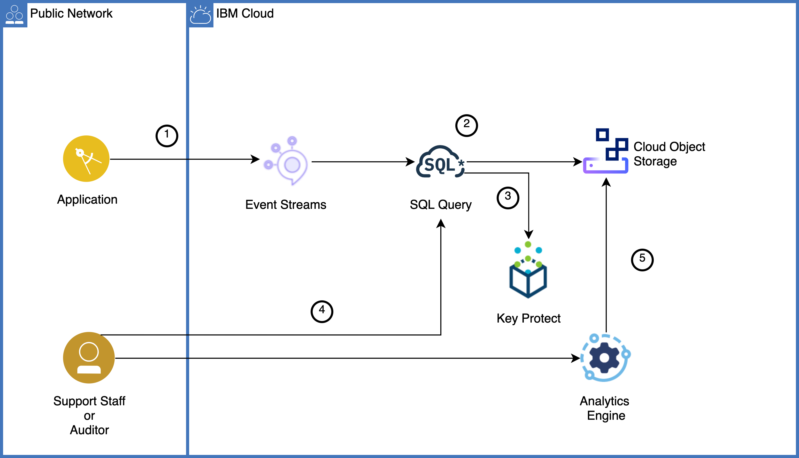
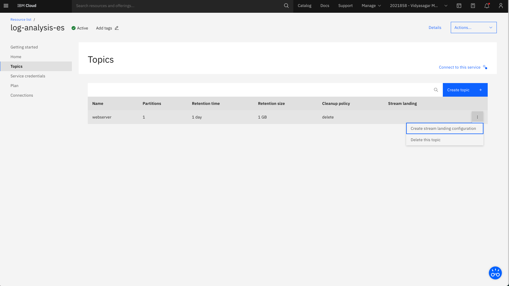
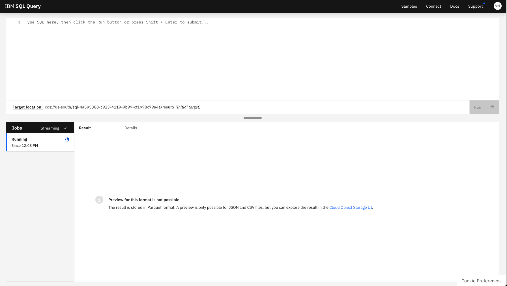
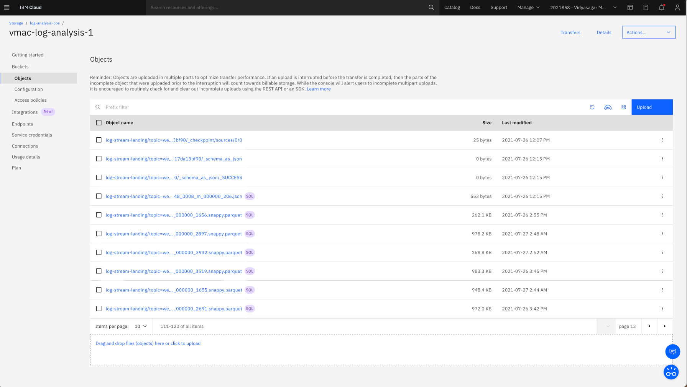

{:step: data-tutorial-type='step'}
{:shortdesc: .shortdesc}
{:new_window: target="_blank"}
{:screen: .screen}
{:tip: .tip}
{:pre: .pre}
{:note: .note}
{:codeblock: .codeblock}

# Process big data logs with SQL
{: #big-data-log-analytics}
{: toc-content-type="tutorial"}
{: toc-services="cloud-object-storage, EventStreams, AnalyticsEngine, sql-query, key-protect"}
{: toc-completion-time="3h"}

<!--##istutorial#-->
This tutorial may incur costs. Use the [Cost Estimator](https://{DomainName}/estimator/review) to generate a cost estimate based on your projected usage.
{: tip}

<!--#/istutorial#-->

In this tutorial, you will build a log analysis pipeline designed to collect, store and analyze log records to support regulatory requirements or aid information discovery. This solution leverages several services available in {{site.data.keyword.cloud_notm}}: {{site.data.keyword.messagehub}}, {{site.data.keyword.cos_short}}, {{site.data.keyword.sqlquery_short}} (previously SQL Query), {{site.data.keyword.keymanagementserviceshort}}, and {{site.data.keyword.iae_full_notm}}. A script and tool will assist you to simulate the transmission of web server log messages from a static file to {{site.data.keyword.messagehub}}.
{: shortdesc}

With {{site.data.keyword.messagehub}} the pipeline scales to receive millions of log records from a variety of producers. Using a combination of {{site.data.keyword.sqlquery_short}} or {{site.data.keyword.iae_full_notm}}, log data can be inspected in realtime to integrate business processes. Log messages can also be easily redirected to long term storage using {{site.data.keyword.cos_short}} where developers, support staff and auditors can work directly with data.

While this tutorial focuses on log analysis, it is applicable to other scenarios: storage-limited IoT devices can similarly stream messages to {{site.data.keyword.cos_short}} or marketing professionals can segment and analyze customer events across digital properties with {{site.data.keyword.sqlquery_short}}.
{: shortdesc}

## Objectives
{: #big-data-log-analytics-objectives}

* Understand Apache Kafka publish-subscribe messaging
* Store log data for audit and compliance requirements
* Monitor logs to create exception handling processes
* Conduct forensic and statistical analysis on log data


{: caption="Figure 1. Architecture diagram of the tutorial" caption-side="bottom"}
{: style="text-align: center;"}


1. Application generates log events to {{site.data.keyword.messagehub}}.
2. To persist the log events, they are stream landed into {{site.data.keyword.cos_short}} through {{site.data.keyword.sqlquery_short}}.
3. The storage bucket and the {{site.data.keyword.sqlquery_short}} jobs are encrypted with {{site.data.keyword.keymanagementserviceshort}} service. Also, the stream landing job executes in {{site.data.keyword.sqlquery_short}} by securely retrieving the service ID from {{site.data.keyword.keymanagementserviceshort}}. 
4. Auditor or support staff use {{site.data.keyword.sqlquery_short}} or {{site.data.keyword.iae_short}} to perform requests.
5. Requests are executed against the data stored in {{site.data.keyword.cos_short}}.

## Before you begin
{: #big-data-log-analytics-prereqs}

This tutorial requires:
* {{site.data.keyword.cloud_notm}} CLI,
* {{site.data.keyword.cloud_notm}} CLI plugin: `ibmcloud plugin install analytics-engine-v3`
* `git` to clone a code repository that contains some example data.
* Optionally, a Docker client.

<!--##istutorial#-->
You will find instructions to download and install these tools for your operating environment in the [Getting started with solution tutorials](/docs/solution-tutorials?topic=solution-tutorials-tutorials) guide.
<!--#/istutorial#-->

## Create services
{: #big-data-log-analytics-setup}
{: step}

In this section, you will create the services required to perform analysis of log events generated by your applications.  Choose a region that supports all services.  

The {{site.data.keyword.iae_short}} serverless plan has limited availability. Dallas, us-south, was verified for this tutorial.
{: note}

### Enable Platform Logs
{: #big-data-log-analytics-platform-logs}
Platform logs are generally useful for troubleshooting resources and will be required in a later step to see the output of {{site.data.keyword.iae_short}}.

You can have multiple {{site.data.keyword.loganalysislong_notm}} instances, however, only one instance in a region can be configured to receive platform logs from [enabled cloud services](https://{DomainName}/docs/log-analysis?topic=log-analysis-cloud_services) in that {{site.data.keyword.Bluemix_notm}} region.
{: important}

1. Navigate to the [Observability](https://{DomainName}/observe) page and click **Logging**, look for any existing log analysis services with `Platform logs` enabled.  If there is a platform logging instance in the region no further configuration is required.
2. To create a new {{site.data.keyword.loganalysislong_notm}} click the **Options** then **Create**. Continue to create a logging instance with 7-day plan.  If not visible hit the **refresh** button.
3. Back in the [Observability](https://{DomainName}/observe) page and click **Logging** on the left pane.
   1. Click on **Options > Edit platform** and **select** the region.
   2. Select the log analysis service instance created for platform logs **Select**.

For more information, see [Configuring {{site.data.keyword.Bluemix_notm}} platform logs](https://{DomainName}/docs/log-analysis?topic=log-analysis-config_svc_logs)
{: tip}


### Stream messages in real-time
{: #big-data-log-analytics-new-eventstreams}

1. Create an instance of [{{site.data.keyword.messagehub}}](https://{DomainName}/catalog/services/event-streams).
   1. Select the region.
   2. Select the **Standard** plan.
   3. Set the **Service name** to **log-analysis-es**.
   4. Select a **Resource group** and click **Create**.
   5. Access the newly created service instance from the [Resource List](https://{DomainName}/resources) under the **Integration** section.
2. Go to **Topics** and click **Create topic**.
   1. Set the **Topic Name** to `webserver` and click **Next**.
   2. Select **1** partition and click **Next**.
   3. Set message retention to **1 Day** and click the **Create topic** button.
3. Under **Service credentials**, click on **New credential**.
   1. Provide a name for the credential - `es-for-log-analysis`.
   2. select **Writer** as the role and click **Add**.
4. Make note of the values or remember where they can be located. They will be used in the `kcat.config` file in the next section.

### Encrypt your data and secure your keys
{: #big-data-log-analytics-new-kp}

{{site.data.keyword.keymanagementserviceshort}} helps you provision encrypted keys for apps across {{site.data.keyword.cloud_notm}} services. 

In this tutorial, {{site.data.keyword.keymanagementserviceshort}} service will be used to encrypt the storage bucket, stored {{site.data.keyword.sqlquery_short}} jobs and securely store the service ID for stream landing.

1. Create an instance of [{{site.data.keyword.keymanagementserviceshort}}](https://{DomainName}/catalog/services/kms).
   1. Select a **location**.
   2. Set the name to **log-analysis-kp**.
   3. Select the same **resource group** as earlier.
   4. Click **Create**.
2. Under **Keys**, click the **Add** button to create a new root key.
   1. Set the key type to **Root key**.
   2. Set the name to **log-analysis-root-enckey**.
   3. Then **Add key**.

### Setup storage to persist the messages from {{site.data.keyword.messagehub}}
{: #big-data-log-analytics-new-cos}

1. Create an instance of [{{site.data.keyword.cos_short}}](https://{DomainName}/catalog/services/cloud-object-storage).
   1. Select the **Standard** plan.
   2. Set **Service name** to **log-analysis-cos**.
   3. Select the same **Resource group** as the above service and click **Create**.
2. Under **Service credentials**, click on **New credential**
   1. Provide a name for the credential - `cos-for-log-analysis` and select **Writer** as the role
   2. Expand the **Advanced options** then set Include HMAC Credential to **On** and click **Add**.
   3. Make note of the **access_key_id** and **secret_access_key** values or remember where they can be located.

Before creating the bucket, you will grant the {{site.data.keyword.cos_short}} service instance access to the root key stored in the {{site.data.keyword.keymanagementserviceshort}} service instance.

1. Go to [Manage > Access (IAM) > Authorizations](https://{DomainName}/iam/authorizations) in the {{site.data.keyword.cloud_notm}} console.
2. Click the **Create** button.
3. In the **Source service** menu, select **Cloud Object Storage**.
4. Switch to **Resources based on selected attributes**, check **Source service instance** and select the {{site.data.keyword.cos_short}} service instance previously created.
5. In the **Target service** menu, select {{site.data.keyword.keymanagementserviceshort}}.
6. Switch to **Resources based on selected attributes**, check **Instance ID**, select the {{site.data.keyword.keymanagementserviceshort}} service instance created earlier.
7. Enable the **Reader** role.
8. Click the **Authorize** button.

Finally create the bucket.
1. Access the {{site.data.keyword.cos_short}} service instance from the [Resource List](https://{DomainName}/resources) Under **Storage**.
2. Under **Buckets**, click **Create bucket**
   * Click **Customize your bucket**
   * Enter a  unique name, like `<your-initial>-log-analysis`.
   * Click **Regional** resiliency
   * Select the region for the **Location**
3. Click to enable **Service integrations (optional) / Encryption** - **Key management enabled**
   1. Select the {{site.data.keyword.keymanagementserviceshort}} service instance created earlier by clicking on **Use existing instance**
   2. Select **log-analysis-root-enckey** as the key and click **Associate key**.
4. Click **Create bucket**

The bucket will be referenced below as ABC-log-analysis

### Stream land the log data to {{site.data.keyword.cos_short}}
{: #big-data-log-analytics-new-sqlquery}

1. Create an instance of [{{site.data.keyword.sqlquery_short}}](https://{DomainName}/catalog/services/sql-query).
   1. Select a region.
   2. Select the **Standard** plan.
   3. Set the **Service name** to **log-analysis-sql**.
   4. Select the same **Resource group** as the above service.
   5. Select **Encrypt with user-managed key** and then select the {{site.data.keyword.keymanagementserviceshort}} service `log-analysis-kp` with the root key **log-analysis-root-enckey** created earlier.
   6. Click **Create**.

   The **Encryption** section is indicating a warning. The {{site.data.keyword.sqlquery_short}} service instance needs **Reader** authorization to access the root key stored in the {{site.data.keyword.keymanagementserviceshort}} service instance. We will add this authorization next.
   {: note}

1. Go to [Manage > Access (IAM) > Authorizations](https://{DomainName}/iam/authorizations) in the {{site.data.keyword.cloud_notm}} console.
   1. Click the **Create** button.
   1. In the **Source service** menu, select **{{site.data.keyword.sqlquery_short}} (previously SQL Query)**.
   1. Switch to **Resources based on selected attributes**, check **Source service instance** and select the **log-analysis-sql** {{site.data.keyword.sqlquery_short}} service instance just created.
   1. In the **Target service** menu, select {{site.data.keyword.keymanagementserviceshort}}.
   1. Switch to **Resources based on selected attributes**, check **Instance ID**, select the **log-analysis-kp** {{site.data.keyword.keymanagementserviceshort}} service instance created earlier.
   1. Enable the **Reader** role.
   1. Click the **Authorize** button.

### Inspect log data with {{site.data.keyword.iae_short}}
{: #big-data-log-analytics-new-iae}

1. Create an instance of [{{site.data.keyword.iae_short}}](https://{DomainName}/catalog/services/analytics-engine).
   1. Select a region.
   2. Select the **Standard Serverless for Apache Spark** plan.
   3. Set the **Service name** to **log-analysis-iae**.
   4. Select the same **Resource group** as the above service.
   5. Select the **Spark runtime** version.
   6. Select the **Cloud Object Storage** instance created earlier
   7. Click **Create service credentials**
   8. Click **Create** to create the {{site.data.keyword.iae_short}} instance.

## Streams landing from {{site.data.keyword.messagehub}} to Cloud {{site.data.keyword.cos_short}}
{: #big-data-log-analytics-configure-streams}
{: step}

### Configure stream landing
{: #big-data-log-analytics-streamlanding}

In this section, you will learn how to run a fully-managed stream data ingestion from {{site.data.keyword.messagehub}} into Parquet on {{site.data.keyword.cos_full_notm}}. {{site.data.keyword.sqlquery_notm}} is the key component in the Stream Landing approach. It is the service that connects to {{site.data.keyword.messagehub}} and copies the data to {{site.data.keyword.cos_full_notm}}.

[Parquet](https://parquet.apache.org/docs/) is an open source file format for nested data structures in a flat columnar format. Compared to the traditional approach where data is stored in rows, Parquet is more efficient in terms of storage and performance.

1. In your browser, navigate to the [resource list](https://{DomainName}/resources) and under **Integration**, click on {{site.data.keyword.messagehub}} `log-analysis-es` service.
2. Select **Topics** from the navigation pane on the left.
3. Select the context menu (three vertical dots) for your topic `webserver` and click **Create stream landing configuration**.
   
4. Click **Start** and select the `log-analysis-cos` service. Click **Next**.
5. Select the `ABC-log-analysis` {{site.data.keyword.cos_short}} bucket and click **Next**.
6. Select the {{site.data.keyword.sqlquery_short}} `log-analysis-sql` service and click **Next**.
7. Configure how you want your topic data to be streamed to {{site.data.keyword.cos_short}}:
   1. Prefix for objects added to {{site.data.keyword.cos_short}} bucket: `logs-stream-landing`
   2. Create a new Service ID : `logs-stream-landing-service-id`
   3. Select the **log-analysis-kp** {{site.data.keyword.keymanagementserviceshort}} service.
   4. Click **Start streaming data**.

You now see the status `Queued` for your topic. It may take up to 5 minutes until the streaming job is fully dispatched and up and running. You will see the status switch to `Running` at that point. In the context menu, you find a new option called `View stream landing configuration`.


### Using kcat with {{site.data.keyword.messagehub}}
{: #big-data-log-analytics-kafkatools}

The streaming job is currently idle and awaiting messages. In this section, you will configure the tool [kcat](https://github.com/edenhill/kcat) to work with {{site.data.keyword.messagehub}}. kcat allows you to produce arbitrary messages from the terminal and send them to {{site.data.keyword.messagehub}}. Below the Kafka message feed will be persisted in your data lake on {{site.data.keyword.cos_full_notm}} .

1. Either [install kcat](https://github.com/edenhill/kcat) on your machine or use it via Docker.
2. Change into a new directory and create a text file named `kcat.config` with the following contents. The value for `bootstrap.servers` is the comma-separated list of brokers from the **es-for-log-analysis** service credentials created earlier in the {{site.data.keyword.messagehub}} service without any quotes, brackets, or newline characters.
   ```sh
   bootstrap.servers=<value of property kafka_brokers_sasl in your credentials>
   sasl.mechanism=PLAIN
   security.protocol=SASL_SSL
   sasl.username=token
   sasl.password=<value of property password in your credentials>
   ```
   {: codeblock}

3. If you installed kcat, run the following command:
   ```sh
   kcat -F kcat.config -P -t webserver
   ```
   {: pre}

   If you use Docker, run:
   ```sh
   docker run -v  ${PWD}:/bdla -w /bdla -it --network=host edenhill/kcat:1.7.0 -F kcat.config -P -t webserver
   ```
   {: pre}

   The command will connect as event producer to the topic **webserver**. Remember the command for later.

4. The kcat tool is awaiting input. Copy and paste the log message from below into the terminal. Hit `enter` then `CTRL-d` to send the log message to {{site.data.keyword.messagehub}}.
    ```json
    { "host": "199.72.81.55", "time_stamp": "01/Jul/1995:00:00:01 -0400", "request": "GET /history/apollo/ HTTP/1.0", "responseCode": "200", "bytes": "6245" }
    ```
    {: codeblock}

### Check the landed data
{: #big-data-log-analytics-checkmessages}

You can check the landed data in the {{site.data.keyword.sqlquery_short}} UI and also in the {{site.data.keyword.cos_short}} bucket.

1. Navigate to the [resource list](https://{DomainName}/resources) and under **Databases**, click on `log-analysis-sql` service.
2. Click on **Launch {{site.data.keyword.sqlquery_short}} UI** to open the {{site.data.keyword.sqlquery_short}} UI. You should see the streaming job `Running`. 
3. Click on the **Details** tab to see the actual SQL statement that was submitted to {{site.data.keyword.sqlquery_short}} for the stream landing.  Notice the **Result location** it will be used shortly to query the data.
   

   The Select statement would looks like 
   ```sql
   SELECT * FROM <EVENT_STREAMS_CRN>/webserver 
   STORED AS JSON EMIT cos://<REGION>/<BUCKET_NAME>/logs-stream-landing/topic=webserver 
   STORED AS PARQUET EXECUTE AS <KEY_PROTECT_CRN_WITH_KEY>
   ```
   {: codeblock}

   It is a SELECT statement from your {{site.data.keyword.messagehub}} instance and topic (identified via the unique CRN) and the selected data is emitted (EMIT) to your {{site.data.keyword.cos_short}} bucket AS PARQUET format. The operation is executed (EXECUTE) with the service ID's API key that is stored in the {{site.data.keyword.keymanagementserviceshort}} instance.
   {: tip}

4. Click on the link in the `Result location` field, which opens the {{site.data.keyword.cos_short}} UI with a filter set to the objects that are being written by that job. 
   
   
   In the COS UI, switch to `object view` by clicking on the icon next to `Upload`, You should see that there are a couple of metadata objects to track, such as the latest offset that has been consumed and landed. But, in addition, you can find the Parquet files with the actual payload data.
   {: tip} 

5. Return to the {{site.data.keyword.sqlquery_short}} UI and in the **Details** tab click on **Query the result** and then click **Run** to execute a `Batch job`. You should see the query in the panel pointing to the {{site.data.keyword.cos_short}} file (under `FROM`) with the log message(s) you sent above. Wait for the job to change to `Completed`.
6. Click on the **Results** tab to see the log messages in a tabular format.
   
   The query saves the result to a `CSV` file under a different bucket with name `sql-<SQL_QUERY_GUID>`. Check the `INTO` part of the query.
   {: tip}

### Increasing message load
{: #big-data-log-analytics-streamsload}

For later analysis purposes increase the message volume sent to {{site.data.keyword.messagehub}}. The provided script simulates a flow of messages to {{site.data.keyword.messagehub}} based on traffic to the webserver. To demonstrate the scalability of {{site.data.keyword.messagehub}}, you will increase the throughput of log messages.

1. Download and unzip the Jul 01 to Jul 31, ASCII format, 20.7 MB gzip compressed log file from NASA:
   ```sh
   curl ftp://ita.ee.lbl.gov/traces/NASA_access_log_Jul95.gz -o NASA_access_log_Jul95.gz
   gunzip NASA_access_log_Jul95.gz
   ```
   {: pre}

2. Turn the access logs into JSON format by running:
   ```sh
   awk -F " " '{ print "{\"host\":\"" $1 "\",\"time_stamp\":\"" $4 " "  $5 "\",\"request\":" $6 " " $7 " " $8 ",\"responseCode\":\"" $9 "\",\"bytes\":\"" $10 "\"}" }' NASA_access_log_Jul95 > NASA_logs.json
   ```
   {: pre}

3. Create a shell script to only send few log lines per second. Create a new file `rate_limit.sh` and copy the following into it:
    ```sh
   #! /bin/bash
   if [ -z "$1" ]; then 
	   echo "usage: $0 filename lines wait"
	   exit
   fi
   INPUT_FILE=$1
   NUM_LINES=$2
   COUNTER=0
   WAIT_SECONDS=$3
   while read -u3 input_text rest; do
	   trap 'exit 130' INT	
	   echo $input_text $rest
	   ((COUNTER++))
	   if (( COUNTER == $NUM_LINES )); then
		   sleep $WAIT_SECONDS
		   COUNTER=0
	   fi
   done 3< "$INPUT_FILE"
   ```
   {: pre}

   The script accepts a file name, the number of lines to output as chunk, and how many seconds to wait in between.

3. Run the following command to send lines each from the access log to {{site.data.keyword.messagehub}}. It uses the converted log file from above, sends 10 lines each and waits 1 second before sending the next lines:
   ```sh
   ./rate_limit.sh NASA_logs.json 10 1 | kcat -F kcat.config -P -t webserver
   ```
   {: pre}

   If you are using Docker, replace the part after the `|` accordingly.

4. The script configuration above pushes about 10 lines/second. Stop the script after the desired number of messages have been streamed using `control+C`.
5. In your browser, return to the {{site.data.keyword.sqlquery_short}} UI and the **Details** tab. There, click on **Query the result** and then click **Run** to see some of the received messages under the `Results` tab of the batch job. 
6. You can experiment with {{site.data.keyword.messagehub}} by increasing or decreasing the number of lines value.

## Investigating log data using {{site.data.keyword.sqlquery_short}}
{: #big-data-log-analytics-sqlquery}
{: step}

Depending on how long you ran the transfer, the number of files on {{site.data.keyword.cos_short}} has certainly grown. You will now act as an investigator answering audit or compliance questions by combining {{site.data.keyword.sqlquery_short}} with your log file. The benefit of using {{site.data.keyword.sqlquery_short}} is that the log file is directly accessible - no additional transformations or database servers are necessary.


1. Back in the **Details** view edit the {{site.data.keyword.sqlquery_short}}.
   * Click on the drop down next to **Jobs** and select **Streaming**.
   * Open the **Details** and click on the **Query the result**.
   * Notice the query editor, above, is populated with a query.
   * Notice the **FROM** clause does not specify a specific parquet object in the bucket but references the job id, which means all of the objects in the job.  Perfect!
   ```
   cos://<REGION>/<BUCKET-NAME>/log-stream-landing/topic=webserver/jobid=<JOBID>
   ```
   * Remove the INTO clause to display the output without storing the results.
   ```
   INTO cos://<Region>/sql-<ID>/result/ STORED AS CSV
   ```
   * **Run** the query.
   * Observe the results when it is complete in the **Result** tab.
   * Now lets do some investigation by modifying this basic query.

2. In the {{site.data.keyword.sqlquery_short}} UI, edit the SQL in the text area to look more like this, keep the FROM statement as is. 
   ```sql
   -- What are the top 10 web pages on NASA from July 1995?
   -- Which mission might be significant?
   SELECT REQUEST, COUNT(REQUEST)
   FROM cos://<REGION>/<BUCKET-NAME>/log-stream-landing/topic=webserver/jobid=<JOBID> STORED AS PARQUET
   WHERE REQUEST LIKE '%.htm%'
   GROUP BY REQUEST
   ORDER BY 2 DESC
   LIMIT 10
   ```

3. Update the `FROM` clause with your Object SQL URL and click **Run**.
4. Click on the latest **Completed** job to see the result under the **Result** tab.
5. Select the **Details** tab to view additional information such as the location where the result was stored on {{site.data.keyword.cos_short}}.
6. Try the following question and answer pairs by adding them individually to the **Type SQL here ...** text area.
   ```sql
   -- Who are the top 5 viewers?
   SELECT HOST, COUNT(*)
   FROM cos://<REGION>/<BUCKET-NAME>/log-stream-landing/topic=webserver/jobid=<JOBID> STORED AS PARQUET
   GROUP BY HOST
   ORDER BY 2 DESC
   LIMIT 5
   ```
   {: codeblock}

   ```sql
   -- Which viewer has suspicious activity based on application failures?
   SELECT HOST, COUNT(*)
   FROM cos://<REGION>/<BUCKET-NAME>/log-stream-landing/topic=webserver/jobid=<JOBID> STORED AS PARQUET
   WHERE `responseCode` == 500
   GROUP BY HOST
   ORDER BY 2 DESC
   ```
   {: codeblock}

   ```sql
   -- Which requests showed a page not found error to the user?
   SELECT DISTINCT REQUEST
   FROM cos://<REGION>/<BUCKET-NAME>/log-stream-landing/topic=webserver/jobid=<JOBID> STORED AS PARQUET
   WHERE `responseCode` == 404
   ```
   {: codeblock}

   ```sql
   -- What are the top 10 largest files?
   SELECT DISTINCT REQUEST, BYTES
   FROM cos://<REGION>/<BUCKET-NAME>/log-stream-landing/topic=webserver/jobid=<JOBID> STORED AS PARQUET
   WHERE BYTES > 0
   ORDER BY CAST(BYTES as Integer) DESC
   LIMIT 10
   ```
   {: codeblock}

   ```sql
   -- What is the distribution of total traffic by hour?
   SELECT SUBSTRING(TIME_STAMP, 13, 2), COUNT(*)
   FROM cos://<REGION>/<BUCKET-NAME>/log-stream-landing/topic=webserver/jobid=<JOBID> STORED AS PARQUET
   GROUP BY 1
   ORDER BY 1 ASC
   ```
   {: codeblock}

   ```sql
   -- Why did the previous result return an empty hour?
   -- Hint, find the malformed hostname.
   SELECT HOST, REQUEST
   FROM cos://<REGION>/<BUCKET-NAME>/log-stream-landing/topic=webserver/jobid=<JOBID> STORED AS PARQUET
   WHERE SUBSTRING(TIME_STAMP, 13, 2) == ''
   ```
   {: codeblock}

## Investigating data using {{site.data.keyword.iae_short}} serverless plan
{: #big-data-log-analytics-5}
{: step}

The data stream landed to cos can be also queried using Apache Spark that is part of the {{site.data.keyword.iae_short}} service serverless plan.  Programs will need to be loaded into a bucket and executed from the command line.  The pyspark python environment will be used in this tutorial.

Open the analytics engine service:

1. Access the {{site.data.keyword.iae_short}} service instance from the [Resource List](https://{DomainName}/resources) under **Analytics**.
2. Click the **Applications** tab.


Try the following:

If you are not logged in, use `ibmcloud login` or `ibmcloud login --sso` to log in interactively. Target the region and resource group you have been using (edit for your specifics):
```
ibmcloud target -r <region> -g <resource group>
```
{: codeblock}

Record the guid of the {{site.data.keyword.iae_short}} and set a shell variable:
```
ibmcloud resource service-instance log-analysis-iae
```
{: codeblock}

```
GUID=<YOUR GUID>
```
{: codeblock}

Enable output to the platform logs that you created earlier in the region:

```
ibmcloud ae-v3 log-config update --instance-id $GUID --enable=true
```
{: codeblock}

Run a program that is built into the IBM spark runtime to print some output:
```
ibmcloud ae-v3 spark-app submit --instance-id $GUID \
  --app "/opt/ibm/spark/examples/src/main/python/wordcount.py" \
  --arg '["/opt/ibm/spark/examples/src/main/resources/people.txt"]'
```
{: codeblock}

Back in the {{site.data.keyword.iae_short}} instance on the **Applications** click refresh to see the status of the application.

Open the platform logs for the region:

1. Navigate to the [Observability](https://{DomainName}/observe) page and click **Logging**, look for the existing log analysis service in the region with `Platform logs` enabled.
2. Click **Open dashboard**.
3. In a few minutes you should see the logs associated with the program

Search for `host:ibmanalyticsengine`.  There will be a lot of output. Look for:
```
Michael,: 1
29: 1
Andy,: 1
30: 1
Justin,: 1
19: 1
```
{: codeblock}

On your laptop create the following file with the name hello.py:

hello.py:
```
def main():
  print("hello world")

if __name__ == '__main__':
  main()
```
{: codeblock}

Then upload hello.py to your bucket `ABC-log-analysis`

1. Access the {{site.data.keyword.cos_short}} service instance from the [Resource List](https://{DomainName}/resources) Under **Storage**.
2. Under **Buckets**, select your bucket.
3. Drag and drop hello.py into the bucket.

To run the hello.py application just uploaded to the bucket locate the **HMAC** credentials associated with the {{site.data.keyword.cos_short}} instance created earlier.  Click on the **Service credentials** tab and open the **cos-for-log-analysis** credentials. Create corresponding shell variables for the cos_hmac_keys and your bucket name. Learn more about the service variable in the [stocator](https://github.com/CODAIT/stocator#stocator-and-ibm-cloud-object-storage-ibm-cos) project.

Click **Buckets** on the left, and select your bucket. Open the **Configuration** tag and scroll down to the **Endpoints** section and notice the **Direct** endpoint. Fill in these shell variables. Something like the following:

```
# GUID= set earlier
service=hello
access_key_id="0012345678901234567899550cfa9a60"
secret_access_key="00f02d12345678948bc82602c123456789963849c68c0f19"
endpoint=s3.direct.us-south.cloud-object-storage.appdomain.cloud
bucket=ABC-log-analysis
```
{: codeblock}

Submit the hello application. Notice the single and double quotes, it is a little tricky:
```
ibmcloud ae-v3 spark-app submit --instance-id $GUID \
  --app "cos://$bucket.$service/hello.py" \
  --conf '{
        "spark.hadoop.fs.cos.'$service'.endpoint": "https://'$endpoint'",
        "spark.hadoop.fs.cos.'$service'.access.key": "'$access_key_id'",
        "spark.hadoop.fs.cos.'$service'.secret.key": "'$secret_access_key'"
        }' 
```
{: codeblock}

Again verify the results in the platform log.

The final step is to submit the spark application that accesses the data in the same bucket. Create a file, solution.py, with the following contents and upload it to the bucket. Notice the COS_PARQUET environment variable that will be initialized in the next step.

solution.py:

```
from pyspark.sql import SparkSession
from pyspark.sql import SQLContext
import os
import sys

def main():
  # COS_PARQUET in format: cos://<bucket>.<service>/landing_folder/topic=<topic>/jobid=<jobid>/
  # like cos://ABC-log-analysis.solution/logs-stream-landing/topic=webserver/jobid=48914a16-1d33-4d3e-93e3-7efb855b662e/
  print("solution v1.0")
  if "COS_PARQUET" not in os.environ:
    print("COS_PARQUET must be in environment")
    return 1
  cos_parquet = os.environ["COS_PARQUET"]
  print(f"cos_parquet: {cos_parquet}")

  spark = SparkSession.builder.appName("solution").getOrCreate()
  sc = spark.sparkContext
  sqlContext = SQLContext(sc)

  df = spark.read.parquet(cos_parquet)
  sqlContext.registerDataFrameAsTable(df, "Table")
  df_query = sqlContext.sql("SELECT * FROM Table LIMIT 10")
  df_query.show(10)
  return 0

if __name__ == '__main__':
  sys.exit(main())
```
{: codeblock}

Now submit the spark application that accesses the data in the same bucket. Note that you will need to substitute in your jobid instead of `01234567-0123-0123-0123-012345678901`.  Double check the full path to the jobid in the COS bucket

```
jobid=01234567-0123-0123-0123-012345678901
service=solution
endpoint=s3.direct.us-south.cloud-object-storage.appdomain.cloud
ibmcloud ae-v3 spark-app submit --instance-id $GUID \
  --app "cos://$bucket.$service/solution.py" \
  --conf '{
        "spark.hadoop.fs.cos.'$service'.endpoint": "https://'$endpoint'",
        "spark.hadoop.fs.cos.'$service'.access.key": "'$access_key_id'",
        "spark.hadoop.fs.cos.'$service'.secret.key": "'$secret_access_key'"
        }' \
  --env '{
        "COS_PARQUET": "cos://'$bucket'.'$service'/logs-stream-landing/topic=webserver/jobid='$jobid'/"
        }'
```
{: codeblock}

Check out the platform log and look for something that looks like this:

```
+---------------------------+-----+--------------------+--------------------+------------+--------------------+
|_corrupt_or_schema_mismatch|bytes|                host|             request|responseCode|          time_stamp|
+---------------------------+-----+--------------------+--------------------+------------+--------------------+
|                       null| 9867|      ntigate.nt.com|GET /software/win...|         200|[01/Jul/1995:04:1...|
|                       null| 7634|piweba3y.prodigy.com|GET /shuttle/miss...|         200|[01/Jul/1995:04:1...|
|                       null|25218|      ntigate.nt.com|GET /software/win...|         200|[01/Jul/1995:04:1...|
|                       null| 4441|      ntigate.nt.com|GET /software/win...|         200|[01/Jul/1995:04:1...|
|                       null| 1414|      ntigate.nt.com|GET /images/const...|         200|[01/Jul/1995:04:1...|
|                       null|45308|line03.pm1.abb.mi...|GET /shuttle/miss...|         200|[01/Jul/1995:04:1...|
|                       null|  669|  source.iconz.co.nz|GET /images/WORLD...|         200|[01/Jul/1995:04:1...|
|                       null|  234|  source.iconz.co.nz|GET /images/USA-l...|         200|[01/Jul/1995:04:1...|
|                       null|  363|  source.iconz.co.nz|GET /images/MOSAI...|         200|[01/Jul/1995:04:1...|
|                       null|13372|      ntigate.nt.com|GET /software/win...|         200|[01/Jul/1995:04:1...|
+---------------------------+-----+--------------------+--------------------+------------+--------------------+

```
{: codeblock}

## Expand the tutorial
{: #big-data-log-analytics-expand}

Congratulations, you have built a log analysis pipeline with {{site.data.keyword.cloud_notm}}. Below are additional suggestions to enhance your solution.

* Follow the [Build a data lake using {{site.data.keyword.cos_short}}](https://{DomainName}/docs/solution-tutorials?topic=solution-tutorials-smart-data-lake) tutorial to add a dashboard to log data.
* Integrate additional systems with {{site.data.keyword.messagehub}} using [{{site.data.keyword.appconserviceshort}}](https://{DomainName}/catalog/services/app-connect).

## Remove services
{: #big-data-log-analytics-removal}
{: step}

1. From the [Resource List](https://{DomainName}/resources?search=log-analysis), use the **Delete** or **Delete service** menu item in the overflow menu to remove the following service instances.

   * log-analysis-es
   * log-analysis-sql
   * log-analysis-cos
   * log-analysis-iae
2. Before deleting the `log-analysis-kp` service, delete the root key.
3. Navigate to [Manage > Access (IAM) > Service IDs](https://{DomainName}/iam/serviceids) in the {{site.data.keyword.cloud_notm}} console and **Remove** the `log-stream-landing-service-id` serviceID.

Depending on the resource it might not be deleted immediately, but retained (by default for 7 days). You can reclaim the resource by deleting it permanently or restore it within the retention period. See this document on how to [use resource reclamation](https://{DomainName}/docs/account?topic=account-resource-reclamation).
{: tip}

## Related content
{: #big-data-log-analytics-8}
{: related}

* [Apache Kafka](https://kafka.apache.org/)
