{{site.data.keyword.attribute-definition-list}}

# Bring Your Own IP Address
{: #byoip}
{: toc-content-type="tutorial"}
{: toc-services="virtual-servers"}
{: toc-completion-time="1h"}

This tutorial describes the use of **Classic Infrastructure**.  Most workloads can be implemented using [{{site.data.keyword.vpc_full}}](/docs/vpc) resources. Use {{site.data.keyword.vpc_short}} to create your own private cloud-like computing environment on shared public cloud infrastructure. A VPC gives an enterprise the ability to define and control a virtual network that is logically isolated from all other public cloud tenants, creating a private, secure place on the public cloud.  Specifically, you can [bring your own subnet](/docs/vpc?topic=vpc-configuring-address-prefixes) IP address range to a {{site.data.keyword.vpc_short}}.
{: note}

<!--##istutorial#-->
This tutorial may incur costs. Use the [Cost Estimator](/estimator/review) to generate a cost estimate based on your projected usage.
{: tip}

<!--#/istutorial#-->

This tutorial presents a brief overview of BYOIP implementation patterns that can be used with {{site.data.keyword.Bluemix_notm}} and a decision tree for identifying the appropriate pattern when realizing the secure enclosure as described in the [Isolate workloads with a secure private network](/docs/solution-tutorials?topic=solution-tutorials-secure-network-enclosure) tutorial. Setup may require additional input from your onsite network team, {{site.data.keyword.Bluemix_notm}} technical support or IBM Services.
{: shortdesc}

Bring Your own IP (BYOIP) is a frequent requirement where its desired to connect existing client networks to infrastructure provisioned on the {{site.data.keyword.Bluemix_notm}}. The intent is typically to minimize change to the clients network routing configuration and operations with the adoption of a single IP address space based on the clients existing IP addressing scheme.

## Objectives
{: #byoip-objectives}

* Understand BYOIP implementation patterns.
* Select implementation pattern for {{site.data.keyword.Bluemix_notm}}.

## {{site.data.keyword.Bluemix_notm}} IP addressing
{: #byoip-1}

The {{site.data.keyword.Bluemix_notm}} utilizes a number of private address ranges, most specifically 10.0.0.0/8, and in some cases these ranges may conflict with existing client networks. Where address conflicts exist, there are a number of patterns that support BYOIP to allow interoperability with the IBM Cloud network.

-	Network Address Translation
-	GRE (Generic Routing Encapsulation) tunneling
-	GRE tunneling with IP alias
-	Virtual Overlay Network

The choice of pattern is determined by the applications intended to be hosted on the {{site.data.keyword.Bluemix_notm}}. There are two key aspects, application sensitivity to the pattern implementation and the extent of overlap of address ranges between the client network and {{site.data.keyword.Bluemix_notm}}. Additional considerations will also apply if there is an intent to use a dedicated private network connection to {{site.data.keyword.Bluemix_notm}}. The documentation for [{{site.data.keyword.BluDirectLink}}
](/docs/direct-link?topic=direct-link-configure-ibm-cloud-direct-link#configure-ibm-cloud-direct-link) is recommended reading for all users considering BYOIP. For {{site.data.keyword.BluDirectLink}} users, the associated guidance should be followed in deference to the information presented here.

## Implementation patterns overview
{: #byoip-patterns_overview}

1. **NAT**: NAT address translation at the on-premises client router. Perform on-premises NAT to translate the client addressing scheme to the IP addresses assigned by {{site.data.keyword.Bluemix_notm}} to provisioned IaaS services.
2. **GRE Tunneling**: The addressing scheme is unified by routing IP traffic over a GRE tunnel between {{site.data.keyword.Bluemix_notm}} and the on-premises network, typically via VPN. This is the scenario illustrated in the [VPN into a secure private network tutorial](/docs/solution-tutorials?topic=solution-tutorials-configuring-IPSEC-VPN#configuring-IPSEC-VPN).

   There are two sub-patterns depending on the potential for address space overlap.
     * No Address Overlapping: When there’s no address overlap of address ranges and risk of conflict between the networks.
     * Partial Address Overlapping: When the client and {{site.data.keyword.Bluemix_notm}} IP address spaces use the same address range and there is potential for overlap and conflict. In this case client subnet addresses are chosen which don’t overlap in {{site.data.keyword.Bluemix_notm}} private network.

3. **GRE Tunneling + IP alias**: The addressing scheme is unified by routing IP traffic over a GRE tunnel between the on-premises network and alias IP addresses assigned to servers on the {{site.data.keyword.Bluemix_notm}}. This is a special case of the scenario illustrated in the [VPN into a secure private network tutorial](/docs/solution-tutorials?topic=solution-tutorials-configuring-IPSEC-VPN#configuring-IPSEC-VPN). An additional interface and IP alias for a compatible IP subnet is created on the virtual and bare-metal servers provisioned on the {{site.data.keyword.Bluemix_notm}}, supported by appropriate routing configuration on the VRA.

4. **Virtual Overlay Network**: [{{site.data.keyword.Bluemix_notm}} Virtual Private Cloud (VPC)](/docs/vpc?topic=vpc-getting-started) supports BYOIP for fully virtual environments on the {{site.data.keyword.Bluemix_notm}}. It could be considered as an alternative to the secure private network enclosure described in the [Isolating workloads with a secure private network tutorial](/docs/solution-tutorials?topic=solution-tutorials-secure-network-enclosure#secure-network-enclosure).

Alternatively consider a solution such as VMware NSX that implements a virtual overlay network in a layer over the {{site.data.keyword.Bluemix_notm}} network. All BYOIP addresses in the virtual overlay are independent of {{site.data.keyword.Bluemix_notm}} network address ranges. See [Getting started with VMware and {{site.data.keyword.Bluemix_notm}}](/docs/vmware?topic=vmware-vmware-getting-started).

## Pattern decision tree
{: #byoip-decision_tree}

The decision tree here can be used to determine the appropriate implement pattern.

{: caption="Pattern decision tree" caption-side="bottom"}
{: style="text-align: center;"}

The following notes provide further guidance:

### Is NAT problematic for your applications?
{: #byoip-nat_consideration}

There are following two distinctive cases where NAT could be problematic. In these cases, NAT should not be used.

- Some applications such as Microsoft AD domain communication, and P2P applications could have technical problems with NAT.
- Where unknown servers need to communicate with the {{site.data.keyword.Bluemix_notm}} or hundreds of bidirectional connections between {{site.data.keyword.Bluemix_notm}} and on-premises servers are required. In this case all the mapping cannot be configured on the client router/NAT table because of an inability to identify the mapping beforehand.

### No address overlapping
{: #byoip-no-overlap}

Is 10.0.0.0/8 used in the on-premises network? When no address overlaps exist between the on-premises and the {{site.data.keyword.Bluemix_notm}} private network, GRE tunneling as described in [this tutorial](/docs/solution-tutorials?topic=solution-tutorials-configuring-IPSEC-VPN#configuring-IPSEC-VPN) can be used between on-premises and IBM Cloud to avoid the need for NAT translation. This requires a review of network address usage with onsite network team.

### Partial address overlapping
{: #byoip-partial_overlap}

If any of the 10.0.0.0/8 range is in use on the on-premises network, are there non-overlapping subnets available on the {{site.data.keyword.Bluemix_notm}} network? Review existing network address usage with on-site network team and contact {{site.data.keyword.Bluemix_notm}} technical sales to identify available non-overlapping networks.

### Is IP aliasing problematic?
{: #byoip-ip_alias}

If no overlap-safe addresses exist, IP aliasing can be implemented on virtual and bare-metal servers deployed in the secure private network enclosure. IP aliasing assigns multiple subnet addresses on one or more network interfaces on each server.

IP aliasing is a commonly used technique, though it is recommended to review server and application configurations to determine if they work well under multi-home and IP alias configurations.

Additional routing configuration on the VRA will be required to create dynamic routes (for example BGP) or static routes for the BYOIP subnets.

## Related content
{: #byoip-related}

- [{{site.data.keyword.BluDirectLink}}](/docs/direct-link?topic=direct-link-configure-ibm-cloud-direct-link#configure-ibm-cloud-direct-link)
- [Virtual Private Cloud (VPC)](/docs/vpc?topic=vpc-getting-started)
