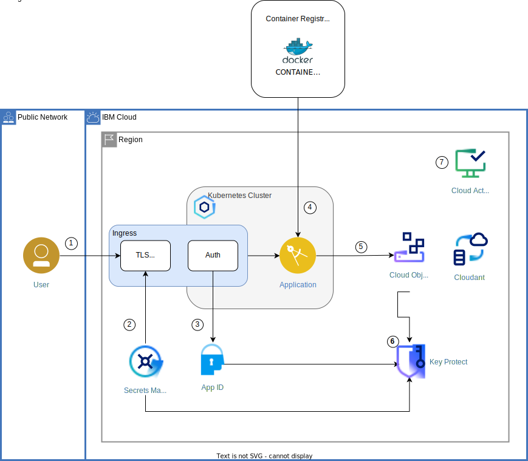

{{site.data.keyword.attribute-definition-list}}

# Enhance cloud security by applying context-based restrictions
{: #cbr-security}
{: toc-content-type="tutorial"}
{: toc-services="containers, cloud-object-storage, activity-tracker, Registry, secrets-manager, appid, Cloudant, key-protect, log-analysis"}
{: toc-completion-time="2h"}

<!--##istutorial#-->
This tutorial may incur costs. Use the [Cost Estimator](/estimator/review) to generate a cost estimate based on your projected usage.
{: tip}

<!--#/istutorial#-->

This tutorial walks you through the process of implementing [context-based restrictions](/docs/account?topic=account-context-restrictions-whatis) (CBRs) in your {{site.data.keyword.cloud_notm}} account. CBRs help you to secure the cloud environment further and move towards a [zero trust security model](https://en.wikipedia.org/wiki/Zero_trust_security_model){:external: target="_blank" .external}.
{: shortdesc}

The tutorial discusses how to create network zones and context rules and how to verify that they work. In the tutorial, you learn how to create the CBR objects both in the browser console and as Infrastructure as Code with Terraform. 

* gotchas? best practices?


## Objectives
{: #cbr-security-objectives}

* Learn about context-based restrictions to protect your cloud resources
* Define network zones to identify traffic sources for allowed and denied access
* Create rules that define context for access to your cloud resources


{: class="center"}
{: style="text-align: center;"}


1. Adapt to creating CBR zones and rules
2. Need to decide how to visualize it
3. could be boxes around zones, lines with question marks for rules?

<!--##istutorial#-->
## Before you begin
{: #cbr-security-prereqs}

This tutorial requires:
* {{site.data.keyword.cloud_notm}} CLI,
* `git` to clone source code repository,
* `terraform` to deploy resources.

You will find instructions to download and install these tools for your operating environment in the [Getting started with tutorials](/docs/solution-tutorials?topic=solution-tutorials-tutorials) guide.

To avoid the installation of these tools you can use the [{{site.data.keyword.cloud-shell_short}}](/shell) from the {{site.data.keyword.cloud_notm}} console.
{: tip}

You need to have deployed the resources discussed in the tutorial [Apply end to end security to a cloud application](/docs/solution-tutorials?topic=solution-tutorials-cloud-e2e-security). This could have been manually by following the steps or by [using Terraform code as described](/docs/solution-tutorials?topic=solution-tutorials-cloud-e2e-security#cloud-e2e-security-setup).

* You need to have an instance of [{{site.data.keyword.at_short}}](/docs/activity-tracker?topic=activity-tracker-getting-started) configured for platform logs.


## Overview: Context-based restrictions
{: #cbr-security-strategy-overview}
{: step}

Context-based restrictions (CBR) provide the ability to define and enforce access restrictions for {{site.data.keyword.cloud_notm}} resources based on the network location and the type of access requests. These restrictions add an extra layer of protection and are additional to traditional IAM (Identity and Access Management) policies. Because both IAM policies and context-based restrictions enforce access, context-based restrictions offer protection even in the face of compromised or mismanaged credentials.

* discuss actions / privileges, who is authorized to create / update / view zones and rules
* show how to add CBR zone and rule in the UI
* IKS to COS? or COS to KP?


in the tutorial and TF code,
- discuss that rules can be disabled, reported, enabled
- provide switch to change the mode for rules, so that there could be a transition (and test) phase towards enabled rules
- discuss how to check that rules are in place but not enforced yet


supported service references: 
https://{DomainName}/docs/account?topic=account-context-restrictions-whatis#service-attribute


## Create zone and rule
{: #cbr-security-zone-rule-create}
{: step}

For evaluating the impact of context-based restrictions, you are going to create a rule governing the access to a namespace in {{site.data.keyword.registryshort_notm}}. You start by creating that namespace, then a network zone to identify a VPC as traffic source.

1. Go to the [{{site.data.keyword.registryshort_notm}} namespaces](https://{DomainName}/registry/namespaces) and select the region you want to work with. Click **Create** and enter **YOUR_INITIALS-e2esec** as **Name**. Use your initials or something else to make sure the namespace is unique within the region. Last, **Create** the new namespace.
2. In the [{{site.data.keyword.cloud_notm}}](https://{DomainName}) console, click on the **Manage** menu and select [**Context-based restrictions**](https://{DomainName}/context-based-restrictions). In the overview page, click on **Create a network zone**.
3. Enter **VPCzone** as name. Under **Allowed VPCs**, select the one with your {{site.data.keyword.containershort_notm}} cluster. Click **Next** to review, then **Create** the zone.
4. Next, create a rule using the zone by clicking on **Rules** in the navigation on the left, then **Create**.
5. Select **{{site.data.keyword.registryshort_notm}}** in the **Service** section and click **Next**.
6. Then, under **Resources**, choose **Specific resources**. Pick **Resource Type** as attribute and specify **namespace** as value. Add another attribute and configure **Resource Name** as **YOUR_INITIALS-e2esec** (the same value as in step 1). Click **Review**, then **Continue**.
7. Select the **VPCzone** you created earlier from the list. Then use **Add** and **Continue** to get to the last step of the dialog. Mark the **Enforcement** as **Report-only**. Thereafter, **Create** the rule.


## Test the rule and its enforcement modes
{: #cbr-security-in-action}
{: step}

1. In a new browser tab, open the [{{site.data.keyword.at_short}} platform logs](https://{DomainName}/observe/activitytracker) to monitor IAM-related events.
2. Start a new session of [{{site.data.keyword.cloud-shell_notm}}](https://{DomainName}/shell) in another browser tab.
3. In the shell, perform the following commands:
   ```sh
   ibmcloud cr login
   ```
   {: codeblock}
  
   The above logs you in to the {{site.data.keyword.registryshort_notm}}. Next, pull a container image to the shell environment.
   ```sh
   docker pull registry.access.redhat.com/ubi8/ubi-micro
   ```
   {: codeblock}

   Re-tag the image to upload it to your registry namespace. Make sure to adapt **REGION** and **YOUR_INITIALS** to your configuration.
   ```sh
   docker tag registry.access.redhat.com/ubi8/ubi-micro REGION.icr.io/YOUR_INITIALS-e2esec/ubi-micro
   ```
   {: codeblock}

   Last, push the container image to the registry.
   ```sh
   docker push --remove-signatures REGION.icr.io/YOUR_INITIALS-e2esec/ubi-micro
   ```
   {: codeblock}

4. Switch to the browser tab with the activity logs. When in report mode, log entries are written to {{site.data.keyword.at_short}} when a rule matches. The action is still approved. The log record has details on the request. In the image below, the rule to allow access to a {{site.data.keyword.registryshort_notm}} namespace matched in report mode.

   {: class="center"}

5. Back in the browser tab with the shell, list the container images in the namespace. Remember to replace **YOUR_INITIALS** with your chosen prefix.
   ```sh
   ibmcloud cr images --restrict YOUR_INITIALS-e2esec
   ```
   {: codeblock}

6. In a third browser tab, navigate to the [CBR rules](https://{DomainName}/context-based-restrictions/rules). Next to the registry-related rule you created earlier, click on the dot menu and select **Edit**. Go to **Describe your rule (Step 3)** and switch the rule from **Report-only** to **Enabled**. Activate the change by pressing the **Apply** button.
7. Go back to the browser tab with {{site.data.keyword.cloud-shell_notm}}. Issue the same command as before to list the images:
   ```sh
   ibmcloud cr images --restrict YOUR_INITIALS-e2esec
   ```
   {: codeblock}

   This time, it should result in an error message that you are not authorized.
8. In the browser tab with the logs, you should find a new record similar to the following:
   {: class="center"}


   The rule has been enforced and, based on how you tried to access the registry, the access has been denied.

Monitoring a new rule is recommended for 30 days prior to enforcing it. Learn more about [**Monitoring context-based restrictions**](https://{DomainName}/docs/account?topic=account-cbr-monitor) both in report-only and enabled mode in the CBR documentation.
{: tip}

## Define the access strategy for your cloud resources
{: #cbr-security-strategy}
{: step}

* what to protect
* which by CBR, by IAM
* what endpoints to protect / use
* make sure to not lock you out (console, CLI, TF)
* what are your bastions or zones for admin work?
* what are typical users of the protected resources? Are all accounted for with zones and rules?
* test it in report-only mode (for 30 days or more) before enabling enforcement


## Use Terraform to configure context-based restrictions
{: #cbr-security-terraform}
{: step}

Instead of manually creating the network zones and context rules for a project, it is recommended to automate the deployment. Context-based restrictions can be deployed utilizing Infrastructure as Code (IaC) - namely [Terraform code](https://{DomainName}/docs/ibm-cloud-provider-for-terraform). You can first deploy the zones and rules with rules in report-only mode for testing. Then, after thorough tests, switch to enforced mode by updating the deployed configuration. 

### Terraform resources for zones and rules
{: #cbr-security-terraform-resources}


In the following, you will deploy the Terraform code to create a basic set of network zones and context rules. The code for zones is using the [**ibm_cbr_zone**](https://registry.terraform.io/providers/IBM-Cloud/ibm/latest/docs/resources/cbr_zone) resource. The following shows a zone specification which identifies the Kubernetes cluster. Such a cluster is one of the [supported service references](https://{DomainName}/docs/account?topic=account-context-restrictions-whatis#service-attribute).

```hcl
resource "ibm_cbr_zone" "cbr_zone_k8s" {
  account_id = data.ibm_iam_account_settings.team_iam_account_settings.account_id
  addresses {
    type = "serviceRef"
    ref {
      account_id       = data.ibm_iam_account_settings.team_iam_account_settings.account_id
      service_instance = data.terraform_remote_state.e2e-resources.outputs.cluster.id
      service_name     = "containers-kubernetes"
    }
  }
  description = "Zone with the Kubernetes cluster"
  name        = "cbr_zone_k8s"
}
```
{: codeblock}


The code for rules is using the [**ibm_cbr_rule**](https://registry.terraform.io/providers/IBM-Cloud/ibm/latest/docs/resources/cbr_rule) resource. The Terraform configuration for a typical rule is shown below.
Similar to the browser UI, it has the following elements:
* Contexts to specify the zones
* Enforcement mode
* Resources it applies to, identified by attributes

```hcl
resource "ibm_cbr_rule" "cbr_rule_cos_vpc" {
  contexts {
    attributes {
      name  = "networkZoneId"
      value = ibm_cbr_zone.cbr_zone_k8s.id
    }
    attributes {
      name  = "networkZoneId"
      value = ibm_cbr_zone.cbr_zone_iam_groups.id
    }
    attributes {
      name  = "networkZoneId"
      value = ibm_cbr_zone.cbr_zone_iam_users.id
    }
    attributes {
      name  = "networkZoneId"
      value = ibm_cbr_zone.cbr_zone_homezone.id
    }

  }

  description      = "restrict COS access to cluster"
  enforcement_mode = var.cbr_enforcement_mode
  resources {
    attributes {
      name  = "accountId"
      value = data.ibm_iam_account_settings.team_iam_account_settings.account_id
    }
    attributes {
      name     = "serviceInstance"
      operator = "stringEquals"
      value    = data.terraform_remote_state.e2e-resources.outputs.cos.guid
    }
    attributes {
      name     = "serviceName"
      operator = "stringEquals"
      value    = "cloud-object-storage"
    }

  }
}
```
{: codeblock}

### Deploy the Terraform resources
{: #cbr-security-terraform-deploy}

With the understanding of the CBR-related Terraform resources, it is time to deploy them to create zones and rules. 


You can run the following commands in the browser tab with the {{site.data.keyword.cloud-shell_notm}} session or in a terminal. 

Note that the files will be gone once the session is closed. It is not a problem for the tutorial, but should be avoided for production systems. For these, consider using [{{site.data.keyword.bpfull_notm}}](/docs/schematics?topic=schematics-about-schematics), a managed Infrastructure-as-Code solution, or having the files on your computers.
{: note}

1. Get the Terraform code:
   ```sh
   git clone https://github.com/IBM-Cloud/secure-file-storage
   ```
   {: codeblock}
   
2. Change into the **secure-file-storage/terraform** directory:
   ```sh
   cd secure-file-storage/terraform
   ```
   {: codeblock}

3. Next, create a file **terraform.tfvars** with settings like the following. Adapt the values where needed.
   ```hcl
   ibmcloud_api_key="<your-api-key>"
   region = "us-south"
   iks_cluster_name="mycluster-us-south-e2e-sec"
   iks_namespace="secure-file-storage"
   existing_resources=true
   ```
   {: codeblock}

   The last variable is to make sure that no new service instances will be created, but that the metadata of existing ones is retrieved.
4. First, initialize the Terraform project.
   ```sh
   terraform init
   ```
   {: codeblock}

   Next, retrieve the metadata by running **apply**. You will be asked to confirm with **yes**. Before confirming, check that no resources will be created, changed, or deleted. It should just retrieve data and create outputs.
   ```sh
   terraform apply
   ```
   {: codeblock}

The above created a file **terraform.tfstate**. It holds all the metadata about the managed resources. The same file will be used when deploying the CBR zones and rules. It is utilized to reference the existing services as well as to store the state information about the new CBR objects. With that, it is time to actually create the zones and rules.

1. Change into the **terraform-cbr** directory:
   ```sh
   cd ../terraform-cbr
   ```
   {: codeblock}

2. Take a look at the file content of **backend.tf**. It defines the reference to the Terraform state in the other directory.
3. Review the file **variables.tf** which contains definitions of variables. The variable **cbr_enforcement_mode** is used for the new rules and should have a default value **report**. 

4. Again, create a file **terraform.tfvars** to configure an API key and the region. Moreover, you can set a range of IP addresses as home or bastion zone. It will be used to create a network zone which is granted access (allow-listed) in CBR rules.
   ```hcl
   ibmcloud_api_key=""<your-api-key>""
   region = "us-south"
   homezone_iprange = "2.42.42.1-2.42.42.255"
   ```
   {: codeblock}

   For enforcing rules instead of creating them in report-only mode, you would need to add a line with `cbr_enforcement_mode=enabled`.

5. Similar to the steps applied in the other directory, start by initializing the Terraform project.
   ```sh
   terraform init
   ```
   {: codeblock}

   Next, **apply** the infrastructure definition and create the zones and rules. You will be asked to confirm with **yes**. Before confirming, review the objects to be created which should only be CBR zones and rules.
   ```sh
   terraform apply
   ```
   {: codeblock}

   Note that you can run **apply** again after changing some configuration. A use case would be to test the zones and rules and later to update the enforcement mode, then deploying the changed configuration.
   {: note}


### Test the context rules
{: #cbr-security-terraform-test}

With the set of context-based restrictions deployed, it is time again to verify them. This includes tests on {{site.data.keyword.registryshort_notm}}, {{site.data.keyword.cos_short}} and {{site.data.keyword.keymanagementserviceshort}}.

Because the zones and rules include the access restriction on the {{site.data.keyword.registryshort_notm}}, you can repeat the tests performed in section [Test the rule and its enforcement modes](#cbr-security-in-action).

To test the new rule for access to {{site.data.keyword.cos_short}}, follow these steps:
1. In a browser tab, go to the [list of {{site.data.keyword.cos_short}} instances](/objectstorage). Click on the service name for the tutorial, e.g., **secure-file-storage-cos**.
2. In a second browser tab, visit the already used {{site.data.keyword.at_short}} dashboard with the activity logs.
3. Back in the tab with the {{site.data.keyword.cos_short}} overview, in the list of **Buckets**, click on the storage bucket.
4. Use **Upload** to import a file into the bucket. Leave the setting as **Standard transfer** and use the **Upload files (objects)** area to select a file. Finish by clicking **Upload**.
5. Back in the browser tab with the activity logs, there should be CBR-related log records titled `Context restriction matched while in report mode`. This is due to the fact that the rules have been deployed in **report** mode. Expand some records to check the reported **decision** and **isEnforced** data. Depending on the configured IP range for the homezone, **decision** might be **Permit** or **Deny**. The value for **isEnforced** should be **false** because of the reporting mode.

For further testing, you might want to change the IP range of the homezone and then redeploy the rules with `terraform apply`.

## Remove resources
{: #cbr-security-remove}
{: removeresources}


To remove the resource, delete the created context rules and network zones. Run the following command in the **terraform-cbr** directory:
```sh
terraform destroy
```
{: codeblock}

If you do not have access to that directory any longer, you could also use the browser UI. Visit the [page with CBR objects](https://{DomainName}/context-based-restrictions/) and first delete the rules, then the zones that were created as part of this tutorial.

## Related content
{: #cbr-security-12}
{: related}

* Blog post [Towards Zero Trust with Context-Based Restrictions](https://www.ibm.com/cloud/blog/towards-zero-trust-with-context-based-restrictions){:external: target="_blank" .external}
* Blog post [Introducing Context-Based Restrictions](https://www.ibm.com/cloud/blog/announcements/introducing-context-based-restrictions){:external: target="_blank" .external}
* [What is Zero Trust?](https://www.ibm.com/topics/zero-trust){:external: target="_blank" .external}