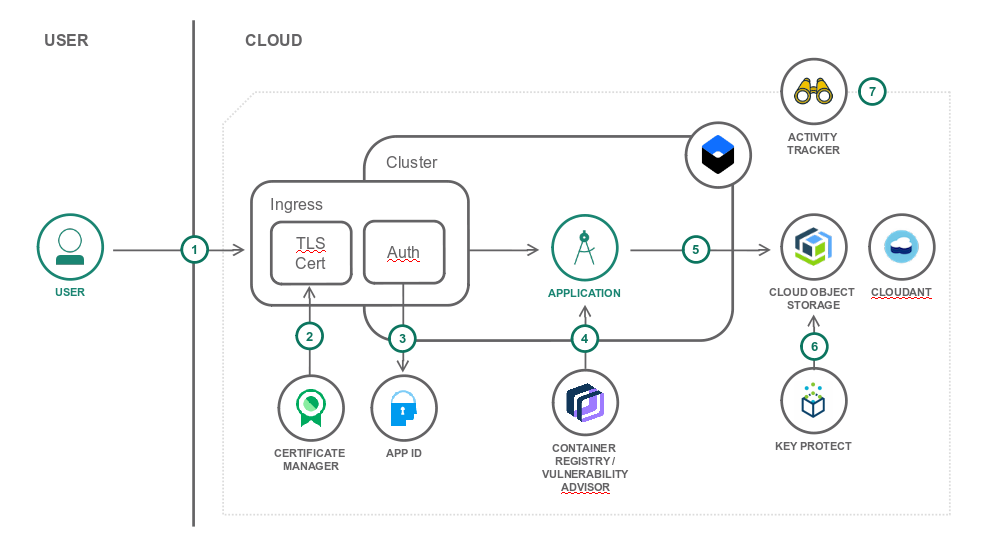

{:step: data-tutorial-type='step'}
{:shortdesc: .shortdesc}
{:new_window: target="_blank"}
{:codeblock: .codeblock}
{:screen: .screen}
{:tip: .tip}
{:pre: .pre}

# Enhance cloud security by applying context-based restrictions
{: #cbr-security}
{: toc-content-type="tutorial"}
{: toc-services="containers, cloud-object-storage, activity-tracker, Registry, secrets-manager, appid, Cloudant, key-protect, log-analysis"}
{: toc-completion-time="2h"}

<!--##istutorial#-->
This tutorial may incur costs. Use the [Cost Estimator](https://{DomainName}/estimator/review) to generate a cost estimate based on your projected usage.
{: tip}

<!--#/istutorial#-->

This tutorial walks you through the process of implementing context-based restrictions (CBRs) in your {{site.data.keyword.cloud}} account. They help you to secure the cloud environment further and move towards a [zero trust security model](https://en.wikipedia.org/wiki/Zero_trust_security_model).
{: shortdesc}


## Objectives
{: #cbr-security-objectives}

* Secure your cloud environment with context-based restrictions
* Define network zones
* Monitor and audit security-related API calls and other actions across cloud services


The tutorial features a sample application that enables groups of users to upload files to a common storage pool and to provides access to those files via shareable links. The application is written in Node.js and deployed as a container to the {{site.data.keyword.containershort_notm}}. It leverages several security-related services and features to improve the application's security posture.

<!--##istutorial#-->
This tutorial will work with a Kubernetes cluster running in Classic Infrastructure or VPC Infrastructure.
<!--#/istutorial#-->

{: class="center"}
{: style="text-align: center;"}


1. User connects to the application.
2. If using a custom domain and a TLS certificate, the certificate is managed by and deployed from the {{site.data.keyword.secrets-manager_short}}.
3. {{site.data.keyword.appid_short}} secures the application and redirects the user to the authentication page. Users can also sign up.
4. The application runs in a Kubernetes cluster from an image stored in the {{site.data.keyword.registryshort_notm}}. This image is automatically scanned for vulnerabilities.
5. Uploaded files are stored in {{site.data.keyword.cos_short}} with accompanying metadata stored in {{site.data.keyword.cloudant_short_notm}}.
6. Object storage buckets, {{site.data.keyword.appid_short}}, and {{site.data.keyword.secrets-manager_short}} services leverage a user-provided key to encrypt data.
7. Application management activities are logged by {{site.data.keyword.at_full_notm}}.

<!--##istutorial#-->
## Before you begin
{: #cbr-security-prereqs}

This tutorial requires:
* {{site.data.keyword.cloud_notm}} CLI,
   * {{site.data.keyword.containerfull_notm}} plugin (`kubernetes-service`),
   * {{site.data.keyword.registryshort_notm}} plugin (`container-registry`),
* `kubectl` to interact with Kubernetes clusters,
* `git` to clone source code repository.

You will find instructions to download and install these tools for your operating environment in the [Getting started with tutorials](/docs/solution-tutorials?topic=solution-tutorials-tutorials) guide.

To avoid the installation of these tools you can use the [{{site.data.keyword.cloud-shell_short}}](https://{DomainName}/shell) from the {{site.data.keyword.cloud_notm}} console.
{: tip}


## Create services
{: #cbr-security-setup}
{: step}

In the next section, you are going to create the services used by the application.

<!--##istutorial#-->
If you want to skip the manual steps to create the services, the tutorial provides an automated alternative set of [terraform templates to use with {{site.data.keyword.bpshort}}](https://github.com/IBM-Cloud/secure-file-storage#deploy-resources-using-terraform-managed-by-schematics).
{: tip}

<!--#/istutorial#-->


### Use your own encryption keys
{: #cbr-security-7}

{{site.data.keyword.keymanagementserviceshort}} helps you provision encrypted keys for apps across {{site.data.keyword.Bluemix_notm}} services. {{site.data.keyword.keymanagementserviceshort}} and {{site.data.keyword.cos_full_notm}} [work together to protect your data at rest](https://{DomainName}/docs/key-protect/integrations?topic=key-protect-integrate-cos#integrate-cos). In this section, you will create one root key for the storage bucket.

1. Create an instance of [{{site.data.keyword.keymanagementserviceshort}}](https://{DomainName}/catalog/services/kms).
   1. Select a **location**.
   2. Set the name to **<!--##isworkshop#--><!--&lt;your-initials&gt;---><!--#/isworkshop#-->secure-file-storage-kp**.
   3. Select the **resource group** where to create the service instance and click **Create**.
2. Under **Keys**, click the **Add** button to create a new root key. It will be used to encrypt the storage bucket and {{site.data.keyword.appid_short}} data.
   1. Set the key type to **Root key**.
   2. Set the name to **secure-file-storage-root-enckey**.
   3. Then **Add key**.

## Expand the tutorial
{: #cbr-security-21}

Security is never done. Try the below suggestions to enhance the security of your application.

* Replace {{site.data.keyword.keymanagementservicelong_notm}} by [{{site.data.keyword.hscrypto}}](https://{DomainName}/docs/hs-crypto?topic=hs-crypto-get-started) for even greater security and control over encryption keys.
text

## Remove resources
{: #cbr-security-23}
{: removeresources}

To remove the resource, delete the deployed container and then the provisioned services.

If you share an account with other users, always make sure to delete only your own resources.
{: tip}

1. Delete the deployed container:
   ```sh
   kubectl delete -f secure-file-storage.yaml
   ```
   {: codeblock}

2. Delete the secrets for the deployment:
   ```sh
   kubectl delete secret <!--##isworkshop#--><!--<your-initials>---><!--#/isworkshop#-->secure-file-storage-credentials
   ```
   {: codeblock}

4. In the [{{site.data.keyword.Bluemix_notm}} Resource List](https://{DomainName}/resources) locate the resources that were created for this tutorial. Use the search box and **secure-file-storage** as pattern. Delete each of the services by clicking on the context menu next to each service and choosing **Delete Service**. Note that the {{site.data.keyword.keymanagementserviceshort}} service can only be removed after the key has been deleted. Click on the service instance to get to the related dashboard and to delete the key.

Depending on the resource it might not be deleted immediately, but retained (by default for 7 days). You can reclaim the resource by deleting it permanently or restore it within the retention period. See this document on how to [use resource reclamation](https://{DomainName}/docs/account?topic=account-resource-reclamation).
{: tip}

## Related content
{: #cbr-security-12}
{: related}

* [{{site.data.keyword.security-advisor_short}} documentation](https://{DomainName}/docs/security-advisor?topic=security-advisor-about#about)
* [Security to safeguard and monitor your cloud apps](https://www.ibm.com/cloud/garage/architectures/securityArchitecture)
* [{{site.data.keyword.Bluemix_notm}} Platform security](https://{DomainName}/docs/overview?topic=overview-security#security)
* [Security in the IBM Cloud](https://www.ibm.com/cloud/security)
* Tutorial: [Best practices for organizing users, teams, applications](https://{DomainName}/docs/solution-tutorials?topic=solution-tutorials-users-teams-applications#users-teams-applications)
* Blog: [Secure Apps on IBM Cloud with Wildcard Certificates](https://www.ibm.com/cloud/blog/secure-apps-on-ibm-cloud-with-wildcard-certificates)
* Blog: [Cloud Offboarding: How to Remove a User and Maintain Security](https://www.ibm.com/cloud/blog/cloud-offboarding-how-to-remove-a-user-and-maintain-security)
* Blog: [Going Passwordless on IBM Cloud Thanks to FIDO2](https://www.ibm.com/cloud/blog/going-passwordless-on-ibm-cloud-thanks-to-fido2)
