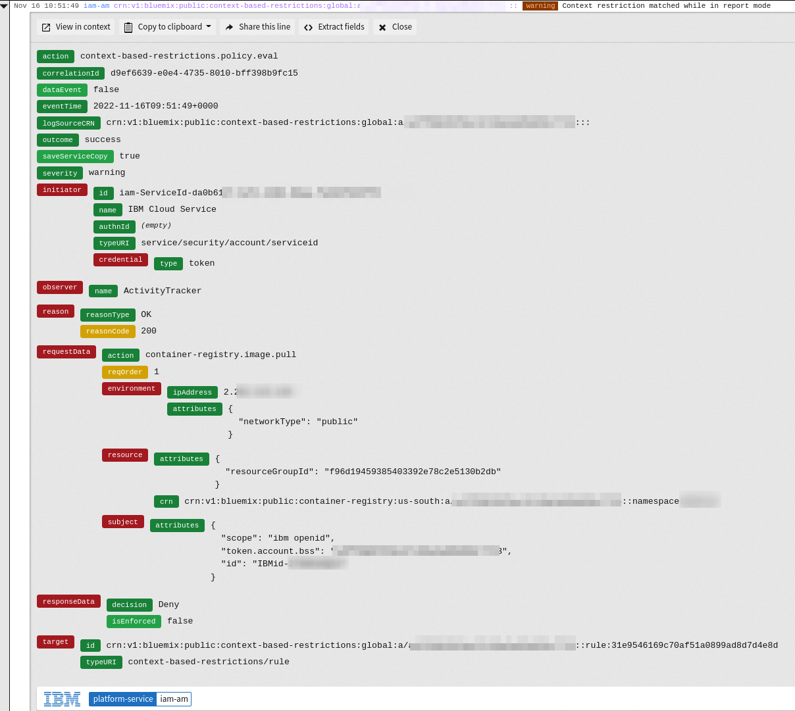

{:step: data-tutorial-type='step'}
{:shortdesc: .shortdesc}
{:new_window: target="_blank"}
{:codeblock: .codeblock}
{:screen: .screen}
{:tip: .tip}
{:pre: .pre}

# Enhance cloud security by applying context-based restrictions
{: #cbr-security}
{: toc-content-type="tutorial"}
{: toc-services="containers, cloud-object-storage, activity-tracker, Registry, secrets-manager, appid, Cloudant, key-protect, log-analysis"}
{: toc-completion-time="2h"}

<!--##istutorial#-->
This tutorial may incur costs. Use the [Cost Estimator](https://{DomainName}/estimator/review) to generate a cost estimate based on your projected usage.
{: tip}

<!--#/istutorial#-->

This tutorial walks you through the process of implementing context-based restrictions (CBRs) in your {{site.data.keyword.cloud_notm}} account. They help you to secure the cloud environment further and move towards a [zero trust security model](https://en.wikipedia.org/wiki/Zero_trust_security_model).
{: shortdesc}


## Objectives
{: #cbr-security-objectives}

* Learn about context-based restrictions to protect your cloud resources
* Define network zones to identify traffic sources for allowed and denied access
* Create rules that define context for access to your cloud resources


{: class="center"}
{: style="text-align: center;"}


1. Adapt to creating CBR zones and rules
2. Need to decide how to visualize it
3. could be boxes around zones, lines with question marks for rules?

<!--##istutorial#-->
## Before you begin
{: #cbr-security-prereqs}

This tutorial requires:
* {{site.data.keyword.cloud_notm}} CLI,
* `git` to clone source code repository,
* `terraform` to deploy resources.

You will find instructions to download and install these tools for your operating environment in the [Getting started with tutorials](/docs/solution-tutorials?topic=solution-tutorials-tutorials) guide.

To avoid the installation of these tools you can use the [{{site.data.keyword.cloud-shell_short}}](https://{DomainName}/shell) from the {{site.data.keyword.cloud_notm}} console.
{: tip}

!!!Need to have app from other tutorial DEPLOYED!!!

* You need to have an instance of [{{site.data.keyword.at_short}}](https://{DomainName}/docs/activity-tracker?topic=activity-tracker-getting-started) configured for platform logs.


## Overview: Context-based restrictions
{: #cbr-security-strategy-overview}
{: step}

Context-based restrictions (CBR) provide the ability to define and enforce access restrictions for {{site.data.keyword.cloud_notm}} resources based on the network location and the type of access requests. These restrictions add an extra layer of protection and are additional to traditional IAM (Identity and Access Management) policies. Because both IAM policies and context-based restrictions enforce access, context-based restrictions offer protection even in the face of compromised or mismanaged credentials.

* discuss actions / privileges, who is authorized to create / update / view zones and rules
* show how to add CBR zone and rule in the UI
* IKS to COS? or COS to KP?


in the tutorial and TF code,
- discuss that rules can be disabled, reported, enabled
- provide switch to change the mode for rules, so that there could be a transition (and test) phase towards enabled rules
- discuss how to check that rules are in place but not enforced yet


## Create zone and rule
{: #cbr-security-zone-rule-create}
{: step}

For evaluating the impact of context-based restrictions, you are going to create a rule governing the access to a namespace in {{site.data.keyword.registryshort_notm}}. You start by creating that namespace, then a network zone to identify a VPC as traffic source.

1. Go to the [{{site.data.keyword.registryshort_notm}} namespaces](https://{DomainName}/registry/namespaces) and select the region you want to work with. Click **Create** and enter **YOUR_INITIALS-e2esec** as **Name**. Use your initials or something else to make sure the namespace is unique within the region. Last, **Create** the new namespace.
2. In the [{{site.data.keyword.cloud_notm}}](https://{DomainName}) console, click on the **Manage** menu and select [**Context-based restrictions**](https://{DomainName}/context-based-restrictions). In the overview page, click on **Create a network zone**.
3. Enter **VPCzone** as name. Under **Allowed VPCs**, select the one with your {{site.data.keyword.containershort_notm}} cluster. Click **Next** to review, then **Create** the zone.
4. Next, create a rule using the zone by clicking on **Rules** in the navigation on the left, then **Create**.
5. Select **{{site.data.keyword.registryshort_notm}}** in the **Service** section and click **Next**.
6. Then, under **Resources**, choose **Specific resources**. Pick **Resource Type** as attribute and specify **namespace** as value. Add another attribute and configure **Resource Name** as **YOUR_INITIALS-e2esec** (the same value as in step 1). Click **Review**, then **Continue**.
7. Select the **VPCzone** you created earlier from the list. Then use **Add** and **Continue** to get to the last step of the dialog. Mark the **Enforcement** as **Report-only**. Thereafter, **Create** the rule.


## Test the rule and its enforcement modes
{: #cbr-security-in-action}
{: step}

1. In a new browser tab, open the [{{site.data.keyword.at_short}} platform logs](https://{DomainName}/observe/activitytracker) to monitor IAM-related events.
2. Start a new session of [{{site.data.keyword.cloud-shell_notm}}](https://{DomainName}/shell) in another browser tab.
3. In the shell, perform the following commands:
   ```sh
   ibmcloud cr login
   ```
   {: codeblock}
  
   The above logs you in to the {{site.data.keyword.registryshort_notm}}. Next, pull a container image to the shell environment.
   ```sh
   docker pull registry.access.redhat.com/ubi8/ubi-micro
   ```
   {: codeblock}

   Re-tag the image to upload it to your registry namespace. Make sure to adapt **REGION** and **YOUR_INITIALS** to your configuration.
   ```sh
   docker tag registry.access.redhat.com/ubi8/ubi-micro REGION.icr.io/YOUR_INITIALS-e2esec/ubi-micro
   ```
   {: codeblock}

   Last, push the container image to the registry.
   ```sh
   docker push --remove-signatures REGION.icr.io/YOUR_INITIALS-e2esec/ubi-micro
   ```
   {: codeblock}

4. Switch to the browser tab with the activity logs. When in report mode, log entries are written to {{site.data.keyword.at_short}} when a rule matches. The action is still approved. The log record has details on the request. In the image below, the rule to allow access to a {{site.data.keyword.registryshort_notm}} namespace matched in report mode.

   {: class="center"}

5. Back in the browser tab with the shell, list the container images in the namespace. Remember to replace **YOUR_INITIALS** with your chosen prefix.
   ```sh
   ibmcloud cr images --restrict YOUR_INITIALS-e2esec
   ```
   {: codeblock}

6. In a third browser tab, navigate to the [CBR rules](https://{DomainName}/context-based-restrictions/rules). Next to the registry-related rule you created earlier, click on the dot menu and select **Edit**. Go to **Describe your rule (Step 3)** and switch the rule from **Report-only** to **Enabled**. Activate the change by pressing the **Apply** button.
7. Go back to the browser tab with {{site.data.keyword.cloud-shell_notm}}. Issue the same command as before to list the images:
   ```sh
   ibmcloud cr images --restrict YOUR_INITIALS-e2esec
   ```
   {: codeblock}

   This time, it should result in an error message that you are not authorized.
8. In the browser tab with the logs, you should find a new record similar to the following:
   {: class="center"}


   The rule has been enforced and, based on how you tried to access the registry, the access has been denied.

Monitoring a new rule is recommended for 30 days prior to enforcing it. Learn more about [**Rule Enforcement**](https://{DomainName}/docs/account?topic=account-context-restrictions-whatis&interface=ui#rule-enforcement) in the CBR overview documentation.
{: tip}

## Define the access strategy for your cloud resources
{: #cbr-security-strategy}
{: step}

should this be moved towards the end, after some more hands-on experience?

* what to protect
* which by CBR, by IAM
* what endpoints to protect / use
* make sure to not locked you out (console, CLI, TF)


https://{DomainName}/docs/account?topic=account-cbr-monitor

## Expand the tutorial
{: #cbr-security-21}

Security is never done. Try the below suggestions to enhance the security of your application.


## Remove resources
{: #cbr-security-23}
{: removeresources}

To remove the resource, delete the created network zones and rules.


## Related content
{: #cbr-security-12}
{: related}

https://{DomainName}/docs/vpc?topic=vpc-cbr&interface=cli