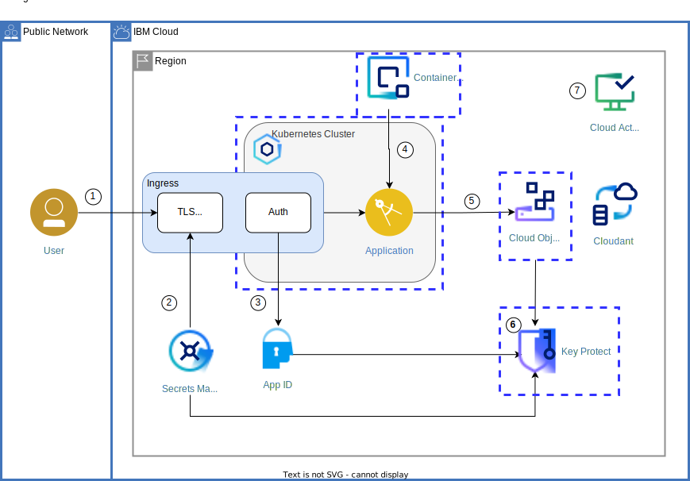

{{site.data.keyword.attribute-definition-list}}

# Enhance cloud security by applying context-based restrictions
{: #cbr-security}
{: toc-content-type="tutorial"}
{: toc-services="containers, cloud-object-storage, activity-tracker, Registry, secrets-manager, appid, Cloudant, key-protect, log-analysis"}
{: toc-completion-time="2h"}

<!--##istutorial#-->
This tutorial may incur costs. Use the [Cost Estimator](/estimator/review) to generate a cost estimate based on your projected usage.
{: tip}

<!--#/istutorial#-->

This tutorial walks you through the process of implementing [context-based restrictions](/docs/account?topic=account-context-restrictions-whatis) (CBRs) in your {{site.data.keyword.cloud_notm}} account. CBRs help you to secure the cloud environment further and move towards a [zero trust security model](https://en.wikipedia.org/wiki/Zero_trust_security_model){:external: target="_blank" .external}.
{: shortdesc}

The tutorial discusses how to create network zones and context rules and how to verify that they work. In the tutorial, you learn how to create the CBR objects both in the browser console and as Infrastructure as Code with Terraform. You will also learn about criteria on how to define the access strategy for your cloud resources.

## Objectives
{: #cbr-security-objectives}

* Learn about context-based restrictions to protect your cloud resources
* Define network zones to identify traffic sources for allowed and denied access
* Create rules that define context for access to your cloud resources

The following diagram shows the solution architecture as used in the tutorial [Apply end to end security to a cloud application](/docs/solution-tutorials?topic=solution-tutorials-cloud-e2e-security). The additional boxes with dashed, blue lines around the {{site.data.keyword.containershort_notm}} cluster, {{site.data.keyword.registryshort_notm}}, {{site.data.keyword.keymanagementserviceshort}}, and {{site.data.keyword.cos_short}} denote context-based restrictions implemented as context rules.

{: caption="Solution architecture" caption-side="bottom"}


<!--##istutorial#-->
## Before you begin
{: #cbr-security-prereqs}

This tutorial requires:
* {{site.data.keyword.cloud_notm}} CLI,
* `git` to clone source code repository,
* `terraform` to deploy resources,
* `docker` client to push and pull container images.

You will find instructions to download and install these tools for your operating environment in the [Getting started with tutorials](/docs/solution-tutorials?topic=solution-tutorials-tutorials) guide.

To avoid the installation of these tools you can use the [{{site.data.keyword.cloud-shell_short}}](/shell) from the {{site.data.keyword.cloud_notm}} console.
{: tip}


## Setup
{: #cbr-security-setup}
{: step}

In a later step, [Use Terraform to configure context-based restrictions](#cbr-security-terraform), you are going to deploy CBR objects as additional security layer on top of the resources used in the tutorial [Apply end to end security to a cloud application](/docs/solution-tutorials?topic=solution-tutorials-cloud-e2e-security). 

1. [Deploy resources using Terraform managed by {{site.data.keyword.bpshort}}](https://github.com/IBM-Cloud/secure-file-storage#deploy-resources-using-terraform-managed-by-schematics) as described in the companion GitHub repository.

2. To monitor events for context-based restrictions, you must have an instance of the {{site.data.keyword.cloudaccesstrailshort}} service in the Frankfurt (eu-de) region. For more information, see [Provisioning an instance](/docs/activity-tracker?topic=activity-tracker-provision).

## Overview: Context-based restrictions
{: #cbr-security-strategy-overview}
{: step}

[Context-based restrictions (CBRs)](/docs/account?topic=account-context-restrictions-whatis) provide the ability to define and enforce access restrictions for {{site.data.keyword.cloud_notm}} resources based on the network location and the type of access requests. Because both IAM policies and context-based restrictions enforce access, context-based restrictions offer protection even in the face of compromised or mismanaged credentials.

A rule governs access to a resource identified by its service name and type as well as by additional attributes. They can include the region, resource group, and other service-specific properties. The attributes in a rule are mostly optional, so that you could govern, e.g., all {{site.data.keyword.keymanagementserviceshort}} instances together, or target just a specific key ring in an identified {{site.data.keyword.keymanagementserviceshort}} instance.

The context for a restriction is made up of network zones and service endpoints. You might want to define zones based on specific IP addresses or ranges, or by configuring traffic originating from one or more VPCs or cloud services. With that, access to the sample {{site.data.keyword.keymanagementserviceshort}} instance might only be allowed from, e.g., a specific {{site.data.keyword.cos_short}} instance, a well-known range of IP addresses, and only via the private endpoint.

Network zones can be used for the definition of multiple rules. Rules have an enforcement mode which is one of disabled, report-only, or enabled.

{: caption="A diagram that shows how context-based restrictions work" caption-side="bottom"}


## Create zone and rule
{: #cbr-security-zone-rule-create}
{: step}

For evaluating the impact of context-based restrictions, you are going to create a rule governing the access to a namespace in {{site.data.keyword.registryshort_notm}}. You start by creating that namespace, then a network zone to identify a VPC as traffic source.

1. Go to the [{{site.data.keyword.registryshort_notm}} namespaces](https://{DomainName}/registry/namespaces) and select the region you want to work with. Click **Create** and enter **YOUR_INITIALS-e2esec** as **Name**. Use your initials or something else to make sure the namespace is unique within the region. Last, **Create** the new namespace.
2. In the [{{site.data.keyword.cloud_notm}}](https://{DomainName}) console, click on the **Manage** menu and select [**Context-based restrictions**](https://{DomainName}/context-based-restrictions). In the overview page, click on **Create a network zone**.
3. Enter **VPCzone** as name. Under **Allowed VPCs**, select the one with your {{site.data.keyword.containershort_notm}} cluster. Click **Next** to review, then **Create** the zone.
4. Next, create a rule using the zone by clicking on **Rules** in the navigation on the left, then **Create**.
5. Select **{{site.data.keyword.registryshort_notm}}** in the **Service** section and click **Next**.
6. Then, under **Resources**, choose **Specific resources**. Pick **Resource Type** as attribute and specify **namespace** as value. Add another condition and configure **Resource Name** as **YOUR_INITIALS-e2esec** (the same value as in step 1). Click **Review**, then **Continue**.
7. Select the **VPCzone** you created earlier from the list. Then use **Add** and **Continue** to get to the last step of the dialog. Mark the **Enforcement** as **Report-only**. Thereafter, **Create** the rule.

Be aware that CBR zones and rules are deployed asynchronously. It may take up to few minutes for them to become active (eventually consistent).
{: note}

## Test the rule and its enforcement modes
{: #cbr-security-in-action}
{: step}

1. In a new browser tab, open the [{{site.data.keyword.at_short}} platform logs](https://{DomainName}/observe/activitytracker) to monitor IAM-related events (Frankfurt region).
2. Start a new session of [{{site.data.keyword.cloud-shell_notm}}](https://{DomainName}/shell) in another browser tab.
3. In the shell, perform the following commands:
   Set an environment variable to the cloud region you are going to use for the {{site.data.keyword.registryshort_notm}}, e.g., **us** or **de**.
   ```sh
   export REGION=us
   ```
   {: codeblock}

   Set another variable with your initials (or the prefix you picked above):
   ```sh
   export YOUR_INITIALS=MI
   ```
   {: codeblock}

   Now log in to the {{site.data.keyword.registryshort_notm}}.
   ```sh
   ibmcloud cr login
   ```
   {: codeblock}
  
   Next, pull a container image to the shell environment.
   ```sh
   docker pull docker.io/library/hello-world:latest
   ```
   {: codeblock}

   Re-tag the image to upload it to your registry namespace.
   ```sh
   docker tag docker.io/library/hello-world $REGION.icr.io/$YOUR_INITIALS-e2esec/hello-world
   ```
   {: codeblock}

   Last, push the container image to the registry.
   ```sh
   docker push $REGION.icr.io/$YOUR_INITIALS-e2esec/hello-world
   ```
   {: codeblock}

4. Switch to the browser tab with the activity logs. When in report mode, log entries are written to {{site.data.keyword.at_short}} when a rule matches, regardless of the decision outcome. The log record has details on the request. In the image below, the rule to allow access to a {{site.data.keyword.registryshort_notm}} namespace matched in report mode.

   {: caption="A context restriction matched in reporting mode" caption-side="bottom"}

   As discussed, in report mode, all matching requests generate a log entry. In the event details you see an attribute **decision** with a value of either **Permit** or **Deny**. In the screenshot above it is **Deny**, below **Permit**.

   {: caption="A CBR rule with decision result Permit in reporting mode" caption-side="bottom"}

5. Back in the browser tab with the shell, list the container images in the namespace.
   ```sh
   ibmcloud cr images --restrict $YOUR_INITIALS-e2esec
   ```
   {: codeblock}

6. In a third browser tab, navigate to the [CBR rules](/context-based-restrictions/rules). Next to the registry-related rule you created earlier, click on the dot menu and select **Edit**. Go to **Describe your rule (Step 3)** and switch the rule from **Report-only** to **Enabled**. Activate the change by pressing the **Apply** button.
7. Go back to the browser tab with {{site.data.keyword.cloud-shell_notm}}. Issue the same command as before to list the images:
   ```sh
   ibmcloud cr images --restrict $YOUR_INITIALS-e2esec
   ```
   {: codeblock}

   This time, it should result in an error message that you are not authorized.
8. In the browser tab with the logs, you should find a new record similar to the following:
   {: caption="A context restriction rendered a deny" caption-side="bottom"}


   The rule has been enforced and, based on how you tried to access the registry, the access has been denied. The reason is that rule allows access from a specific VPC only. The {{site.data.keyword.cloud-shell_short}} environment and its IP address, as documented in the logs in the **requestData->environment** fields, differ. Therefore, the request is denied.

Monitoring a new rule is recommended for 30 days prior to enforcing it. Learn more about [**Monitoring context-based restrictions**](https://{DomainName}/docs/account?topic=account-cbr-monitor) both in report-only and enabled mode in the CBR documentation.
{: tip}

In order to prepare for the deployment of CBR objects with Terraform in a section further down, go to the browser tab with the [CBR rules](/context-based-restrictions/rules). There, delete the previously created rule by clicking on its dot menu and selecting **Remove** and then confirming with **Delete**. Thereafter, click on **Network zones** and delete the previously created zone.

## Define the access strategy for your cloud resources
{: #cbr-security-strategy}
{: step}

To set up the right set of rules for context-based restrictions (CBRs), you should have defined the access strategy for your cloud resources. All resources should be protected by identity and access management (IAM). It means, that authentication and authorization checks should be performed before a user or service ID accesses a resource. CBRs add to the protection by cutting off network access based on origin criteria and other rules, but they do not replace proper IAM configuration. Additionally, many services support limiting network traffic to private endpoints, thereby already reducing access options.

You might find that some rules impact the comfort of administrating resources, e.g., through the browser console. Moreover, you need to make sure that you don't deny yourself access to resources, management dashboards and APIs. Thus, you have to account for bastion hosts, corporate networks, gateways and maybe even {{site.data.keyword.cloud-shell_short}}. In addition, some services support a fine-grained distinction of data plane and control place access for CBR configuration, e.g., [{{site.data.keyword.containershort_notm}} cluster and management APIs](/docs/containers?topic=containers-cbr#protect-api-types-cbr).

In summary, these questions should be asked:
* Are all resources protected by IAM and similar?
* How are the resources accessed, are they already limited to private endpoints where possible?
* Is it possible to separate data plane and control plane access?
* What is traffic related to usage, which to administrative work? How are emergencies handled?
* From where does the above traffic originate?

Use the report mode to be aware of activities matching the context-based restrictions. Do the rule-based decisions render a permit or deny? Does that match your expectation? To learn about activities and to handle them correctly with CBR rules, a test phase in reporting mode of at least a month is recommended. This allows for an iterative approach towards the desired set of network zones and context rules.

For this tutorial, we are going to define the following network zones:
* a zone for each of the deployed services which are supported as service reference for originating traffic
* a zone for each for the Kubernetes cluster
* for an IP range with the addresses of a home network (corporate or bastion) to serve as **homezone**
* a zone for each of the CBR-enabled platform services

Thereafter, we are going to define context rules as follows:
* for the access to the [{{site.data.keyword.keymanagementserviceshort}} instance](/docs/key-protect?topic=key-protect-access-control-with-cbr)
* for the access to the [{{site.data.keyword.cos_short}} instance and its bucket](/docs/cloud-object-storage?topic=cloud-object-storage-setting-a-firewall)
* for the access to the [{{site.data.keyword.registryshort_notm}} and the namespace with the container image](/docs/Registry?topic=Registry-iam#iam_cbr)
* for the access to the [{{site.data.keyword.containershort_notm}} cluster and its management API](/docs/containers?topic=containers-cbr#protect-api-types-cbr)

All the above zones and rules can be deployed in either report-only or enforced mode with a single Terraform command. Note that the rules are not meant for production use, but as a starter to investigate usage and traffic in report-only mode.

The documentation has a [list of resources which are supported as service references](/docs/account?topic=account-context-restrictions-whatis#service-attribute). You can also retrieve the list using the [CLI command **service-ref-targets**](/docs/cli?topic=cli-cbr-plugin#cbr-cli-service-ref-targets-command) or the related API function [List available service reference targets](/apidocs/context-based-restrictions#list-available-serviceref-targets).
{: tip}


## Use Terraform to configure context-based restrictions
{: #cbr-security-terraform}
{: step}

Instead of manually creating the network zones and context rules for a project, it is recommended to automate the deployment. Context-based restrictions can be deployed utilizing Infrastructure as Code (IaC) - namely [Terraform code](https://{DomainName}/docs/ibm-cloud-provider-for-terraform). You can first deploy the zones and rules with rules in report-only mode for testing. Then, after thorough tests, switch to enforced mode by updating the deployed configuration. 

### Terraform resources for zones and rules
{: #cbr-security-terraform-resources}


In the following, you will deploy the Terraform code to create a basic set of network zones and context rules. The code for zones is using the [**ibm_cbr_zone**](https://registry.terraform.io/providers/IBM-Cloud/ibm/latest/docs/resources/cbr_zone) resource. The following shows a zone specification which identifies the Kubernetes cluster. Such a cluster is one of the [supported service references](https://{DomainName}/docs/account?topic=account-context-restrictions-whatis#service-attribute).

```hcl
resource "ibm_cbr_zone" "cbr_zone_k8s" {
  account_id = data.ibm_iam_account_settings.team_iam_account_settings.account_id
  addresses {
    type = "serviceRef"
    ref {
      account_id       = data.ibm_iam_account_settings.team_iam_account_settings.account_id
      service_instance = data.ibm_container_vpc_cluster.cluster.id
      service_name     = "containers-kubernetes"
    }
  }
  description = "Zone with the Kubernetes cluster"
  name        = "cbr_zone_k8s"
}
```
{: codeblock}


The code for rules is using the [**ibm_cbr_rule**](https://registry.terraform.io/providers/IBM-Cloud/ibm/latest/docs/resources/cbr_rule) resource. The Terraform configuration for a typical rule is shown below.
Similar to the browser UI, it has the following elements:
* Contexts to specify the zones
* Enforcement mode
* Resources it applies to, identified by attributes

```hcl
resource "ibm_cbr_rule" "cbr_rule_cos_k8s" {
  contexts {
    attributes {
      name  = "networkZoneId"
      value = ibm_cbr_zone.cbr_zone_k8s.id
    }
    attributes {
      name  = "networkZoneId"
      value = ibm_cbr_zone.cbr_zone_homezone.id
    }

  }

  description      = "restrict COS access, limit to cluster"
  enforcement_mode = var.cbr_enforcement_mode
  resources {
    attributes {
      name  = "accountId"
      value = data.ibm_iam_account_settings.team_iam_account_settings.account_id
    }
    attributes {
      name     = "serviceInstance"
      operator = "stringEquals"
      value    = var.cos.guid
    }
    attributes {
      name     = "serviceName"
      operator = "stringEquals"
      value    = "cloud-object-storage"
    }

  }
}
```
{: codeblock}

### Deploy the Terraform resources
{: #cbr-security-terraform-deploy}

With the understanding of the CBR-related Terraform resources, it is time to deploy them on top of the existing resources to create zones and rules. 

1. In the browser, navigate to the [{{site.data.keyword.bpfull_notm}} workspaces](/schematics/workspaces). Select the workspace with the existing resources from the earlier setup.   
2. Click on **Settings**. In the list of **Variables** and locate the row with **deploy_cbr**. Its value should be **false**, the default.
3. In the dot menu for the variable select **Edit**. Then, in the pop-up form, uncheck **Use default** to be able to change the value. Type **true** in the field for **Value of the variable called: deploy_cbr**. Thereafter, finish the update by clicking **Save**.
4. Once the settings page has updated, continue with **Generate plan** in the top. The plan output should indicate that CBR zones and rules would be created.
5. Create the CBR objects by using the **Apply plan** button.

By default, the enforcement mode is configured to **report-only**. You can change the variable **cbr_enforcement_mode** to the value **enabled** to enforce the restrictions.
{: tip}


## Test the context rules
{: #cbr-security-terraform-test}
{: step}

With the set of context-based restrictions deployed, it is time again to verify and test them. To verify the CBR objects, go to the [context-based restrictions overview](/context-based-restrictions). Then, inspect the new [zones](/context-based-restrictions/zones) and [rules](/context-based-restrictions/rules).

Tests should be performed on {{site.data.keyword.registryshort_notm}}, {{site.data.keyword.cos_short}} and {{site.data.keyword.keymanagementserviceshort}} and validated by monitoring the logs as performed earlier. Because the zones and rules include an access restriction on the {{site.data.keyword.registryshort_notm}}, you can repeat the tests performed in section [Test the rule and its enforcement modes](#cbr-security-in-action).

To test the new rule for access to {{site.data.keyword.cos_short}}, follow these steps:
1. In a browser tab, go to the [list of {{site.data.keyword.cos_short}} instances](/objectstorage). Click on the service name for the tutorial, e.g., **secure-file-storage-cos**.
2. In a second browser tab, visit the already used {{site.data.keyword.at_short}} dashboard with the activity logs.
3. Back in the tab with the {{site.data.keyword.cos_short}} overview, in the list of **Buckets**, click on the storage bucket.
4. Use **Upload** to import a file into the bucket. Leave the setting as **Standard transfer** and use the **Upload files (objects)** area to select a file. Finish by clicking **Upload**.
5. Back in the browser tab with the activity logs, there should be CBR-related log records titled `Context restriction matched while in report mode`. This is due to the fact that the rules have been deployed in **report** mode. Expand some records to check the reported **decision** and **isEnforced** data. Depending on the configured IP range for the homezone, **decision** might be **Permit** or **Deny**. The value for **isEnforced** should be **false** because of the reporting mode.

For further testing, you might want to change the IP range of the homezone. It is the variable **homezone_iprange** in the {{site.data.keyword.bpshort}} settings.

## Remove resources
{: #cbr-security-remove}
{: removeresources}


To remove the resource, use the browser and navigate to the [{{site.data.keyword.bpfull_notm}} workspaces overview](/schematics/workspaces). Select the workspace, then in the **Actions** menu, first select **Destroy resources**, thereafter use **Delete workspace**.

## Related content
{: #cbr-security-12}
{: related}

* Blog post [Towards Zero Trust with Context-Based Restrictions](https://www.ibm.com/cloud/blog/towards-zero-trust-with-context-based-restrictions){:external: target="_blank" .external}
* Blog post [Introducing Context-Based Restrictions](https://www.ibm.com/cloud/blog/announcements/introducing-context-based-restrictions){:external: target="_blank" .external}
* [What is Zero Trust?](https://www.ibm.com/topics/zero-trust){:external: target="_blank" .external}
* Tutorial: [Best practices for organizing users, teams, applications](/docs/solution-tutorials?topic=solution-tutorials-users-teams-applications#users-teams-applications)