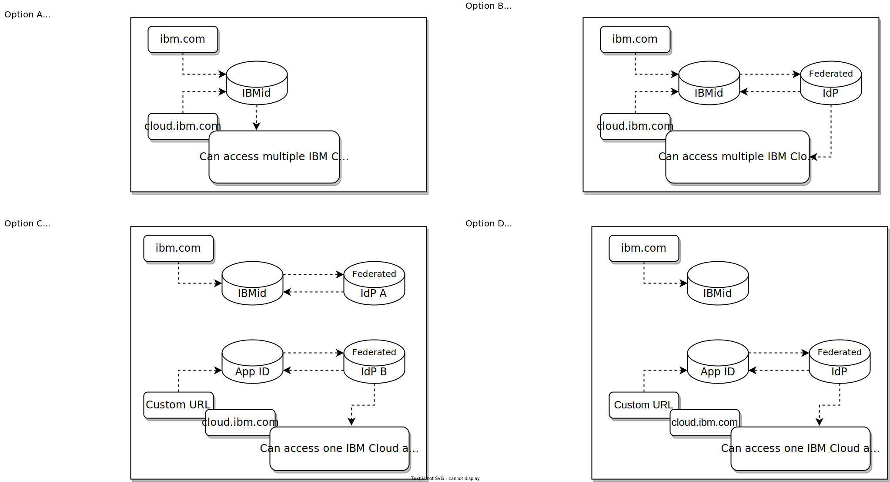
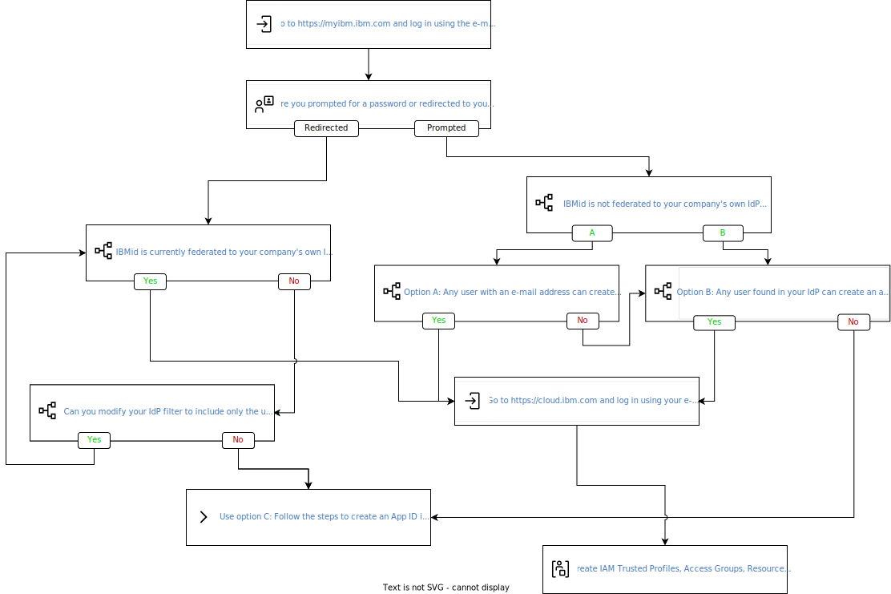
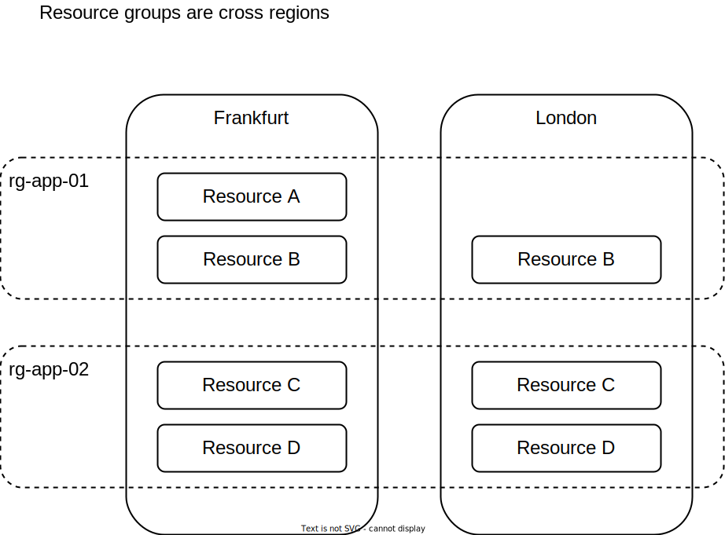

---
copyright:
  years: 2022

lastupdated: "2022-10-19"

keywords: onboard to cloud, get started on IBM Cloud, account set up

subcollection: overview

---

{{site.data.keyword.attribute-definition-list}}
{:external: target="_blank" .external}

# Getting started on {{site.data.keyword.cloud_notm}} checklist
{: #get-started-checklist}

This checklist is for {{site.data.keyword.cloud_notm}} customers that are creating and configuring their {{site.data.keyword.cloud_notm}} account. The intent is to help quickly navigate the available documentation allowing you to create and configure your account, secure your cloud resources, track costs and billing, set up on-premises to cloud connectivity, and meet your business needs.  
{: shortdesc}

## Exploring the platform
{: #exploring}

If you have had little to no exposure to {{site.data.keyword.cloud_notm}} or need a refresher on the {{site.data.keyword.cloud_notm}} platform use the tasks in the following checklist.

|  | Task Description |
|------|-------------|
|  |  **What is the {{site.data.keyword.cloud_notm}} platform?** \n Get familiar with the {{site.data.keyword.cloud_notm}} platform by reviewing the documentation section titled [Learn about the {{site.data.keyword.cloud_notm}} platform](/docs/overview?topic=overview-whatis-platform).  |
|   | **Understand your options for provisioning in {{site.data.keyword.cloud_notm}}** \n For creating and managing resource in {{site.data.keyword.cloud_notm}} you can use: \n  * [{{site.data.keyword.cloud_notm}} console](https://{DomainName}){: external}. \n * [{{site.data.keyword.cloud_notm}} Command Line Interface (CLI)](https://github.com/IBM-Cloud/ibm-cloud-cli-release){: external}. \n * [{{site.data.keyword.cloud_notm}} Shell](/shell){: external}. \n * [{{site.data.keyword.cloud_notm}} Schematics](/schematics){: external}. \n * Each service offers its sets of APIs and SDKs available in their own documentation.   |
|  | **Navigating the console** \n The {{site.data.keyword.cloud_notm}} console is the user interface that you use to create and manage all your {{site.data.keyword.cloud_notm}} resources. You can create a free account, log in, access documentation, access the catalog, view pricing information, get support, or check the status of {{site.data.keyword.cloud_notm}} components.  [Learn more on using the {{site.data.keyword.cloud_notm}} console](/docs/overview?topic=overview-ui).   |
|   | **Getting started with the {{site.data.keyword.cloud_notm}} CLI** \n The {{site.data.keyword.cloud_notm}} Command Line Interface (CLI) is a set of plug-ins and tools that you can use to create and manage your resources in {{site.data.keyword.cloud_notm}}. [Learn more](/docs/cli?topic=cli-getting-started).  |
|  | **Getting started with {{site.data.keyword.cloud_notm}} Shell** \n The {{site.data.keyword.cloud_notm}} Shell, gives you a personal cloud-based shell workspace with the full {{site.data.keyword.cloud_notm}} CLI and tons of additional command-line tools - no installation needed. [Learn more](/docs/cloud-shell?topic=cloud-shell-shell-ui).  |
|   | **Getting started with {{site.data.keyword.cloud_notm}} Schematics** \n {{site.data.keyword.cloud_notm}} Schematics provides powerful set of Infrastructure as Code (IaC) tools -Terraform, Ansible, Helm - as a service to program your cloud infrastructure. Schematics can run your end-to-end automation to build one or more stack of cloud resources, manage their lifecycle, manage changes in their configurations, deploy your app workloads, and perform day-2 operations. [Learn more](/docs/schematics?topic=schematics-getting-started).  |
|   | **Getting started with cloud APIs** \n {{site.data.keyword.cloud_notm}} services provide APIs which comply with OAuth 2.0 authentication standards and accept Bearer tokens provided by {{site.data.keyword.cloud_notm}}'s IAM service. [Explore the API docs](/docs?tab=api-docs) for the service(s) you plan on using. |
{: caption="Table 1. Getting started tasks for exploring the platform" caption-side="top"} 

For additional resources on related topics that may be of interest, please see below:
* Security and compliance: {{site.data.keyword.cloud_notm}} provides a secure cloud platform that you can trust. {{site.data.keyword.cloud_notm}} compliance results from a platform and services that are built on best-in-industry security standards, including GDPR, HIPAA, ISO 9001, ISO 27001, ISO 27017, ISO 27018, PCI, SOC2, and others.  [Learn more](/docs/overview?topic=overview-compliance).
* National language support: {{site.data.keyword.cloud_notm}} supports nine national languages other than English. The {{site.data.keyword.cloud_notm}} console and the Support Center display content according to your browser's language setting. The {{site.data.keyword.cloud_notm}} docs are machine translated. You can switch between languages by using the Language switcher at the top of each page. [Learn more](/docs/overview?topic=overview-language-support).
* What's new in {{site.data.keyword.cloud_notm}}: Stay up-to-date with the new features that are available on the {{site.data.keyword.cloud_notm}} platform so that you get the most out of your {{site.data.keyword.cloud_notm}} experience. [Learn more](/docs/overview?topic=overview-whatsnew).
* Viewing cloud status: The {{site.data.keyword.cloud_notm}} Status page is the central place to find details about all incidents, planned maintenance, announcements, release notes, and security bulletins about key events that affect the {{site.data.keyword.cloud_notm}} platform and services. [Learn more](/docs/get-support?topic=get-support-viewing-cloud-status).

## Account and Enterprise in {{site.data.keyword.cloud_notm}} 
{: #account-enterprise-settings}

This checklist is for administrators responsible for creating and setting up an account structure in {{site.data.keyword.cloud_notm}} and enable users within their company to create and/or manage cloud resources.

{{site.data.keyword.cloud_notm}} offers you the ability to create a stand-alone account and/or an Enterprise.

A stand-alone account allows account owner(s), for example department or business unit administrators, to add users to the account, manage roles and permissions, manage billing and payments, and much more. It includes the following interacting components:
   * **Users**: Users are invited to an account and given access to the resources in the account.
   * **Access Groups**: Access groups are used to organize a set of users and service IDs into a single entity to enable the assignment of policies to the group instead of assigning the same access multiple times per individual user or service ID.
   * **Resource Groups**: Resource groups are used to organize an account's cloud resources into groupings so that users can be given access to more than one resource at a time. 
   * **Policy**: A policy consists of a subject, target, and a role. A policy grants a subject one or multiple roles to a set of resources so that specific actions can be taken. The role defines the level of access that is granted. 
   * **Trusted Profiles**: Trusted profiles are used to automatically grant federated users access to your account with conditions based on SAML attributes from your corporate directory. Trusted profiles can also be used to set up fine-grained authorization for applications that are running in compute resources. This way, you aren't required to create service IDs or API keys for the compute resources.

An enterprise manages the billing for the entire company, with usage costs from multiple accounts being rolled up and paid from the enterprise account. Accounts that are created as part of an enterprise are just like stand-alone {{site.data.keyword.cloud_notm}} accounts, the main difference is that these accounts don't manage their own billing or payments.

Use the following checklist to track all the tasks to create and configure your {{site.data.keyword.cloud_notm}} account and/or enterprise. 

| Task | Description |
|------|-------------|
|  Determine if you need an Enterprise. | An **Enterprise** manages billing for your entire company, with usage costs from the accounts that are added to the enterprise rolled up and paid from the enterprise account. Once you create an enterprise to manage your billing, you can move existing stand-alone accounts to it or create new accounts as needed. Consider the following when determining if you need an enterprise or a stand-alone account: \n * In an enterprise, subscription discounts and cloud credits are available to all accounts that are in the enterprise. \n  * Stand-alone account control their own billing. If your company is globally distributed, you may have a mix of multiple enterprises and/or stand-alone accounts to support regional billing requirements. \n Learn more by visiting the [What is an enterprise?](/docs/account?topic=account-what-is-enterprise&interface=ui) topic to determine if you need an enterprise. \n Note: A subscription or committed use billing model is required to create an enterprise.  |
|  Create and configure your {{site.data.keyword.cloud_notm}} account. | Even if you plan on using an enterprise, you need to create an {{site.data.keyword.cloud_notm}} account. You can create your {{site.data.keyword.cloud_notm}} account by going to [https://{DomainName}/registration](https://{DomainName}/registration){: external} and provide your e-mail address and some additional information. When you log in to the account for the first time, you are required to provide a credit card or subscription code to complete your account setup. Later on, you will be able to add users by inviting them to the account or by federating to your own corporate directory. Users that are added to your account are not required to created their own {{site.data.keyword.cloud_notm}} account.  |
|  Determine if you will use an IBMid or a federated identity to add users to your {{site.data.keyword.cloud_notm}} account. | When you create an account in {{site.data.keyword.cloud_notm}}, by default for user identity you use an IBMid. IBMid is the ID as a Service (IDaaS) from IBM used to access IBM web based services, including {{site.data.keyword.cloud_notm}} resources. The IBMid is based on your company's email address and a password managed by IBMid. IBMid allows you to federate to your own corporate directory or a 3rd party Identity Provider (IdP) service that you may already be using such as Okta. Federating to your own directory simplifies the process of adding users to your account as they will not required to create an IBMid and manage a separate password. However, there are cases that it may not be feasible for you to use IBMid federated to your corporate directory. An alternative is to create an [{{site.data.keyword.appid_short_notm}}](https://www.ibm.com/cloud/app-id) instance in your account and connect it to your desired directory. Federating with **{{site.data.keyword.appid_short_notm}}** is limited to one {{site.data.keyword.cloud_notm}} account.  \n Review the following oversimplified diagram to understand your choices when accessing IBM web services and {{site.data.keyword.cloud_notm}} resources using IBMid or an {{site.data.keyword.appid_short_notm}} instance. \n {: caption="Figure 1. IBMid-AppID-FederatedIdP" caption-side="bottom"} \n It is possible that your company's domain is already federated with IBMid, review the following decision flow diagram to understand if it is and help you in deciding your best path. \n {: caption="Figure 1. IBMid-AppID-FederatedIdP-DecisionFlow" caption-side="bottom"} \n For a deeper dive, use the following documentation topics: \n * [IBM Cloud SAML Federation Guide](https://www.ibm.com/cloud/blog/ibm-cloud-saml-federation-guide){: external} \n * [IBM Cloud login sequences](/docs/account?topic=account-account-getting-started&mhsrc=ibmsearch_a&mhq=ibm+cloud+account#signup-federated). \n Use the following documentation topics when you are ready to federate: \n [IBMid Enterprise Federation Adoption Guide](https://ibm.box.com/v/IBMid-Federation-Guide) \n [Enabling authentication from an external identity provider using {{site.data.keyword.appid_short_notm}}](/docs/account?topic=account-idp-integration). \n The decision to federate to your company's own directory needs to involve the person in your company that can make company wide decisions when it comes to connecting to external parties for identity services, you need to ensure this person is included the process. Federating with **IBMid** can have an impact on the services that your company already utilizes with IBM. |
|  Activate a subscription code. | With an {{site.data.keyword.cloud_notm}} subscription, you get discounted usage for platform services and support by committing to a minimum spending commitment for a certain period of time. After you buy a subscription for platform or support credit, you must add the credit to your account by applying a subscription code to your stand-alone account or enterprise account. Applying the code ensures that the credit is added to your account and you don't have unexpected overage charges. Make sure to add any purchased subscriptions to your account prior to creating resources. [Learn more](/docs/billing-usage?topic=billing-usage-subscription_code).  |
|  Create and configure an enterprise | When you create an enterprise, the account that you used to initiate the process is automatically added to the enterprise and a new enterprise account is created to manage the billing for the enterprise. Follow the steps in the [Setting up an enterprise](/docs/account?topic=account-enterprise-tutorial) topic to create an enterprise. Keep in mind when using an enterprise, users within each account in the enterprise can create, use, and collaborate on resources just as they can in a stand-alone account.  |
|  Create Resource Groups | Use resource groups to organize an account's resources for access control and billing purposes. For example, creating a resource group per project allows costs to be tracked at the project level even when your resources are distributed across regions. \n   \n Learn more from the [Best practices guide](/docs/account?topic=account-account_setup#resource-group-strategy) and when you are ready, [create your resource group(s)](/docs/account?topic=account-rgs).  |
|  Assign enterprise access to users. | You may require to have administrators manage the enterprise performing functions such as creating account groups, creating and managing accounts. Review the access level required and add users as appropriate. [Learn more](/docs/account?topic=account-assign-access-enterprise&interface=ui).  |
{: caption="Table 2. Getting started tasks for Account  and Enterprise Account" caption-side="top"} 

For additional resources on related topics that may be of interest, please see below:
* What's in an account?: Your {{site.data.keyword.cloud_notm}} account includes many interacting components and systems for resource, user, and access management. Concepts like how certain components are connected or how access works help you in understanding how to set up your account. [Learn more](/docs/account?topic=account-overview).  |
* Account types: When you register with {{site.data.keyword.cloud_notm}}, you are set up with a Pay-As-You-Go account. Another account type, called a Subscription account, is also available. [Learn more](/docs/account?topic=account-accounts).
* Pay as you go committed: The {site.data.keyword.cloud_notm}} Pay as you go with Committed Use billing model is similar to the billing model for Subscription accounts but with a few added benefits. You are billed monthly based on your usage and you continue to receive a discount even after you reach your committed amount. [Pay as you go with Committed Use billing model](/docs/billing-usage?topic=billing-usage-committed-use).
* FAQs: Visit the FAQs section in the console on [managing your account, resources, and access](/docs?tab=faqs&tags=account).
* Private Catalog: You can customize the {{site.data.keyword.cloud_notm}} public catalog or create private catalogs in your account to make specific products visible to users in your account. By doing so, you can filter to only the products you want users in your account to provision. This may also help in reducing the number products you create usage alerts on. See the [Customizing the {{site.data.keyword.cloud_notm}} catalog and private catalogs for users in your account](/docs/account?topic=account-restrict-by-user&interface=ui) topic for more details. There are however a few limitations to be aware, review the [Catalog management settings don't apply to some IBM products](/docs/account?topic=account-known-issues&interface=ui#settings-noapply).
* [Enterprise Management API/SDK](/apidocs/enterprise-apis/enterprise).

## Securing your account and resources
{: #securing}

| Task | Description |
|------|-------------|
|  Identity and Access Management (IAM) Overview | Learn about what {{site.data.keyword.cloud_notm}} Identity and Access Management (IAM) is, how IAM works, what features are available, and how to access the console, CLI, and APIs to work with IAM in your account. [Learn more](/docs/account?topic=account-iamoverview).  |
|  Understanding {{site.data.keyword.at_full_notm}} | Use the {{site.data.keyword.at_full_notm}} service to capture a record and monitor all activities in your account. You can use this service to investigate abnormal activity and critical actions, and comply with regulatory audit requirements. Depending on your compliance and organizational requirements, you will need to select between two IBM Cloud Activity Tracker offerings. [Learn more](/docs/activity-tracker?topic=activity-tracker-about). \n In {{site.data.keyword.at_full_notm}}, events are collected automatically for most Activity Tracker Event Routing-enabled services. However, some services might require an upgrade of the service plan, a configuration setting, or both, for you to be able to collect and analyze their events. [Learn more](https://{DomainName}/docs/activity-tracker?topic=activity-tracker-events_collect). |
|  Provision an {{site.data.keyword.at_full_notm}} instance. | You can use the {{site.data.keyword.at_full_notm}} service to track how users and applications interact with an {{site.data.keyword.cloud_notm}} resources that you have provisioned. Follow the instructions in [Provisioning an {{site.data.keyword.at_short}} instance](/docs/activity-tracker?topic=activity-tracker-provision) to create an instance in your desired cloud region.  \n For environments seeking to maintain **Financial Services Validated** status on IBM Cloud should instead follow the instructions in to [Use Activity Tracker Event Routing](/docs/activity-tracker?topic=activity-tracker-getting-started-routing-2). |
|  Provision an {{site.data.keyword.at_full_notm}} instance for IAM events. | You can use the {{site.data.keyword.at_full_notm}} service to track how users and applications interact with an {{site.data.keyword.cloud_notm}} account, the {{site.data.keyword.cloud_notm}} catalog, private catalogs, and with {{site.data.keyword.cloud_notm}} Identity and Access Management (IAM). These services, send all of their events to the Frankfurt (eu-de) region. You **must** create an instance of the {{site.data.keyword.at_short}} service in the Frankfurt (eu-de) region to start tracking IAM events.  [Learn more](/docs/account?topic=account-acct_iam_tracking) on the events that are sent to that region. Follow the instructions in [Provisioning an {{site.data.keyword.at_short}} instance](/docs/activity-tracker?topic=activity-tracker-provision) to create an instance in Frankfurt (eu-de).  |
|  Get started with {{site.data.keyword.at_full_notm}} | Complete this [tutorial](/docs/activity-tracker?topic=activity-tracker-getting-started-search) to learn how to manage the access to the {{site.data.keyword.at_short}} service, what common data is available in each event and how it can help you monitor your IBM Cloud environment. Follow up by creating your own [custom views](/docs/activity-tracker?topic=activity-tracker-views) to filter the data that is important to you and [configuring alerts](/docs/activity-tracker?topic=activity-tracker-create_alert_ui). |
|  Configure streaming of {{site.data.keyword.at_full_notm}} (optional). | You can stream data from an {{site.data.keyword.at_full_notm}} another {{site.data.keyword.at_full_notm}} across region or to other corporate tools such as Security Information and Event Management (SIEM) tools. [Learn more](/docs/activity-tracker?topic=activity-tracker-streaming).  |
|  Implement context-based restrictions. | Context-based restrictions give account owners and administrators the ability to define and enforce access restrictions for {{site.data.keyword.cloud_notm}} resources based on the network location of access requests. These restrictions work with traditional IAM policies, which are based on identity, to provide an extra layer of protection. Since both IAM access and context-based restrictions enforce access, context-based restrictions offer protection even in the face of compromised or mismanaged credentials. [Learn more](/docs/account?topic=account-context-restrictions-whatis) and follow the guide to [secure your resources using context-based restrictions](/docs/account?topic=account-context-restrictions-tutorial). |
|  Implement {{site.data.keyword.secrets-manager_full_notm}} | With {{site.data.keyword.secrets-manager_short}}, you can create, lease, and centrally manage secrets that are used in {{site.data.keyword.cloud_notm}} services or your custom-built applications. For example, you can integrate {{site.data.keyword.secrets-manager_short}} with your {{site.data.keyword.containerlong_notm}} cluster to centrally manage Ingress subdomain certificates and other secrets. Review this [comparison documentation topic](/docs/secrets-manager?topic=secrets-manager-manage-secrets-ibm-cloud) to understand the differences and uses cases for {{site.data.keyword.secrets-manager_short}}, {{site.data.keyword.keymanagementserviceshort}} and {{site.data.keyword.hscrypto}}. Use the following guides to create and configure your {{site.data.keyword.secrets-manager_short}} instance: \n * [Creating a {{site.data.keyword.secrets-manager_short}} instance](/docs/secrets-manager?topic=secrets-manager-create-instance&interface=ui). \  * [Assigning access to {{site.data.keyword.secrets-manager_short}}](/docs/secrets-manager?topic=secrets-manager-assign-access&interface=ui). |
|  Implement {{site.data.keyword.keymanagementservicefull_notm}} | {{site.data.keyword.keymanagementserviceshort}} is a full-service encryption solution that allows data to be secured and stored in {{site.data.keyword.cloud_notm}} using the latest envelope encryption techniques. Encryption keys can be provisioned or imported for use with applications for many {{site.data.keyword.cloud_notm}} services and then managed from a central location. Review this [comparison documentation topic](/docs/secrets-manager?topic=secrets-manager-manage-secrets-ibm-cloud) to understand the differences and uses cases for {{site.data.keyword.secrets-manager_short}}, {{site.data.keyword.keymanagementserviceshort}} and {{site.data.keyword.hscrypto}}. Use the following guides to create and configure your {{site.data.keyword.keymanagementserviceshort}} instance: \n * [Creating a {{site.data.keyword.keymanagementserviceshort}} instance](/docs/key-protect?topic=key-protect-provision). \n * [Managing a key create and import access policy in {{site.data.keyword.keymanagementserviceshort}}](/docs/key-protect?topic=key-protect-manage-keyCreateImportAccess&interface=ui). \n * [Initializing a {{site.data.keyword.keymanagementserviceshort}} instances](/docs/hs-crypto?topic=hs-crypto-initialize-hsm-prerequisite&interface=ui). \n * [Managing user access](/docs/hs-crypto?topic=hs-crypto-manage-access&interface=ui). |
|  Implement {{site.data.keyword.cloud_notm}} {{site.data.keyword.hscrypto}} | {{site.data.keyword.hscrypto}} is a dedicated key management service and hardware security module (HSM) in {{site.data.keyword.cloud_notm}}. With this service, you can take the ownership of the cloud HSM built on FIPS 140-2 Level 4-certified hardware to fully manage your encryption keys and to perform cryptographic operations. {{site.data.keyword.hscrypto}} integrates with {{site.data.keyword.keymanagementserviceshort}} application programming interface (API) to generate and manage keys. Review this [comparison documentation topic](/docs/secrets-manager?topic=secrets-manager-manage-secrets-ibm-cloud) to understand the differences and uses cases for {{site.data.keyword.secrets-manager_short}}, {{site.data.keyword.keymanagementserviceshort}} and {{site.data.keyword.hscrypto}}. Use the following guides to create and configure your {{site.data.keyword.keymanagementserviceshort}} instance: \n * [Provisioning service instances](/docs/hs-crypto?topic=hs-crypto-provision&interface=ui)  |
|  Setup Multi-factor Authentication | Multifactor authentication (MFA) adds an extra layer of security to your account by requiring all users to authenticate by using an additional authentication factor beyond an ID and password. This is also commonly known as two-factor authentication (2FA). Review the [types of multifactor authentication](/docs/account?topic=account-types&interface=ui) that can be enabled for your account. Follow the steps in [enabling MFA for your account](/docs/account?topic=account-enablemfa&interface=ui) to configure the setting that is most appropriate for your company.|
{: caption="Table 8. Getting started tasks for securing your account and resources" caption-side="top"} 

For additional resources on related topics that may be of interest, please see the table below:
* Configuring the IAM credentials engine in {{site.data.keyword.keymanagementserviceshort}}

## Billing and Usage
{: #billing-usage}

| Task | Description |
|------|-------------|
|  How-to manage billing and usage | Learn about the {{site.data.keyword.cloud_notm}} billing options and tools that you can use to track your usage and manage invoicing and payments. [Learn more](/docs/billing-usage?topic=billing-usage-overview&interface=ui).   |
|  Understand suspend billing on {{site.data.keyword.vsi_is_short}} | Suspended billing is an option that is available for virtual server instances running on VPC, it is not available for bare metal or dedicated hosts on VPC. With suspended billing there are some resources, for example network and storage, that continue billing, [learn more](/docs/vpc?topic=vpc-suspend-billing).   |
|  Configure spending alerts for your account. | You can enable spending notifications for Pay-As-You-Go or Subscription account, these alerts are configurable for the entire account or for individual services. [learn more](/docs/billing-usage?topic=billing-usage-spending).  |
|  Manage subscriptions and usage | Setting up a subscription was discussed in the "Account and Enterprise Account" section of these checklists. You can add more subscriptions, and monitor subscription usage on the Subscriptions page in the {{site.data.keyword.cloud_notm}} console. [Learn more](/docs/billing-usage?topic=billing-usage-subscriptions&interface=ui).  |
{: caption="Table 5. Getting started tasks for billing and usage" caption-side="top"} 

For additional resources on related topics that may be of interest, please see below:
* Viewing your invoices: To manage and view your invoices, visit the [Invoices](/billing/invoices) page from the billing and usage dashboard in the {{site.data.keyword.cloud_notm}} console. [Learn more](/docs/billing-usage?topic=billing-usage-managing-invoices&interface=ui).
* [Usage Reports API/SDK](/apidocs/metering-reporting)
* [Enterprise Billing Units API/SDK](/apidocs/enterprise-apis/billing-unit).
* [Enterprise Usage Reports API/SDK](/apidocs/enterprise-apis/resource-usage-reports).

## Connecting your network to {{site.data.keyword.cloud_notm}}
{: #network}

Use the following checklist to review the options available and to connect your existing on-premises environment(s) to {{site.data.keyword.cloud_notm}}.
| Task | Description |
|------|-------------|
|  Enable Virtual Routing and Forwarding (VRF) | Dispersed cloud resources are resources in more than one location or in more than one subnet or VLAN. These types of resources require a routing function to communicate among themselves, even within a private network context. New accounts created in {{site.data.keyword.cloud_notm}} will have a "multiple isolation" tenancy communication option, which is often called a customer VRF, enabled. Verify that it is enabled in your account - or enable it after confirming potential service disruptions if you have existing resources in your arccount - by following the steps outlined in this [documentation topic](/docs/account?topic=account-vrf-service-endpoint&interface=ui#vrf).  |
|  Enable Service Endpoints | It is also recommended to enable your account for using service endpoints. When {{site.data.keyword.cloud_notm}} service endpoints are enabled in your account, you can choose to expose a private network endpoint when you create a resource. You can then connect directly to this endpoint over the {{site.data.keyword.cloud_notm}} private network rather than the public network. Because resources that use private network endpoints don't have an internet-routable IP address, connections to these resources are more secure. Follow the steps outlined in this [documentation topic](/docs/account?topic=account-vrf-service-endpoint&interface=ui#use-service-endpoint) |
|  Determine the Interconnectivity solution for you | Use this decision tree to help you decide which solution works best for you. If you want help with getting started, you can open an IBM Support case through the {{site.data.keyword.cloud_notm}} console, or contact your {{site.data.keyword.cloud_notm}} sales representative. [Learn more](/docs/direct-link?topic=direct-link-get-started-with-ibm-cloud-direct-link#get-started-solution-to-order).    |
|  About {{site.data.keyword.cloud_notm}} Direct Link (2.0) | {{site.data.keyword.cloud_notm}} Direct Link offerings provide connectivity from an external source into a customer's {{site.data.keyword.cloud_notm}} private network. Direct Link can be viewed as an alternative to a traditional site-to-site VPN solution, which is designed for customers that need more consistent, higher-throughput connectivity between a remote network and their {{site.data.keyword.cloud_notm}} environments. 
When selecting to use Direct Link, it is recommended that most customers choose Direct Link 2.0.  [Learn more](/docs/dl?topic=dl-dl-about).   |
|  Ordering {{site.data.keyword.cloud_notm}} Direct Link Dedicated | Allows customers to terminate a single-tenant, fiber-based cross-connect into the {{site.data.keyword.cloud_notm}} network. This offering can be used by customers with colocation premises that are next to {{site.data.keyword.cloud_notm}} PoPs and data centers, as well as network service providers that deliver circuits to customer on-premises or other data centers. [Learn more](/docs/dl?topic=dl-how-to-order-ibm-cloud-dl-dedicated).   |
|  Ordering {{site.data.keyword.cloud_notm}} Direct Link Connect | Offers private access to your {{site.data.keyword.cloud_notm}} infrastructure and to any other clouds linked to your service provider through your local {{site.data.keyword.cloud_notm}} data center. This option is perfect for creating multi-cloud connectivity in a single environment. IBM connects customers to the {{site.data.keyword.cloud_notm}} private network, using a shared bandwidth topology. As with all Direct Link products, you can add global routing that enables private network traffic to all {{site.data.keyword.cloud_notm}} locations. [Learn more](/docs/dl?topic=dl-how-to-order-ibm-cloud-dl-connect).   |
|  Identify potential conflicts  with the IBM Network Reserved IPs (Applicable to Direct Link 1.0 only) | When selecting to use Direct Link, it is recommended that most customers choose Direct Link 2.0 since it provides more options and flexibility.  If you have a real need for Direct Link 1.0, make sure to review the list of IBM Network Reserved IPs that may conflict with your on-premises environment. [Learn more](/docs/cloud-infrastructure?topic=cloud-infrastructure-ibm-cloud-ip-ranges).    |
|  Coordinate with {{site.data.keyword.cloud_notm}} Design Engineering when you have special requirements | If you are planning on using  any of the following:  GRE or IPSec tunnels, BCR pairing,  multi VLAN tenants, custom inbound or outbound ACLs, ASN pre-pend, and static routes, open a Support ticket and request assistance from the {{site.data.keyword.cloud_notm}} Design Engineering to confirm your requirements are inline with your Direct Link selections.  |
{: caption="Table 6. Getting started tasks for network connectivity" caption-side="top"} 

For additional resources on related topics that may be of interest, please see below:
* [Pricing for {{site.data.keyword.cloud_notm}} Direct Link](/docs/dl?topic=dl-pricing-for-ibm-cloud-dl)

## Enable observability (logging and monitoring)
{: #observability}

| Task | Description |
|------|-------------|
|  Configure Logging | You can use {{site.data.keyword.loganalysislong_notm}} to manage operating system logs, application logs, and platform logs in the {{site.data.keyword.cloud_notm}}. {{site.data.keyword.loganalysislong_notm}} offers administrators, DevOps teams, and developers advanced features to filter, search, and tail log data, define alerts, and design custom views to monitor application and system logs. [Learn more](/docs/log-analysis?topic=log-analysis-getting-started). |
|  Configure access groups | You can configure, control, and manage data that is available to users in your account by configuring groups in the logging instance. Groups provide additional security by only allowing users to see a subset of auditing events, as opposed to all auditing events that are generated in the account. For example, you could grant a group of users access to only see auditing events that are related to development services in the account. Learn more by reviewing the following documentation topics: [Using groups to control data access](/docs/log-analysis?topic=log-analysis-group_data_access) && [RBAC, groups and IAM integration](/docs/log-analysis?topic=log-analysis-iam_grant_group)  |
|  Configure logging agent | The logging agent collects and forwards logs to your {{site.data.keyword.loganalysislong_notm}} instance. After you provision an {{site.data.keyword.loganalysislong_notm}} instance, you must configure a logging agent for each log source that you want to monitor. [Learn more](/docs/log-analysis?topic=log-analysis-log_analysis_agent)  |
|  Configure {{site.data.keyword.cloud_notm}} platform logs  | Platform logs are logs that are exposed by enabled services and the platform in {{site.data.keyword.cloud_notm}}. You must configure a logging instance in a region to monitor these logs. [Learn more](/docs/log-analysis?topic=log-analysis-config_svc_logs). |
|  Configure streaming of {{site.data.keyword.loganalysislong_notm}} | You can stream data from an {{site.data.keyword.loganalysislong_notm}} another {{site.data.keyword.loganalysislong_notm}} across region or to other corporate tools such as Security Information and Event Management (SIEM) tools. [Learn more](/docs/log-analysis?topic=log-analysis-streaming).  |
|  Configure Monitoring | {{site.data.keyword.monitoringlong_notm}} is a cloud-native, and container-intelligence management system that you can include as part of your {{site.data.keyword.cloud_notm}} architecture. Use it to gain operational visibility into the performance and health of your applications, services, and platforms. It offers administrators, DevOps teams and developers full stack telemetry with advanced features to monitor and troubleshoot, define alerts, and design custom dashboards. [Learn more](/docs/monitoring?topic=monitoring-getting-started).  |
|  Configure monitoring agent | Depending on the compute resource type you are monitoring follow these guides to configure the monitoring agent: \n [Working with the Kubernetes agent](/docs/monitoring?topic=monitoring-agent_Kube) \n [Working with the {{site.data.keyword.openshiftshort}} agent](/docs/monitoring?topic=monitoring-agent_openshift) \n [Working with the Linux agent](/docs/monitoring?topic=monitoring-agent_linux) \n [Working with the Docker agent](/docs/monitoring?topic=monitoring-agent_docker) |
|  Configure streaming of {{site.data.keyword.monitoringfull_notm}} | You can use {{site.data.keyword.monitoringfull_notm}} to push a set of selected metrics to a Kafka service such as IBM {{site.data.keyword.messagehub}} on {{site.data.keyword.cloud_notm}}. [Learn more](/docs/monitoring?topic=monitoring-data_streaming).  |
{: caption="Table 7. Getting started tasks for observability" caption-side="top"} 

For additional resources on related topics that may be of interest, please see below:

## Users and access groups
{: #users-groups}

| Task | Description |
|------|-------------|
|  Create Access Groups | A logical way to assign access to resource groups is by creating one access group per required level of access. Then each access group is mapped to the needed resource groups. Examples of access groups you should consider would be Admin and Developer. [Learn more](/docs/account?topic=account-account_setup#accessgroup_strategy).  |
|  Managing resource groups | A resource group is a way for you to organize your account resources in customizable groupings so that you can quickly assign users access to multiple resources at a time. It is generally recommended to create a resource group per project. [Learn more](/docs/account?topic=account-rgs&interface=ui).  |
|  Inviting users to an account | Use IAM to invite users, cancel invitations, or resend a pending invitation. You can invite a single user or multiple users. [Learn more](/docs/account?topic=account-iamuserinv&interface=ui)  |
{: caption="Table 3. Getting started tasks for Users and groups" caption-side="top"} 

For additional resources on related topics that may be of interest, please see below:
* [User Management API/SDK](/apidocs/user-management)

## Getting support
{: #support}

| Task | Description |
|------|-------------|
|  Support Plans | You can choose a Basic, Advanced, or Premium support plan to customize your {{site.data.keyword.cloud_notm}} support experience for your business needs. The level of support that you select determines the severity that you can assign to support cases and your level of access to the tools available in the Support Center. [Learn more](/docs/get-support?topic=get-support-support-plans).  |
|  Creating support cases | If you experience problems with {{site.data.keyword.cloud_notm}}, you can use the [Support Center](/unifiedsupport/supportcenter) to create a support case. You can also create support cases for issues that are associated with access (IAM), billing & usage, account, and invoice or sales inquiries. [Learn more](/docs/get-support?topic=get-support-open-case&interface=ui).  |
|  Technical training and certification resources | Grow your skills with learning paths.  Choose a topic and get started with step-by-step technical training. [Learn more](https://www.ibm.com/training/cloud){: external}.  |
|  Submitting Feedback | We want to hear from you! You can submit feedback for the {{site.data.keyword.cloud_notm}} team on the documentation or the console. You can choose from a few different methods to provide feedback. [Learn more](/docs/overview?topic=overview-feedback).  |
{: caption="Table 9. Getting started tasks for getting support and other resources " caption-side="top"} 

For additional resources on related topics that may be of interest, please see below:
* Developer resources: Learn in-demand skills, build solutions with real sample code, and connect with a global community of developers. [Learn more](https://developer.ibm.com/).
* Stack Overflow: Ask questions or view responses on [Stack Overflow](https://stackoverflow.com/questions/tagged/ibm-cloud){: external} using the [`ibm-cloud` tag](https://stackoverflow.com/questions/tagged/ibm-cloud?tab=Newest) or expand to additional related [tags](https://stackoverflow.com/questions/tagged/ibm-cloud+or+ibm-cloud-code-engine+or+ibm-appid?tab=Newest){: external}.
* FAQs: Visit the FAQs section in the console on [getting support](/docs?tab=faqs&tags=get-support).