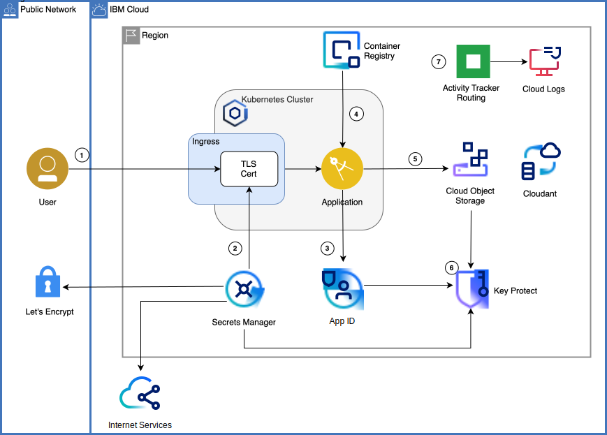

{:step: data-tutorial-type='step'}
{:shortdesc: .shortdesc}
{:new_window: target="_blank"}
{:codeblock: .codeblock}
{:screen: .screen}
{:tip: .tip}
{:pre: .pre}

# Apply end to end security to a cloud application
{: #cloud-e2e-security}
{: toc-content-type="tutorial"}
{: toc-services="containers, cloud-object-storage, activity-tracker, Registry, secrets-manager, appid, Cloudant, key-protect, log-analysis"}
{: toc-completion-time="2h"}

<!--##istutorial#-->
This tutorial may incur costs. Use the [Cost Estimator](https://{DomainName}/estimator/review) to generate a cost estimate based on your projected usage.
{: tip}

<!--#/istutorial#-->

This tutorial walks you through key security services available in the {{site.data.keyword.cloud}} catalog and how to use them together. An application that provides file sharing will put security concepts into practice.
{: shortdesc}

No application architecture is complete without a clear understanding of potential security risks and how to protect against such threats. Application data is a critical resource which can not be lost, compromised or stolen. Additionally, data should be protected at rest and in transit through encryption techniques. Encrypting data at rest protects information from disclosure even when it is lost or stolen. Encrypting data in transit (e.g. over the Internet) through methods such as HTTPS, SSL, and TLS prevents eavesdropping and so called man-in-the-middle attacks.

Authenticating and authorizing users' access to specific resources is another common requirement for many applications. Different authentication schemes may need to be supported: customers and suppliers using social identities, partners from cloud-hosted directories, and employees from an organization’s identity provider.

## Objectives
{: #cloud-e2e-security-objectives}

* Encrypt content in storage buckets with your own encryption keys
* Require users to authenticate before accessing an application
* Monitor and audit security-related API calls and other actions across cloud services


The tutorial features a sample application that enables groups of users to upload files to a common storage pool and to provides access to those files via shareable links. The application is written in Node.js and deployed as a container to the {{site.data.keyword.containershort_notm}}. It leverages several security-related services and features to improve the application's security posture.

<!--##istutorial#-->
This tutorial will work with a Kubernetes cluster running in Classic Infrastructure or VPC Infrastructure.
<!--#/istutorial#-->

{: class="center"}
{: style="text-align: center;"}


1. User connects to the application.
2. If using a custom domain and a TLS certificate, the certificate is managed by and deployed from the {{site.data.keyword.secrets-manager_short}}.
3. {{site.data.keyword.appid_short}} secures the application and redirects the user to the authentication page. Users can also sign up.
4. The application runs in a Kubernetes cluster from an image stored in the {{site.data.keyword.registryshort_notm}}. This image is automatically scanned for vulnerabilities.
5. Uploaded files are stored in {{site.data.keyword.cos_short}} with accompanying metadata stored in {{site.data.keyword.cloudant_short_notm}}.
6. Object storage buckets, {{site.data.keyword.appid_short}}, and {{site.data.keyword.secrets-manager_short}} services leverage a user-provided key to encrypt data.
7. Application management activities are logged by {{site.data.keyword.at_full_notm}}.

<!--##istutorial#-->
## Before you begin
{: #cloud-e2e-security-prereqs}

This tutorial requires:
* {{site.data.keyword.cloud_notm}} CLI,
   * {{site.data.keyword.containerfull_notm}} plugin (`kubernetes-service`),
   * {{site.data.keyword.registryshort_notm}} plugin (`container-registry`),
* `kubectl` to interact with Kubernetes clusters,
* `git` to clone source code repository.

You will find instructions to download and install these tools for your operating environment in the [Getting started with tutorials](/docs/solution-tutorials?topic=solution-tutorials-tutorials) guide.

To avoid the installation of these tools you can use the [{{site.data.keyword.cloud-shell_short}}](https://{DomainName}/shell) from the {{site.data.keyword.cloud_notm}} console.
{: tip}

<!--#/istutorial#-->

<!--##isworkshop#-->
<!--
## Start a new {{site.data.keyword.cloud-shell_notm}}
{: #cloud-e2e-security-2}
{: step}
1. From the {{site.data.keyword.cloud_notm}} console in your browser, select the account where you have been invited.
1. Click the button in the upper right corner to create a new [{{site.data.keyword.cloud-shell_short}}](https://{DomainName}/shell).

-->
<!--#/isworkshop#-->

## Create services
{: #cloud-e2e-security-setup}
{: step}

In the next section, you are going to create the services used by the application.

<!--##istutorial#-->
If you want to skip the manual steps to create the services, the tutorial provides an automated alternative set of [terraform templates to use with {{site.data.keyword.bpshort}}](https://github.com/IBM-Cloud/secure-file-storage#deploy-resources-using-terraform-managed-by-schematics).
{: tip}

<!--#/istutorial#-->

<!--##istutorial#-->
### Decide where to deploy the application
{: #cloud-e2e-security-4}

1. Identify the **location** and **resource group** where you will deploy the application and its resources.
<!--#/istutorial#-->

<!--##istutorial#-->
### Capture user and application activities
{: #cloud-e2e-security-activity-tracker }

The {{site.data.keyword.at_full_notm}} service records user-initiated activities that change the state of a service in {{site.data.keyword.Bluemix_notm}}. At the end of this tutorial, you will review the events that were generated by completing the tutorial's steps.

1. Access the {{site.data.keyword.cloud_notm}} catalog and create an instance of [{{site.data.keyword.at_full_notm}}](https://{DomainName}/observe/activitytracker/create). Note that there can only be one instance of {{site.data.keyword.at_short}} per region. Set the **Service name** to **secure-file-storage-activity-tracker**.
1. Ensure you have the right permissions assigned to manage the service instance by following [these instructions](https://{DomainName}/docs/activity-tracker?topic=activity-tracker-iam_manage_events#admin_account_opt1).
<!--#/istutorial#-->

<!--##istutorial#-->
### Create a cluster for the application
{: #cloud-e2e-security-6}

{{site.data.keyword.containershort_notm}} provides an environment to deploy highly available apps in containers that run in Kubernetes clusters.

Skip this section if you have an existing `Standard` cluster you want to reuse with this tutorial, throughout the remainder of this tutorial the cluster name is referenced as **secure-file-storage-cluster**, simply substitute with the name of your cluster. **Note the minimum required Kubernetes version of 1.19.**
{: tip}

A minimal cluster with one (1) zone, one (1) worker node and the smallest available size (**Flavor**) is sufficient for this tutorial. A **minimum Kubernetes version of 1.19 is required**. Make sure to select an appropriate version when creating the cluster.
- Set the cluster name to **secure-file-storage-cluster**.
- For Kubernetes on VPC infrastructure, you are required to create a VPC and subnet(s) prior to creating the Kubernetes cluster. You may follow the instructions provided under the [Creating a standard VPC cluster in the console](https://{DomainName}/docs/containers?topic=containers-clusters#clusters_vpcg2_ui).
- Make sure to attach a Public Gateway for each of the subnets that you create as it is required for App ID.
- For Kubernetes on Classic infrastructure, follow the [Creating a standard classic cluster](https://{DomainName}/docs/containers?topic=containers-clusters#clusters_standard) instructions.

While the cluster is being provisioned, you will create the other services required by the tutorial.
<!--#/istutorial#-->

### Use your own encryption keys
{: #cloud-e2e-security-7}

{{site.data.keyword.keymanagementserviceshort}} helps you provision encrypted keys for apps across {{site.data.keyword.Bluemix_notm}} services. {{site.data.keyword.keymanagementserviceshort}} and {{site.data.keyword.cos_full_notm}} [work together to protect your data at rest](https://{DomainName}/docs/key-protect/integrations?topic=key-protect-integrate-cos#integrate-cos). In this section, you will create one root key for the storage bucket.

1. Create an instance of [{{site.data.keyword.keymanagementserviceshort}}](https://{DomainName}/catalog/services/kms).
   1. Select a **location**.
   2. Set the name to **<!--##isworkshop#--><!--&lt;your-initials&gt;---><!--#/isworkshop#-->secure-file-storage-kp**.
   3. Select the **resource group** where to create the service instance and click **Create**.
2. Under **Keys**, click the **Add** button to create a new root key. It will be used to encrypt the storage bucket and {{site.data.keyword.appid_short}} data.
   1. Set the key type to **Root key**.
   2. Set the name to **secure-file-storage-root-enckey**.
   3. Then **Add key**.

<!--##istutorial#-->
Bring your own key (BYOK) by [importing an existing root key](https://{DomainName}/docs/key-protect?topic=key-protect-import-root-keys#import-root-keys).
{: tip}

<!--#/istutorial#-->

### Setup storage for user files
{: #cloud-e2e-security-8}

The file sharing application saves files to a {{site.data.keyword.cos_short}} bucket. The relationship between files and users is stored as metadata in a {{site.data.keyword.cloudant_short_notm}} database. In this section, you'll create and configure these services.

#### A bucket for the content
{: #cloud-e2e-security-9}

1. Create an instance of [{{site.data.keyword.cos_short}}](https://{DomainName}/catalog/services/cloud-object-storage).
   1. Select a **Standard** plan and Set the **name** to **<!--##isworkshop#--><!--&lt;your-initials&gt;---><!--#/isworkshop#-->secure-file-storage-cos**.
   2. Use the same **resource group** as for the previous services and click **Create**.
2. Under **Service credentials**, create a *New credential*.
   1. Set the **name** to **secure-file-storage-cos-acckey**.
   2. Set **Role** to **Writer**.
   3. Under **Advanced options**, check **Include HMAC Credential**. This is required to generate pre-signed URLs.
   4. Click **Add**.
   5. Make note of the credentials. You will need them in a later step.
3. Click **Endpoints** from the menu:
   1. Set **Resiliency** to **Regional** and set the **Location** to the target location:
   2. For Classic infrastructure: Copy the **Private** service endpoint. It will be used later in the configuration of the application.
   3. For VPC infrastructure: Copy the **Direct** service endpoint. It will be used later in the configuration of the application.

Before creating the bucket, you will grant the {{site.data.keyword.cos_short}} service instance access to the root key stored in the {{site.data.keyword.keymanagementserviceshort}} service instance.

1. Go to [Manage > Access (IAM) > Authorizations](https://{DomainName}/iam/authorizations) in the {{site.data.keyword.cloud_notm}} console.
2. Click the **Create** button.
3. In the **Source service** menu, select **Cloud Object Storage**.
4. Switch to **Resources based on selected attributes**, check **Source service instance** and select the {{site.data.keyword.cos_short}} service instance previously created.
5. In the **Target service** menu, select **{{site.data.keyword.keymanagementserviceshort}}**.
6. Switch to **Resources based on selected attributes**, check **Instance ID**, select the {{site.data.keyword.keymanagementserviceshort}} service instance created earlier.
7. Enable the **Reader** role.
8. Click the **Authorize** button.

Finally create the bucket.

1. Access the {{site.data.keyword.cos_short}} service instance from the [Resource List](https://{DomainName}/resources) Under **Storage**.
2. Click **Create bucket** and then **Custom bucket**.
   1. Set the **name** to a unique value, such as **&lt;your-initials&gt;-secure-file-upload**.
   2. Set **Resiliency** to **Regional**.
   3. Set **Location** to the same location where you created the {{site.data.keyword.keymanagementserviceshort}} service instance.
   4. Set **Storage class** to **Standard**
3. Under **Service integrations (optional) / Encryption**, enable **Key management**
   1. Select the {{site.data.keyword.keymanagementserviceshort}} service instance created earlier by clicking on **Use existing instance**
   2. Select **secure-file-storage-root-enckey** as the key and click **Associate key**.
4. Under **Service integrations (optional) / Monitoring & Activity tracking**, enable **Activity tracking** to have events recording in {{site.data.keyword.cloudaccesstrailshort}}.
   1. After clicking the checkmark the service information for the {{site.data.keyword.at_short}} instance in the region should be shown.
   2. Now, enable **Track Data events** and select **read & write** as **Data Events**.
5. Click **Create bucket**.

### A database map relationships between users and their files
{: #cloud-e2e-security-10}

The {{site.data.keyword.cloudant_short_notm}} database will contain metadata for all files uploaded from the application.

1. Create an instance of [{{site.data.keyword.cloudant_short_notm}}](https://{DomainName}/catalog/services/cloudant) service.
   1. Select **Cloudant** as the offering. 
   2. Select a **Multitenant** environment and a **region** same as the previous services.
   3. Set the **name** to **<!--##isworkshop#--><!--&lt;your-initials&gt;---><!--#/isworkshop#-->secure-file-storage-cloudant**.
   4. Use the same **resource group** as for the previous services.
   5. Set **Authentication method** to **IAM**.
   6. Click **Create**.
2. Back to the **Resource List**, locate the newly created service and click on it. *Note: You will need to wait until the status changes to Active*.
   1. Under **Service credentials**, create **New credential**.
   2. Set the **name** to **secure-file-storage-cloudant-acckey**.
   3. Set **Role** to **Manager**.
   4. Keep the default values for the the remaining fields.
   5. Click **Add**.
3. Expand the newly created credentials and make note of the values. You will need them in a later step.
4. Under **Manage**, launch the Cloudant dashboard.
5. Click **Create Database** to create a **Non-partitioned** database named **secure-file-storage-metadata**.

{{site.data.keyword.cloudant_short_notm}} instances on dedicated hardware allow private endpoints. Instances with dedicated service plans allow to define a list of allowed IP addresses. See [{{site.data.keyword.cloudant_short_notm}} Secure access control](https://{DomainName}/docs/Cloudant?topic=Cloudant-security#secure-access-control) for details.
{: tip}

### Authenticate users
{: #cloud-e2e-security-11}

With {{site.data.keyword.appid_short}}, you can secure resources and add authentication to your applications. {{site.data.keyword.appid_short}} [integrates](https://{DomainName}/docs/containers?topic=containers-comm-ingress-annotations#app-id) with {{site.data.keyword.containershort_notm}} to authenticate users accessing applications deployed in the cluster.

Before creating the {{site.data.keyword.appid_short}} service, grant service access to {{site.data.keyword.keymanagementserviceshort}} service. You must be the account owner or an administrator for the instance of {{site.data.keyword.keymanagementserviceshort}} that you're working with. You must also have at least Viewer access for the {{site.data.keyword.appid_short}} service.

1. Go to [Manage > Access IAM > Authorizations](https://{DomainName}/iam/authorizations) and click **Create**.
2. Select the {{site.data.keyword.appid_short}} service as your source service.
3. Select **{{site.data.keyword.keymanagementserviceshort}}** as your target service.
4. Switch to **Resources based on selected attributes**, check **Instance ID**, select the {{site.data.keyword.keymanagementserviceshort}} service instance created earlier.
5. Assign the **Reader** role under Service access.
6. Click **Authorize** to confirm the delegated authorization.

Now, Create an instance of the {{site.data.keyword.appid_short}} service.
1. Navigate to the [{{site.data.keyword.appid_short}}](https://{DomainName}/catalog/services/AppID) service creation page.
   1. Use the same **location** used for the previous services.
   2. Select the **Graduated tier** as plan.
   3. Set the **Service name** to **<!--##isworkshop#--><!--&lt;your-initials&gt;---><!--#/isworkshop#-->secure-file-storage-appid**.
   4. Select a **resource group** same as the previous services.
   5. Select the authorized {{site.data.keyword.keymanagementserviceshort}} service **name** and the **root key** from the respective dropdowns.
   6. Click **Create**.
2. Under **Manage Authentication**, in the **Authentication Settings** tab, add a **web redirect URL** pointing to the domain you will use for the application. The URL format is `https://secure-file-storage.<Ingress subdomain>/oauth2-<!--##isworkshop#--><!--<your-initials>---><!--#/isworkshop#-->secure-file-storage-appid/callback`. For example:
   * with the ingress subdomain: `mycluster-1234-d123456789.us-south.containers.appdomain.cloud`
   * the redirect URL is `https://secure-file-storage.mycluster-1234-d123456789.us-south.containers.appdomain.cloud/oauth2-<!--##isworkshop#--><!--<your-initials>---><!--#/isworkshop#-->secure-file-storage-appid/callback`.

   {{site.data.keyword.appid_short}} requires the web redirect URL to be **https**. You can view your Ingress subdomain in the cluster dashboard or with `ibmcloud ks cluster get --cluster <cluster-name>`.
   {: tip}

3. In the same tab under **Authentication Settings** under **Runtime Activity** enable capturing events in {{site.data.keyword.at_short}}.

You should customize the identity providers used as well as the login and user management experience in the {{site.data.keyword.appid_short}} dashboard. This tutorial uses the defaults for simplicity. For a production environment, consider to use Multi-Factor Authentication (MFA) and advanced password rules.
{: tip}

## Deploy the app
{: #cloud-e2e-security-deploy}
{: step}

All services have been configured. In this section you will deploy the tutorial application to the cluster.

### Get the code
{: #cloud-e2e-security-13}

1. Get the application's code:
   ```sh
   git clone https://github.com/IBM-Cloud/secure-file-storage
   ```
   {: codeblock}
   
2. Go to the **secure-file-storage/app** directory:
   ```sh
   cd secure-file-storage/app
   ```
   {: codeblock}

### Fill in credentials and configuration settings
{: #cloud-e2e-security-15}

1. Copy `credentials.template.env` to `credentials.env`:
   ```sh
   cp credentials.template.env credentials.env
   ```
   {: codeblock}

2. Edit `credentials.env` and fill in the blanks with these values:
   * the {{site.data.keyword.cos_short}} service regional endpoint, the bucket name, the credentials created for the {{site.data.keyword.cos_short}} service,
   * and the credentials for **<!--##isworkshop#--><!--&lt;your-initials&gt;---><!--#/isworkshop#-->secure-file-storage-cloudant**.

   When using {{site.data.keyword.cloud-shell_short}}, you can use `nano credentials.env` to edit the file.
   {: tip}

3. Set the environment variables required for `secure-file-storage.template.yaml` file to generate `secure-file-storage.yaml` in the next step. 
   1. Start by setting the cluster name by replacing `<YOUR_CLUSTER_NAME>`:
      ```sh
      export MYCLUSTER=<YOUR_CLUSTER_NAME>
      ```
      {: pre}

   2. Set the ingress subdomain and ingress secret using `ibmcloud ks` commands:
      ```sh
      export INGRESS_SUBDOMAIN=$(ibmcloud ks cluster get --cluster $MYCLUSTER --output json | jq -r 'try(.ingressHostname) // .ingress.hostname')
      export INGRESS_SECRET=$(ibmcloud ks cluster get --cluster $MYCLUSTER --output json | jq -r 'try(.ingressSecretName) // .ingress.secretName')
      ```
      {: pre}

   3. Set the image repository name to the pre-built image `icr.io/solution-tutorials/tutorial-cloud-e2e-security`:
      ```sh
      export IMAGE_REPOSITORY=icr.io/solution-tutorials/tutorial-cloud-e2e-security
      ```
      {: pre}

   4. Set additional environment variables by replacing the default values:
      ```sh
      export BASENAME=<!--##isworkshop#--><!--<your-initials>---><!--#/isworkshop#-->secure-file-storage
      export TARGET_NAMESPACE=default
      ```
      {: pre}

   Set `$IMAGE_PULL_SECRET` environment variable only if you are using another Kubernetes namespace than the `default` namespace and the {{site.data.keyword.registryfull_notm}} for the image. This requires additional Kubernetes configuration (e.g. [creating a container registry secret in the new namespace](https://{DomainName}/docs/containers?topic=containers-registry#other)).
   {: tip}

4. Run the below command to generate `secure-file-storage.yaml`. It will use the environment variables you just configured together with the template file `secure-file-storage.template.yaml`.
   ```sh
   ./generate_yaml.sh
   ```
   {: pre}

   As example, assuming the application is deployed to the _default_ Kubernetes namespace:

| Variable | Value | Description |
| -------- | ----- | ----------- |
| `$IMAGE_PULL_SECRET` | Keep the lines commented in the .yaml | A secret to access the registry.  |
| `$IMAGE_REPOSITORY` | *icr.io/solution-tutorials/tutorial-cloud-e2e-security* or *icr.io/namespace/image-name* | The URL-like identifier for the built image based on the registry URL, namespace and image name from the previous section. |
| `$TARGET_NAMESPACE` | *default* | the Kubernetes namespace where the app will be pushed. |
| `$INGRESS_SUBDOMAIN` | *secure-file-stora-123456.us-south.containers.appdomain.cloud* | Retrieve from the cluster overview page or with `ibmcloud ks cluster get --cluster <your-cluster-name>`. |
| `$INGRESS_SECRET` | *secure-file-stora-123456* | Retrieve with `ibmcloud ks cluster get --cluster <your-cluster-name>`. |
| `$BASENAME` | *<!--##isworkshop#--><!--&lt;your-initials&gt;---><!--#/isworkshop#-->secure-file-storage* | The prefix used to identify resources. |


### Deploy to the cluster
{: #cloud-e2e-security-16}

<!--##istutorial#-->
1. If not present, enable the [ALB OAuth Proxy add-on](https://{DomainName}/docs/containers?topic=containers-comm-ingress-annotations#app-id) in your cluster.
   ```sh
   ibmcloud ks cluster addon enable alb-oauth-proxy --cluster $MYCLUSTER
   ```
   {: codeblock}

   You can check for existing add-ons with this command:
   ```sh
   ibmcloud ks cluster addon ls --cluster $MYCLUSTER
   ```
   {: codeblock}

2. Only if deploying to a non-default namespace, ensure that the Ingress secret is available in that namespace. First, get the CRN of the Ingress secret for your custom domain or default Ingress subdomain. It should be named similar to your cluster.
   ```sh
   ibmcloud ks ingress secret ls -c $MYCLUSTER
   ```
   {: codeblock}   

   Now use its name and CRN to create a secret in the namespace:
   ```sh
   ibmcloud ks ingress secret create -c $MYCLUSTER -n $TARGET_NAMESPACE --cert-crn <crn-shown-in-the-output-above> --name <secret-name-shown-above>
   ```
   {: codeblock}   

3. Gain access to your cluster as described in the **Connect via CLI** instructions accessible from the **Actions...** menu in your console overview page.
   ```sh
   ibmcloud ks cluster config --cluster $MYCLUSTER
   ```
   {: codeblock}

4. Create the secret used by the application to obtain service credentials:
   ```sh
   kubectl create secret generic secure-file-storage-credentials --from-env-file=credentials.env
   ```
   {: codeblock}

5. Edit the ALB's ConfigMap (`kube-system/ibm-k8s-controller-config`) and change `allow-snippet-annotations: "false"` to `allow-snippet-annotations: "true"`.
    ```sh
    kubectl edit cm ibm-k8s-controller-config -n kube-system
    ```
    {: pre}

6. Bind the {{site.data.keyword.appid_short_notm}} service instance to the cluster. If you have several services with the same name the command will fail. You should pass the service GUID instead of its name. To find the GUID of a service, use `ibmcloud resource service-instance <service-name>`. Replace **default** namespace if using a different namespace.
   ```sh
   ibmcloud ks cluster service bind --cluster $MYCLUSTER --namespace default --service secure-file-storage-appid
   ```
   {: codeblock}

7. Deploy the app.
   ```sh
   kubectl apply -f secure-file-storage.yaml
   ```
   {: codeblock}

<!--#/istutorial#-->

<!--##isworkshop#-->
<!--
1. If not present, enable the [ALB OAuth Proxy add-on](https://{DomainName}/docs/containers?topic=containers-comm-ingress-annotations#app-id) in your cluster.
   ```sh
   ibmcloud ks cluster addon enable alb-oauth-proxy --cluster $MYCLUSTER
   ```
   {: codeblock}

   You can check for existing add-ons with this command:
   ```sh
   ibmcloud ks cluster addon ls --cluster $MYCLUSTER
   ```
   {: codeblock}

2. Gain access to your cluster as described in the **Connect via CLI** instructions accessible from the **Actions...** menu in your console overview page.
   ```sh
   ibmcloud ks cluster config --cluster $MYCLUSTER
   ```
   {: codeblock}

3. Create the secret used by the application to obtain service credentials:
   ```sh
   kubectl create secret generic YOUR-INITIALS-secure-file-storage-credentials --from-env-file=credentials.env
   ```
   {: codeblock}

4. Edit the ALB's ConfigMap (`kube-system/ibm-k8s-controller-config`) and change `allow-snippet-annotations: "false"` to `allow-snippet-annotations: "true"`.
    ```sh
    kubectl edit cm ibm-k8s-controller-config -n kube-system
    ```
    {: pre}

5. Bind the {{site.data.keyword.appid_short_notm}} service instance to the cluster. If you have several services with the same name the command will fail. You should pass the service GUID instead of its name. To find the GUID of a service, use `ibmcloud resource service-instance <service-name>`.
   ```sh
   ibmcloud ks cluster service bind --cluster $MYCLUSTER --namespace default --service YOUR-INITIALS-secure-file-storage-appid
   ```
   {: codeblock}

6. Deploy the app.
   ```sh
   kubectl apply -f secure-file-storage.yaml
   ```
   {: codeblock}

-->
<!--#/isworkshop#-->

## Test the application
{: #cloud-e2e-security-5}
{: step}

The application can be accessed at `https://secure-file-storage.<your-cluster-ingress-subdomain>/`.

1. Go to the application's home page. You will be redirected to the {{site.data.keyword.appid_short_notm}} default login page.
2. Sign up for a new account with a valid email address.
3. Wait for the email in your inbox to verify the account.
4. Login.
5. Choose a file to upload. Click **Upload**.
6. Use the **Share** action on a file to generate a pre-signed URL that can be shared with others to access the file. The link is set to expire after 5 minutes.

Authenticated users have their own spaces to store files. While they can not see each other files, they can generate pre-signed URLs to grant temporary access to a specific file.

You can find more details about the application in the [source code repository](https://github.com/IBM-Cloud/secure-file-storage).

## Review Security Events
{: #cloud-e2e-security-18}
{: step}

Now that the application and its services have been successfully deployed, you can review the security events generated by that process. All the events are centrally available in {{site.data.keyword.at_short}} instance.

1. From the [**Observability**](https://{DomainName}/observe/activitytracker) dashboard, locate the {{site.data.keyword.at_short}} instance for the region where your application is deployed and click **Open Dashboard**.
2. Review all logs sent to the service as you were provisioning and interacting with resources.

<!--##istutorial#-->
## Optional: Use a custom domain and encrypt network traffic
{: #cloud-e2e-security-19}
{: step}

By default, the application is accessible on a generic hostname at a subdomain of `containers.appdomain.cloud`. However, it is also possible to use a custom domain with the deployed app. For continued support of **https**, access with encrypted network traffic, either a certificate for the desired hostname or a wildcard certificate needs to be provided. In the following section, you will upload an existing certificate and deploy it to the cluster. You will also update the app configuration to use the custom domain.

If you don't already have a certificate for your custom domain, you can obtain one from [Let's Encrypt](https://letsencrypt.org/) as described in the following [{{site.data.keyword.cloud}} blog](https://www.ibm.com/cloud/blog/secure-apps-on-ibm-cloud-with-wildcard-certificates).
{: tip}

You need to have an instance of the {{site.data.keyword.secrets-manager_short}} service, you can use an existing instance if you already have one or create a new one by following the steps outlined in [Creating a Secrets Manager service instance](https://{DomainName}/docs/secrets-manager?topic=secrets-manager-create-instance&interface=ui). If creating a new instance, you can enhance the security of your secrets at rest by integrating with the {{site.data.keyword.keymanagementserviceshort}} instance created earlier.

Now, import your certificate into the {{site.data.keyword.secrets-manager_short}} instance.

1. Access the {{site.data.keyword.secrets-manager_short}} service instance from the [Resource List](https://{DomainName}/resources) Under **Services and software**.
2. Click on **Secrets** in the left navigation.
3. Click **Add** and then **TLS certificates**.
4. Click on the **Import certificate** tile.
   * Set name to **SecFileStorage** and description to **Certificate for e2e security tutorial**.
   * Upload the certificate, private key and intermediate certificate files using the **Add file** button for each.
   * Click **Import** to complete the import process.
5. Locate the entry for the imported certificate and click on it.
   * Verify the type is **Imported certificate**
   * Verify the domain name matches your custom domain. If you uploaded a wildcard certificate, an asterisk is included in the domain name.
   * Click the **copy** symbol next to the certificate's **ID** and save it for later.

In order to access the {{site.data.keyword.secrets-manager_short}} service instance from your cluster, we will use the [External Secrets Operator](https://external-secrets.io/) and configure a service ID and API key for it.  

1. Create a service ID and set it as an environment variable.
   ```sh
   export SERVICE_ID=`ibmcloud iam service-id-create secure-file-storage-tutorial --description "A service ID for e2e security tutorial." --output json | jq -r ".id"`; echo $SERVICE_ID
   ```
   {: codeblock}

2. Assign the service ID permissions to read secrets from {{site.data.keyword.secrets-manager_short}}.
   ```sh
   ibmcloud iam service-policy-create $SERVICE_ID --roles "SecretsReader" --service-name secrets-manager
   ```
   {: codeblock}

3. Create an API key for your service ID.
   ```sh
   export IBM_CLOUD_API_KEY=`ibmcloud iam service-api-key-create secure-file-storage-tutorial $SERVICE_ID --description "An API key for e2e security tutorial." --output json | jq -r ".apikey"`
   ```
   {: codeblock}

4. Create a secret in your cluster for that API key.
   ```sh
   kubectl -n default create secret generic secure-file-storage-api-key --from-literal=apikey=$IBM_CLOUD_API_KEY
   ```
   {: codeblock}
   
5. Run the following commands to install the External Secrets Operator.
   ```sh
   helm repo add external-secrets https://charts.external-secrets.io
   ```
   {: codeblock}

   ```sh   
   helm install external-secrets external-secrets/external-secrets
   ```
   {: codeblock}

5. Edit the file `secure-file-storage.yaml`.
   * Find the section for **Ingress**.
   * Uncomment and edit the lines covering custom domains. Making sure to fill in the values for **your custom domain**, **{{site.data.keyword.secrets-manager_short}} API URL** and **certificate ID**.
   
   The CNAME entry in DNS for your custom domain needs to point to the URL for your cluster, i.e. `https://mycluster-1234-d123456789.us-south.containers.appdomain.cloud`.
   {: tip}

6. Apply the configuration changes to the deployed:
   ```sh
   kubectl apply -f secure-file-storage.yaml
   ```
   {: codeblock}

7. Switch back to the browser. In the [{{site.data.keyword.Bluemix_notm}} Resource List](https://{DomainName}/resources) locate the previously created and configured {{site.data.keyword.appid_short}} service and launch its management dashboard.
   * 
   * Under **Manage Authentication**, in the **Authentication Settings** tab.
   * In the **Add web redirect URLs** form add `https://secure-file-storage.<your custom domain>/oauth2-<!--##isworkshop#--><!--<your-initials>---><!--#/isworkshop#-->secure-file-storage-appid/callback` as another URL.
8. Everything should be in place now. Test the app by accessing it at your configured custom domain `https://secure-file-storage.<your custom domain>`.
<!--#/istutorial#-->

## Security: Rotate service credentials
{: #cloud-e2e-security-20}
{: step}

To maintain security, service credentials, passwords and other keys should be replaced (rotated) a regular basis. Many security policies have a requirement to change passwords and credentials every 90 days or with similar frequency. Moreover, in the case an employee leaves the team or in (suspected) security incidents, access privileges should be changed immediately.

In this tutorial, services are utilized for different purposes, from storing files and metadata over securing application access to managing container images. Rotating the service credentials typically involves
- renaming the existing service keys,
- creating a new set of credentials with the previously used name,
- replacing the access data in existing Kubernetes secrets and applying the changes,
- and, after verification, deactivating the old credentials by deleting the old service keys.

<!--##istutorial#-->
## Expand the tutorial
{: #cloud-e2e-security-21}

Security is never done. Try the below suggestions to enhance the security of your application.

* Replace {{site.data.keyword.keymanagementservicelong_notm}} by [{{site.data.keyword.hscrypto}}](https://{DomainName}/docs/hs-crypto?topic=hs-crypto-get-started) for even greater security and control over encryption keys.
text
<!--#/istutorial#-->

<!--##istutorial#-->
## Share resources
{: #cloud-e2e-security-22}

If you want to work with others on resources of this solution tutorial, you can share all or only some of the components. [{{site.data.keyword.cloud_notm}} Identity and Access Management (IAM)](https://{DomainName}/docs/account?topic=account-iamoverview) enables the authentication of users and service IDs and the access control to cloud resources. For granting access to a resource, you can assign [predefined access roles](https://{DomainName}/docs/account?topic=account-userroles) to either a user, a service ID, or to an [access group](https://{DomainName}/docs/account?topic=account-groups). An access group can be created to organize a set of users and service IDs into a single entity. It makes it easy for you to assign access. You can assign a single policy to the group instead of assigning the same access multiple times per individual user or service ID. Thus, you can organize groups for roles on your development project and align security and project management.

You can find information on the individual services and their available IAM access roles here:
* [{{site.data.keyword.containershort_notm}}](https://{DomainName}/docs/containers?topic=containers-access_reference#service). Note that this service also provides examples for [mapping service roles to typical project roles](https://{DomainName}/docs/containers?topic=containers-users). 
* [{{site.data.keyword.registryshort_notm}}](https://{DomainName}/docs/Registry?topic=Registry-iam#iam)
* [{{site.data.keyword.appid_short}}](https://{DomainName}/docs/appid?topic=appid-service-access-management)
* [{{site.data.keyword.cloudant_short_notm}}](https://{DomainName}/docs/Cloudant?topic=Cloudant-managing-access-for-cloudant)
* [{{site.data.keyword.cos_short}}](https://{DomainName}/docs/cloud-object-storage?topic=cloud-object-storage-iam)
* [{{site.data.keyword.at_short}}](https://{DomainName}/docs/activity-tracker?topic=activity-tracker-iam)
* [{{site.data.keyword.keymanagementserviceshort}}](https://{DomainName}/docs/key-protect?topic=key-protect-manage-access#service-access-roles)
* [{{site.data.keyword.secrets-manager_short}}](https://{DomainName/}docs/secrets-manager?topic=secrets-manager-iam)

To get started, check out the [best practices for access management and how to define access groups](https://{DomainName}/docs/account?topic=account-account_setup#resource-group-strategy).
<!--#/istutorial#-->

## Remove resources
{: #cloud-e2e-security-23}
{: removeresources}

To remove the resource, delete the deployed container and then the provisioned services.

If you share an account with other users, always make sure to delete only your own resources.
{: tip}

1. Delete the deployed container:
   ```sh
   kubectl delete -f secure-file-storage.yaml
   ```
   {: codeblock}

2. Delete the secrets for the deployment:
   ```sh
   kubectl delete secret <!--##isworkshop#--><!--<your-initials>---><!--#/isworkshop#-->secure-file-storage-credentials
   ```
   {: codeblock}

4. In the [{{site.data.keyword.Bluemix_notm}} Resource List](https://{DomainName}/resources) locate the resources that were created for this tutorial. Use the search box and **secure-file-storage** as pattern. Delete each of the services by clicking on the context menu next to each service and choosing **Delete Service**. Note that the {{site.data.keyword.keymanagementserviceshort}} service can only be removed after the key has been deleted. Click on the service instance to get to the related dashboard and to delete the key.

Depending on the resource it might not be deleted immediately, but retained (by default for 7 days). You can reclaim the resource by deleting it permanently or restore it within the retention period. See this document on how to [use resource reclamation](https://{DomainName}/docs/account?topic=account-resource-reclamation).
{: tip}

## Related content
{: #cloud-e2e-security-12}
{: related}

* [{{site.data.keyword.security-advisor_short}} documentation](https://{DomainName}/docs/security-advisor?topic=security-advisor-about#about)
* [Security to safeguard and monitor your cloud apps](https://www.ibm.com/cloud/garage/architectures/securityArchitecture)
* [{{site.data.keyword.Bluemix_notm}} Platform security](https://{DomainName}/docs/overview?topic=overview-security#security)
* [Security in the IBM Cloud](https://www.ibm.com/cloud/security)
* Tutorial: [Best practices for organizing users, teams, applications](https://{DomainName}/docs/solution-tutorials?topic=solution-tutorials-users-teams-applications#users-teams-applications)
* Blog: [Secure Apps on IBM Cloud with Wildcard Certificates](https://www.ibm.com/cloud/blog/secure-apps-on-ibm-cloud-with-wildcard-certificates)
* Blog: [Cloud Offboarding: How to Remove a User and Maintain Security](https://www.ibm.com/cloud/blog/cloud-offboarding-how-to-remove-a-user-and-maintain-security)
* Blog: [Going Passwordless on IBM Cloud Thanks to FIDO2](https://www.ibm.com/cloud/blog/going-passwordless-on-ibm-cloud-thanks-to-fido2)
