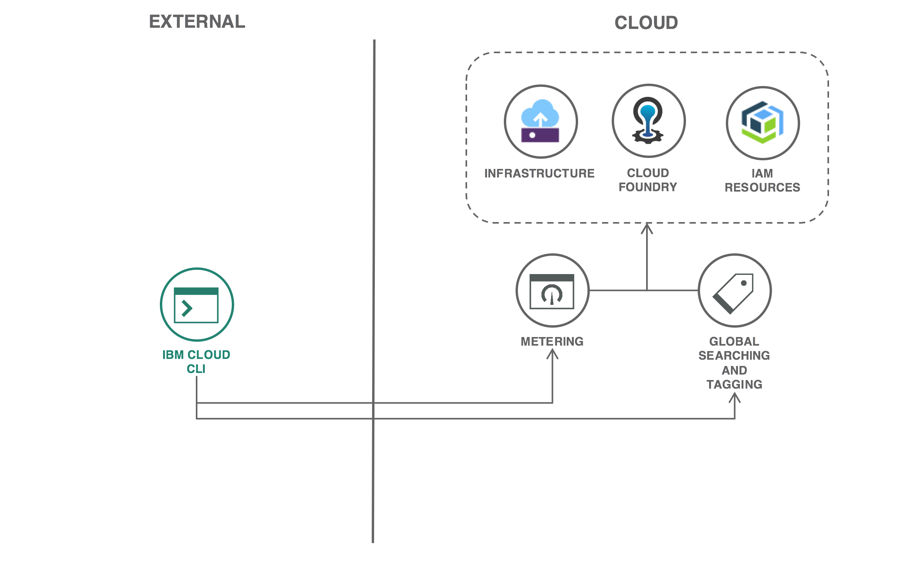

---
copyright:
  years: 2018
lastupdated: "2018-11-14"

---

{:shortdesc: .shortdesc}
{:new_window: target="_blank"}
{:codeblock: .codeblock}
{:screen: .screen}
{:tip: .tip}
{:pre: .pre}

# Reviewing {{site.data.keyword.cloud_notm}} services, resources and usage
{: #cloud-usage}
As Cloud adoption increases, IT and finance managers will need to understand Cloud usage in the context of innovation and cost control. Questions such as: "Which services are teams using?", "How much does it cost to operate a solution?" and "How can I contain sprawl?" can be answered by investigating available data. This tutorial introduces ways to explore such information and answer common usage-related questions.
{:shortdesc}

## Objectives
{: #objectives}
* Itemize {{site.data.keyword.cloud_notm}} artifacts: Cloud Foundry apps and services, Identity and Access Management resources and Infrastructure devices
* Associate {{site.data.keyword.cloud_notm}} artifacts with usage and billing
* Define the relationships between {{site.data.keyword.cloud_notm}} artifacts and development teams
* Leverage usage and billing data to create data sets for accounting purposes

## Architecture
{: #architecture}



## Before you begin
{: #prereqs}

* Install [{{site.data.keyword.cloud_notm}} CLI](https://{DomainName}/docs/cli/reference/bluemix_cli/get_started.html#getting-started)
* Install [cURL](https://curl.haxx.se/)
* Install [Node.js](https://nodejs.org/)
* Install [json2csv](https://www.npmjs.com/package/json2csv) using the command `npm install -g json2csv`
* Install [jq](https://stedolan.github.io/jq/)

## Background
{: #background}

Prior to executing commands that inventory and detail {{site.data.keyword.cloud_notm}} usage, it's helpful to have some background on the broad categories of usage and their function. Key terms used later in the tutorial are bolded. A helpful visualization of the below artifacts can be found in the [Managing your account documentation](https://{DomainName}/docs/account/account_overview.html#overview).

### Cloud Foundry
Cloud Foundry is an open-source, platform-as-a-service (PaaS) on {{site.data.keyword.cloud_notm}} that enables you to deploy and scale applications and **Services** without managing servers. Cloud Foundry organizes applications and services into orgs or spaces.  An **Org** is a development account that one or many users can own and use. An org can contain multiple spaces. Each **Space** provides users with access to a shared location for application development, deployment, and maintenance.

### Identity and Access Management
IBM Cloud Identity and Access Management (IAM) enables you to securely authenticate users for both platform services and control access to resources consistently across the {{site.data.keyword.cloud_notm}} platform. More recent offerings and migrated Cloud Foundry services exist as **Resources** managed by {{site.data.keyword.cloud_notm}} Identity and Access Management. Resources are organized into **Resource Groups** and provide access control through Policies and Roles.

### Infrastructure
Infrastructure encompasses a variety of compute options: bare metal servers, virtual server instances and Kubernetes nodes. Each are seen as a **Device** in the console.

### Account
The aforementioned artifacts are associated with an **Account** for billing purposes. **Users** are invited to the account and given access to the different resources within the account.

## Assign permissions
To view Cloud inventory and usage, you will need the appropriate roles assigned by the account administrator. If you are the account administrator, proceed to the next section.

1. The account administrator should login to {{site.data.keyword.cloud_notm}} and access the [**Identity & Access Users**](https://{DomainName}/iam/#/users) page.
2. The account administrator can select your name from the list of users in the account to assign appropriate permissions.
3. On the **Access policies** tab, click the **Assign Access** button and perform the following changes.
    1. Select the **Assign access within a resource group** tile. Select the **Resource group(s)** to be granted access to and apply the **Viewer** role. Finish by clicking the **Assign** button. This role is required for the `resource groups` and `billing resource-group-usage` commands.
    2. Select the **Assign access by using Cloud Foundry** tile. Select the overflow menu next to each **Organization** to be granted access. Select **Edit organization role** from the menu. Select **Billing Manager** from the **Organization roles** list. Finish by clicking the **Save role** button. This role is required for the `billing org-usage` command.

## Locate resources with the search command
{: #search}

As development teams begin using Cloud services, managers will benefit from knowing which services have been deployed. Deployment information helps answer questions related to innovation and service management:
- What service-related skills can be shared across teams to enhance other projects?
- What are commonalities across teams that might be lacking in some?
- Which teams are using a service that requires a critical fix or will soon be deprecated?
- How can teams review their service instances to minimize sprawl?

Search is not limited to services and resources. You can also query Cloud artifacts such as Cloud Foundry orgs and spaces, resource groups, resource bindings, aliases, etc. For more examples, see the [ibmcloud resource search](https://{DomainName}/docs/cli/reference/ibmcloud/cli_resource_group.html#ibmcloud_resource_search) documentation.
{:tip}

1. Login to {{site.data.keyword.cloud_notm}} via the command line and target your Cloud Foundry account. See [CLI Getting Started](https://{DomainName}/docs/cli/reference/bluemix_cli/get_started.html#getting-started).
    ```sh
    ibmcloud login
    ```
    {: pre}

    ```sh
    ibmcloud target --cf
    ```
    {: pre}

2. Inventory all Cloud Foundry services used within the account.
    ```sh
    ibmcloud resource search 'type:cf-service-instance'
    ```
    {: pre}

3. Boolean filters can be applied to broaden or narrow searches. For example, find both Cloud Foundry services and apps as well as IAM resources using the below query.
    ```sh
    ibmcloud resource search 'type:cf-service-instance OR type:cf-application OR type:resource-instance'
    ```
    {: pre}

4. To notify teams using a particular service type, query using the service name. Replace `<name>` with text, for example `weather` or `cloudant`. Then get the organization's name by replacing `<Organization ID>` with the **Organization ID**.
    ```sh
   ibmcloud resource search 'service_name: *<name>*'
    ```
    {: pre}

    ```sh
    ibmcloud cf curl /v2/organizations/<Organization ID> | tail -n +3 | jq .entity.name
    ```
    {: pre}

## Explore usage with the Usage Dashboard
{: #dashboard}

Once management is aware of the services that teams are using, the next often-asked question is, "What does it cost to operate these services?" The most straightforward means of determining usage and cost is by reviewing the {{site.data.keyword.cloud_notm}} Usage Dashboard.

1. Login to {{site.data.keyword.cloud_notm}} and access the [Account Usage Dashboard](https://{DomainName}/account/usage).
2. From the **Groups** drop-down menu, select a Cloud Foundry Org to view service usage.
3. For a given **Service Offering**, click **View Instances** to view the service instances that have been created.
4. On the following page, choose an instance and click **View Instance**. The resulting page provides details about the instance such as Org, Space and Location as well as individual line items that build total cost.
5. Using the breadcrumb, revisit the [Usage Dashboard](https://{DomainName}/account/usage).
6. From the **Groups** drop-down menu, change the selector to **Resource Groups** and select a group such as **default**.
7. Conduct a similar review of available instances.

## Explore usage with the command line

In this section, you'll explore usage with the command line interface.

1. List all Cloud Foundry orgs available to you and set an environment variable to store one for testing.
    ```sh
    ibmcloud cf orgs
    ```
    {: pre}

    ```sh
    export ORG_NAME=<org name>
    ```
    {: pre}

2. Itemize billing and usage for a given org with the `billing` command. Specify a particular month using the `-d` flag with a date in the format YYYY-MM.
    ```sh
    ibmcloud billing org-usage $ORG_NAME
    ```
    {: pre}

3. Conduct the same investigation for resources. Every account has a `default` resource group. Substitute the value `<group>` for a resource group listed in the first command.
    ```sh
    ibmcloud resource groups
    ```
    {: pre}

    ```sh
    export RESOURCE_GROUP=<group>
    ```
    {: pre}

    ```sh
    ibmcloud billing resource-group-usage $RESOURCE_GROUP
    ```
    {: pre}

4. You can view both Cloud Foundry services and IAM resources using the `resource-instances-usage` command. Depending on your level of permission, execute the appropriate commands.
    - If you are the account administrator or have been granted the Administrator role for All Identity and Access enabled services, simply run the `resource-instances-usage`.
        ```sh
        ibmcloud billing resource-instances-usage
        ```
        {: pre}
    -  If you are not the account administrator, the following commands can be used because the Viewer role that was set at the beginning of the tutorial.
        ```sh
        ibmcloud billing resource-instances-usage -o $ORG_NAME
        ```
        {: pre}

        ```sh
        ibmcloud billing resource-instances-usage -g $RESOURCE_GROUP
        ```
        {: pre}

6. To view infrastructure devices, use the `sl` command. You can login to your infrastructure using the **Use Bluemix Single-Sign-On** option and accept the default API endpoint. Then use the `vs` command to review {{site.data.keyword.virtualmachinesshort}}.
    ```sh
    ibmcloud sl init
    ```
    {: pre}

    ```sh
    ibmcloud sl vs list
    ```
    {: pre}

    ```sh
    ibmcloud sl vs detail <id>
    ```
    {: pre}

## Export usage with the command line
{: #usagecmd}

Some in management often need data exported to another application. A common example is exporting usage data into a spreadsheet. In this section, you will export usage data into the comma separated value (CSV) format, which is compatible with most spreadsheet applications.

This section uses two third-party tools: `jq` and `json2csv`. Each of the below commands is composed of three steps: obtaining usage data as JSON, parsing the JSON, and formatting the result as CSV. The process of obtaining and converting JSON data is not limited to `json2csv` and other tools can be leveraged.

Use the `-p` option to pretty print results. If the data prints poorly, remove the `-p` argument to print the raw CSV data.
{:tip}

1. Export a resource group's usage with anticipated costs for each resource type.
    ```sh
    ibmcloud billing resource-group-usage $RESOURCE_GROUP --output json | \
    jq '.[0].resources[] | {resource_name,billable_cost}' | \
    json2csv -f resource_name,billable_cost -p
    ```
    {: pre}

2. Itemize the instances for each resource type in the resource group.
    ```sh
    ibmcloud billing resource-instances-usage -g $RESOURCE_GROUP --output json | \
    jq '.[] | {month,resource_name,resource_instance_name,organization_name,space_name}' | \
    json2csv -f month,resource_name,resource_instance_name,organization_name,space_name -p
    ```
    {: pre}

3. Follow the same approach for a Cloud Foundry Org.
    ```sh
    ibmcloud billing resource-instances-usage -o $ORG_NAME --output json | \
    jq '.[] | {month,resource_name,resource_instance_name,organization_name,space_name}' | \
    json2csv -f month,resource_name,resource_instance_name,organization_name,space_name -p
    ```
    {: pre}

4. Add antipated costs to the data using a more advanced `jq` query. This will create more rows as some resource types have multiple cost metrics.
    ```sh
    ibmcloud billing resource-instances-usage -g $RESOURCE_GROUP --output json | \
    jq '.[] | {month,resource_name,resource_instance_name,organization_name,space_name,metric: .usage[].metric,cost : .usage[].cost}' | \
    json2csv -f month,resource_name,resource_instance_name,organization_name,space_name,metric,cost -p
    ```
    {: pre}

5. Use the same `jq` query to also list Cloud Foundry resources with associated costs.
    ```sh
    ibmcloud billing resource-instances-usage -o $ORG_NAME --output json | \
    jq '.[] | {month,resource_name,organization_name,space_name,resource_group_name,metric: .usage[].metric,cost : .usage[].cost}' | \
    json2csv -f month,resource_name,resource_instance_name,organization_name,space_name,metric,cost -p
    ```
    {: pre}

6. Export the data to a file by removing the `-p` option and piping output to a file. The resulting CSV file can be opened with a spreadsheet application.
    ```sh
    ibmcloud billing resource-instances-usage -o $ORG_NAME --output json | \
    jq '.[] | {month,resource_name,organization_name,space_name,resource_group_name,metric: .usage[].metric,cost : .usage[].cost}' | \
    json2csv -f month,resource_name,resource_instance_name,organization_name,space_name,metric,cost > $ORG_NAME.csv
    ```
    {: pre}

## Export usage with APIs
{: #usageapi}

While `billing` commands are helpful, trying to assemble a "big picture" view using the command line interface is tedious. Similarly, the Usage Dashboard presents an overview of Orgs and Resource Groups but not necessarily a team or project's usage. In this section you'll begin to explore a more data-driven approach to obtain usage for custom requirements.

1. In the terminal, set the environment variable `IBMCLOUD_TRACE=true` to print API requests and responses.
    ```sh
    export IBMCLOUD_TRACE=true
    ```
    {: pre}

2. Re-run the `billing org-usage` command to see the API calls. Note that multiple hosts and API routes are used for this single command.
    ```sh
    ibmcloud billing org-usage $ORG_NAME
    ```
    {: pre}

3. Obtain an OAuth token and execute one of the API calls seen in the `billing org-usage` command. Note that some APIs use the UAA Token while others may use an IAM Token as bearer authorization.
    ```sh
    export IAM_TOKEN=`ibmcloud iam oauth-tokens | head -n 1 | awk ' {print $4} '`
    ```
    {: pre}

    ```sh
    export UAA_TOKEN=`ibmcloud iam oauth-tokens | tail -n 1 | awk ' {print $4} '`
    ```
    {: pre}

    ```sh
    curl -H "Authorization: Bearer $UAA_TOKEN" https://mccp.ng.bluemix.net/v2/organizations?q=name:$ORG_NAME
    ```
    {: pre}

4. To execute infrastructure APIs, obtain and set environment variables for your **API Username** and **Authentication Key** seen in your [User Profile](https://control.softlayer.com/account/user/profile). If you do not see an API username and Authentication Key, you can create one on the **Actions** menu next to your name in the [User List](https://control.softlayer.com/account/users).
    ```sh
    export IAAS_USERNAME=<API Username>
    ```
    {: pre}

    ```sh
    export IAAS_KEY=<Authentication Key>
    ```
    {: pre}

5. Obtain infrastructure billing totals and billing items using the following APIs. Similar APIs are documented [here](https://softlayer.github.io/reference/services/SoftLayer_Account/).
    ```sh
    curl -u $IAAS_USERNAME:$IAAS_KEY https://api.softlayer.com/rest/v3/SoftLayer_Account/getNextInvoiceTotalAmount
    ```
    {: pre}

    ```sh
    curl -u $IAAS_USERNAME:$IAAS_KEY https://api.softlayer.com/rest/v3/SoftLayer_Account/getAllBillingItems
    ```
    {: pre}

6. Disable tracing.
    ```sh
    export IBMCLOUD_TRACE=false
    ```
    {: pre}

While the data-driven approach provides the most flexibility in exploring usage, a more thorough explanation is beyond the scope of this tutorial. The GitHub project [openwhisk-cloud-usage-sample](https://github.com/IBM-Cloud/openwhisk-cloud-usage-sample) has been created and combines {{site.data.keyword.cloud_notm}} services with Cloud Functions to provide a sample implementation.

## Expand the tutorial
{: #expand}

Use the following suggestions to expand your investigation into inventory and usage-related data.

- Explore the `ibmcloud billing` commands with the `--output json` option. This will show additional data properties available and not covered in the tutorial.
- Read the blog post [Using the {{site.data.keyword.cloud_notm}} command line to find resources](https://www.ibm.com/blogs/bluemix/2018/06/where-are-my-resources/) for more examples on `ibmcloud resource search` and which properties can be used in your queries.
- Review the [Infrastructure Account APIs](https://softlayer.github.io/reference/services/SoftLayer_Account/) for addition APIs to investigate infrastructure usage.
- Review the [jq Manual](https://stedolan.github.io/jq/manual/) for advanced queries to aggregate usage data.
