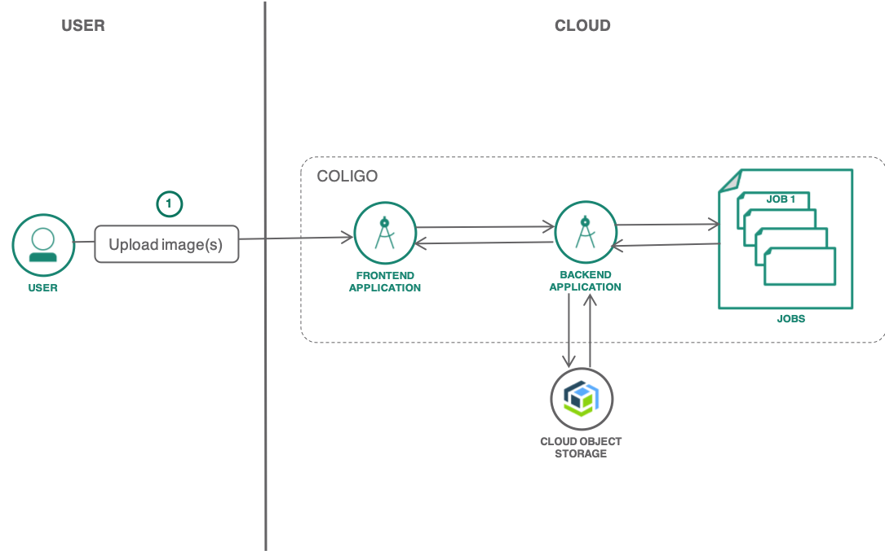

{:java: #java .ph data-hd-programlang='java'}
{:swift: #swift .ph data-hd-programlang='swift'}
{:ios: #ios data-hd-operatingsystem="ios"}
{:android: #android data-hd-operatingsystem="android"}
{:shortdesc: .shortdesc}
{:new_window: target="_blank"}
{:codeblock: .codeblock}
{:screen: .screen}
{:tip: .tip}
{:pre: .pre}
{:important: .important}
{:note: .note}

# Coligo tutorial
{: #coligo}

In this tutorial, you will be learn about Coligo by deploying an object detection application to a Coligo cluster. Coligo aims to create a platform to unify the deployment of functions, applications and pre-built containers to Kubernetes-based infrastructure. It provides a "one-stop-shop" experience for developers, enabling higher productivity and faster time to market. Delivered as a managed service on the cloud and built on open-source projects (Kubernetes, Istio, knative, Tekton etc.,).

Starting with a multi-tenant shared container environment, but extendable to "bring your own cluster" (either IKS or OpenShift) for higher isolation.
{:shortdesc}

Kubernetes is a complex product that needs a lot of configuration to run properly. Developers must log into individual worker nodes to carry out repetitive tasks, such as installing dependencies and configuring networking rules. They must generate configuration files, manage logging and tracing, and write their own CI/CD scripts using tools like Jenkins. Before they can deploy their containers, they have to go through multiple steps to containerize their source code in the first place.

Knative helps developers by hiding many of these tasks, simplifying container-based management and enabling you to concentrate on writing code. It also has support for serverless functions.

Knative's serving component incorporates Istio, which is an open source tool developed by IBM, Google, and Lyft to help manage tiny, container-based software services known as microservices.

Istio provides a routing mechanism that allows services to access each other via URLs in what's known as a service mesh. It's essentially a switchboard for the vast, complex array of container-based services that can quickly develop in a microservice environment. It handles all of this routing without needing the developer to make any changes to their underlying application code.

## Objectives
{: #objectives}

* Understand Coligo and how it simplifies the developer experience.
* Deploy a frontend application to Coligo to upload images for object detection.
* Store the uploaded images in COS service bucket on {{site.data.keyword.Bluemix}}.
* Process the images as individual jobs and store the results of object detection in a different bucket on COS service.

## Services used
{: #services}

This tutorial uses the following runtimes and services:
* Coligo service
* [{{site.data.keyword.cos_full}}](https://{DomainName}/catalog/services/cloud-object-storage)
* [{{site.data.keyword.visualrecognitionfull}}](https://{DomainName}/catalog/services/visual-recognition)
* [{{site.data.keyword.registrylong_notm}}](https://{DomainName}/kubernetes/registry/main/start)


<!--##istutorial#-->
This tutorial may incur costs. Use the [Pricing Calculator](https://{DomainName}/estimator/review) to generate a cost estimate based on your projected usage.
<!--#/istutorial#-->

## Architecture
{: #architecture}

<p style="text-align: center;">

  
</p>

## Before you begin
{: #prereqs}

This tutorial requires:
* {{site.data.keyword.cloud_notm}} CLI,
   * Coligo plugin (`coligo-service`),
   * {{site.data.keyword.containerfull_notm}} plugin (`kubernetes-service`),
   * {{site.data.keyword.registryshort_notm}} plugin (`container-registry`),
* a Docker engine,
* `kubectl` to interact with Kubernetes clusters,
* Knative client [kn](https://storage.googleapis.com/knative-nightly/client/latest/kn-darwin-amd64) for troubleshooting Knative.

## Create Coligo and required cloud services
{: #create_coligo_project}

In this section, you will provision a Coligo service and a subsequent project to group applications and jobs. You will also provision other services required

### Provision Coligo service and create a project
{:#coligo_service_project}

1. On {{site.data.keyword.Bluemix_notm}} catalog, provision a Coligo service.
   - Select a region and a resource group
   - Provide a service name
   - Click **Create** to provision he Coligo service
2. Once provisioned, create a new project to group your artifacts (applications,jobs etc.,).
   - Provide a project name
   - Click on **Create Project**
3. On a terminal, define an environment variable `COLIGO_PROJECT` and set it to your project name.
   ```sh
   export COLIGO_PROJECT=<your-project-name>
   ```
   {:pre}
4. Check the details of your project by running the following command
   ```sh
   ibmcloud coligo project get $COLIGO_PROJECT
   ```
   {:pre}
5. Target the project to run the future commands
   ```sh
   ibmcloud coligo target $COLIGO_PROJECT
   ```
   {:pre}

## Deploy the frontend and backend apps as Coligo services
{: #deploy_app}

In this section, you will deploy your front-end application as a Knative service to Coligo under the targeted project. Once deployed and tested, you will deploy your back-end application and verify the connection. You will use the pre-built container images to deploy the respective applications,

### Deploy a frontend application

1. To deploy a new Knative service, you need to run the below command by provide a service name "frontend" and the pre-built container image as a parameter to `--image` flag.
   ```sh
   ibmcloud coligo service create frontend --image ibmcom/coligo-frontend
   ```
   {:pre}
2. Run the below command to get the public endpoint(URL) of the frontend service
   ```sh
   ibmcloud coligo service list
   ```
   {:pre}
3. Copy the secured URL with HTTPS from the output above and open it in a browser to see an output as similar to the one below
   ```
   Hello World!! from the frontend.
   Connection to the backend failed as there is no backend defined yet.
   ```
<!--4. List the pods of the service and notice that it has a running pod
   ```sh
   kubectl get pods --watch
   ```
   {:pre}-->

### Deploy a backend app and test the connection

1. To deploy a new Knative service, run the below command
   ```sh
   ibmcloud coligo service create backend --image ibmcom/coligo-backend -l serving.knative.dev/visibility=cluster-local --requests-cpu 50m --requests-memory 128Mi --limits-cpu 2000m --limits-memory 4Gi
   ```
   {:pre}
2. Run the below command to get the private endpoint of the backend service
   ```sh
   ibmcloud coligo service list
   ```
   {:pre}
3. Edit the frontend service to set the environment variable pointing to the backend private point
   ```sh
   ibmcloud coligo service update frontend --env backend=backend.XXX.svc.cluster.local
   ```
   {:pre}
4. Refresh the frontend URL on the browser to test the connection to the backend service. Not backend should be available. Try uploading an image from your computer to detect objects, you should still see an error message as the backend is still not connected with the required services to store the image and process it.

## Connect the backend service to {{site.data.keyword.cos_short}} and {{site.data.keyword.visualrecognitionshort}} services
{:connect_cloud_services}

In this section, you will create the required {{site.data.keyword.cos_short}} and {{site.data.keyword.visualrecognitionshort}} services and bind them to the backend service.

### Create {{site.data.keyword.cos_short}} and {{site.data.keyword.visualrecognitionshort}} services
{:#create_services}

1. Create an instance of [{{site.data.keyword.cos_short}}](https://{DomainName}/catalog/services/cloud-object-storage)
   1. Select the **Lite** plan or the **Standard** plan if you already have an {{site.data.keyword.cos_short}} service instance in your account.
   2. Set **Service name** to **coligo-cos** and select a resource group.
   3. Click on **Create**.
2. Under **Service Credentials**, create new credential and select **Include HMAC Credential**. Click **Add** and save the credentials for future reference
3. Create a **Standard** bucket named `<your-initial>-coligo-images` with **Cross Region** resiliency and another bucket named `<your-initial>-coligo-results` with **Cross Region** resiliency.
4. Under **Endpoint**, find the **private** endpoint to access each of your bucket and save the endpoint for quick reference.
5. Create an instance of [{{site.data.keyword.visualrecognitionshort}}](https://{DomainName}/catalog/services/visual-recognition)
   1. Select a region and select **Lite** plan.
   2. Set **Service name** to **coligo-vr** and select a resource group.
   3. Click on **Create**.
6. Under **Service Credentials**, expand **View credentials** and save the credentials for quick reference. If you don't see auto-generated credentials, create a **New credential**.

### Bind the services to the backend service

1. Create a secret each for {{site.data.keyword.cos_short}} and {{site.data.keyword.visualrecognitionshort}} services. There are multiple options to use the created secret
   - Refer the secret as a ENV variable.

     Currently, `kn service update` has a flag `--env-from` stringArray
     Add environment variables from a ConfigMap (prefix cm: or config-map:) or a Secret (prefix secret:). Example: --env-from cm:myconfigmap or --env-from secret:mysecret. You can use this flag multiple times.
     {:tip}

   - Mount the secret as a Kubernetes Volume.

2. To verify whether the backend-service `yaml` is updated with the secret. You can run the below command
   ```sh
   ibmcloud coligo service describe backend -o yaml
   ```
   {:pre}

## Test the application
{:test_app}

1. Now, test the app by uploading an image through the frontend UI. The image will be stored in the {{site.data.keyword.cos_short}} service.
2. Upload multiple images to process them in parallel using jobs.
3. Check the results of the processed images.

## Build your own container image and push it to {{site.data.keyword.registrylong_notm}}
{:#container_image_registry}

> Optional step

In this section, you will build your own container image from the source code and store the image in a private registry - {{site.data.keyword.registrylong_notm}}

1. If you wish to build your own container image from source code, run the below command
    - If `ibmcloud coligo CLI` provides a way to build a container from the source code, we can mention that here or use Tekton pipelines
    - Or we can talk about Kaniko, Buildkit, Jib, Skaffold etc., to build the container image from source code.
    - Or follow the usual Dockerfile create flow
2. With Coligo, I am assuming something like this (internally using any of the methods above)
   ```sh
   ibmcloud coligo service frontend --source https://github.com/test/nodeapp.git
   ```
   {:pre}

## Remove resources
{:#cleanup}

1. Navigate to [Resource List](https://{DomainName}/resources/)
1. Delete the services you have created:
 * [{{site.data.keyword.cos_full}}](https://{DomainName}/catalog/services/cloud-object-storage)
 * [{{site.data.keyword.visualrecognitionfull}}](https://{DomainName}/catalog/services/visual-recognition)
 * [{{site.data.keyword.registrylong_notm}}](https://{DomainName}/kubernetes/registry/main/start)
