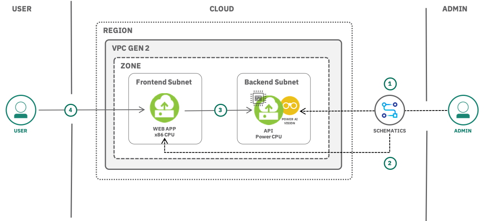

{:shortdesc: .shortdesc}
{:new_window: target="_blank"}
{:codeblock: .codeblock}
{:screen: .screen}
{:tip: .tip}
{:pre: .pre}

# Computer vision with PowerAI and Schematics
{: #computer-vision-powerai-schematics}

This tutorial walks you through how to provision a dedicated backend instance(VSI) of PowerAI Vision in {{site.data.keyword.vpc_full}}, upload an image dataset, train, deploy an optimized deep learning model as an API using a GPU provisioned on the VSI and deploy a front-end application to a VSI to interact with the backend API to classify an image. Once the front-end VM is created on {{site.data.keyword.vpc_short}} using {{site.data.keyword.bplong_notm}}, its public IP address along with the username and password to log into the application will be displayed for easy access.
{:shortdesc}

Cameras are everywhere. Videos and images have become one of the most interesting data sets for artificial intelligence. In particular, deep learning is being used to create models for computer vision, and you can train these models to let your applications recognize what an image (or video) represents.

IBM PowerAI Vision is a new generation video/image analysis platform that offers built-in deep learning models that learn to analyze images and video streams for classification and object detection.
PowerAI Vision includes tools and interfaces that allow anyone with limited skills in deep learning technologies to get up and running quickly and easily. And because PowerAI Vision is built on open source frameworks for modeling and managing containers it delivers a highly available platform that includes application life-cycle support, centralized management and monitoring, and support from IBM.

## Objectives
{: #objectives}

* Understand how to setup PowerAI vision trial running on Power CPU
* Deploy an object detection and image classification application to a VSI on {{site.data.keyword.vpc_short}}
* Upload an image dataset to train and deploy a deep learning model
* Test the accuracy and adjust the hyperparameters for an optimized model

## Services used
{: #services}

This tutorial uses the following runtimes and services:
* PowerAI Vision Trial
* [{{site.data.keyword.bplong_notm}}](https://{DomainName}/schematics/overview)
* [{{site.data.keyword.vpc_short}}](https://{DomainName}/vpc/provision/vpc)
* [{{site.data.keyword.cos_full}}](https://{DomainName}/catalog/services/cloud-object-storage)

This tutorial may incur costs. Use the [Pricing Calculator](https://{DomainName}/estimator/review) to generate a cost estimate based on your projected usage.

## Architecture
{: #architecture}

  

1. User logs into a backend application running in a VSI with PowerAI vision trial preinstalled to train and deploy a deep learning model(API)
2. User deploys a web application to a front-end subnet on {{site.data.keyword.vpc_short}} through {{site.data.keyword.bplong_notm}}
3. The front-end app interacts with the back-end API
4. User uploads an image for classification to the front-end web app

## Before you begin
{: #prereqs}

1. Obtain your [IBM Cloud API key](https://{DomainName}/iam/apikeys) and save the key for future reference.
2. If you don't have an SSH key on your local machine, [refer to these instructions for creating a key](/docs/vpc?topic=vpc-ssh-keys). By default, the private key is found at `$HOME/.ssh/id_rsa`. [Upload your public SSH key](https://{DomainName}/vpc/compute/sshKeys) to IBM Cloud and save the UUID for future reference.

## Setup a {{site.data.keyword.cos_short}} bucket with PowerAI Vision Trial

In this section, you will download PowerAI Vision Trial and upload it to a {{site.data.keyword.cos_short}}(COS) bucket later to be used with {{site.data.keyword.bplong_notm}} to create a VPC.

Download the PowerAI Vision Trial by clicking on the [download link](http://ibm.biz/vision_trial). Once downloaded, extract the contents of the `tar` file.

  You may be asked to provide your IBMid (the one you use to log into your IBM Cloud account). The download is approx. 15GB.
  {:tip}

1. While the download is in progress, create an instance of [{{site.data.keyword.cos_short}}](https://{DomainName}/catalog/services/cloud-object-storage).
   - Select the **Lite** plan or the **Standard** plan if you already have an {{site.data.keyword.cos_short}} service instance in your account
   - Set **Service name** to **powerai-cos** and select a resource group
   - Click on **Create**
2. Under **Service Credentials**, create new credential and select **Include HMAC Credential**. Click **Add** and save the credentials for quick reference
3. Create a **Custom** bucket,
   - Provide `powerai-vision-trial-bucket` as the unique bucket name
   - Select **Cross Region** as the resiliency
   - Select **Standard** as the storage class
   - Click on **Create bucket**
4. Open the created bucket, click on **Upload** and select **Files**.
5. Choose **Aspera high-speed transfer** as the transfer type.

   You will be asked to download and setup the IBM Aspera connect client.
   {:tip}

6. Once the client is setup, upload the downloaded PowerAI Vision Trial files(`.deb`,`.rpm`,`.tar`) from the extracted folder via the IBM Aspera connect client.

## Provision a VPC and VSI using {{site.data.keyword.bplong_notm}} service
{:#provision_VPC}

In this section, you will provision a VPC with PowerAI vision trial installed on a virtual server instance via {{site.data.keyword.bplong_notm}} service,

1. Navigate to [{{site.data.keyword.bplong_notm}}](https://cloud.ibm.com/schematics/overview) overview page and click on **Create a workspace**,
   - Enter **powerai-vision-workspace** as the workspace name and select a resource group
   - Enter `https://github.com/ibm/vision-terraform`as the GitHub URL under Import your Terraform template section
   - Click **Retrieve input variables**.
2. Enter the values as shown in the table below. If no **override value** is provided, the **Default value** will be used.Once entered, click on **Create**.

  <table>
    <tr>
        <td>Name</td>
        <td>Description</td>
        <td>Type</td>
        <td>Default</td>
        <td>Override value</td>
        <td>Sensitive</td>
    </tr>
    <tr>
        <td>ibmcloud_api_key</td>
        <td>key from [IBM Cloud api keys](https://cloud.ibm.com/iam/apikeys)</td>
        <td>string</td>
        <td></td>
        <td>ENTER THE KEY HERE without trialing spaces</td>
        <td></td>
    </tr>
    <tr>
        <td>vision_version</td>
        <td>Check the name of the downloaded file</td>
        <td>string</td>
        <td>1.1.5.1</td>
        <td></td>
        <td></td>
    </tr>
    <tr>
        <td>vpc_basename</td>
        <td></td>
        <td>string</td>
        <td>powerai-vision-trial </td>
        <td></td>
        <td></td>
    </tr>
    <tr>
        <td>expect_gpus</td>
        <td></td>
        <td>string</td>
        <td>1</td>
        <td></td>
        <td></td>
    </tr>
    <tr>
        <td>cos_access_key </td>
        <td>From saved credentials W/O spaces</td>
        <td>string</td>
        <td></td>
        <td>ENTER THE KEY HERE without trialing spaces</td>
        <td>true</td>
    </tr>
    <tr>
        <td>cos_secret_access_key</td>
        <td>From saved credentials W/O spaces </td>
        <td>string</td>
        <td></td>
        <td>ENTER THE KEY HERE without trialing spaces</td>
        <td>true</td>
    </tr>
    <tr>
        <td>cos_bucket_base</td>
        <td>For endpoint, refer COS service endpoint</td>
        <td>string</td>
        <td></td>
        <td>e.g. http://s3.ap.cloud-object-storage.appdomain.cloud/powerai-vision-trial-bucket</td>
        <td></td>
    </tr>
    <tr>
        <td>vision_deb_name</td>
        <td>Name of the `.deb` file in the extracted folder</td>
        <td>string</td>
        <td></td>
        <td>e.g. powerai-vision-1.1.5~trial.deb</td>
        <td></td>
    </tr>
    <tr>
        <td>vision_tar_name </td>
        <td>Name of the images tar file </td>
        <td>string</td>
        <td></td>
        <td>e.g. powerai-vision-1.1.5-images.tar</td>
        <td></td>
    </tr>
    <tr>
        <td>boot_image_name</td>
        <td></td>
        <td>string</td>
        <td>ibm-ubuntu-18-04-3-minimal-ppc64le-2</td>
        <td></td>
        <td></td>
    </tr>
    <tr>
        <td>vpc_region</td>
        <td>Target region to create this instance of PowerAI Vision</td>
        <td>string</td>
        <td>us-south</td>
        <td></td>
        <td></td>
    </tr>
    <tr>
        <td>vpc_zone</td>
        <td>Target availbility zone to create this instance of PowerAI Vision</td>
        <td>string</td>
        <td>us-south-1</td>
        <td></td>
        <td></td>
    </tr>
    <tr>
        <td>vm_profile</td>
        <td>What resources or VM profile should we create for compute? gp2-24x224x2 provides 2 GPUs and 224GB RAM</td>
        <td>string</td>
        <td>gp2-24x224x2</td>
        <td></td>
        <td></td>
    </tr>
</table>

1. Click on **Apply plan** and then **View log** next to the plan to see the logs.

<!--## Provision a PowerAI Vision Trial service
{: #provision_powerai_vision}
In this section, you will provision a PowerAI vision Trial service. Once successfully provisioned, the result is a VPC, subnet and a VSI where PowerAI Vision trial is pre-installed.

1. Create [PowerAI vision trial](https://{DomainName}/catalog/services/powerai) service from the [{{site.data.keyword.Bluemix}} catalog](https://{DomainName}/catalog).
2. Click on **Create** to provision
   * a VPC
   * a backend subnet
   * Virtual server instance(VSI) within the backend subnet in VPC (particular region and availability zone (AZ))
   * Floating IP (FIP) address on the public Internet for the back-end subnet. _Temporarily attached to train the model._
   * Security group with a rule that allows ingress traffic on port 22 (for SSH)
-->
## Train, deploy and test the deep learning model
{: #train_deploy_dl_model}
In this section, you will train, deploy a deep learning model and expose it as an API

### Train the model
{: #train_model}

For training the model and testing the deployed deep learning model, Download the [Caltech 101 dataset](http://www.vision.caltech.edu/Image_Datasets/Caltech101/) that contains pictures of objects belonging to 101 categories. Unzip and extract the dataset folder.

1. Access the application via the Floating IP of the backend subnet and login with the credentials generated. Click **Get started**.
2. Click **Create new data set** and give it a name
   - Click on the data set tile.
   - Click on **Import files** and point to the downloaded dataset folder
   - Select a category folder and import the pictures to be uploaded for classification
3. Label the objects
   - Select at least 5 images of a type and click **Label Objects**
   - Click **Assign category**, give a name and click **Assign**
   - Repeat the steps if you have images of different type

   There must be at least two categories.Each category must have at least five images.
   {:tip}

4. Click **Train model**
   - Modify the model name
   - Select **Image classification** as your type of training
   - Select **System Default(GoogLeNet)** as your Optimization technique
   - Click **Train model**

### Deploy and test the model
{: #deploy_test_model}
1. Once the training is completed, check the accuracy and other parameters.
2. To deploy the trained model, click **Deploy model**
   - Give it a name and click **Deploy**
   - Once the status changes to **Ready**, click on the model **name**
3. To test the deployed model,
   - Click on **import** and select an image
   - Check the **Results** section to check the category and the confidence value
You should also see the created API for the deployed model and the endpoints.

## Create a web app with {{site.data.keyword.bpshort}} to classify images
{: #create_access_webapp}

{{site.data.keyword.bplong_notm}} delivers Terraform-as-a-Service so that you can use a high-level scripting language to model the resources that you want in your IBM Cloud environment, and enable Infrastructure as Code (IaC). Terraform is an Open Source software that is developed by HashiCorp that enables predictable and consistent resource provisioning to rapidly build complex, multi-tier cloud environments.

### Create web app with {{site.data.keyword.bplong_notm}}
{: #create_webapp}

1. Navigate to [Schematics overview page](https://{DomainName}/schematics/overview) and click **Create a workspace**.
2. Enter a **Workspace name** and select a resource group.
3. Provide the [GitHub repository URL](https://github.com/abc/abc.git) to import the Terraform template.
4. Click on **Retrieve input variables** and complete the fields
5. Click on **Create** to start creation.
6. On the Schematics page, Click on **Generate Plan**.
7. Once the plan has successfully generated, a new item appears under Recent Activity saying Plan Generated. Click **Apply plan** to provision
   * a front-end subnet
   * VSI within the front-end subnet to deploy the web app
   * Floating IP (FIP) address on the public Internet for the front-end subnet to access the web app
   * Security group with rules that allows ingress traffic on port 22 (for SSH), HTTP requests on port 80 and HTTPS on port 443.
8. In a browser, enter `http://<Floating_IP>` to see the front-end web app that calls the deployed deep learning model via an API call.

### Classify images
{: #classify_images}

1. Click on **Upload** to select an image from your machine.
2. Click on **Classify** to see the response from the deployed model.
3. Check the configure and confidence output.
4. Repeat the above steps with different types of images.

## Remove resources
{: #cleanup}
Navigate to [resource list](https://{DomainName}/resources) and delete the services.

## Related resources
{: #related_resources}
