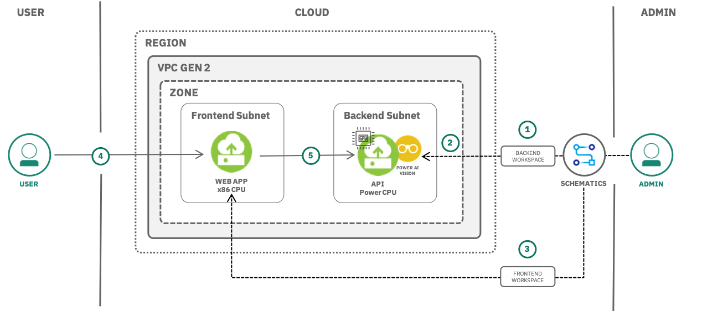

{:shortdesc: .shortdesc}
{:new_window: target="_blank"}
{:codeblock: .codeblock}
{:screen: .screen}
{:tip: .tip}
{:pre: .pre}

# Computer vision with {{site.data.keyword.visualinsightsshort}} and {{site.data.keyword.bpshort}}
{: #computer-vision-visual-insights-schematics}

This tutorial walks you through provisioning a dedicated backend virtual server instance (VSI) of {{site.data.keyword.IBM_notm}} {{site.data.keyword.visualinsightsshort}} (previously PowerAI Vision) in {{site.data.keyword.vpc_full}}(VPC) through {{site.data.keyword.bplong}}. Once provisioned, you will upload an image data set, train, deploy, and test an optimized deep learning (image classification) model through a GPU on the VSI. You will also deploy a front-end web application through {{site.data.keyword.bplong_notm}} to a new VSI on the same {{site.data.keyword.vpc_short}}. Once deployed, you will upload an image for classification by communicating with the backend deployed model exposed an an API.
{:shortdesc}

Videos and images have become one of the most interesting data sets for artificial intelligence. In particular, deep learning is being used to create models for computer vision, and you can train these models to let your applications recognize what an image (or video) represents.

[{{site.data.keyword.IBM_notm}} {{site.data.keyword.visualinsightsshort}} (previously PowerAI Vision)](https://www.ibm.com/us-en/marketplace/ibm-visual-insights) is a new generation video and image analysis platform that offers built-in deep learning models that learn to analyze images and video streams for classification and object detection. {{site.data.keyword.visualinsightsshort}} includes tools and interfaces that allow anyone with limited skills in deep learning technologies to get up and running quickly and easily. And because {{site.data.keyword.visualinsightsshort}} is built on open source frameworks for modeling and managing containers it delivers a highly available platform that includes application life-cycle support, centralized management and monitoring, and support from IBM.

## Objectives
{: #objectives}

* Use {{site.data.keyword.bpshort}} to deploy a virtual server instance running {{site.data.keyword.visualinsightsshort}} on Power CPU in {{site.data.keyword.vpc_short}}.
* Train and test an image classification model.
* Augment the VPC environment by deploying an image classification application to a new virtual server instance.

## Services used
{: #services}

This tutorial uses the following runtimes and services:
* [{{site.data.keyword.bpfull}}](https://{DomainName}/schematics/overview)
* [{{site.data.keyword.vpc_full}}](https://{DomainName}/vpc/provision/vpc)

This tutorial may incur costs. Use the [Pricing Calculator](https://{DomainName}/estimator/review) to generate a cost estimate based on your projected usage.

## Architecture
{: #architecture}

  

1. Admin creates a backend workspace on {{site.data.keyword.bpshort}} and uses a Terraform template to provision a virtual server instance(VSI) running {{site.data.keyword.visualinsightsshort}}.
2. Once the environment is provisioned, the admin logs into the {{site.data.keyword.visualinsightsshort}} backend app and deploys a deep learning model(API) for image classification.
3. Admin deploys a web application to a front-end subnet on the same {{site.data.keyword.vpc_short}} by creating a front-end workspace on the same {{site.data.keyword.bpshort}}.
4. User uploads an image to the front-end web app for classification.
5. The front-end sends the uploaded images to the backend for classification and displays the results on the web page.

## Before you begin
{: #prereqs}

This tutorial requires:
* Obtain an [IBM Cloud API key](https://{DomainName}/iam/apikeys) and save the key for future reference.
* Install {{site.data.keyword.cloud_notm}} CLI,
  * vpc-infrastructure/infrastructure-service plugin

<!--##istutorial#-->
You will find instructions to download and install these tools for your operating environment in the [Getting started with tutorials](/docs/tutorials?topic=solution-tutorials-getting-started) guide.
<!--#/istutorial#-->

## Provision a virtual server instance with {{site.data.keyword.visualinsightsshort}} using {{site.data.keyword.bpshort}}
{:#provision_VPC_backend_vsi}

In this section, you will provision a VPC with {{site.data.keyword.visualinsightsshort}} installed on a virtual server instance via {{site.data.keyword.bplong_notm}} service. {{site.data.keyword.bplong_notm}} delivers Terraform-as-a-Service so that you can use a high-level scripting language to model the resources that you want in your {{site.data.keyword.Bluemix_notm}} environment, and enable Infrastructure-as-Code (IaC).

### Create a {{site.data.keyword.bplong_notm}} backend workspace
{:#backend_workspace}

1. Navigate to [{{site.data.keyword.bplong_notm}}](https://{DomainName}/schematics/overview) overview page, and click on **Create a workspace**.
1. Set **Workspace name** to **visual-insights-workspace**. This is your backend workspace.
1. Select a resource group.
1. Set **GitHub or GitLab repository URL** to `https://github.com/ibm/vision-terraform`.
1. Click **Retrieve input variables**.
1. Once the input variables have been discovered, set `ibmcloud_api_key` to your {{site.data.keyword.Bluemix_notm}} API key and mark the variable as **sensitive**. Other variables can be kept to their default values unless you want to customize the deployed environment.
1. Click on **Create** to create the workspace.

### Apply the workspace plan
{:#Apply_plan}

Once applied, the workspace will lead to the provisioning of:
   - a Virtual Private Cloud (VPC)
   - a backend Subnet
   - a Virtual Server Instance within the VPC and a particular region and availability zone (AZ)
   - a floating IP (FIP) address on the public Internet
   - a security group that allows ingress traffic on port 443 (SSL) and on port 22 (for debug)
   - a SSH keypair - For private key, check the logs. For public key, Refer [this link](https://{DomainName}/vpc-ext/compute/sshKeys).

1. Click on **Apply plan**.
1. Click on **View log** next to the current running plan to follow the logs.
1. Wait for the plan to complete. It may take around 20 minutes for Schematics to download and install {{site.data.keyword.IBM_notm}} {{site.data.keyword.visualinsightsshort}} on the VSI.
1. Save the **Outputs** from the log for quick reference.

## Train, deploy and test the image classification model
{: #train_deploy_dl_model}

In this tutorial, **Ajayi, Gbeminiyi (2018), "Multi-class Weather Dataset for Image Classification", Mendeley Data, v1** *http://dx.doi.org/10.17632/4drtyfjtfy.1* will be used for training and testing the image classification model. Click the link provided above to **download** the `.zip` file. Once downloaded, **unzip** and **extract** image folders.

In this section, you will create a weather data set from the images you downloaded, assign a category, and train a image classification model based on the weather images uploaded. Once you are happy with the accuracy and other model parameters, you will deploy and test the image classification model.

### Train the model
{: #train_model}

1. Access the application via the **{{site.data.keyword.visualinsightsshort}}** URL saved from the log output and login with the **{{site.data.keyword.visualinsightsshort}}** credentials provided in the log. Click **Get started**.

   Ignore the certificate warning as the SSL certificate is self signed with no potential security threats.
   {:tip}
2. Click **Create new data set**, set the **Data set name** to `weather_classification_dataset` and click **Create**.
3. To add images to the dataset and to categorize, Click on the `weather_classification_dataset` tile.
   1. Click on **Import files** and point to the downloaded dataset folder.
   2. Select **cloudy** image folder and import images numbered from `cloudy1.jpg` to `cloudy240.jpg`(240 images) to be uploaded for classification.
     The rest of the images in the folder will be used for testing the model. You are splitting the data around 80%-20% between training and testing stages.
     {:tip}
   3. Once all the images are imported, expand **Categories** on the left pane, select **Uncategorized**, check **Select** on the top menu bar
   4. Click on **Assign category**, give **Cloudy** as the name and click **Assign**
   5. **Repeat** the steps with images from **rain (rain1.jpg to rain172.jpg)**, **shine (shine1.jpg to shine201.jpg)** and **sunrise (sunrise1.jpg to sunrise285.jpg)** dataset folders by assigning category names - **Rain**, **Shine** and **Sunrise** respectively
4. Click on **Train model**
   1. Select **Image classification** as your type of training
   2. Select **System Default(GoogLeNet)** as your Optimization technique
   3. Click **Train model**

### Deploy and test the model
{: #deploy_test_model}

1. Once the training is completed, check the accuracy, model hyperparameters, precision and other details by clicking on **Model details**.
2. Click on **Deploy model** to deploy the trained model.
   - Keep the suggested deployed model name.
   - Click **Deploy**.
3. Once the status changes to **Ready**, click on the model **name**.
4. Click on **Copy** under Deployed model API endpoint. **Save** the Deployed Model API URL(endpoint) for quick reference.

   To learn more about the exposed APIs reference and their usage, click on **GET** or **POST** next to the endpoint.
   {:tip}

5. To test the deployed model,
   - Click on **Import** and select an image from the respective folder. Remember to import an image that is not part of training.
   - Check the **Results** section to check the category and the confidence value

## Create a web app with {{site.data.keyword.bpshort}} for image classification
{: #create_access_webapp}

In this section, you will deploy a web application to a new VSI and upload an image for classification. An URL is provided for you to access the web app from any browser anywhere.

### Deploy a web app with {{site.data.keyword.bpshort}}
{: #deploy_webapp}

1. Navigate to [{{site.data.keyword.bpshort}} overview page](https://{DomainName}/schematics/overview) and click on **Create a workspace**.
2. Enter **visual-insights-frontend-workspace** as the Workspace name and select a resource group.
3. Enter the GitHub repository URL - `https://github.com/IBM-Cloud/visual-insights-image-classifier`
4. Click on **Retrieve input variables** and complete the required fields.Other variables can be kept to their default values unless you want to customize the deployed environment.
   <table>
    <thead>
        <tr>
            <td><strong>Name</strong></td>
            <td><strong>Description</strong></td>
            <td><strong>Type</strong></td>
            <td><strong>Default</strong></td>
            <td><strong>Override value</strong></td>
            <td><strong>Sensitive</strong></td>
        </tr>
    </thead>
    <tbody>
        <tr>
            <td>ibmcloud_api_key</td>
            <td>Enter the IBM Cloud API key. Use the same API key used for {{site.data.keyword.visualinsightsshort}} backend</td>
            <td>string</td>
            <td></td>
            <td>ENTER THE KEY HERE without any trailing spaces</td>
            <td>yes</td>
        </tr>
         <tr>
            <td>vpc_id</td>
            <td>Check the Schematics output of {{site.data.keyword.visualinsightsshort}} backend</td>
            <td>string</td>
            <td></td>
            <td>ENTER THE ID HERE without any trailing space</td>
            <td></td>
        </tr>
        <tr>
            <td>visual_insights_model_api_url</td>
            <td>The deployed model API URL of {{site.data.keyword.visualinsightsshort}}</td>
            <td>string</td>
            <td></td>
            <td>ENTER THE URL HERE without any trailing spaces</td>
            <td></td>
        </tr>
    </tbody>
   </table>

   <!--If you already have an {{site.data.keyword.Bluemix_notm}} account and planning to use the `default` resource group, set the `resource_group_name` input variable to `default`. For resource group name, Run this command - `ibmcloud resource groups`
   {:tip}-->
   If you wish to check the details of the created VPC and it resources, target VPC gen 2 with this command - `ibmcloud is target --gen 2` and run the help command - `ibmcloud is --help` for more info.
   {:tip}

5. Click on **Create** to create the workspace.
6. On the subsequent page, Click **Apply plan** to provision
   * a front-end subnet
   * VSI within the front-end subnet to deploy the web app
   * Floating IP (FIP) address on the public Internet for the front-end subnet to access the web app
   * Security group with rules that allows ingress traffic on port 22 (for SSH), HTTP requests on port 80 , HTTP requests on port 3000 to allow nodeJS traffic and HTTPS on port 443.
   * a SSH keypair - For private key, check the logs. For public key, Refer [this link](https://{DomainName}/vpc-ext/compute/sshKeys)
7. Click on **View log** next to the current running plan to follow the logs.
8. Wait for the plan to complete and check the **Outputs** from the log for the application access URL. In a browser, enter `http://<Floating_IP>:3000` to see the front-end web app that calls the deployed model via an API call.

### Classify images
{: #classify_images}

1. Click on **Upload a JPEG image** to select a `.JPEG` or `.JPG` image from `cloudy`(between cloudy241.jpg and cloudy300.jpg) folder on your machine.
2. Click on **Classify image** to see the response from the deployed model.
3. Check the category and confidence output.
4. Repeat the above steps with images from other folders namely `sunrise`, `rain` and `shine`. Remember to upload an image that is not part of training.
5. You can also upload any random `.JPEG` or `.JPG` image for classification.

## Remove resources
{: #cleanup}

1. Navigate to [{{site.data.keyword.bpshort}}](https://{DomainName}/schematics/workspaces) workspaces.
2. Click on the action menu next to the `visual-insights-frontend-workspace`.
3. Click on **Delete**, check all the Delete options, enter the name of the workspace and click **Delete** to cleanup all the provisioned resources.
4. Wait for the deletion to complete and **Repeat** steps 2-3 to delete the backend workspace - `visual-insights-workspace`

## Related resources
{: #related_resources}

* If you wish to log into the respective servers for debugging or troubleshooting using the generated SSH keypair, check this [VPC tutorial](https://{DomainName}/docs/tutorials?topic=solution-tutorials-vpc-secure-management-bastion-server#test-your-bastion)
* {{site.data.keyword.IBM_notm}} {{site.data.keyword.visualinsightsshort}} [documentation](https://www.ibm.com/support/knowledgecenter/en/SSRU69)