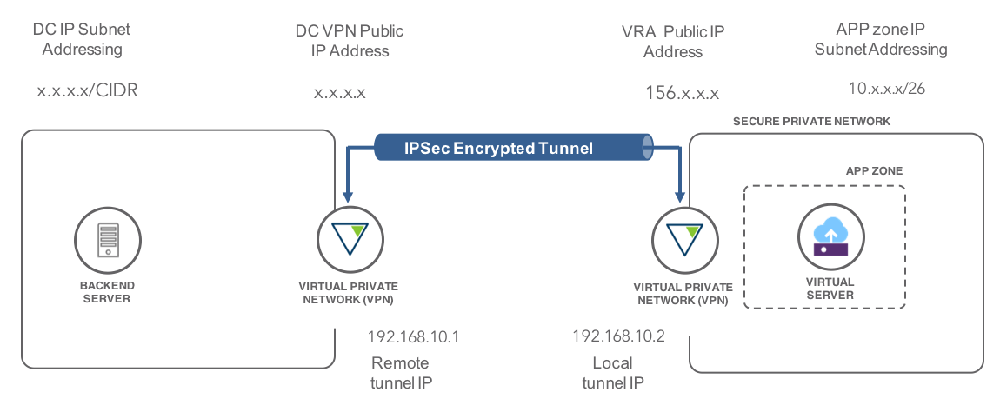

{:java: #java .ph data-hd-programlang='java'}
{:swift: #swift .ph data-hd-programlang='swift'}
{:ios: #ios data-hd-operatingsystem="ios"}
{:android: #android data-hd-operatingsystem="android"}
{:shortdesc: .shortdesc}
{:new_window: target="_blank"}
{:codeblock: .codeblock}
{:screen: .screen}
{:tip: .tip}
{:pre: .pre}

# VPN into a secure private network
{: #configuring-IPSEC-VPN}

The need to create a private connection between a remote network environment and servers on the private network of the {{site.data.keyword.Bluemix_notm}} is a common requirement. Most typically this connectivity supports hybrid workloads, data transfers, private workloads or administration of systems on the {{site.data.keyword.Bluemix_notm}}. A site-to-site Virtual Private Network (VPN) tunnel is the usual approach to securing connectivity between networks. 

{{site.data.keyword.Bluemix_notm}} provides a number of options for site-to-site data center connectivity, either using a VPN over the public internet or via a private dedicated network connection. 

See [{{site.data.keyword.BluDirectLink}}
]( https://{DomainName}/docs/infrastructure/direct-link?topic=direct-link-configure-ibm-cloud-direct-link#configure-ibm-cloud-direct-link) 
for more details on dedicated secure network links to the {{site.data.keyword.Bluemix_notm}}. A VPN over the public internet provides a lower cost option, though without bandwidth guarantees. 

There are two suitable VPN options for connectivity over the public internet to servers provisioned on the {{site.data.keyword.Bluemix_notm}}:

-	[IPSEC VPN]( https://{DomainName}/catalog/infrastructure/ipsec-vpn)
-	[Virtual Router Appliance VPN](https://{DomainName}/docs/infrastructure/virtual-router-appliance?topic=virtual-router-appliance-about-the-vra#virtual-private-network-vpn-gateway)

This tutorial presents setup of a site-to-site IPSec VPN using a Virtual Router Appliance (VRA) to connect a subnet in a client data center to a secured subnet on the {{site.data.keyword.Bluemix_notm}} private network. 

This example builds on the [Isolate workloads with a secure private network](https://{DomainName}/docs/tutorials?topic=solution-tutorials-secure-network-enclosure#secure-network-enclosure) tutorial. It uses a site-to-site IPSec 
VPN, GRE tunnel and static routing. More complex VPN configurations that use dynamic routing (BGP etc) and VTI tunnels can be found in the [supplemental VRA documentation](https://{DomainName}/docs/infrastructure/virtual-router-appliance?topic=virtual-router-appliance-supplemental-vra-documentation#supplemental-vra-documentation).
{:shortdesc}

## Objectives
{: #objectives}

- Document configuration parameters for IPSec VPN
- Configure IPSec VPN on a Virtual Router Appliance
- Route traffic through a GRE tunnel

## Services used
{: #products}

This tutorial uses the following runtimes and services:
* [Virtual Router Appliance VPN](https://{DomainName}/docs/infrastructure/virtual-router-appliance?topic=virtual-router-appliance-about-the-vra#virtual-private-network-vpn-gateway)

This tutorial may incur costs. The VRA is only available on a monthly pricing plan.

## Architecture
{: #architecture}

<p style="text-align: center;">

  
</p>

1.	Document VPN Configuration
2.	Create IPSec VPN on a VRA
3.	Configuration of data center VPN and tunnel
4.	Create GRE tunnel
5.	Create static IP route
6.	Configure firewall 

## Before you begin
{: #prereqs}

This tutorial connects the secure private enclosure in the [Isolate workloads with a secure private network](https://{DomainName}/docs/tutorials?topic=solution-tutorials-secure-network-enclosure#secure-network-enclosure) tutorial to your data center. That tutorial must be completed first.

## Document VPN configuration
{: #Document_VPN}

Configuring an IPSec VPN site-to-site link between your data center and {{site.data.keyword.Bluemix_notm}} requires coordination with your onsite networking team to determine many of the configuration parameters, the type of tunnel and IP routing information. The parameters have to be in exact accordance for an operational VPN connection. Typically your onsite networking team will specify the configuration to match agreed corporate standards and provide you with the necessary IP address of the data center VPN gateway, and the subnet address ranges that can be accessed.

Before commencing setup of the VPN, the IP addresses of the VPN gateways and IP network subnet ranges must be determined and available for the data center VPN configuration and for the secure private network enclosure in the {{site.data.keyword.Bluemix_notm}}. These are illustrated in the following figure, where the APP zone in the secure enclosure will be connected via the IPSec tunnel to systems in the ‘DC IP Subnet’ in the client data center.   

<p style="text-align: center;">

  
</p>

The following parameters must be agreed and documented between the {{site.data.keyword.Bluemix_notm}} user configuring the VPN and the networking team for the client data center. In this example the Remote and Local tunnel IP addresses are set to 192.168.10.1 and 192.168.10.2. Any arbitrary subnet may be used with agreement of the on-site networking team. 

| Item  | Description |
|:------ |:--- | 
| &lt;ike group name&gt; | Name given to the IKE group for the connection. |
| &lt;ike encryption&gt; | Agreed IKE encryption standard to be used between {{site.data.keyword.Bluemix_notm}} and the client data center, typically *aes256*. |
| &lt;ike hash&gt; | Agreed IKE hash between {{site.data.keyword.Bluemix_notm}} and client data center, typically *sha1*. |
| &lt;ike-lifetime&gt; | IKE lifetime from client data center, typically *3600*. |
| &lt;esp group name&gt; | Name given to ESP group for the connection. |
| &lt;esp encryption&gt; | Agreed ESP encryption standard between {{site.data.keyword.Bluemix_notm}} and client data center, typically *aes256*. |
| &lt;esp hash&gt; | Agreed ESP hash between {{site.data.keyword.Bluemix_notm}} and client data center, typically *sha1*. |
| &lt;esp-lifetime&gt; | ESP lifetime from client data center, typically *1800*. |
| &lt;DC VPN Public IP&gt;  | Internet facing public IP address of the VPN gateway at the client data centre. | 
| &lt;VRA Public IP&gt; | Public IP address of the VRA. |
| &lt;Remote tunnel IP\/24&gt; | IP address assigned to remote end of IPSec tunnel. Pair of IP address in range that does not conflict with IP Cloud or client data center.   |
| &lt;Local tunnel IP\/24&gt; | IP address assigned to local end of IPSec tunnel.   |
| &lt;DC Subnet/CIDR&gt; | IP address of subnet to be accessed in client data center and CIDR. |
| &lt;App Zone subnet/CIDR&gt; | Network IP address and CIDR of the APP Zone subnet from the VRA creation tutorial. | 
| &lt;Shared-Secret&gt; | Shared encryption key to be used between {{site.data.keyword.Bluemix_notm}} and client data center. |

## Configure IPSec VPN on a VRA
{: #Configure_VRA_VPN}

To create the VPN on the {{site.data.keyword.Bluemix_notm}}, the commands and all the variables that need to changed, are highlighted below with &lt; &gt;. The changes are identified line by line, for each line that needs to be changed. Values come from the 
table. 

1. SSH into VRA and enter `[edit]` mode.
   ```bash
   SSH vyatta@<VRA Private IP Address>
   configure
   ```
   {: codeblock}
2. Create Internet Key Exchange (IKE) group.
   ```
   set security vpn ipsec ike-group <ike group name> proposal 1
   set security vpn ipsec ike-group <ike group name> proposal 1 encryption <ike encryption>
   set security vpn ipsec ike-group <ike group name> proposal 1 hash <ike hash>
   set security vpn ipsec ike-group <ike group name> proposal 1 dh-group 2
   set security vpn ipsec ike-group <ike group name> lifetime <ike-lifetime>
   ```
   {: codeblock}
3. Create Encapsulating Security Payload (ESP) group
   ```
   set security vpn ipsec esp-group <esp group name> proposal 1 encryption <esp encryption>
   set security vpn ipsec esp-group <esp group name> proposal 1 hash <esp hash>
   set security vpn ipsec esp-group <esp group name> lifetime <esp-lifetime>
   set security vpn ipsec esp-group <esp group name> mode tunnel
   set security vpn ipsec esp-group <esp group name> pfs enable
   ```
   {: codeblock}
4. Define site-to-site connection
   ```
   set security vpn ipsec site-to-site peer <DC VPN Public IP>  authentication mode pre-shared-secret
   set security vpn ipsec site-to-site peer <DC VPN Public IP>  authentication pre-shared-secret <Shared-Secret>
   set security vpn ipsec site-to-site peer <DC VPN Public IP>  connection-type initiate
   set security vpn ipsec site-to-site peer <DC VPN Public IP>  ike-group <ike group name>
   set security vpn ipsec site-to-site peer <DC VPN Public IP>  local-address <VRA Public IP>
   set security vpn ipsec site-to-site peer <DC VPN Public IP>  default-esp-group <esp group name>
   set security vpn ipsec site-to-site peer <DC VPN Public IP>  tunnel 1
   set security vpn ipsec site-to-site peer <DC VPN Public IP>  tunnel 1 protocol gre
   commit
   save
   ```
   {: codeblock}

## Configure data center VPN and tunnel
{: #Configure_DC_VPN}

1. The network team at the client data centre will configure an identical IPSec VPN connection with the &lt;DC VPN Public IP&gt; and &lt;VRA Public IP&gt; swapped, the local and remote tunnel address and also the &lt;DC Subnet/CIDR&gt; and &lt;App Zone subnet/CIDR&gt; parameters swapped. The specific configuration commands at the client data center will depend on the vendor of the VPN.
1. Validate that the public IP address of the DC VPN gateway is accessible over the internet before proceeding:
   ```
   ping <DC VPN Public IP>
   ```
   {: codeblock}
2. When data center VPN configuration is complete, the IPSec link should come up automatically. Verify that the link has been established and the status shows that there is one or more active IPsec tunnels. Verify with the data center that both ends of the VPN show active IPsec tunnels.
   ```bash
   show vpn ipsec sa
   show vpn ipsec status
   ```
   {: codeblock}
3. If the link has not been created, validate that the local and remote addresses have been correctly specified and other parameters are as expected using the debug command:
   ``` bash
   show vpn debug
   ```
   {: codeblock}

The line `peer-<DC VPN Public IP>-tunnel-1: ESTABLISHED 5 seconds ago, <VRA Public IP>[500].......` should be found in the output. If this does not exist or shows 'CONNECTING' there is an error in the VPN configuration.  

## Define GRE tunnel 
{: #Define_Tunnel}

1. Create the GRE tunnel in VRA edit mode.
   ```
   set interfaces tunnel tun0 address <Local tunnel IP/24>
   set interfaces tunnel tun0 encapsulation gre
   set interfaces tunnel tun0 mtu 1300
   set interfaces tunnel tun0 local-ip <VRA Public IP>
   set interfaces tunnel tun0 remote-ip <DC VPN Public IP>
   commit
   ```
   {: codeblock}
2. After both ends of the tunnel have been configured it should come up automatically. Check the operational state of tunnel from the VRA command line.
   ```
   show interfaces tunnel
   show interfaces tun0
   ```
   {: codeblock}
   The first command should show the tunnel with State and Link as `u/u` (UP/UP). The second command shows more detail about the tunnel and that traffic is transmitted and received.
3. Validate that traffic flows across the tunnel
   ```bash
   ping <Remote tunnel IP>
   ```
   {: codeblock}
   The TX and RX counts on a `show interfaces tunnel tun0` should be seen to increment while there is `ping` traffic. 
4. If traffic is not flowing, `monitor interface` commands can be used to observe what traffic is seen on each interface. Interface `tun0` shows the internal traffic over the tunnel. Interface `dp0bond1` will show the encapsulated traffic flow to and from the remote VPN gateway.
   ```
   monitor interface tunnel tun0 traffic
   monitor interface bonding dp0bond1 traffic 
   ```
   {: codeblock}

If no return traffic is seen, the data center networking team will need to monitor the traffic flows at the VPN and tunnel interfaces at the remote site to localise the issue. 

## Create static IP route
{: #Define_Routing}

Create the VRA routing to direct traffic to the remote subnet via the tunnel.

1. Create static route in VRA edit mode.
   ```
   set protocols static route <DC Subnet/CIDR>  next-hop <Remote tunnel IP>
   ```
   {: codeblock}   
2. Review the VRA routing table from the VRA command line. At this time no traffic will transverse the route as no firewall rules exist to allow traffic via the tunnel. Firewall rules are required for traffic initiated at either side.
   ```bash
   show ip route
   ```
   {: codeblock}

## Configure firewall
{: #Configure_firewall}

1. Create resource groups for allowed icmp traffic and tcp ports. 
   ```
   set res group icmp-group icmpgrp type 8
   set res group icmp-group icmpgrp type 11
   set res group icmp-group icmpgrp type 3

   set res group port tcpports port 22
   set res group port tcpports port 80
   set res group port tcpports port 443
   commit
   ```
   {: codeblock}
2. Create firewall rules for traffic to the remote subnet in VRA edit mode.
   ```
   set security firewall name APP-TO-TUNNEL default-action drop
   set security firewall name APP-TO-TUNNEL default-log

   set security firewall name APP-TO-TUNNEL rule 100 action accept
   set security firewall name APP-TO-TUNNEL rule 100 protocol tcp
   set security firewall name APP-TO-TUNNEL rule 100 destination port tcpports

   set security firewall name APP-TO-TUNNEL rule 200 protocol icmp
   set security firewall name APP-TO-TUNNEL rule 200 icmp group icmpgrp
   set security firewall name APP-TO-TUNNEL rule 200 action accept
   commit
   ```
   {: codeblock}

   ```
   set security firewall name TUNNEL-TO-APP default-action drop
   set security firewall name TUNNEL-TO-APP default-log

   set security firewall name TUNNEL-TO-APP rule 100 action accept
   set security firewall name TUNNEL-TO-APP rule 100 protocol tcp
   set security firewall name TUNNEL-TO-APP rule 100 destination port tcpports

   set security firewall name TUNNEL-TO-APP rule 200 protocol icmp
   set security firewall name TUNNEL-TO-APP rule 200 icmp group icmpgrp
   set security firewall name TUNNEL-TO-APP rule 200 action accept 
   commit
   ```
   {: codeblock}
2. Create Zone for tunnel and associate firewalls for traffic initiated in either zone.
   ```
   set security zone-policy zone TUNNEL description "GRE Tunnel"
   set security zone-policy zone TUNNEL default-action drop
   set security zone-policy zone TUNNEL interface tun0

   set security zone-policy zone TUNNEL to APP firewall TUNNEL-TO-APP
   set security zone-policy zone APP to TUNNEL firewall APP-TO-TUNNEL
   commit
   save
   ```
   {: codeblock}
3. To validate the firewalls and routing at both ends are configured correctly and are now allowing ICMP and TCP traffic ping the gateway address of the remote subnet, first from the VRA command line and if successful then by logging into the VSI.
   ```bash
   ping <Remote Subnet Gateway IP>
   ssh root@<VSI Private IP>
   ping <Remote Subnet Gateway IP>
   ```
   {: codeblock}
4. If the ping from the VRA command line fails, validate that a ping reply is seen in response to a ping request on the tunnel interface.
   ```
   monitor interface tunnel tun0 traffic
   ```
   {: codeblock}
   No response indicates an issue with the firewall rules or routing at the data center. If a reply is seen in the monitor output, but the ping command times out, check the configuration of the local VRA firewall rules.
5. If the ping from the VSI fails, this indicates an issue with the VRA firewall rules, routing in the VRA or VSI configuration. Complete the prior step to ensure that a request is sent to and response is seen from the data center. Monitoring the traffic on the local VLAN and inspecting the firewall logs will assist in isolating the issue to routing or the firewall.
   ```
   monitor interfaces bonding dp0bond0.<VLAN ID>
   show log firewall name APP-TO-TUNNEL
   show log firewall name TUNNEL-TO-APP
   ```
   {: codeblock}

This completes setup of the VPN from the secure private network enclosure. Additional tutorials in this series illustrate how the enclosure can access services on the public internet.

## Remove resources
{:removeresources}

Steps to take to remove the resources created in this tutorial.

The VRA is on a monthly paid plan. Cancellation does not result in a refund. It is suggested to only cancel if this VRA will not be required again in the next month. If a dual VRA High-Availability cluster is required, this single VRA can be upgraded on the [Gateway Details](https://{DomainName}/classic/network/gatewayappliances) page.
{:tip}  

1. Cancel any virtual servers or bare-metal servers
2. Cancel the VRA
3. Cancel any additional VLANs by support ticket. 

## Related content
{:related}
- [IBM Virtual Router Appliance](https://{DomainName}/docs/infrastructure/virtual-router-appliance?topic=virtual-router-appliance-accessing-and-configuring-the-ibm-virtual-router-appliance#vra-basics)
- [Static and Portable IP Subnets](https://{DomainName}/docs/infrastructure/subnets?topic=subnets-about-subnets-and-ips)
- [Vyatta documentation](https://{DomainName}/docs/infrastructure/virtual-router-appliance?topic=virtual-router-appliance-supplemental-vra-documentation#supplemental-vra-documentation)
- [Brocade Vyatta Network OS IPsec Site-to-Site VPN Configuration Guide, 5.2R1](https://public.dhe.ibm.com/cloud/bluemix/network/vra/vyatta-network-os-5.2r1-ipsec-vpn.pdf)
- [Brocade Vyatta Network OS Tunnels Configuration Guide, 5.2R1](https://public.dhe.ibm.com/cloud/bluemix/network/vra/vyatta-network-os-5.2r1-tunnels.pdf)
