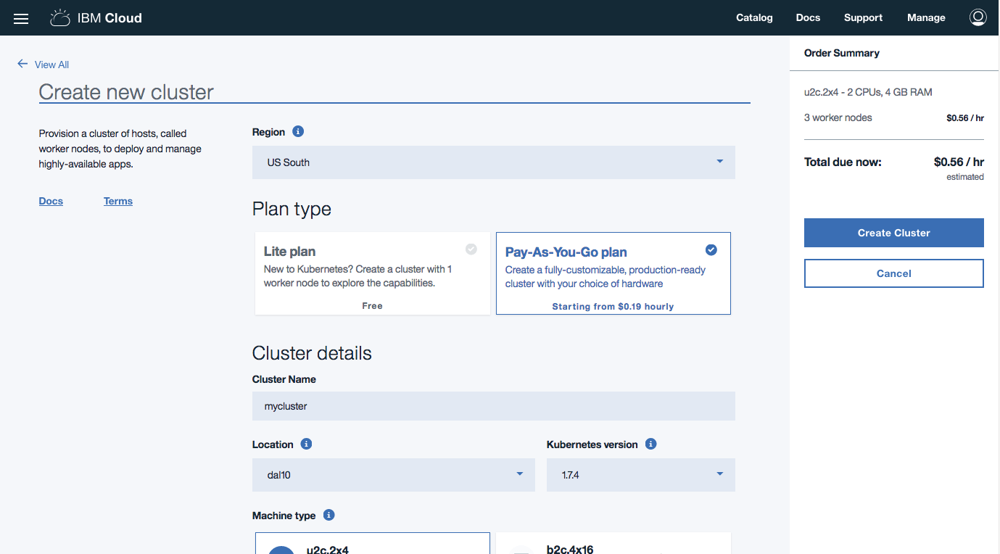

{:step: data-tutorial-type='step'}
{:shortdesc: .shortdesc}
{:new_window: target="_blank"}
{:codeblock: .codeblock}
{:screen: .screen}
{:pre: .pre}
{:tip: .tip}

# Continuous Deployment to Kubernetes
{: #continuous-deployment-to-kubernetes}
{: toc-content-type="tutorial"}
{: toc-services="containers, Registry, ContinuousDelivery"}
{: toc-completion-time="1h"}

<!--##istutorial#-->
This tutorial may incur costs. Use the [Cost Estimator](https://{DomainName}/estimator/review) to generate a cost estimate based on your projected usage.
{: tip}
<!--#/istutorial#-->

This tutorial walks you through the process setting up a continuous integration and delivery pipeline for containerized applications running on the {{site.data.keyword.containershort_notm}}.  You will learn how to set up source control, then build, test and deploy the code to different deployment stages. Next, you will add integrations to other services like Slack notifications.

{:shortdesc}

## Objectives
{: #objectives}

<!--##istutorial#-->
* Create development and production Kubernetes clusters.
<!--#/istutorial#-->
* Create a starter application, run it locally and push it to a Git repository.
* Configure the DevOps delivery pipeline to connect to your Git repository, build and deploy the starter app to dev/prod environments.
* Explore and integrate the app to use Slack notifications.

1. The code is pushed to a private Git repository.
2. The pipeline picks up changes in Git and builds container image.
3. The container image is uploaded to registry. The app is deployed to the Development environment.
4. Once changes are validated, the app is deployed to the Production environment.
5. Notifications are sent to Slack to track the deployment activities.

## Before you begin
{: #prereq}

This tutorial requires:
* {{site.data.keyword.cloud_notm}} CLI,
  * {{site.data.keyword.containerfull_notm}} plugin (`kubernetes-service`),
  * {{site.data.keyword.registryshort_notm}} plugin (`container-registry`),
  * `dev` plugin,
* a Docker engine,
* `kubectl` to interact with Kubernetes clusters,
* `helm` to deploy charts,
* `git` to clone source code repository,
* {{site.data.keyword.cloud_notm}} GitLab configured with your SSH key.

<!--##istutorial#-->
You will find instructions to download and install these tools for your operating environment in the [Getting started with tutorials](/docs/solution-tutorials?topic=solution-tutorials-getting-started) guide.
<!--#/istutorial#-->

In addition, make sure you:
- [set up a registry namespace](/docs/services/Registry?topic=registry-registry_setup_cli_namespace#registry_namespace_setup)
- and [understand the basics of Kubernetes](https://kubernetes.io/docs/tutorials/kubernetes-basics/).

<!--##istutorial#-->
## Create development Kubernetes cluster
{: #create_kube_cluster}
{: step}

{{site.data.keyword.containershort_notm}} delivers powerful tools by combining Docker and Kubernetes technologies, an intuitive user experience, and built-in security and isolation to automate the deployment, operation, scaling, and monitoring of containerized apps in a cluster of compute hosts.

To complete this tutorial you would need to select the **Paid** cluster of type **Standard**. You would be required to setup two clusters, one for development and one for production.
{: shortdesc}

1. Create the first development Kubernetes cluster from the [{{site.data.keyword.Bluemix}} catalog](https://{DomainName}/kubernetes/catalog/cluster/create). Later you will be required to repeat these steps and create a production cluster.

   For ease of use, check the configuration details like the number of CPUs, memory and the number of worker nodes you get.
   {:tip}

   

2. Select the **Cluster type** and click **Create Cluster** to provision a Kubernetes cluster. The smallest **Machine type** with 2 **CPUs**, 4 **GB RAM**, and 1 **Worker Nodes** is sufficient for this tutorial. All other options can be left to their defaults.
3. Check the status of your **Cluster** and **Worker Nodes** and wait for them to be **ready**.

**Note:** Do not proceed until your workers are ready.
<!--#/istutorial#-->

<!--##isworkshop#-->
<!--
## Log in {{site.data.keyword.cloud_notm}}
{: #access-cluster}
{: step}

1. Open the [{{site.data.keyword.cloud_notm}} console](https://{DomainName}).
2. Switch to the account where you have been invited.
-->
<!--#/isworkshop#-->

## Create a starter application
{: #create_application}
{: step}

{{site.data.keyword.containershort_notm}} offers a selection of starter applications, these starter applications can be created using the `ibmcloud dev create` command or the web console. In this tutorial, we are going to use the web console. The starter application greatly cuts down on development time by generating application starters with all the necessary boilerplate, build and configuration code so that you can start coding business logic faster.

1. From the [{{site.data.keyword.cloud_notm}} console](https://{DomainName}), use the left side menu option and select [App Development](https://{DomainName}/developer/appservice/dashboard).
2. Under **Starter Kits**, section click on the **Get a Starter Kit** button.
3. Select the `Node.js Express App` tile, click on **Get Started** and then `Create app` to create a Node.js starter application.
4. Enter a unique **name** for the application such as `<your-initial>-mynodestarter` and select a resource group. Then, click **Create**.

## Configure DevOps delivery pipeline
{: #create_devops}
{: step}

Now that you successfully created the starter application, you can automate its deployment to the Kubernetes cluster.

1. Click **Deploy your app**, under the **Configure Continuous Delivery** tile.
1. Select **{{site.data.keyword.containershort_notm}}** as the **Deployment target**.
1. Provide an {{site.data.keyword.Bluemix_notm}} API Key. If you don't have one, create by clicking on **New**.
1. Select a region and your cluster from the list.
1. Select **Helm** as the **Deployment type** and click on **Next**.
1. Define a unique **DevOps toolchain name**.
1. Select a region to create your toolchain in.
1. Click **Create**.

The toolchain will build your application and deploy it to the cluster.

1. Once the pipeline is created, click the pipeline under **Delivery Pipelines**.
1. After the deploy stages complete, click on **View logs and history** to see the logs.
1. Visit the URL displayed to access the application (`http://worker-public-ip:portnumber/`).
   

## Modify the application and deploy the updates
{: step}

1. Follow the breadcrumbs on the upper left of the screen and click on the first entry after of `<your-initial>-mynodestarter` after `Toolchains` 
1. Click the **Eclipse Orion Web IDE** tile.
1. Expand the `<your-initial>-mynodestarter` and then `public`.
1. Update the `index.html` by making a simple change, for example change "Congratulations!" to something else, your changes are automatically saved.
1. Click on the Git icon in the left most column.
1. Enter a commit message: *my first changes* and click on **Commit**.
1. On the left in the Outgoing section click **Push**.
1. Click on the arrow at the top to get back to the toolchain. 
1. Click on the **Delivery Pipeline** tile.
1. Notice a new **BUILD** has started.
1. Wait for the **DEPLOY** stage to complete.
1. Click the application **url** under Last Execution result to view your changes live.

If you don't see your application updating, check the logs of the DEPLOY and BUILD stages of your pipeline.

**Note:** If you prefer to work locally for making and viewing updates to the application, you can  clone the repository to your own environment for editing and use `ibmcloud dev build` and `ibmcloud dev run` to view the changes locally before pushing them back to the repository. Once your changes are pushed to the repository they will also trigger a build in the **Delivery Pipeline**.

## Deploy to a production environment
{: #deploytoproduction}
{: step}

In this section, you will complete the deployment pipeline by deploying the application to development and production environments respectively.

There are [different options](https://{DomainName}/docs/solution-tutorials?topic=solution-tutorials-users-teams-applications) to handle the deployment of an application to multiple environments. In this tutorial, you will deploy the application to two different namespaces.

1. Go to the toolchain you created earlier and click the **Delivery Pipeline** tile.
1. Rename the **Deploy Stage** to `Deploy dev` by clicking on the settings icon, then **Configure Stage**.
   
1. Clone the **Deploy dev** stage (settings icon > Clone Stage) and name the cloned stage as `Deploy prod`.
5. Change the **stage trigger** to `Run jobs only when this stage is run manually`.
   
6. In **Environment properties**, set **CLUSTER_NAMESPACE** to **production**.
7. **Save** the stage.

You now have the full deployment setup. To deploy from dev to production, you must manually run the `Deploy prod` stage. This is a simplification process stage over a more advanced scenario where you would include unit tests and integration tests as part of the pipeline.
   

## Setup Slack notifications
{: #setup_slack}
{: step}

1. Go back to view the list of [toolchains](https://{DomainName}/devops/toolchains) and select your toolchain, then click on **Add a Tool**.
2. Search for Slack in the search box or scroll down to see **Slack**. Click to see the configuration page.
    
3. For **Slack webhook**, follow the steps in this [link](https://my.slack.com/services/new/incoming-webhook/). You need to login with your Slack credentials and provide an existing channel name or create a new one.
4. Once the Incoming webhook integration is added, copy the **Webhook URL** and paste the same under **Slack webhook**.
5. The Slack channel is the channel name you provided while creating a webhook integration above.
6. **Slack team name** is the team-name(first part) of team-name.slack.com. e.g., kube is the team name in kube.slack.com
7. Click **Create Integration**. A new tile will be added to your toolchain.
    
8. From now on, whenever your toolchain executes, you should see Slack notifications in the channel you configured.
    

## Remove resources
{: #removeresources}
{: step}

In this step, you will clean up the resources to remove what you created above.

- Delete the Git repository.
- Delete the toolchain.
<!--##istutorial#-->
- Delete the cluster.
<!--#/istutorial#-->
- Delete the Slack channel.

## Expand the Tutorial
{: #expandTutorial}

Do you want to learn more? Here are some ideas of what you can do next:

- [Analyze logs and monitor application health with LogDNA and Sysdig](https://{DomainName}/docs/solution-tutorials?topic=solution-tutorials-application-log-analysis#application-log-analysis).
- Add a 3rd environment dedicated to testing.
- Deploy the production app [across multiple locations](https://{DomainName}/docs/solution-tutorials?topic=solution-tutorials-multi-region-webapp#multi-region-webapp).

## Related Content
{: #related}

* End to end Kubernetes solution guide, [moving VM based apps to Kubernetes](https://{DomainName}/docs/solution-tutorials?topic=solution-tutorials-vm-to-containers-and-kubernetes#vm-to-containers-and-kubernetes).
* [Security](https://{DomainName}/docs/containers?topic=containers-security#cluster) for IBM Cloud Container Service.
* Toolchain [integrations](https://{DomainName}/docs/services/ContinuousDelivery?topic=ContinuousDelivery-integrations#integrations).
* Analyze logs and monitor application health with [LogDNA and Sysdig](https://{DomainName}/docs/solution-tutorials?topic=solution-tutorials-application-log-analysis#application-log-analysis).

