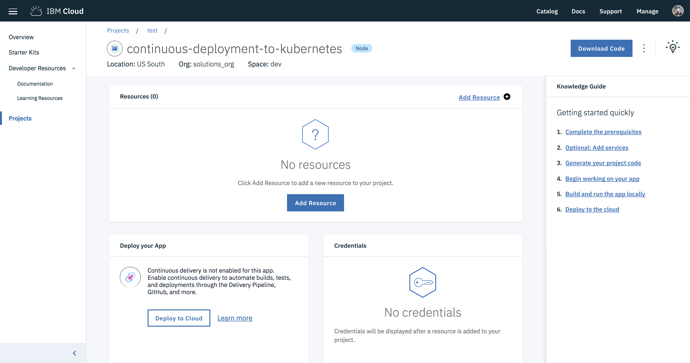
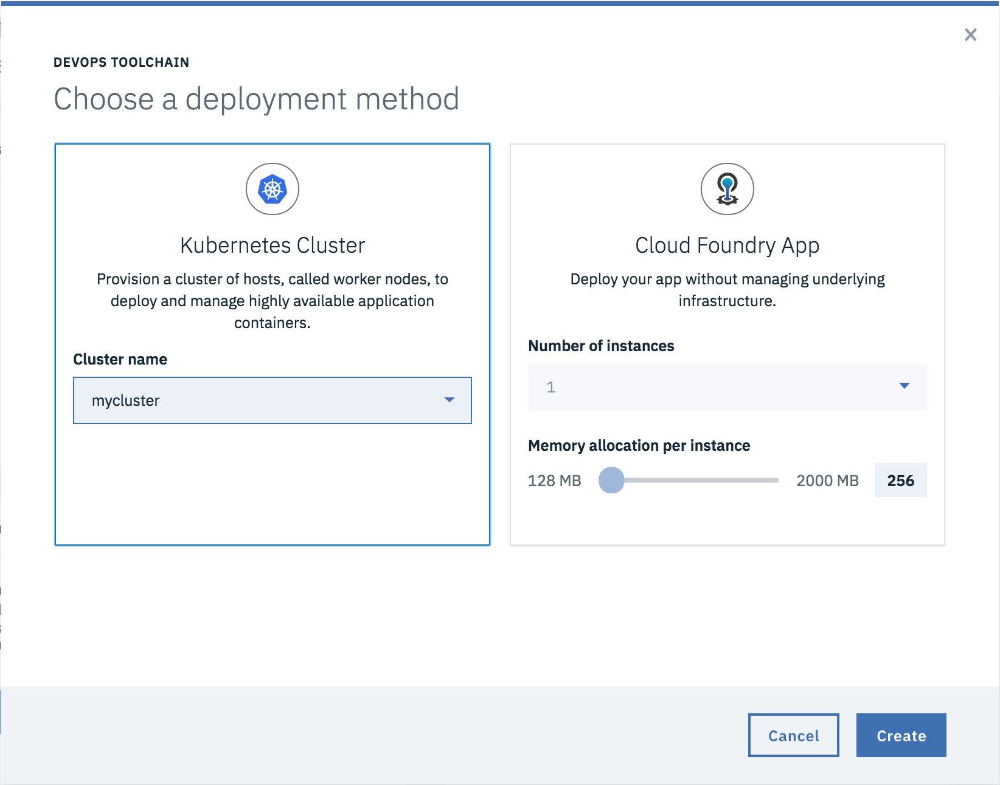
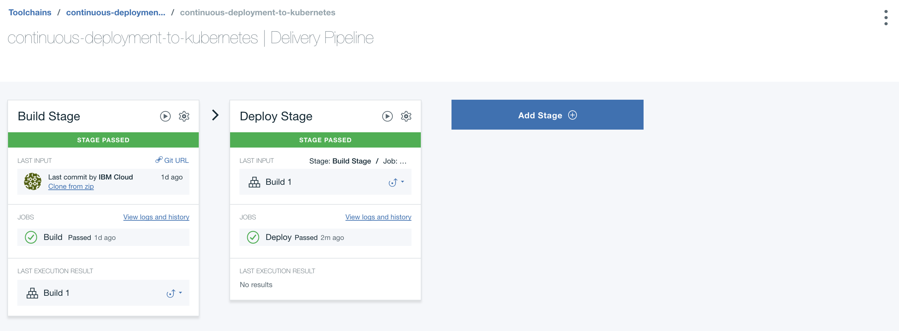
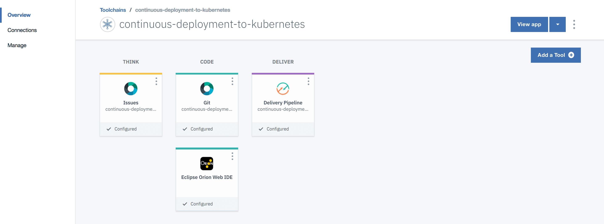
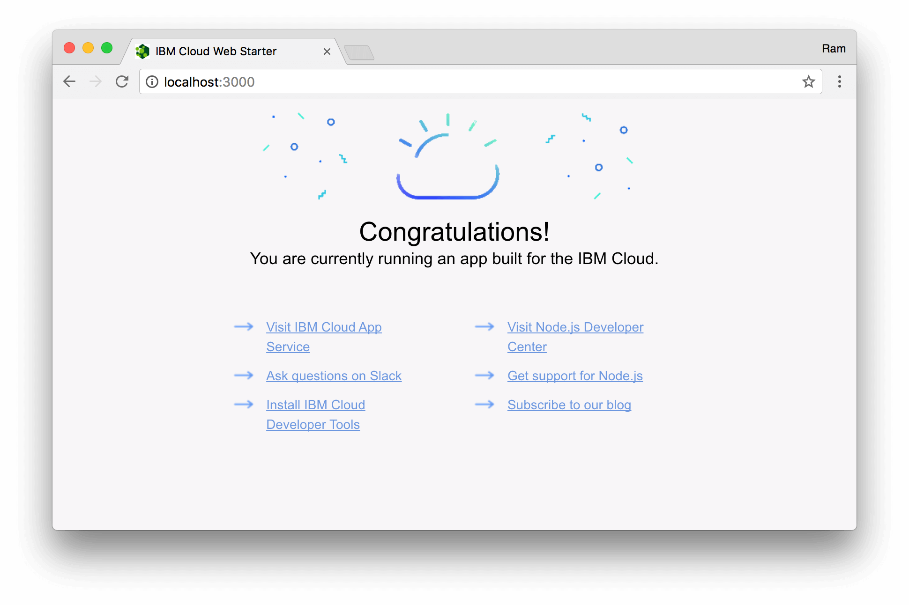
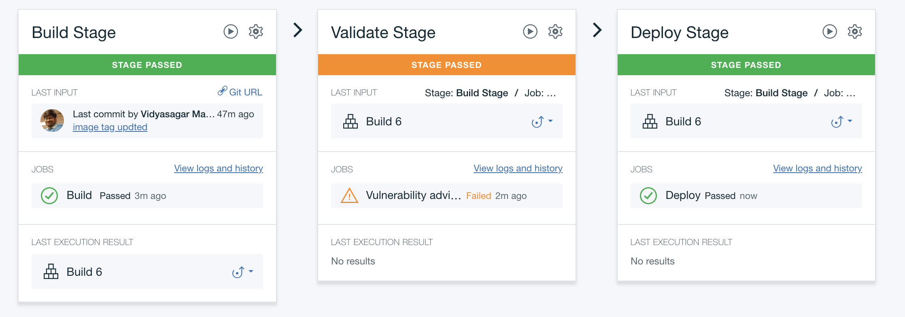
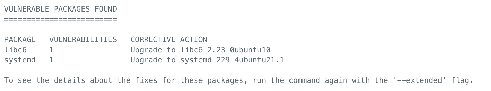
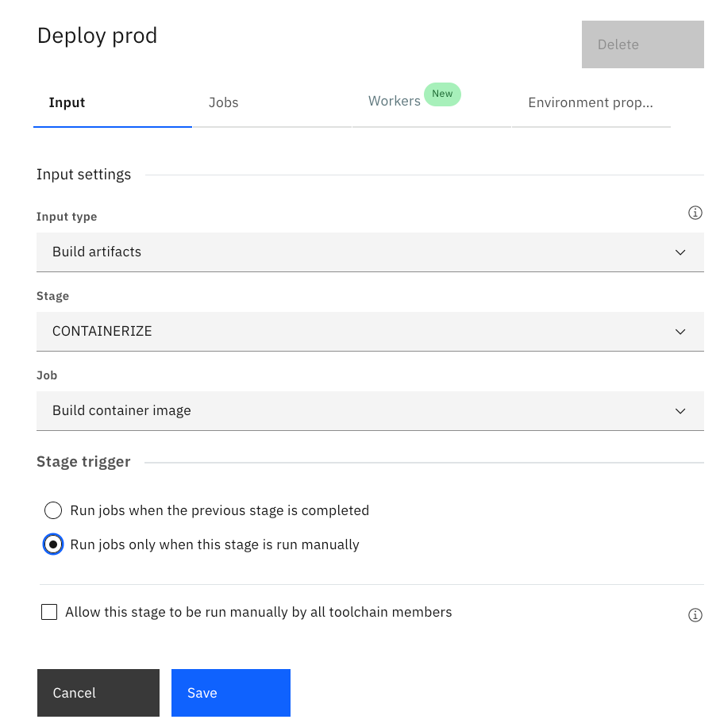

---
copyright:
  years: 2018

lastupdated: "2018-03-09"
---


{:shortdesc: .shortdesc}
{:new_window: target="_blank"}
{:codeblock: .codeblock}
{:screen: .screen}
{:pre: .pre}
{:tip: .tip}


# Continuous Deployment to Kubernetes

This tutorial walks you through setting up a continuous integration and delivery pipeline for containerized applications running in Kubernetes. This will cover the set up of source control, build, test and deploy stages as well as adding integrations such as security scanners, notifications, and analytics.

{:shortdesc}

## Objectives:

* Create a Kubernetes cluster 
* Create a starter application 
* Configure DevOps delivery pipeline 
* Clone, build and run the application locally 
* Push application Git repository 
* Deploy to production cluster
* Security using Vulnerability Advisor 
* Setup Slack notifications 
* Clean up resources


1. Push code to a private Git repository.
2. Pipeline picks up changes in Git and builds container image. 
3. Container image uploaded to registry deployed to a development Kubernetes cluster.
4. Validate changes and deploy to production cluster.
5. Slack notifications setup for deployment activities.


## Prerequisites

{: #prereq}

* [IBM Cloud Developer Tools](https://github.com/IBM-Cloud/ibm-cloud-developer-tools) - Script to install docker, kubectl, helm, bx cli and required plug-ins
* [Container registry with namespace configured](https://console.bluemix.net/docs/services/Registry/registry_setup_cli_namespace.html)
* [Basic understanding of Kubernetes](https://kubernetes.io/docs/tutorials/kubernetes-basics/)

## Cost

{: #cost}

This tutorial uses billable components of IBM Cloud Platform, including: 

- Kubernetes
- Continuous Delivery

Use the [Pricing Calculator](https://console.bluemix.net/pricing/) to generate a cost estimate based on your projected usage.  

## Create a Kubernetes cluster
{: #step1}

1. Create **Containers in Kubernetes Clusters** from the [{{site.data.keyword.Bluemix}} catalog](https://console.bluemix.net/containers-kubernetes/launch) and choose the **Pay-As-You_Go** cluster. Paid account is needed to complete the full tutorial.
2. For convenience, use the name `dev-cluster` to be consistent with this tutorial.
3. The smallest **Machine Type** with 1 **Worker Nodes** is sufficient for this tutorial. Leave all other options set to defaults.
4. Check the status of your **Cluster** and **Worker Nodes** and wait for them to be **ready**.

**NOTE:** Do not proceed until your workers are ready. 

## Create a starter application

{: #create_application}
IBM Cloud offers a selection of starter applications, these starter applications can be created using the `bx dev` command or the web console. In this tutorial, we are going to use the web console. The starter application greatly cuts down on development time by generating application starters with all the necessary boilerplate, build and configuration code so that you can start coding business logic faster.

1. From the [IBM Cloud console](https://console.bluemix.net), use the left side menu option and select [Web Apps](https://console.bluemix.net/developer/appservice/dashboard).
2. Under **Start from the Web**, section click on the **Get Started** button.
3. Select the `Express.js Basic` and then `Create Project` to create a Node.js starter application.
4. Enter a **name** `mynodestarter` and a unique **hostname** (`username-mynodestarter`) for your project.

## Configure DevOps delivery pipeline

   1. Now that you successfully created the starter application, under the **Deploy your App**, click on the **Deploy to Cloud** button. 
   2. Select the cluster you created earlier and then click **Create**. This will create a toolchain and delivery pipeline. 
   3. Once the pipeline created, click on **View Toolchain** then **Delivery Pipeline** to view the pipeline. 
   4. After the deploy stages complete, click on the **View logs and history** to see the logs.
   5. Visit the URL displayed to access the application (`http://worker-public-ip:portnumber/`). 

In the example above we used the App Service UI to create the starter applications but we could also create the same starter project using the `bx dev`command in the terminal.

## Clone, build and run the application locally

In this step, you will clone the repo locally, make code changes and build/run the application locally.  

### Clone the application
1. Select the **Git** tile under **Code**. You're then directed to your git repository page. 
2. If you haven't set up SSH keys yet, you should see a notification bar at the top with instructions. Follow the steps by opening the **add an SSH key** link in a new tab or if you want to use HTTPS instead of SSH, follow the steps by clicking **create a personal access token**. Remember to save the key or token for future reference.
3. Select SSH or HTTPS and copy the git URL. Clone the source to your local machine.

   ```bash
   git clone <your_repo_url>
   cd <name_of_your_app>
   ```

**Note:** If you're prompted for a user name, provide your git user name. For the password, use an existing **SSH key** or **personal access token** or the one created you created in the previous step.

4. Open the cloned repository in an IDE of your choice and navigate to `public/index.html`. Update the code - try changing "Congratulations!" to something else.

### Build the application
You can build and run the application as you normally would using `mvn` for java local development or `npm` for node development.  You can also build a docker image and run the application in a container to ensure consistent execution locally and on the cloud. Use the following steps to build your docker image.

1. Ensure your local Docker engine is started.
   ```
   docker ps
   ```
   {: pre}
2. Change to the generated project directory.
   ```
   cd <project name>
   ```
   {: pre}
3. Build the application.
   ```
   bx dev build
   ```
   {: pre}

   This might take a few minutes to run as all the application dependencies are downloaded and a Docker image, which contains your application and all the required environment, is built.

### Run the application locally

1. Run the container.
   ```
   bx dev run
   ```
   {: pre}

   This uses your local Docker engine to run the docker image that you built in the previous step.
2. After your container starts, go to http://localhost:3000/ 
   

## Push application Git repository 

In this step, you will commit your change to your Git repository. The pipeline will pick up the commit and push the changes to the cloud automatically.
1. In your terminal window, make sure you are inside the repo you cloned. 
2. Push the change to your repository with three simple steps: Add, commit, and push.
   ```bash
   git add public/index.html
   git commit -m "my first changes"
   git push origin master
   ```
3. Go to the toolchain you created earlier and click the **Delivery Pipeline** tile.
4. Confirm that you see n **BUILD** and **DEPLOY** stage.
   
5. Wait for the **DEPLOY** stage to complete.
6. Click the application **url** under Last Execution result to view your changes live.

If you don't see your application updating, check the logs of the DEPLOY and BUILD stages of your pipeline.

## Security using Vulnerability Advisor
{: #vulnerability_advisor}

In this step, you will explore the [Vulnerability Advisor](https://console.bluemix.net/docs/containers/va/va_index.html). The vulnerability advisor is used check the security status of container images before deployment, and also it checks the status of running containers.

1. Go to the toolchain you created earlier and click the **Delivery Pipeline** tile.
2. Click on **Add Stage** and change MyStage to **Validate Stage**.
3. Click on JOBS  > **ADD JOB**.
4. Select **Test** as the Job Type and Change **Test** to **Vulnerability advisor** in the box.
5. Under Tester type, select **Vulnerability Advisor**.
6. All the other fields should be populated automatically.

  Container Registry namespace should be same as the one mentioned in **Build Stage** of this toolchain.
  {:tip}
7. Drag and move the **Validate Stage** to the middle.
8. Click **Run**  on the **Validate Stage**.You will see that the **Validate stage** fails.
    
9. Click on **View logs and history** to see the vulnerability assessment.The end of the log says:
    
    You can see the detailed vulnerability assessments of all the scanned repositories [here](https://console.bluemix.net/containers-kubernetes/security/scans)
    {:tip}

10. Let's fix the vulnerabilities by following the corrective action. Open the cloned repository in an IDE or select Eclipse Orion web IDE tile, open `Dockerfile` and add the below command after `EXPOSE 3000`
    ```
    RUN apt-get update && apt-get install -y \
            libc6 \
            systemd \
            sensible-utils
    ```
11. Commit and Push the changes. This should trigger the toolchain and fix the **Validate Stage**.
    ```
    git add Dockerfile
    git commit -m "Fix Vulnerabilities"
    git push origin master
    ```

## Deploy to production cluster 
{: #deploytoproduction}

In this step, you will complete the deployment pipeline by deploying the Kubernetes application to development and production environments respectively. Ideally, we want to set up an automatic deployment for the development environment and a manual deployment for the production environment. Before we do that, let's explore the two ways in which you can deliver this. It's possible to use one cluster for both development and production environment. However, it's recommended to have two separate clusters, one for development and one for production. Let's explore setting up a second cluster for production.  

1. Following instructions in [Create a Kubernetes cluster](#step1) step, Create a new cluster and let's name it `prod-cluster`.
2. Go to the toolchain you created earlier and click the **Delivery Pipeline** tile.
3. Rename the **Deploy Stage** to `Deploy dev`, you can do that by clicking on settings Icon >  **Configure Stage**.
   
4. Clone the **Deploy dev** stage (settings icon > Clone Stage) and name the cloned stage as `Deploy prod`.
5. Change the **stage trigger** to `Run jobs only when this stage is run manually`. 
6. Under the **Job** tab, change the cluster name to the newly created cluster and then **Save** the stage.
7. You now should have the full deployment setup, to deploy from dev to production, you must manually run the `Deploy prod` stage to deploy to production. 

Deploying manually is one option here giving you a chance to validate your changes in the development environment before moving to production. This is a simplification over a more advanced scenario where you would include unit and integration tests as part of your pipeline and gates to promote a build from a development environment to production.

## Setup Slack notifications
{: #setup_slack}

1. Go back to view the list of [toolchains](https://console.bluemix.net/devops/toolchains) and select your toolchain, then click on **Add a Tool**.
2. Search for slack in the search box or scroll down to see **Slack**. Click to see the configuration page.
    
3. For **Slack webhook**, follow the steps in this [link](https://my.slack.com/services/new/incoming-webhook/). You need to login with your Slack credentials and provide an existing channel name or create a new one.
4. Once the Incoming webhook integration is added, copy the **Webhook URL** and paste the same under **Slack webhook**.
5. **Slack channel** is the channel name your provided while creating a webhook integration above.
6. **Slack team name** is the team-name(first part) of team-name.slack.com. e.g., kube is the team name in kube.slack.com
7. Click **Create Integration**. A new tile will be added to your toolchain.
    
8. From now on, whenever your toolchain executes, You should see slack notifications in the channel you configured.
    


## Clean up resources

{: #cleanupresources}

In this step, you will clean up the resources to remove what you created above. 

- Delete the Git repository 
- Delete the toolchain
- Delete the two clusters 
- Delete the Slack channel

## Expand the Tutorial

{: #expandTutorial}

Do you want to learn more? Here are some ideas of what you can do next:

- [Analyze logs and monitor the health of Kubernetes applications using Kibana and Grafana](kubernetes-log-analysis-kibana.html).
- Add a testing environment and deploy it to a 3rd cluster. 
- Deploy the production cluster [across multiple regions](multi-region-webapp.html).

## Related Content 

{: #relatedContent}

* [Security](https://console.bluemix.net/docs/containers/cs_secure.html#cluster) for IBM Cloud Container Service.

* Configuring tool [integrations](https://console.bluemix.net/docs/services/ContinuousDelivery/toolchains_integrations.html#integrations).

* Analyze logs and monitor the health of Kubernetes applications using [Kibana and Grafana](kubernetes-log-analysis-kibana.html).

  ​