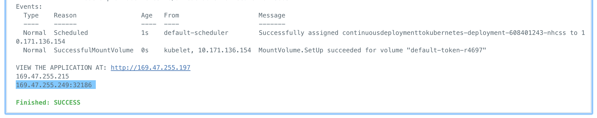
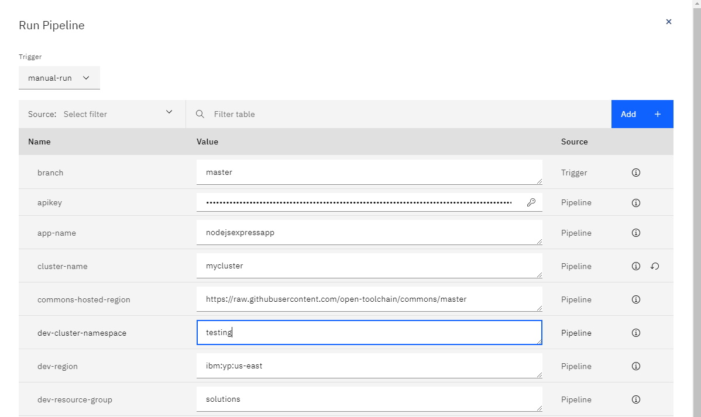
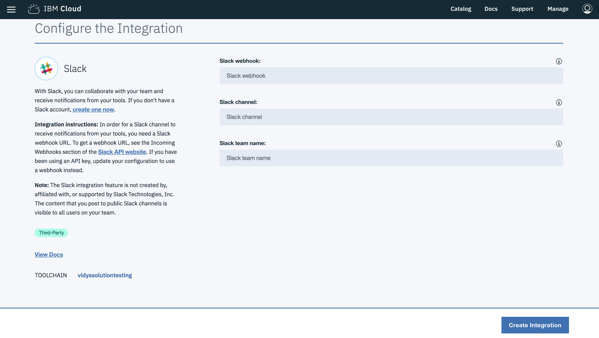
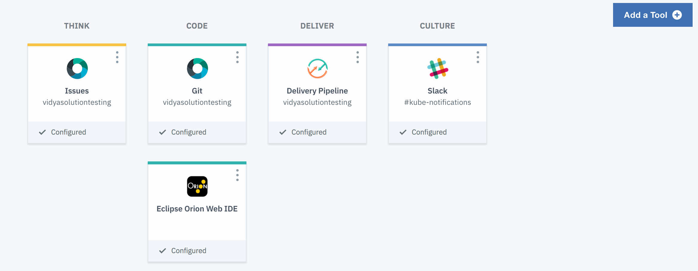
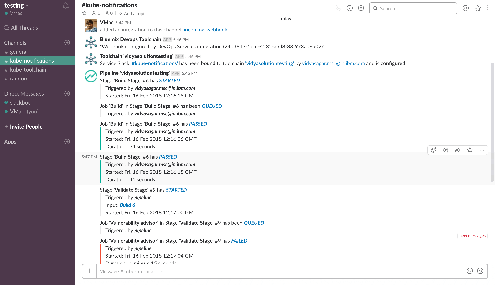

{:step: data-tutorial-type='step'}
{:shortdesc: .shortdesc}
{:new_window: target="_blank"}
{:codeblock: .codeblock}
{:screen: .screen}
{:pre: .pre}
{:tip: .tip}

# Continuous Deployment to Kubernetes
{: #continuous-deployment-to-kubernetes}
{: toc-content-type="tutorial"}
{: toc-services="containers, Registry, ContinuousDelivery"}
{: toc-completion-time="1h"}

<!--##istutorial#-->
This tutorial may incur costs. Use the [Cost Estimator](https://{DomainName}/estimator/review) to generate a cost estimate based on your projected usage.
{: tip}
<!--#/istutorial#-->

This tutorial walks you through the process setting up a continuous integration and delivery pipeline for containerized applications running on the {{site.data.keyword.containershort_notm}}.  You will learn how to set up source control, then build, test and deploy the code to different deployment stages.
{: shortdesc}

## Objectives
{: #continuous-deployment-to-kubernetes-objectives}

<!--##istutorial#-->
* Create development and production Kubernetes clusters.
<!--#/istutorial#-->
* Create a starter application, run it locally and push it to a Git repository.
* Configure the DevOps delivery pipeline to connect to your Git repository, build and deploy the starter app to dev/prod environments.

{: class="center"}
{: style="text-align: center;"}

1. The code is pushed to a private Git repository.
2. The pipeline picks up changes in Git and builds container image.
3. The container image is uploaded to registry. The app is deployed to the Development environment.
4. Once changes are validated, the app is deployed to the Production environment.

<!--##istutorial#-->
## Before you begin
{: #continuous-deployment-to-kubernetes-prereq}

This tutorial requires:
- [set up a registry namespace](/docs/Registry?topic=Registry-registry_setup_cli_namespace#registry_namespace_setup)
- and [understand the basics of Kubernetes](https://kubernetes.io/docs/tutorials/kubernetes-basics/).

## Create development Kubernetes cluster
{: #continuous-deployment-to-kubernetes-create_kube_cluster}
{: step}

{{site.data.keyword.containershort_notm}} delivers powerful tools by combining Docker and Kubernetes technologies, an intuitive user experience, and built-in security and isolation to automate the deployment, operation, scaling, and monitoring of containerized apps in a cluster of compute hosts.

Create a cluster:
1. Open [kubernetes clusters](https://{DomainName}/kubernetes/clusters) or navigate to Kubernetes > Clusters from the left hamburger navigation menu
2. Click **Create cluster**
3. Choose **Standard** plan, Default Kubernetes **version**, **Classic** infrastructure
4. Choose desired resource group
5. Choose desired Geography, Availability and Metro
6. One zone, one worker node per zone and the smallest **flavor** with 2 **CPUs**, 4 **GB RAM**, and 1 **Worker Nodes** is sufficient for this tutorial.
7. Master service endpoint of **Public endpoint only**
8. Choose a cluster name that you can remember

**Note:** Do not proceed until your workers are ready.
<!--#/istutorial#-->

<!--##isworkshop#-->
<!--
## Log in {{site.data.keyword.cloud_notm}}
{: #continuous-deployment-to-kubernetes-access-cluster}
{: step}

1. Open the [{{site.data.keyword.cloud_notm}} console](https://{DomainName}).
2. Switch to the account where you have been invited.
-->
<!--#/isworkshop#-->

## Create a starter application
{: #continuous-deployment-to-kubernetes-create_application}
{: step}

{{site.data.keyword.containershort_notm}} offers a selection of starter applications to generate all the necessary boilerplate, build and configuration code so that you can start coding business logic faster.  The cloud console is used in this example but the ibmcloud cli, `ibmcloud dev create`, is also available.

1. From the [{{site.data.keyword.cloud_notm}} console](https://{DomainName}), use the left side menu option and select [App Development](https://{DomainName}/developer/appservice/dashboard).
2. Click **Starter Kits**
3. Select the `Node.js Express App` tile, click on **Get Started** and then `Create app` to create a Node.js starter application.
4. Enter a unique **name** for the application such as `<your-initial>-mynodestarter` and select a resource group. Then, click **Create**.

## Configure DevOps delivery pipeline
{: #continuous-deployment-to-kubernetes-create_devops}
{: step}

Now that you successfully created the starter application, you can automate its deployment to the Kubernetes cluster.

1. Click **Deploy your app**, under the **Configure Continuous Delivery** tile.
1. Select **{{site.data.keyword.containershort_notm}}** as the **Deployment target**.
1. Provide an {{site.data.keyword.Bluemix_notm}} API Key. If you don't have one, create by clicking on **New**.
1. Select a region and your cluster from the list.
1. Select **Helm** as the **Deployment type** and click on **Next**.
1. Define a unique **DevOps toolchain name**.
1. Select a region to create your toolchain in.
1. Click **Create**.

The toolchain will build your application and deploy it to the cluster.

1. Once the pipeline is created, click the pipeline named **ci-pipeline** under **Delivery Pipelines**.
1. After the all the steps pass, click to expand the **deploy-to-kubernetes** step and click on **execute** to see its log.
1. Scroll to the bottom of the log and visit the URL displayed to access the application (`http://worker-public-ip:portnumber/`).
   

## Modify the application and deploy the updates
{: #continuous-deployment-to-kubernetes-6}
{: step}

1. Follow the breadcrumbs on the upper left of the screen and click on the first entry after of `<your-initial>-mynodestarter` after `Toolchains`
1. Click the **Eclipse Orion Web IDE** tile.
1. Expand the `<your-initial>-mynodestarter` and then `public`.
1. Update the `index.html` by making a simple change, for example change "Congratulations!" to something else, your changes are automatically saved.
1. Click on the Git icon in the left most column.
1. Enter a commit message: *my first changes* and click on **Commit**.
1. On the left in the Outgoing section click **Push**.
1. Click on the arrow at the top to get back to the toolchain.
1. Click on the **Delivery Pipeline** tile named **ci-pipeline**.
1. Notice from the **Status** column that a new build has started, click on its name to view the details.
1. Wait for the **DEPLOY** stage to complete.
1. After the all the steps pass, as before click to expand the **deploy-to-kubernetes** step and click on **execute** to see its log.
1. Scroll to the bottom of the log and visit the URL displayed to access the application (`http://worker-public-ip:portnumber/`).

If you don't see your application updating, confirm all the steps passed and review their respective logs.

**Note:** If you prefer to work locally for making and viewing updates to the application, you can  clone the repository to your own environment for editing and use `ibmcloud dev build` and `ibmcloud dev run` to view the changes locally before pushing them back to the repository. Once your changes are pushed to the repository they will also trigger a build in the **Delivery Pipeline**.

## Deploy to a test environment
{: #continuous-deployment-to-kubernetes-deploytotest}
{: step}

In this section, you will complete the deployment pipeline by deploying the application to development and testing environments respectively.

There are [different options](https://{DomainName}/docs/solution-tutorials?topic=solution-tutorials-users-teams-applications) to handle the deployment of an application to multiple environments. In this tutorial, you will deploy the application to two different namespaces.

1. Go to the toolchain you created earlier and click the **Delivery Pipeline** tile named **ci-pipeline**.
2. Click the **Run Pipeline** button.
3. Modify the value of the `dev-cluster-namespace` to `testing`.

4. Click on **Run**.

You now have the full deployment setup. To deploy from dev to test, you manually run the `Run Pipeline`. This is a simplification process stage over a more advanced scenario where you would include unit tests, integration tests and automated deployment as part of the pipeline. 

<!-- ## Setup Slack notifications
{: #continuous-deployment-to-kubernetes-setup_slack}
{: step}

1. Go back to view the list of [toolchains](https://{DomainName}/devops/toolchains) and select your toolchain, then click on **Add a Tool**.
2. Search for Slack in the search box or scroll down to see **Slack**. Click to see the configuration page.
    
3. For **Slack webhook**, follow the steps in this [link](https://my.slack.com/services/new/incoming-webhook/). You need to login with your Slack credentials and provide an existing channel name or create a new one.
4. Once the Incoming webhook integration is added, copy the **Webhook URL** and paste the same under **Slack webhook**.
5. The Slack channel is the channel name you provided while creating a webhook integration above.
6. **Slack team name** is the team-name(first part) of team-name.slack.com. e.g., kube is the team name in kube.slack.com
7. Click **Create Integration**. A new tile will be added to your toolchain.
    
8. From now on, whenever your toolchain executes, you should see Slack notifications in the channel you configured.
    
-->

## Remove resources
{: #continuous-deployment-to-kubernetes-removeresources}
{: step}

In this step, you will clean up the resources to remove what you created above.

<!-- - Delete the Git repository.
  - Click on the configuration for the **BUILD** stage
  - Select the **Input** panel
  - Copy the Git URL and paste into a browser
  - In the git repository: select Settings on the right then General > Advanced > Remove Project
  -->
- Delete the toolchain.
- Delete the images from the Kubernetes Registry
<!--##istutorial#-->
- Delete the cluster.
<!--#/istutorial#-->

## Expand the Tutorial
{: #continuous-deployment-to-kubernetes-expandTutorial}

Do you want to learn more? Here are some ideas of what you can do next:

- [Analyze logs and monitor application health](https://{DomainName}/docs/solution-tutorials?topic=solution-tutorials-application-log-analysis#application-log-analysis).
- Add a 3rd environment dedicated to testing.
- Deploy the production app [across multiple locations](https://{DomainName}/docs/solution-tutorials?topic=solution-tutorials-multi-region-webapp#multi-region-webapp).

## Related Content
{: #continuous-deployment-to-kubernetes-related}

* End to end Kubernetes solution guide, [moving VM based apps to Kubernetes](https://{DomainName}/docs/solution-tutorials?topic=solution-tutorials-vm-to-containers-and-kubernetes#vm-to-containers-and-kubernetes).
* [Security](https://{DomainName}/docs/containers?topic=containers-security) for {{site.data.keyword.containerlong_notm}}.
* Toolchain [integrations](https://{DomainName}/docs/ContinuousDelivery?topic=ContinuousDelivery-integrations#integrations).
* Analyze logs and monitor [application health](https://{DomainName}/docs/solution-tutorials?topic=solution-tutorials-application-log-analysis#application-log-analysis).

