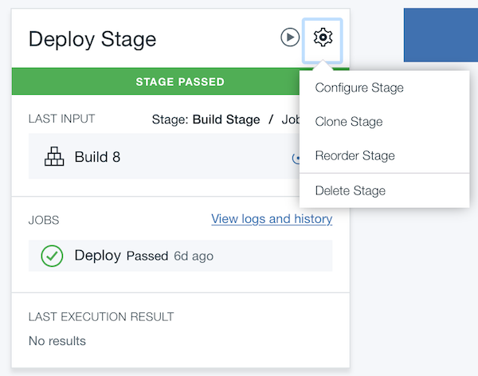
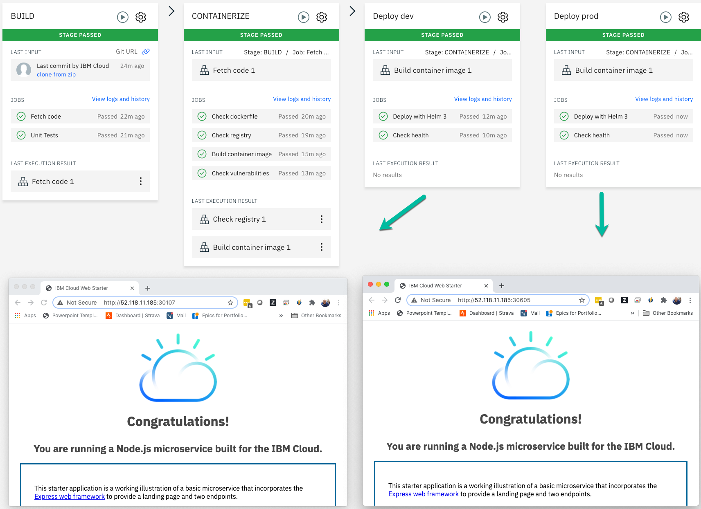

{{site.data.keyword.attribute-definition-list}}

# Continuous Deployment to Kubernetes
{: #continuous-deployment-to-kubernetes}
{: toc-content-type="tutorial"}
{: toc-services="containers, Registry, ContinuousDelivery"}
{: toc-completion-time="1h"}

<!--##istutorial#-->
This tutorial may incur costs. Use the [Cost Estimator](/estimator) to generate a cost estimate based on your projected usage.
{: tip}

<!--#/istutorial#-->

This tutorial walks you through the process setting up a continuous integration and delivery pipeline for containerized applications running on the {{site.data.keyword.containershort_notm}}.  You will learn how to set up source control, then build, test and deploy the code to different deployment stages. Next, you will add integrations to other services like Slack notifications.
{: shortdesc}

## Objectives
{: #continuous-deployment-to-kubernetes-objectives}

<!--##istutorial#-->
* Create development and production Kubernetes clusters.<!-- markdownlint-disable-line -->
<!--#/istutorial#-->
* Create a sample application, run it locally and push it to a Git repository.
* Configure the DevOps delivery pipeline to connect to your Git repository, build and deploy the sample app to dev/prod environments.
* Explore and integrate the app to use Slack notifications.

{: caption="Figure 1. Architecture diagram of the tutorial" caption-side="bottom"}
{: style="text-align: center;"}

1. The code is pushed to a private Git repository.
2. The pipeline picks up changes in Git and builds container image.
3. The container image is uploaded to registry. The app is deployed to the Development environment.
4. Once changes are validated, the app is deployed to the Production environment.
5. Notifications are sent to Slack to track the deployment activities.

<!--##istutorial#-->
## Before you begin
{: #continuous-deployment-to-kubernetes-prereq}

This tutorial requires:
- [set up a registry namespace](/docs/Registry?topic=Registry-registry_setup_cli_namespace#registry_namespace_setup)
- and [understand the basics of Kubernetes](https://kubernetes.io/docs/tutorials/kubernetes-basics/){: external}.

## Create development Kubernetes cluster
{: #continuous-deployment-to-kubernetes-create_kube_cluster}
{: step}

{{site.data.keyword.containershort_notm}} delivers powerful tools by combining Docker and Kubernetes technologies, an intuitive user experience, and built-in security and isolation to automate the deployment, operation, scaling, and monitoring of containerized apps in a cluster of compute hosts.

A minimal cluster with one (1) zone, one (1) worker node and the smallest available size (**Flavor**) is sufficient for this tutorial. The name `mycluster` will be used in this tutorial.

Open the [Kubernetes clusters](/kubernetes/clusters) and click **Create cluster**. See the following documentation for more details based on the cluster type.  Summary:
- Click **Standard tier cluster**
- For Kubernetes on VPC infrastructure see reference documentation [Creating VPC clusters](/docs/containers?topic=containers-cluster-create-vpc-gen2&interface=ui).
   - Click **Create VPC**:
      - Enter a **name** for the VPC.
      - Chose the same resource group as the cluster.
      - Click **Create**.
   - Attach a Public Gateway to each of the subnets that you create:
      - Navigate to the [Virtual private clouds](/vpc-ext/network/vpcs).
      - Click the previously created VPC used for the cluster.
      - Scroll down to subnets section and click a subnet.
      - In the **Public Gateway** section, click **Detached** to change the state to **Attached**.
      - Click the browser **back** button to return to the VPC details page.
      - Repeat the previous three steps to attach a public gateway to each subnet.
- For Kubernetes on Classic infrastructure see reference documentation [Creating classic cluster](/docs/containers?topic=containers-cluster-create-classic&interface=ui).
- Choose a resource group.
- Uncheck all zones except one.
- Scale down to 1 **Worker nodes per zone**.
- Choose the smallest **Worker Pool flavor**.
- Enter a **Cluster name**.
- Click **Create**.

**Note:** Do not proceed until your workers are ready.
<!--#/istutorial#-->

<!--##isworkshop#-->
<!--
## Log in {{site.data.keyword.cloud_notm}}
{: #continuous-deployment-to-kubernetes-access-cluster}
{: step}

1. Open the [{{site.data.keyword.cloud_notm}} console](/).
2. Switch to the account where you have been invited.
-->
<!--#/isworkshop#-->

## Create a sample application
{: #continuous-deployment-to-kubernetes-create_application}
{: step}

1. From the [{{site.data.keyword.cloud_notm}} console](/), from the menu and select [DevOps](/devops/getting-started).
2. Click **Create toolchain**.
3. In the **search box** type **kubernetes** as a filter.
4. Click on the **Develop a Kubernetes app with Helm** tile.
5. Enter a unique **Toolchain Name** for the toolchain such as `<your-initials>-mynodestarter-toolchain` and select a resource group.
6. Enter a unique **Repository Name** for the repository such as `<your-initials>-mynodestarter-repository`.
7. Click on the **Delivery Pipeline** tab.
8. Provide an {{site.data.keyword.Bluemix_notm}} API Key. If you don't have one, create by clicking on **New**.
9. Select a region and your cluster from the list.
10. Make sure to set the cluster namespace to `default` and click **Create**.

In a new browser tab open the [Kubernetes clusters](/kubernetes/clusters):
- Click on your cluster.
- Locate the **Ingress subdomain** field and click the copy button.  The ingress subdomain will be used in the next section.

The toolchain will build your application and deploy it to the cluster.

1. Once the pipeline is created, click the pipeline under **Delivery Pipelines**.
1. Wait for the DEPLOY stage to complete.  The **Check health** job will fail for VPC clusters.
1. Click on the settings cog in the DEPLOY stage and click **Configure stage**.
   - Click the **Environment properties** tab.
   - Click **Add property**, click **Text property**.
   - Enter **Name**: HELM_UPGRADE_EXTRA_ARGS.
   - Enter **Value**: --set ingress.enabled=true,ingress.hosts={dev.INGRESS_SUBDOMAIN} something like: --set ingress.enabled=true,ingress.hosts={dev.vpc-e7f2ca73139645ddf61a8702003a483a-0000.us-south.containers.appdomain.cloud}.
1. Click Save.
1. Click the **play** button on DEPLOY stage.
1. In a browser tab paste the dev.INGRESS_SUBDOMAIN of the cluster.  The message from the application should be returned: **Welcome to IBM Cloud DevOps with Docker, Kubernetes and Helm Charts. Lets go use the Continuous Delivery Service**.
1. Switch back to the pipeline tab.

## Modify the application and deploy the updates
{: #continuous-deployment-to-kubernetes-6}
{: step}

1. Follow the breadcrumbs and click on the first entry after of `<your-initials>-mynodestarter` after `Toolchains`.
1. Click the link under the **Repositories** tile, a new browser tab will open to the repository.
1. Click on the `utils.js` file and then click on **Open in Web IDE**/**Edit** drop down and choose **EDIT** then click **EDIT**. 
1. Make a simple change, for example change "Welcome to" to something else.
1. Enter a commit message: *my first changes* and click on **Commit changes**.
1. Return to the previous tab showing the toolchain.
1. Click on the **Delivery Pipeline** tile named **ci-pipeline**.
1. Notice a new **BUILD** has started.
1. Wait for the **DEPLOY** stage to complete.
1. After the DEPLOY stage completes open a new tab and paste in the dev.INGRESS_SUBDOMAIN of the cluster.

If you don't see your application updating, confirm all the steps passed and review their respective logs.

**Note:** If you prefer to work locally for making and viewing updates to the application. Once your changes are pushed to the repository they will also trigger a build in the **Delivery Pipeline**.

## Deploy to a production environment
{: #continuous-deployment-to-kubernetes-deploytoproduction}
{: step}

In this section, you will complete the deployment pipeline by deploying the application to development and production environments respectively.

There are [different options](/docs/solution-tutorials?topic=solution-tutorials-users-teams-applications) to handle the deployment of an application to multiple environments. In this tutorial, you will deploy the application to two different namespaces.

1. Go to the toolchain you created earlier and click the **Delivery Pipeline** tile.
2. Rename the **DEPLOY** stage to `Deploy dev` by clicking on the settings icon, then **Configure Stage**.
   {: caption="Access the settings Icon" caption-side="bottom"}
3. To save the changes scroll down and click **Save**.
4. Clone the **Deploy dev** stage (settings icon > Clone Stage) and name the cloned stage as `Deploy prod`.
5. On the **Input** panel change the **stage trigger** to `Run jobs only when this stage is run manually`.
6. In **Environment properties** panel, set **CLUSTER_NAMESPACE** to **production**.  Update the **HELM_UPGRADE_EXTRA_ARGS** property **Value**: --set ingress.enabled=true,ingress.hosts={**prod**.INGRESS_SUBDOMAIN}
7. **Save** the stage.
8. Click the **Play** button on the **Deploy prod** stage just created.

You now have the full deployment setup. To deploy from dev to production, you must manually run the `Deploy prod` stage. This is a simplification process stage over a more advanced scenario where you would include unit tests and integration tests as part of the pipeline.
   {: caption="Toolchain with dev and prod stages" caption-side="bottom"}

You now have the full deployment setup. To deploy from dev to production, you manually run the `Run Pipeline`. This is a simplification process stage over a more advanced scenario where you would include unit tests, integration tests and automated deployment as part of the pipeline. 

## Setup Slack notifications
{: #continuous-deployment-to-kubernetes-setup_slack}
{: step}

1. For **Slack webhook**, follow the steps in this [link](https://api.slack.com/messaging/webhooks){: external}. You need to login with your Slack credentials and provide an existing channel name or create a new one. Copy the **Webhook URL** for later use.
2. Go back to view the list of [toolchains](/devops/toolchains) and select your toolchain, then click on **Add**.
3. Search for Slack in the search box or scroll down to see **Slack**. Click to see the configuration page.
    {: caption="Configure the Slack integration" caption-side="bottom"}
4. Once the Incoming webhook integration is added, copy the **Webhook URL** captured earlier and paste under **Slack webhook**.
5. The Slack channel is the channel name you provided while creating a webhook integration.
6. **Slack team name** is the team-name(first part) of team-name.slack.com. for example, kube is the team name in kube.slack.com
7. Click **Create Integration**. A new tile will be added to your toolchain.
    {: caption="Toolchain with new Slack integration" caption-side="bottom"}
8. From now on, whenever your toolchain executes, you should see Slack notifications in the channel you configured.
    {: caption="Slack app with notification" caption-side="bottom"}

## Remove resources
{: #continuous-deployment-to-kubernetes-removeresources}
{: step}

In this step, you will clean up the resources to remove what you created previously.

- Delete the Git repository.
   - Back to the toolchain, click  the link under the **Repositories** tile, a new browser tab will open to the repository.
   - In the git repository: select **Settings** then **General** scroll down and click **Advanced** **Expand**  then scroll down and click **Delete Project**.
- Delete the toolchain.<!-- markdownlint-disable-line -->
- Delete the images from the [{{site.data.keyword.registryshort}}](/registry/images).<!-- markdownlint-disable-line -->
<!--##istutorial#-->
- Delete the cluster.<!-- markdownlint-disable-line -->
<!--#/istutorial#-->
- Delete the Slack app.

## Expand the Tutorial
{: #continuous-deployment-to-kubernetes-expandTutorial}

Do you want to learn more? Here are some ideas of what you can do next:

- [Analyze logs and monitor application health](/docs/solution-tutorials?topic=solution-tutorials-application-log-analysis#application-log-analysis).
- Add a 3rd environment dedicated to testing.

## Related Content
{: #continuous-deployment-to-kubernetes-related}

* End to end Kubernetes solution guide, [moving VM based apps to Kubernetes](/docs/solution-tutorials?topic=solution-tutorials-vm-to-containers-and-kubernetes#vm-to-containers-and-kubernetes).
* [Security](/docs/containers?topic=containers-security) for {{site.data.keyword.containerlong_notm}}.
* Toolchain [integrations](/docs/ContinuousDelivery?topic=ContinuousDelivery-integrations#integrations).
* Analyze logs and monitor [application health](/docs/solution-tutorials?topic=solution-tutorials-application-log-analysis#application-log-analysis).

