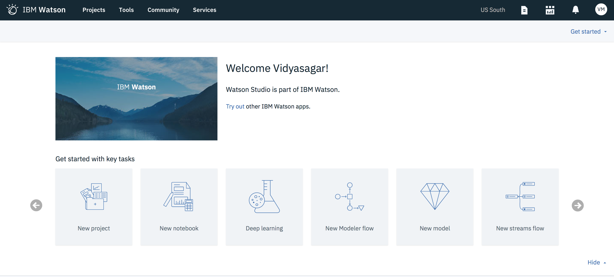

---
copyright:
  years: 2018
lastupdated: "2018-02-20"

---

{:java: #java .ph data-hd-programlang='java'}
{:swift: #swift .ph data-hd-programlang='swift'}
{:ios: #ios data-hd-operatingsystem="ios"}
{:android: #android data-hd-operatingsystem="android"}
{:shortdesc: .shortdesc}
{:new_window: target="_blank"}
{:codeblock: .codeblock}
{:screen: .screen}
{:tip: .tip}
{:pre: .pre}

# Build, Deploy,Test, and retrain a predictive machine learning model
This tutorial walks you through the process of building a predictive machine learning model then deploy it to be used in applications via an API and retrain the model with feedback data. All of this happening in an Integrated and unified self-service experience on IBM Cloud.

In this tutorial, **Iris flower data set** is used for creating a machine learning model to classify species of flowers. 

In the terminology of machine learning, classification is considered an instance of supervised learning, i.e. learning where a training set of correctly identified observations is available
{:tip}

{:shortdesc} 

## Objectives
{: #objectives}

* Import data to a project.
* Build a machine learning model.
* Deploy and Test your model.
* Re-train your model - pending.

## Products
{: #products}

* [Data Science Experience](https://console.bluemix.net/catalog/services/data-science-experience) 
* [Apache Spark](https://console.bluemix.net/catalog/services/apache-spark)
* [Cloud Object Storage](https://console.bluemix.net/catalog/infrastructure/cloud-object-storage)
* [Machine Learning](https://console.bluemix.net/catalog/services/machine-learning)

## Before you begin
{: #prereqs}
* Go to [Try Watson Data Platform](https://dataplatform.ibm.com/registration/stepone?context=wdp) and Sign up for Watson Data Platform apps.

## Import data to a project

{:#import_data}

A project is how you organize your resources to achieve a particular goal. Your project resources can include data, collaborators, and analytic tools like notebooks and models.

You can create a project to add data and open a data asset in the data refiner for cleansing and shaping your data.

**Create a project:**

1. Visit https://dataplatform.ibm.com, login with your IBM id, and Click on [Try out](https://dataplatform.ibm.com/data/discovery?target=offerings&context=analytics) the Watson Data Platform apps.
2. Under Data Science Experience tile, Click on **Try it for free** and Scroll to select **Lite** Plan > Create.

   

3.  Create a **New Project** (Projects > All Projects > New Project). Add a name and optional description for the project.
4. Leave the **Restrict who can be a collaborator** checkbox unchecked as you don't have confidential data.
5. Under **Define Storage**, Click on **Add** and Choose an existing object storage service or create a new one (Select **Lite** plan > Create). Hit **Refresh** to see the created service.
6. Under **Define compute engine**, Click on **Add** and Choose an existing spark service or create a new one.
7. Click Create. Your new project opens and you can start adding resources to it.

**Import data:**

As mentioned earlier, you will be using iris data set. Originally published at [UCI Machine Learning Repository: Iris Data Set](https://archive.ics.uci.edu/ml/datasets/Iris), this small dataset from 1936 is often used for testing out machine learning algorithms and visualizations. The aim is to classify iris flowers among three species (setosa, versicolor or virginica) from measurements of length and width of sepals and petals. 


The iris data set contains 3 classes of 50 instances each, where each class refers to a type of iris plant. [Download](https://www.kaggle.com/uciml/iris/downloads/Iris.csv) the iris.csv.

1. Under **Assets** in your project, click the **Find and Add Data** icon .
2. Under **Load**, Click on **browse** and upload the downloaded iris.csv

      

3. Once added, You should see iris.csv under **Data assets** section of the project. Click on the name to see the contents of the data set.

## Build a machine learning model

{:#build_model}

1. Click on **New model** to see model creation page. Add a name and optional description.

2. Under Machine Learning Service section, Click on **Associate a Machine Learning service instance** to bind a machine learning service (**Lite** plan) to your project. Click **Reload**.

   

3. Select **Model builder** as your model type and **Manual** to manually create a model.

   For the automatic method, you rely on automatic data preparation (ADP) completely. For the manual method, in addition to some functions that are handled by the ADP transformer, you can add and configure your own estimators, which are the algorithms used in the analysis. 
   {:tip}

4. Click **Create**.

5. On the next page, Select **iris.csv** as your data set and click **next**.

6. On the **select technique** page, based on the data set added, Label columns and feature columns are prepopulated .Select **species** as your Label column and petal_length and petal_width as your Feature columns.

7. Choose **Multiclass classification** as your suggested technique.

   

8. Validation split

   **Train:** 50%, 

   **Test** 25%, 

   **Holdout:** 25%

9. Click on **Add Estimators** and select **Decision Tree Classifier** > Add. 

10. Click **Next** to train the model.Once you see the status as **Trained & Evaluated**, Click Save.

    

## Deploy and Test your model

{:#deploy_test_model}

**Deploy:**

1. Under the created model, Click on **Deployments** > **Add Deployment**.

2. Choose **Web Service**. Add a name and an optional description.

3. Click **Save**. Once the status is changed to Active, you can now check the scoring-endpoint, code snippets in various programming languages, and API Specification under **Implementation**.

4. Click on **View API Specification** to see and test IBM Watson Machine Learning API endpoints.

   

   To start working with API one needs to generate an `access token` using the `username` and `password`
   available on the Service Credentials tab of the IBM Watson Machine Learning service instance. Follow the instructions mentioned on the API specification page to generate an `access token`.

   {:tip}

5. To make an online prediction, use the `POST /online` API call.

   * `instance_id` can be found on thee Service Credentials tab of the Machine Learning service. 

   * `deployment_id` and `published_model_id` are under **Overview** of your deployment.

   *  For `online_prediction_input`, use the below JSON

     ```
     {
     	"fields": ["sepal_length", "sepal_width", "petal_length", "petal_width"],
     	"values": [
     		[5.1, 3.5, 1.4, 0.2]
     	]
     }
     ```

6. Using the API endpoints, you can now call this model from any application.

**Test:**

1. Under **Test**, you should see input data (Feature data) prepopulated.
2. Click **Predict** and you should see the **Predicted value for species** in a chart. 

   

3. You can change the input data and continue testing your model. 

## Re-train your model