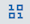

{:java: #java .ph data-hd-programlang='java'}
{:swift: #swift .ph data-hd-programlang='swift'}
{:ios: #ios data-hd-operatingsystem="ios"}
{:android: #android data-hd-operatingsystem="android"}
{:shortdesc: .shortdesc}
{:new_window: target="_blank"}
{:codeblock: .codeblock}
{:screen: .screen}
{:tip: .tip}
{:pre: .pre}

# Build, deploy, test and monitor a predictive machine learning model
{: #create-deploy-retrain-machine-learning-model}
This tutorial walks you through the process of building a predictive machine learning model, deploying the generated model as an API to be used in applications and testing the model. You will also learn how to create a new machine learning model using a notebook, all of this happening in an integrated and unified self-service experience on {{site.data.keyword.Bluemix_notm}}. You will then monitor the deployed model (using a notebook) with {{site.data.keyword.aios_full_notm}}.
{:shortdesc}

In this tutorial, the **Iris flower data set** is used for creating a machine learning model to classify species of flowers.

In the terminology of machine learning, classification is considered an instance of supervised learning, i.e. learning where a training set of correctly identified observations is available.
{:tip}

{{site.data.keyword.DSX}} provides you with the environment and tools to solve your business problems by collaboratively working with data. You can choose the tools you need to analyze and visualize data, to cleanse and shape data, to ingest streaming data, or to create and train machine learning models.

## Objectives
{: #objectives}

* Import data to a project.
* Build a machine learning model.
* Deploy the model and try out the API.
* Test a machine learning model.
* Monitor the deployed model
* Retrain your model.

## Services used
{: #services}

This tutorial uses the following runtimes and services:
* [{{site.data.keyword.DSX_short}}](https://{DomainName}/catalog/services/data-science-experience)
* [{{site.data.keyword.cos_full_notm}}](https://{DomainName}/catalog/infrastructure/cloud-object-storage)
* [{{site.data.keyword.pm_full}}](https://{DomainName}/catalog/services/machine-learning)
* [{{site.data.keyword.aios_full}}](https://{DomainName}/catalog/services/watson-openscale)

## Architecture
{: #architecture}


1. The admin uploads a CSV file from a local machine.
2. The uploaded CSV file is stored in {{site.data.keyword.cos_full_notm}} service as a dataset.
3. The dataset is then used to build and deploy a machine learning model. The deployed model is exposed as an API (scoring-endpoint).
4. The user makes an API call to predict the outcome with the test data.
5. The deployed machine learning model is monitored for quality, accuracy and other key parameters with the test data.

## Import data to a project
{: #import_data_project}

A project is how you organize your resources to achieve a particular goal. Your project resources can include data, collaborators, and analytic tools like Jupyter notebooks and machine learning models.

You can create a project to add data and open a data asset in the data refiner for cleansing and shaping your data.

### Create a project
{: #create_project}

1. Go to the [{{site.data.keyword.Bluemix_short}} catalog](https://{DomainName}/catalog) and create [{{site.data.keyword.DSX_short}}](https://{DomainName}/catalog/services/data-science-experience?taxonomyNavigation=app-services)
  1. Select a **region** preferably **Dallas**
  2. Select a **Lite** pricing plan
  3. Provide a **Service name**
  4. Select a **resource group** and click **Create**
2. Click on the **Get Started** button to launch the **{{site.data.keyword.DSX_short}}** dashboard.
3. Create a **project** by clicking **Create an empty project**.
4. Provide **iris_project** as the project name and Leave the **Restrict who can be a collaborator** checkbox unchecked as there's no confidential data.
5. Under **Define Storage**, Click on **Add** and choose an **existing** Cloud Object Storage service or create a **new** service. If you choose to create a **New** service
   1. Select a **Lite** plan
   2. Click on **Create**
   3. Select a Resource group and change the service name to **cloud-object-storage-tutorial**
   4. Click on **Confirm**
   5. Hit **Refresh** to see the created service.
6. Click **Create**. Your new project opens and you can start adding resources to it.

### Import data
{: #import_data}

As mentioned earlier, you will be using the **Iris data set**. The Iris dataset was used in R.A. Fisher's classic 1936 paper, [The Use of Multiple Measurements in Taxonomic Problems](http://rcs.chemometrics.ru/Tutorials/classification/Fisher.pdf), and can also be found on the [UCI {{site.data.keyword.pm_short}} Repository](http://archive.ics.uci.edu/ml/). This small dataset is often used for testing out machine learning algorithms and visualizations. The aim is to classify Iris flowers among three species (Setosa, Versicolor or Virginica) from measurements of length and width of sepals and petals. The iris data set contains 3 classes of 50 instances each, where each class refers to a type of iris plant.


**Download** [iris_initial.csv](https://ibm.box.com/shared/static/nnxx7ozfvpdkjv17x4katwu385cm6k5d.csv) which consists of 40 instances of each species.

1. Under **Assets** in your project, click the **Find and Add Data** icon .
2. Under **Load**, click on **browse** and upload the downloaded `iris_initial.csv`.
3. Once added, you should see `iris_initial.csv` under the **Data assets** section of the project. Click on the name to see the contents of the data set.

## Associate the {{site.data.keyword.pm_short}} service
{:#associate_services}

1. In the top navigation menu, click on `iris-project`, click on **Settings** in the top bar and scroll to **Associated Services** section.
2. Click **Add Service** and choose **{{site.data.keyword.watson}}**.
3. Click **Add** on **{{site.data.keyword.pm_short}}** tile.
4. If you have an existing **{{site.data.keyword.pm_short}}** service instance, select it otherwise continue with the following steps to create a new instance.
   1. Choose the **Lite** plan and click **Create**.
   2. Leave the default values for Region,Plan and Resource group.
   3. Enter `pm-20-tutorial` as the **Service name** and click **Confirm** to provision a {{site.data.keyword.pm_short}} service.

## Build a machine learning model
{:#build_model}

1. Click on **Add to project +** in the main menu and select **AutoAI experiment**. In the dialog,
   1. Select **From blank**.
   2. Set the Asset name to **iris_model**.
   3. Under **Associated services**, select the **Machine learning service instance**(`pm-20-tutorial`) created above.
4. Click **Create**.

Once the model is created,
1. Add training data by clicking **Select from project**.
   2. Choose the **iris_initial.csv** file.
   3. Click **Select asset**.
3. Select **Species** as your Select column to predict.
4. Click **Experiment settings** > Set **Holdout data split** under **Data source** to **15%** by moving the slider.
5. On the left menu, Click on **Prediction**:
   6. Set **Prediction type** to **Multiclass classification**.
   7. Set **Optimized metric** as **Accuracy**.
2. Click on **Save settings**.
6. Click on **Run experiment**.
1. The **AutoAI experiment** may take up to 5 minutes to select the right Algorithm for your model. Click on **Swap view** to see the Relationship map.

   Each model pipeline is scored for a variety of metrics and then ranked. The default ranking metric for binary classification models is the area under the ROC curve, for multi-class classification models is accuracy, and for for regression models is the root mean-squared error (RMSE). The highest-ranked pipelines are displayed in a leaderboard, so you can view more information about them. The leaderboard also provides the option to save select model pipelines after reviewing them.
   {:tip}

Once the experiment completes running, under the **Pipeline** leaderboard,
1. Click on **Pipeline comparison** to view how the top pipelines compare.
2. Sort the leaderboard by a different metric by selecting the **Rank by** dropdown
3. Click a pipeline to view more detail about the metrics and performance.

   Sorting by different metrics may not change the leaderboard rankings as the dataset used in this tutorial is very simple and used only for your understanding of the concepts. With other datasets, the rank may vary
   {:tip}

4. Next to the model with *Rank 1* when sorted by Accuracy, click on **Save as** > **Model**.
5. Check the details of the model and click **Save**.
6. In the received notification, click **View in project** then under **Overview** tab check the details of the model.

## Deploy the model and try out the API
{:#deploy_model}

In this section, you will deploy the saved model and expose the deployed model as an API to be accessed from your applications.

1. Under the created model, click on **Deployments** and then click **Add Deployment**.
   1. Set the **Name** to **iris_deployment**.
   2. Select **Web Service** as your deployment type.
2. Click **Save**.

Once the status changes to **Ready** (You may have to refresh the page):
1. Click on the **Name** of the new web service.
2. Under **Implementation** tab of the deployment, you can see the *Scoring End-point*, code snippets in various programming languages, and API Specification.
3. **Copy** the *Scoring End-point* in a notepad for future reference.
4. In a browser, launch the [{{site.data.keyword.Bluemix_notm}} Shell](https://{DomainName}/shell) and export the scoring End-point to be used in subsequent requests. **_Make sure you don't close this window/tab_**..
   ```sh
   export SCORING_ENDPOINT='<SCORING_ENDPOINT_FROM_ABOVE_STEP>'
   ```
   {:pre}

   {{site.data.keyword.Bluemix_notm}} Shell is a cloud-based shell workspace that you can access through your browser. It's preconfigured with the full {{site.data.keyword.Bluemix_notm}} CLI and tons of plug-ins and tools that you can use to manage apps, resources, and infrastructure.
   {:tip}
5. To use the {{site.data.keyword.watson}} {{site.data.keyword.pm_short}} REST API, you need to obtain an [{{site.data.keyword.Bluemix_notm}} Identity and Access Management (IAM) token. Run the below command
   ```sh
   ibmcloud iam oauth-tokens --output JSON | jq -r .iam_token
   ```
   {:pre}
6. Copy the IAM token from the above response and export it as an `IAM_TOKEN` to be used in the subsequent API requests
   ```sh
   export IAM_TOKEN='<IAM_TOKEN>'
   ```
   {:pre}

7. Run the command below to retrieve the `instance_id`, required later in the tutorial. **_You will use the the ML service credentials later in the tutorial_**
   ```sh
   ibmcloud resource service-key wdp-writer
   ```
   {:pre}
8. Export the returned `instance_id` as `ML_INSTANCE_ID` for use in subsequent API requests
   ```sh
   export ML_INSTANCE_ID='<INSTANCE_ID>'
   ```
   {:pre}

9. Run the below **cURL** code in the cloud shell to see the prediction results.
   ```sh
   curl -X POST \
   --header 'Content-Type: application/json' \
   --header 'Accept: application/json' \
   --header "Authorization: $IAM_TOKEN" \
   --header "ML-Instance-ID: $ML_INSTANCE_ID" \
   -d '{"input_data": [{"fields": ["sepal_length", "sepal_width", "petal_length", "petal_width"],"values": [[5.1,3.5,1.4,0.2], [3.2,1.2,5.2,1.7]]}]}' \
   $SCORING_ENDPOINT
   ```
   {:pre}

   If you observe, the code is from the **Implementation** tab of the deployment your created above. Thereafter, replacing the `$ARRAY_OF_VALUES_TO_BE_SCORED` placeholder with **[5.1,3.5,1.4,0.2]** and `$ANOTHER_ARRAY_OF_VALUES_TO_BE_SCORED` placeholder with **[3.2,1.2,5.2,1.7]**.
   {:tip}

## Test your model
{:#test_model}

Along with CLI, you can also do predictions using the UI.

1. Under **Test**, click on **Provide input data as JSON** icon next to **Enter input data** and provide the JSON below as input.
   ```json
      {
      "input_data": [{
        "fields": ["sepal_length", "sepal_width", "petal_length", "petal_width"],
        "values": [
          [5.1,3.5,1.4,0.2], [3.2,1.2,5.2,1.7]
        ]
      }]
    }
   ```
   {:pre}
2. Click **Predict** and you should see the **Predictions** JSON output.
3. You can change the input data and continue testing your model.

## Monitor your deployed model with {{site.data.keyword.aios_full_notm}}
{:#monitor_openscale}

{{site.data.keyword.aios_full}} tracks and measures outcomes from your AI models, and helps ensure they remain fair, explainable, and compliant wherever your models were built or are running. {{site.data.keyword.aios_short}} also detects and helps correct the drift in accuracy when an AI model is in production.

For ease of understanding, the tutorial concentrates only on improving the quality (accuracy) of the AI model through {{site.data.keyword.aios_short}}.

### Create a {{site.data.keyword.pm_short}} model using a Jupyter notebook
In this section, you will create a ML model using the same iris dataset for exploring {{site.data.keyword.aios_full_notm}}

1. In the top navigation bar, click on the project name `iris_project` to see the project view.
2. Click on **Add to project** in the menu bar and then click **Notebook**
   1. Select **From URL** and give **iris_notebook** as the name
   2. Under **Notebook URL**, enter `https://github.com/IBM-Cloud/ml-iris-classification/blob/master/classify_iris.ipynb`
   3. Click **Create**
3. Once the notebook is created, scroll to **Provide WML credentials** section of the notebook and provide the {{site.data.keyword.watson}} {{site.data.keyword.pm_short}} service credentials from the Cloud shell.

   Copy the three fields from the output of the `ibmcloud resource service-key wdp-writer` command in the Cloud shell.
   {:tip}

4. In the top menu of the notebook, Click **Cell** and then click **Run All**.
5. This should create a ML model and also a deployment under `iris_project`.
6. If you scroll to **Test the model** section, you can see that the accuracy score of the the model is between 0.85-0.95 based on the randomness of the train data. **_Make sure you don't close this window/tab_**.

Let's improve the quality and accuracy of the model in the next section.

### Provision {{site.data.keyword.aios_full_notm}} service

In this section, you will create a {{site.data.keyword.aios_short}} service to monitor the health, performance, accuracy and quality metrics of your deployed machine learning model.

1. Create a [{{site.data.keyword.aios_full_notm}} service](https://{DomainName}/catalog/services/watson-openscale)
   1. Select a region preferably Dallas. Create the service in the same region where you created the {{site.data.keyword.pm_short}} service.
   2. Choose **Lite** plan
   3. Provide a service name if you wish to and select a resource group
   4. Click **Create**.
2. Once the service is provisioned, Click **Manage** on the left pane and click **Launch Application**.
3. Click on **Manual setup** to manually setup the monitors.

### Selecting a deployment
In this section, as part of preparing your model for monitoring you will set up and enable monitors for each deployment that you are tracking with {{site.data.keyword.aios_full_notm}}.

1. Choose **Free lite plan database** as your Database type and click **Save**. This is to store your model transactions and model evaluation results.
2. Click **Machine learning providers**
   1. Click on **Add machine learning provider** and click the edit icon on the **connection** tile.
   2. Select **{{site.data.keyword.watson}} {{site.data.keyword.pm_short}}** as your service provider type.
   3. In the **{{site.data.keyword.watson}} {{site.data.keyword.pm_short}} service** dropdown, select the {{site.data.keyword.pm_full}} service you created above.
   4. Leave the Environment type to **Pre-production**.
   5. Click **Save**.
3. On the left pane:
   1. Click **Insights dashboard**(first icon) to add a deployment
   2. Click **Add** and select `Deployment of iris model`
   3. Click **Configure**.
4. Click **Configure monitors** to setup your monitors.

### Provide model details
Provide information about your model so that {{site.data.keyword.aios_full_notm}} can access the database and understand how the model is set up.

1. Provide the Model details by clicking the **edit** icon on the Model input tile and select
   1. Data type: **Numerical/categorical**
   2. Algorithm type: **Multi-class classification**
   3. Click **Save and continue**
2.  Click the **edit** icon on the Training data tile and select
   1. Storage type: **Database or cloud storage**
   2. Location: **Cloud Object Storage**
   3. Login URL: **https://s3.us.cloud-object-storage.appdomain.cloud**
   4. For Resource instance ID and API key, Run the below command in the Cloud Shell
      ```sh
      ibmcloud resource service-key $(ibmcloud resource service-keys --instance-name "cloud-object-storage-tutorial" | awk '/WDP-Project-Management/ {print $1}')
      ```
      {:pre}
   5. Copy and paste the credentials without any trailing spaces and click **Connect**
   6. Select the Bucket that starts with `irisproject-donotdelete-`
   7. Select `iris_initial.csv` from the Data set dropdown and click **Next**
3. Before clicking on **Check now**, let's generate scoring payload required for logging. To do this, Go to the tab where you have your notebook open, scroll to **Score data** section(`In [25]` in the notebook), select the code block and click **Run** on the top.
4. Click **Check now**. You should see `Logging is active Click Next` response. Click **Next**
   1.  Select **species** as your label column and click **Next**
   2.  Select **all** the four training features and click **Next**
   3.  Check both **prediction** and **probability** and click **Save**. The model details are now set.
5. On the left pane, click on **Quality** and click the **edit** icon on the Quality threshold tile
    1. Threshold value: Accuracy - **0.98** and click **Next**
    2. Minimum sample size (number of transactions) - **10**, Maximum sample size (number of transactions) - **100** and click **Save**
    3. On the left pane, Click on **Go to model summary**

   The quality monitor (previously known as the accuracy monitor) reveals how well your model predicts outcomes.
   {:tip}

As the tutorial uses a small dataset, configuring Fairness and Drift won't have an impact.

### Evaluate the deployed model
In this section, you will evaluate the model by uploading a `iris_retrain.csv` file which contains 10 instances of each species. Download [iris_retrain.csv](https://ibm.box.com/s/96kvmwhb54700pjcwrd9hd3j6exiqms8).

1. Click on **Actions** and then **Evaluate now**.
2. Click on **browse**, upload the `iris_retrain.csv` file and click on **Upload and evaluate**.
3. After the evaluation is completed, you should see the dashboard with different metrics.
   1. Click on **1.00** under Quality to check the Accuracy of the model. Click on the back button next to **Deployment of iris model: Accuracy**.
   2. Click on the Number of explanations (2), select one of the transactions and click **View**.
   3. You can see important information like How this prediction was determined, Most important factors influencing prediction, confidence etc.,

   To understand the quality metrics, refer to [Quality metric overview](https://{DomainName}/docs/services/ai-openscale?topic=ai-openscale-anlz_metrics)
   {:tip}

## Remove resources
{:removeresources}

1. Navigate to [{{site.data.keyword.Bluemix_short}} Resource List](https://{DomainName}/resources/).
2. Delete the services which you created for this tutorial.

## Related content
{:related}

- [{{site.data.keyword.watson}} Studio Overview](https://dataplatform.ibm.com/docs/content/getting-started/overview-ws.html?audience=wdp&context=wdp)
- [Detect Anomalies using {{site.data.keyword.pm_short}}](https://{DomainName}/docs/tutorials?topic=solution-tutorials-gather-visualize-analyze-iot-data#data_experiencee)
- [Automatic model creation](https://datascience.ibm.com/docs/content/analyze-data/ml-model-builder.html?linkInPage=true)
- [Machine learning & AI](https://dataplatform.ibm.com/docs/content/analyze-data/wml-ai.html?audience=wdp&context=wdp)
- [{{site.data.keyword.aios_short}} documentation](https://{DomainName}/docs/ai-openscale)
