---
copyright:
  years: 2018
lastupdated: "2018-11-23"

---

{:java: #java .ph data-hd-programlang='java'}
{:swift: #swift .ph data-hd-programlang='swift'}
{:ios: #ios data-hd-operatingsystem="ios"}
{:android: #android data-hd-operatingsystem="android"}
{:shortdesc: .shortdesc}
{:new_window: target="_blank"}
{:codeblock: .codeblock}
{:screen: .screen}
{:tip: .tip}
{:pre: .pre}

# Build, deploy, test, and retrain a predictive machine learning model
This tutorial walks you through the process of building a predictive machine learning model, deploying it as an API to be used in applications, testing the model and retraining the model with feedback data. All of this happening in an integrated and unified self-service experience on IBM Cloud.

In this tutorial, the **Iris flower data set** is used for creating a machine learning model to classify species of flowers.

In the terminology of machine learning, classification is considered an instance of supervised learning, i.e. learning where a training set of correctly identified observations is available.
{:tip}

{:shortdesc}

<p style="text-align: center;">
  
</p>

## Objectives
{: #objectives}

* Import data to a project.
* Build a machine learning model.
* Deploy the model and try out the API.
* Test a machine learning model.
* Create a feedback data connection for continuous learning and model evaluation.
* Retrain your model.

## Services used
{: #services}

This tutorial uses the following runtimes and services:
* [{{site.data.keyword.DSX_short}}](https://{DomainName}/catalog/services/data-science-experience)
* [{{site.data.keyword.sparkl}}](https://{DomainName}/catalog/services/apache-spark)
* [{{site.data.keyword.cos_full_notm}}](https://{DomainName}/catalog/infrastructure/cloud-object-storage)
* [{{site.data.keyword.pm_full}}](https://{DomainName}/catalog/services/machine-learning)
* [{{site.data.keyword.dashdblong}}](https://{DomainName}/catalog/services/db2-warehouse)

## Before you begin
{: #prereqs}
* IBM Watson Studio and Watson Knowledge Catalog are applications that are part of IBM Watson. To create an IBM Watson account, begin by signing up for one or both of these applications.

   Go to [Try IBM Watson](https://dataplatform.ibm.com/registration/stepone) and sign up for IBM Watson apps.

## Import data to a project

{:#import_data_project}

A project is how you organize your resources to achieve a particular goal. Your project resources can include data, collaborators, and analytic tools like Jupyter notebooks and machine learning models.

You can create a project to add data and open a data asset in the data refiner for cleansing and shaping your data.

**Create a project:**

1. Go to the [{{site.data.keyword.Bluemix_short}} catalog](https://{DomainName}/catalog) and select [{{site.data.keyword.DSX_short}}](https://{DomainName}/catalog/services/data-science-experience?taxonomyNavigation=app-services) under the **AI** section. **Create** the service. Click on the **Get Started** button to launch the **{{site.data.keyword.DSX_short}}** dashboard.
2. Create a **project** > Click **Create Project** on **Standard** tile. Add a name say `iris_project` and optional description for the project.
3. Leave the **Restrict who can be a collaborator** checkbox unchecked as there's no confidential data.
4. Under **Define Storage**, Click on **Add** and choose an existing Cloud Object Storage service or create a new one (Select **Lite** plan > Create). Hit **Refresh** to see the created service.
5. Click **Create**. Your new project opens and you can start adding resources to it.

**Import data:**

As mentioned earlier, you will be using the **Iris data set**. The Iris dataset was used in R.A. Fisher's classic 1936 paper, [The Use of Multiple Measurements in Taxonomic Problems](http://rcs.chemometrics.ru/Tutorials/classification/Fisher.pdf), and can also be found on the [UCI Machine Learning Repository](http://archive.ics.uci.edu/ml/). This small dataset is often used for testing out machine learning algorithms and visualizations. The aim is to classify Iris flowers among three species (Setosa, Versicolor or Virginica) from measurements of length and width of sepals and petals. The iris data set contains 3 classes of 50 instances each, where each class refers to a type of iris plant.


**Download** [iris_initial.csv](https://ibm.box.com/shared/static/nnxx7ozfvpdkjv17x4katwu385cm6k5d.csv) which consists of 40 instances of each class. You will use the rest 10 instances of each class to re-train your model.

1. Under **Assets** in your project, click the **Find and Add Data** icon .
2. Under **Load**, click on **browse** and upload the downloaded `iris_initial.csv`.
      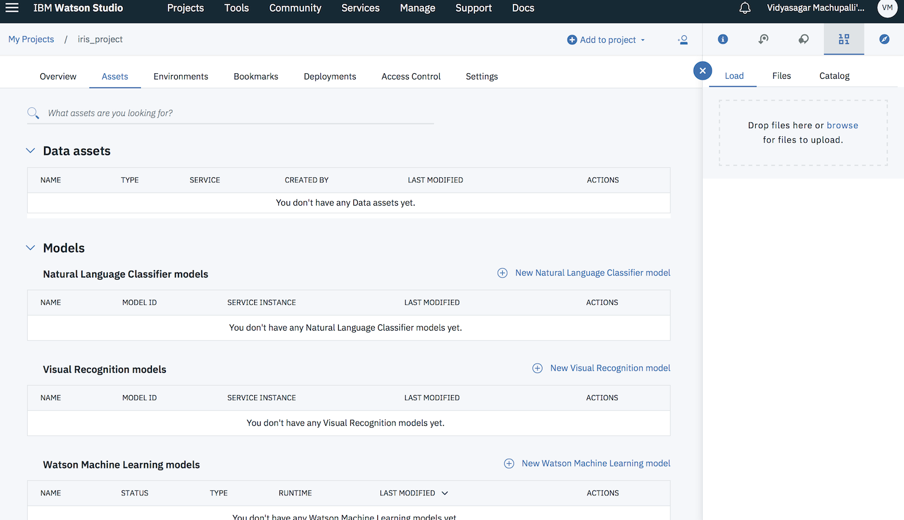
3. Once added, you should see `iris_initial.csv` under the **Data assets** section of the project. Click on the name to see the contents of the data set.

## Associate services
{:#associate_services}
1. Under **Settings**, scroll to **Associated services** > click  **Add service** > choose  **Spark**.
   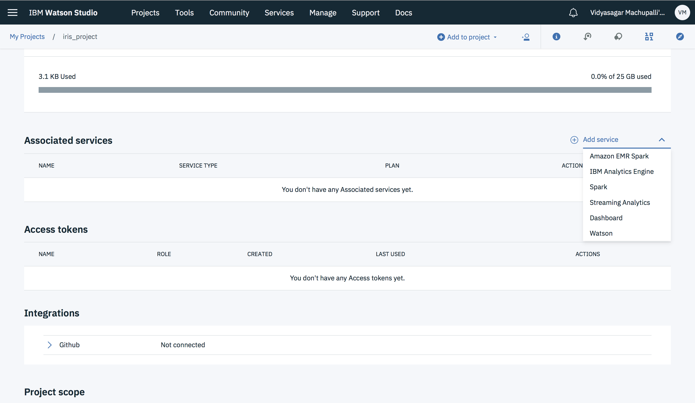
2. Select **Lite** plan and click **Create**. Use the default values and click **Confirm**.
3. Click **Add Service** again and choose **Watson**. Click **Add** on **Machine Learning** tile > choose **Lite** plan > click **Create**.
4. Leave the default values and click **Confirm** to provision a Machine Learning service.

## Build a machine learning model

{:#build_model}

1. Click **Add to project** and select **Watson Machine Learning model**. In the dialog, add **iris_model** as name and an optional description.
2. Under **Machine Learning Service** section, you should see the Machine Learning service you associated in the above step.
   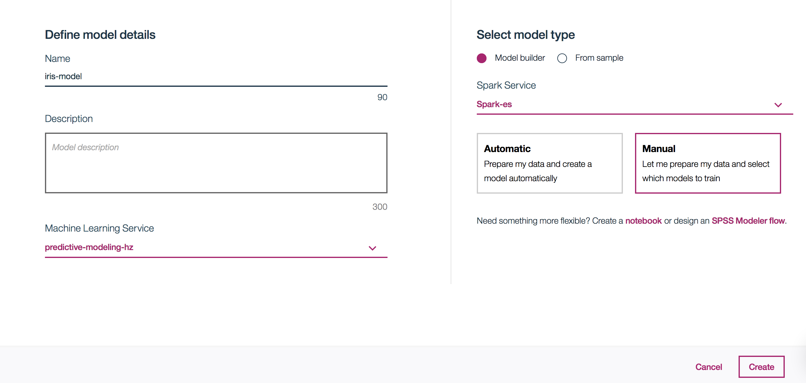
3. Select **Model builder** as your model type and Under **Spark Service or Environment** section, Choose the spark service you created earlier
4. Select **Manual** to manually create a model. Click **Create**.

   For the automatic method, you rely on automatic data preparation (ADP) completely. For the manual method, in addition to some functions that are handled by the ADP transformer, you can add and configure your own estimators, which are the algorithms used in the analysis.
   {:tip}

5. On the next page, select `iris_initial.csv` as your data set and click **Next**.
6. On the **Select a technique** page, based on the data set added, Label columns and feature columns are pre-populated. Select **species (String)** as your **Label Col** and **petal_length (Decimal)** and **petal_width (Decimal)** as your **Feature columns**.
7. Choose **Multiclass Classification** as your suggested technique.
   
8. For **Validation Split** configure the following setting:

   **Train:** 50%,
   **Test** 25%,
   **Holdout:** 25%

9. Click on **Add Estimators** and select **Decision Tree Classifier**, then **Add**.

   You can evaluate multiple estimators in one go. For example, you can add **Decision Tree Classifier** and **Random Forest Classifier** as estimators to train your model and choose the best fit based on the evaluation output.
   {:tip}

10. Click **Next** to train the model. Once you see the status as **Trained & Evaluated**, click **Save**.
   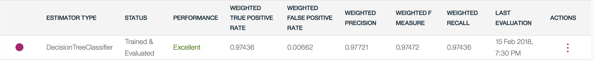

11. Click on **Overview** to check the details of the model.

## Deploy the model and try out the API

{:#deploy_model}

1. Under the created model, click on **Deployments** > **Add Deployment**.
2. Choose **Web Service**. Add a name say `iris_deployment` and an optional description.
3. Click **Save**. On the overview page, click on the name of the new web service. Once the status is **DEPLOY_SUCCESS**, you can check the scoring-endpoint, code snippets in various programming languages, and API Specification under **Implementation**.
4. Click on **View API Specification** to see and test {{site.data.keyword.pm_short}} API endpoints.
   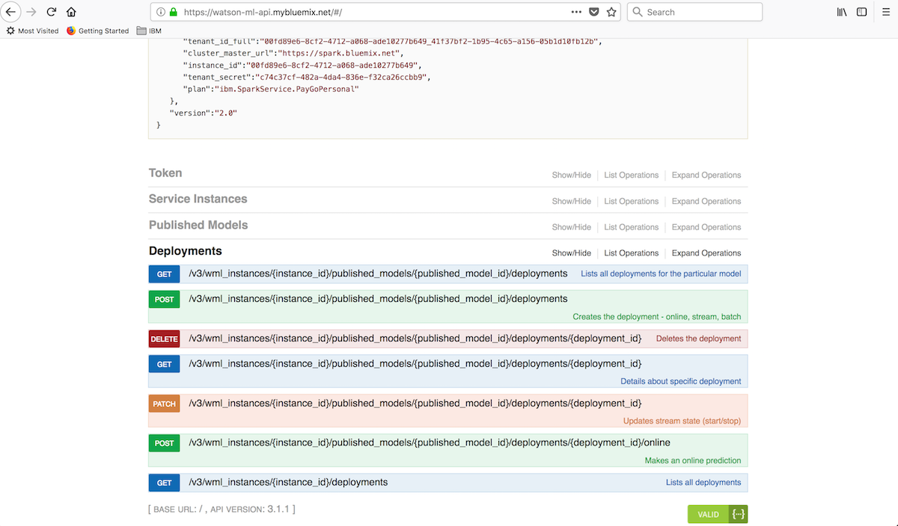

   To start working with the API, you need to generate an **access token** using the **username** and **password** available on the **Service Credentials** tab of the {{site.data.keyword.pm_short}} service instance under [{{site.data.keyword.Bluemix_short}} Dashboard](https://{DomainName}/dashboard/) . Follow the instructions mentioned on the API specification page to generate an **access token**.
   {:tip}
5. To make an online prediction, use the `POST /online` API call.
   * `instance_id` can be found on the **Service Credentials** tab of the {{site.data.keyword.pm_short}} service under [{{site.data.keyword.Bluemix_short}} Dashboard](https://{DomainName}/dashboard/).
   * `deployment_id` and `published_model_id` are under **Overview** of your deployment.
   *  For `online_prediction_input`, use the below JSON

     ```json
     {
     	"fields": ["sepal_length", "sepal_width", "petal_length", "petal_width"],
     	"values": [
     		[5.1, 3.5, 1.4, 0.2]
     	]
     }
     ```
   * Click on **Try it out** to see the JSON output.

6. Using the API endpoints, you can now call this model from any application.

## Test your model

{:#test_model}

1. Under **Test**, you should see input data (Feature data) being populated automatically.
2. Click **Predict** and you should see the **Predicted value for species** in a chart.
   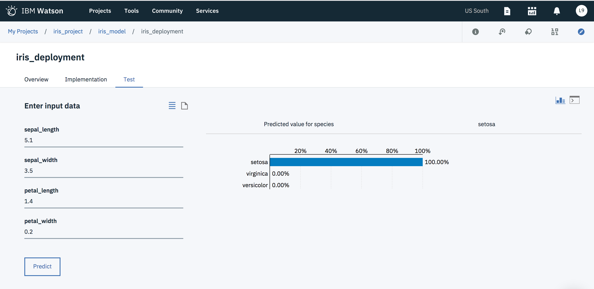
3. For JSON input and output, click on the icons next to the active input and output.
4. You can change the input data and continue testing your model.

## Create a feedback data connection

{:#create_feedback_connection}

1. For continuous learning and model evaluation, you need to store new data somewhere. Create a  [{{site.data.keyword.dashdbshort}}](https://{DomainName}/catalog/services/db2-warehouse) service > **Entry** plan which acts as our feedback data connection.
2. On the {{site.data.keyword.dashdbshort}} **Manage** page, click **Open**. On the top navigation, select **Load**.
3. Click on **browse files** under **My computer** and upload `iris_initial.csv`. Click **Next**.
4. Select **DASHXXXX**, e.g., DASH1234 as your **Schema** and then click on **New Table**. Name it `IRIS_FEEDBACK` and click **Next**.
5. Datatypes are automatically detected. Click **Next** and then **Begin Load**.
   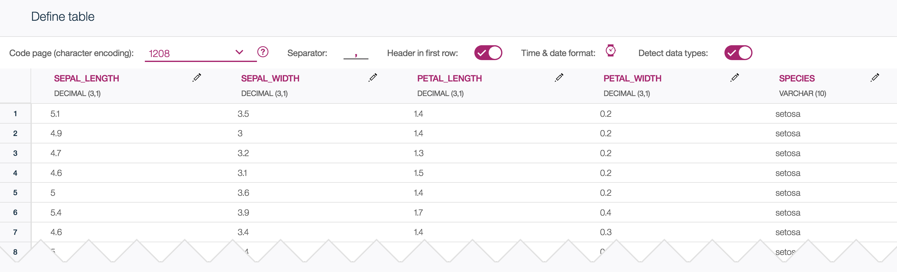
6. A new target **DASHXXXX.IRIS_FEEDBACK** is created.

   You will be using this in the next step where you will be re-training the model for better performance and precision.

## Re-train your model

{:#retrain_model}

1. Return to your [{{site.data.keyword.Bluemix_short}} Dashboard](https://{DomainName}/dashboard/apps) and under the {{site.data.keyword.DSX_short}} service you have been using, click on **Projects** > iris_project >  **iris-model** (under assets) > Evaluation.
2. Under **Performance Monitoring**, Click on **Configure Performance Monitoring**.
3. On the configure Performance Monitoring page,
   * Select the Spark service. Prediction type should be populated automatically.
   * Choose **weightedPrecision** as your metric and set `0.98` as the optional threshold.
   * Click on **Create new connection** to point to the IBM Db2 Warehouse on cloud which you created in the above section.
   * Select the Db2 warehouse connection and once the connection details are populated, click **Create**.
     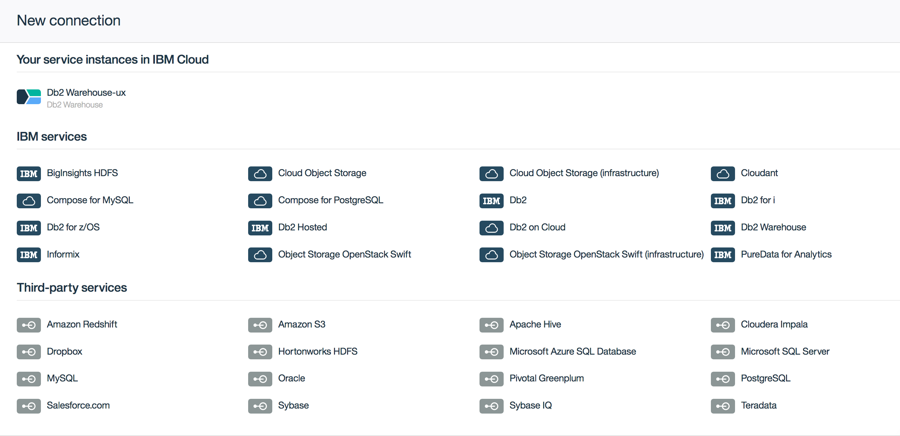
   * Click on **Select feedback data reference** and point to the IRIS_FEEDBACK table and click **Select**.
     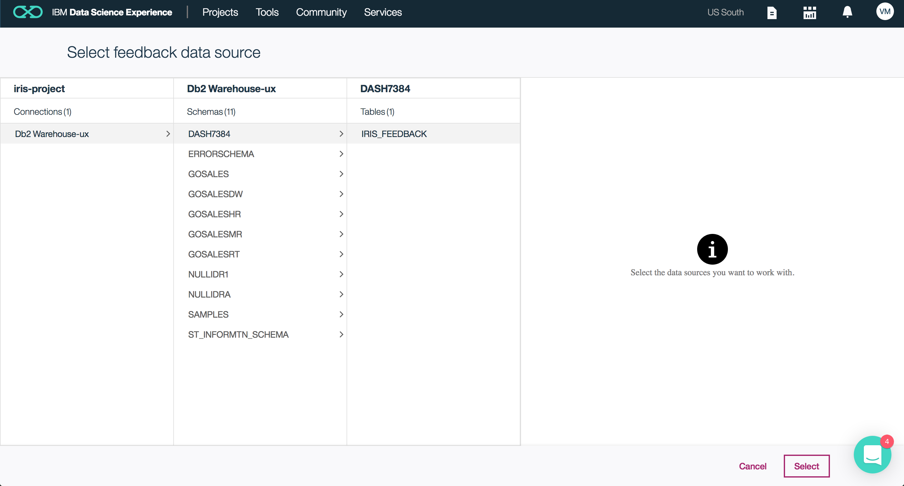
   * In the **Record count required for re-evaluation** box, type the minimum number of new records to trigger retraining. Use **10** or leave blank to use the default value of 1000.
   * In the **Auto retrain** box, select one of the following options:
     - To start automatic retraining whenever model performance is below the threshold that you set, select **when model performance is below threshold**. For this tutorial, you will choose this option as our precision is below the threshold (.98).
     - To prohibit automatic retraining, select **never**.
     - To start automatic retraining regardless of performance, select **always**.
   * In the **Auto deploy** box, select one of the following options:
     - To start automatic deployment whenever model performance is better than the previous version, select **when model performance is better than previous version**. For this tutorial, you will choose this option as our aim is to continuosly improve the performance of the model.
     - To prohibit automatic deployment, select **never**.
     - To start automatic deployment regardless of performance, select **always**.
   * Click **Save**.
     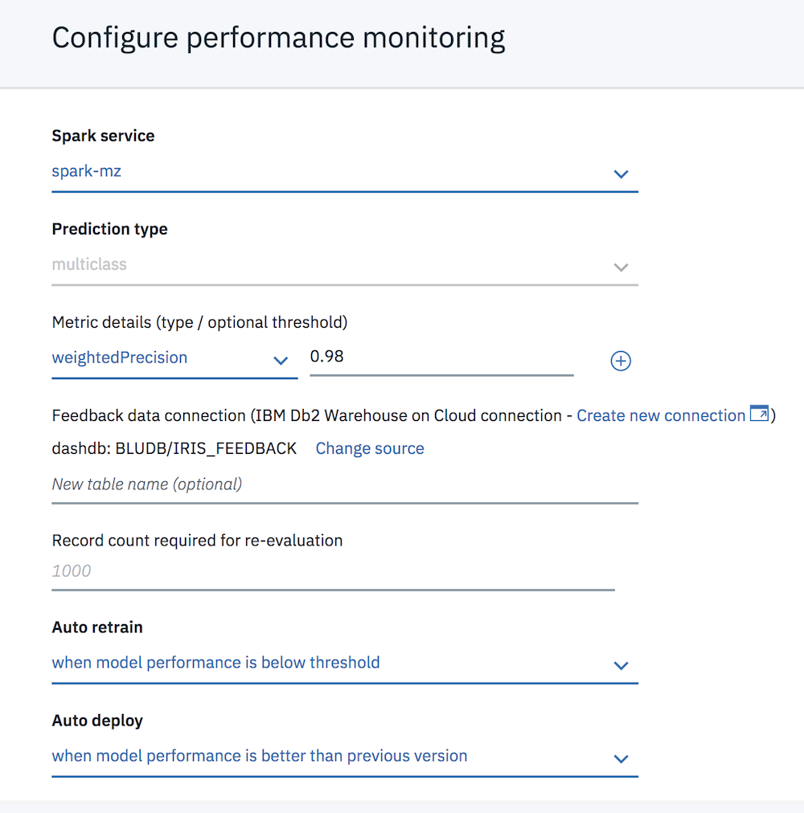
4. Download the file [iris_retrain.csv](https://ibm.box.com/shared/static/96kvmwhb54700pjcwrd9hd3j6exiqms8.csv). Thereafter, click **Add feedback data**, select the downloaded csv file, and click **Open**.
5. Click **New evaluation** to begin.
     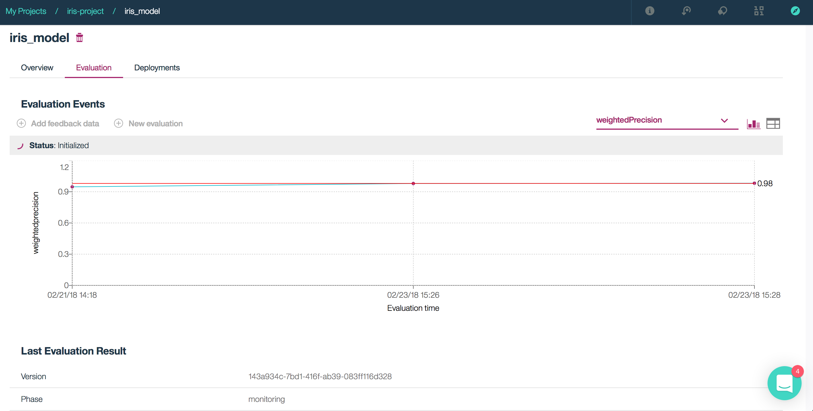
6. Once the evaluation completes. You can check the **Last Evalution Result** section for the improved **WeightedPrecision** value.

## Remove resources
{:removeresources}

1. Navigate to [{{site.data.keyword.Bluemix_short}} Dashboard](https://{DomainName}/dashboard/) > choose the Location, Org and Space where you have created the services.
2. Delete the respective {{site.data.keyword.DSX_short}}, {{site.data.keyword.sparks}}, {{site.data.keyword.pm_short}}, {{site.data.keyword.dashdbshort}} and {{site.data.keyword.cos_short}} services which you created for this tutorial.

## Related content
{:related}

- [Watson Studio Overview](https://dataplatform.ibm.com/docs/content/getting-started/overview-ws.html?audience=wdp&context=wdp)
- [Detect Anomalies using Machine Learning](https://{DomainName}/docs/tutorials/gather-visualize-analyze-iot-data.html#data_experience)
- [Watson Data Platform Tutorials](https://www.ibm.com/analytics/us/en/watson-data-platform/tutorial/)
- [Automatic model creation](https://datascience.ibm.com/docs/content/analyze-data/ml-model-builder.html?linkInPage=true)
- [Machine learning & AI](https://dataplatform.ibm.com/docs/content/analyze-data/wml-ai.html?audience=wdp&context=wdp)
- [Watson machine learning client library](https://dataplatform.ibm.com/docs/content/analyze-data/pm_service_client_library.html#client-libraries)
