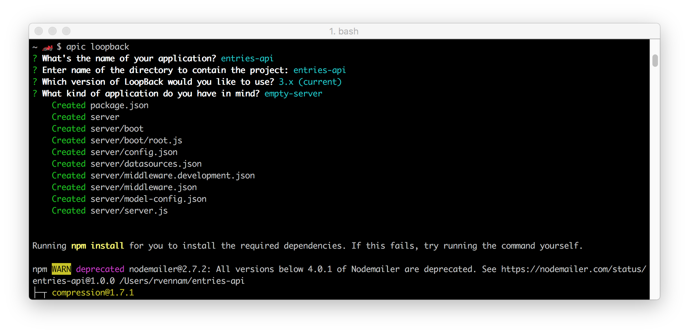
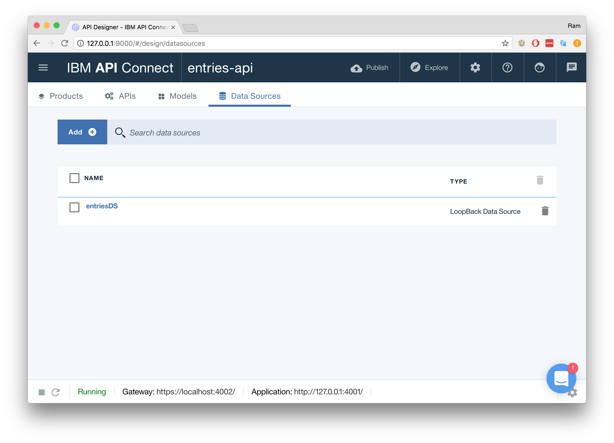
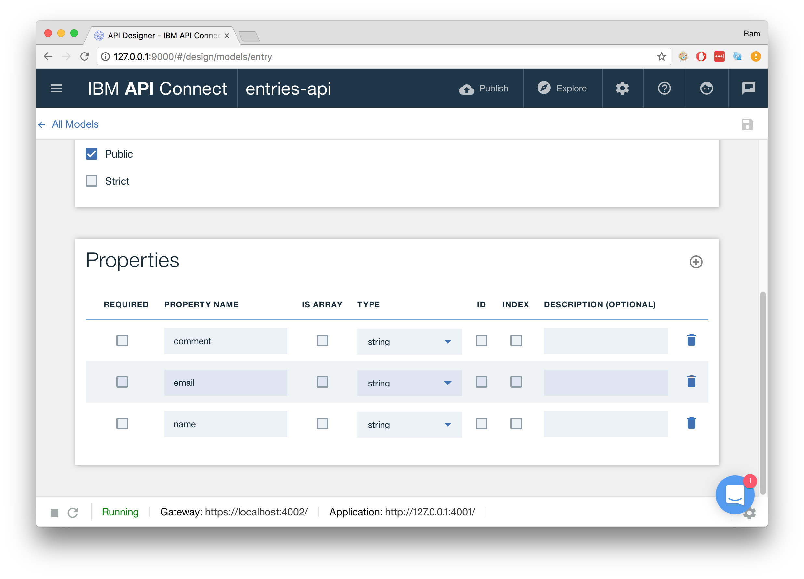
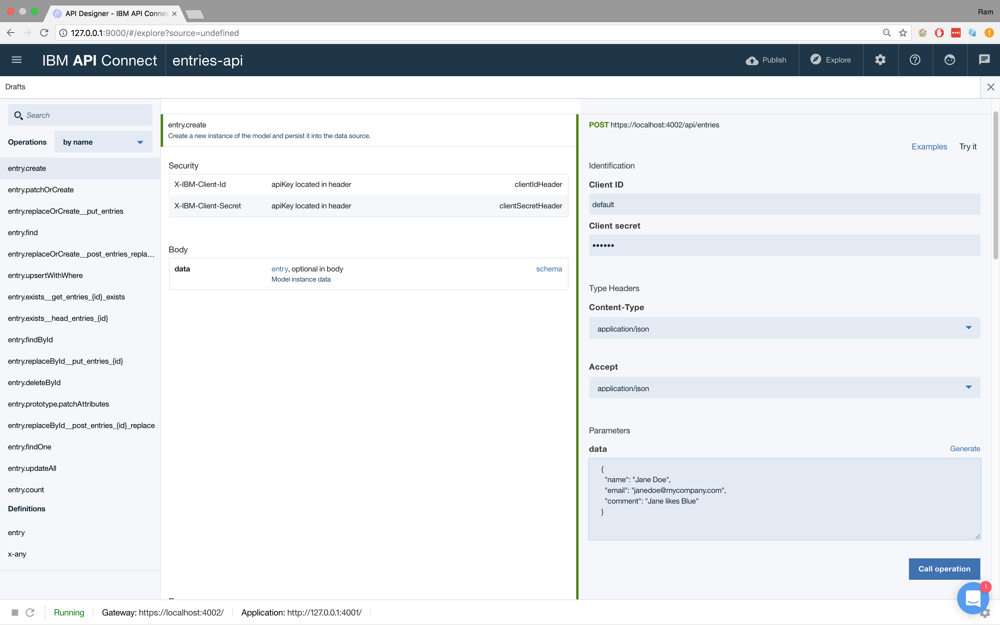
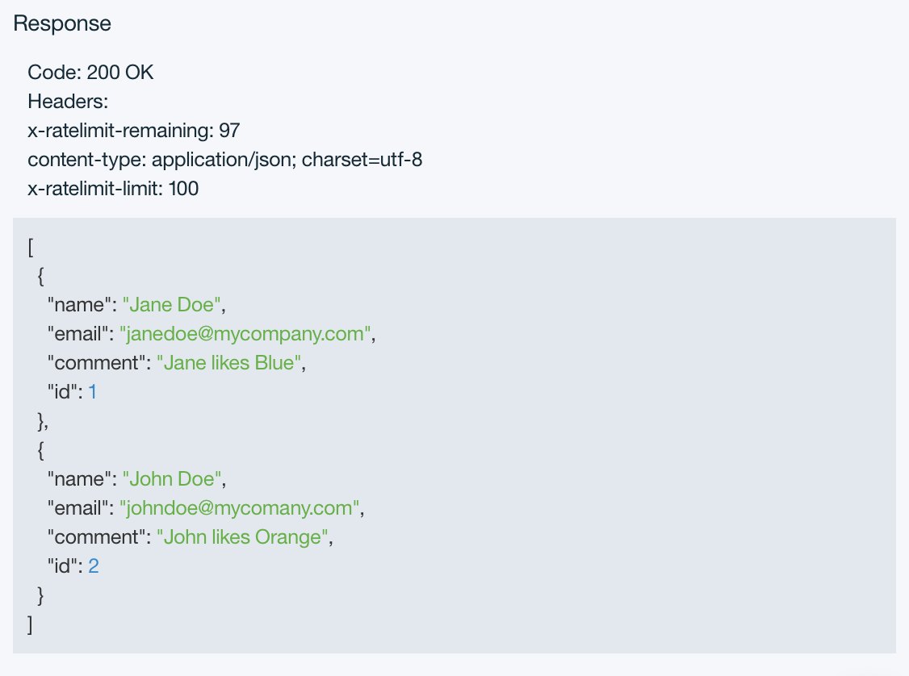
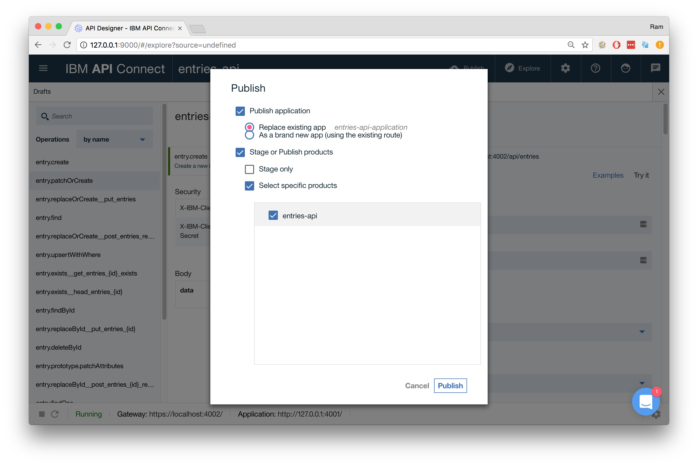
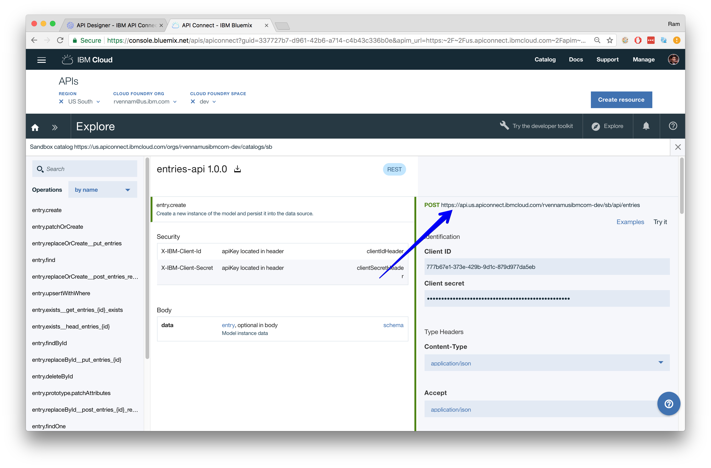
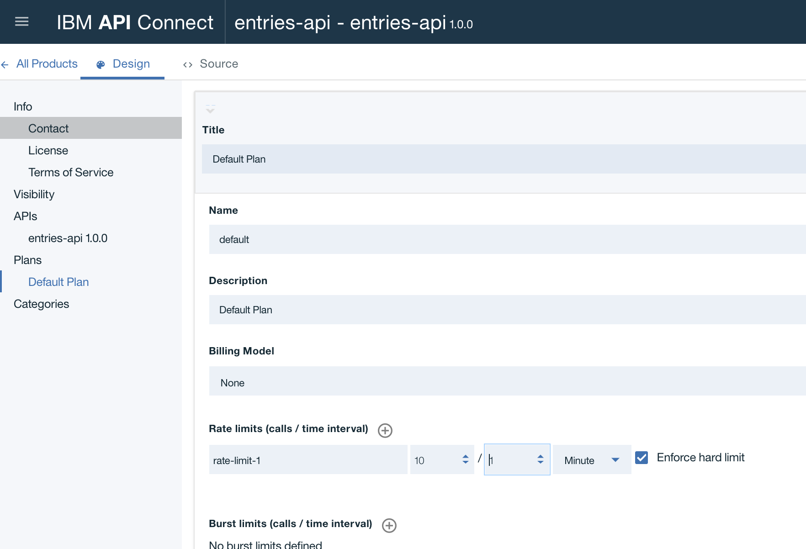

---
copyright:
  years: 2017, 2018
lastupdated: "2018-06-05"

---

{:java: #java .ph data-hd-programlang='java'}
{:swift: #swift .ph data-hd-programlang='swift'}
{:ios: #ios data-hd-operatingsystem="ios"}
{:android: #android data-hd-operatingsystem="android"}
{:shortdesc: .shortdesc}
{:new_window: target="_blank"}
{:codeblock: .codeblock}
{:screen: .screen}
{:tip: .tip}
{:pre: .pre}

# Create, secure and manage REST APIs

This tutorial demonstrates how to create REST APIs using the LoopBack Node.js API Framework. With Loopback you can quickly create REST APIs that connect devices and browsers to data and services. Then add management, visibility, security and rate limiting to your API using {{site.data.keyword.apiconnect_long}}.
{:shortdesc}

## Objectives

* Build a REST API with little to no coding
* Publish your API on {{site.data.keyword.Bluemix_notm}} to reach developers
* Bring existing APIs into {{site.data.keyword.apiconnect_short}}
* Securely expose and control access to systems of record

## Services used

This tutorial uses the following runtimes and services:

* [Loopback](https://loopback.io/)
* [{{site.data.keyword.apiconnect_short}}](https://console.bluemix.net/docs/services/apiconnect/index.html)
* [SDK for Node.js](https://console.bluemix.net/catalog/starters/sdk-for-nodejs) Cloud Foundry App

## Architecture


1. Developer defines RESTful API
2. Developer publishes API to {{site.data.keyword.apiconnect_long}}
3. Users and applications consume API

## Before you begin

* Download and install [Node.js](https://nodejs.org/en/download/)

## Create a REST API in Node.js

{: #create_api}
In this section, you will create an API in Node.js using [LoopBack](https://loopback.io/doc/index.html). LoopBack is a highly-extensible, open-source Node.js framework that enables you to create dynamic end-to-end REST APIs with little or no coding.

### Create application

1. Install the {{site.data.keyword.apiconnect_short}} command line tool.
  ```bash
  npm install -g apiconnect
  ```
2. Enter the following command to create the application.
  ```bash
  apic loopback
  ```
3. At the prompt, enter `entries-api` as the project name and press `Enter`.
  ```sh
  ? What's the name of your application? entries-api
  ```
4. Press `Enter` to use a directory with the same name as the project.
5. Choose the **current** version of LoopBack.
6. Select **empty-server** for the kind of application.
  ```bash
    ? What kind of application do you have in mind? (Use arrow keys)
    ? empty-server (An empty LoopBack API, without any configured models or datasources)
      hello-world (A project containing a basic working example, including a memory database)
      notes (A project containing a basic working example, including a memory database)
  ```
  

### Add a data source

Data sources represent backend systems such as databases, external REST APIs, SOAP web services and storage services. Data sources typically provide create, retrieve, update and delete (CRUD) functions. While Loopback supports many types of [data sources](http://loopback.io/doc/en/lb3/Connectors-reference.html), for the sake of simplicity, you will use an in-memory data store with your API.

1. Change directory to the new project and launch the API Designer.
  ```bash
  cd entries-api
  apic edit
  ```
2. Click on **Data Sources > Add**. A New LoopBack Data Source window opens.
3. Enter `entriesDS` in the **Name** text field and click **New**.
4. Use **in-memory db** for the **Connector** setting.
5. Click **All Data Sources** on the top left. The data source will appear in the list of data sources.

   The editor automatically updates the server/datasources.json file with settings for the new data source.
   {:tip}



### Add a model

A model is a JavaScript object with both Node and REST APIs that represents data in backend systems. Models are connected to these systems via data sources. In this section, you will define the structure of your data and connect it to the data source previously created.

1. Click **Models > Add** and enter `entry` in the **Name** text field and click **New**
  .
2. In the **Data Source** field, select **entriesDS**.
3. In the **Properties**, click the **Add property** icon .
4. In the **Property Name** text field, enter `name` and select **Type** of **string**.
5. Repeat with **Property Name** text field `email` and **Type** of **string**.
6. Repeat with **Property Name** text field `comment` and **Type** of **string**.
7. Click the **Save** icon  to save your changes.
8. Click **All Models** to finish editing the model.



## Test your LoopBack application

In this section, you will start a local instance of your Loopback application and test the API by inserting and querying data using the API Designer.

1. Start the local server by clicking **Start** icon   at the bottom of the screen and wait for the **Running** message.
  .
2. Click the **Explore** icon  to see the API Designer Explore tool. The sidebar shows all of the REST operations for the LoopBack models in the API.
3. Click the operation **entry.create** in the left pane to display the endpoint. The center pane displays summary information about the endpoint, including its parameters, security, model instance data and response codes. The right pane provides template code to call the endpoint using the cURL command, and languages such as Ruby, Python, Java and Node.
4. On the right pane click **Try it**. Scroll down to **Parameters** and enter the following in **data**
  ```
  {
    "name": "Jane Doe",
    "email": "janedoe@mycompany.com",
    "comment": "Jane likes Blue"
  }
  ```
5. Click **Call operation**.
  
6. Confirm successful POST by checking for **Response Code: 200 OK**.

  **Note:** If you see an error message due to an untrusted certificate for localhost, click the link provided in the error message in API Designer Explore tool to accept the certificate, then proceed to visit the URL in your web browser. The exact procedure depends on the web browser you are using. If you load the REST endpoints directly in your browser, you will see the message: {"name":"PreFlowError","message":"unable to process the request"}. Then, attempt the **Call operation** again.

7. Add another entry using a curl command. Confirm the port matches your Application port.
  ```bash
  curl --request POST \
  --url https://localhost:4002/api/entries \
  --header 'accept: application/json' \
  --header 'content-type: application/json' \
  --header 'x-ibm-client-id: default' \
  --header 'x-ibm-client-secret: SECRET' \
  --data '{"name":"John Doe","email":"johndoe@mycomany.com","comment":"John likes Orange"}' \
  --insecure
  ```
8. Click **entry.find** > **Try It** (on the right pane) > **Call operation**  to display all entries. You should see JSON for **Jane Doe** and **John Doe**.
  

You can also start the application manually by issuing the `npm start` command. Your REST API will be available at http://localhost:3000/api/entries
{:tip}

## Create {{site.data.keyword.apiconnect_short}} service

To prepare for the next steps, you need to create an **{{site.data.keyword.apiconnect_short}}** service on {{site.data.keyword.Bluemix_notm}} which will act as the gateway for your API. This service on {{site.data.keyword.Bluemix_notm}} will be used to manage, secure and rate limit your API.

1. Launch {{site.data.keyword.Bluemix_notm}} [Dashboard](https://console.bluemix.net/dashboard).
2. Navigate to **Catalog > APIs > {{site.data.keyword.apiconnect_short}}** and click **Create**.
  

## Publish API to {{site.data.keyword.Bluemix_notm}}

{: #publish}
You will use the API Designer to deploy your application to {{site.data.keyword.Bluemix_notm}} as a Cloud Foundry application and also publish your API definition to **{{site.data.keyword.apiconnect_short}}**. The API Designer is your local toolkit. If you closed it, relaunch it with `apic edit` from the project directory.

You can also deploy the application manually using the `ibmcloud cf push` command; however, it will not be secured. To [import the API](https://console.bluemix.net/docs/services/apiconnect/tutorials/tut_rest_landing.html#tut_rest_landing) into {{site.data.keyword.apiconnect_short}}, use the OpenAPI definition file is available in the `definitions` folder. Deploying using the API Designer secures the application and imports the definition automatically. {:tip}

1. Back in the API Designer, click **Publish > Add and Manage Targets > Add IBM Bluemix target**.
2. Select the **Region** and **Organization** that you want to publish to.
3. Select the **Sandbox** Catalog and click **Next**.
4. Enter `entries-api-application` under **Type a new application name** and click **+**.
5. Click **entries-api-application** in the list and click **Save**.
6. Click on the **Menu** icon on the left top most corner > **Projects** > **entries-api** in the list.
7. In the API Designer UI, click **APIs > entries-api > Assemble**.
8. In the Assembly editor, click the **Filter policies** icon.
9. Select **DataPower Gateway policies** and click **Save**.
10. Click **Publish** on the top bar and select your target. Select **Publish application** and Stage or Publish Products > Select **Specific products** > **entries-api**.
11. Click **Publish** and wait for the application to finish publishing.
   

   You can republish or stage your application anytime by clicking on **publish** anytime.
   {:tip}

The API application is now published to {{site.data.keyword.Bluemix_notm}} as a Cloud Foundry application. You can see it by looking at Cloud Foundry applications under {{site.data.keyword.Bluemix_notm}} [Dashboard](https://console.bluemix.net/dashboard), but direct access using the URL is not possible as the application is protected.

## API Gateway

Until now, you have been designing and testing your API locally. In this section, you will use {{site.data.keyword.apiconnect_short}} to test your deployed API on {{site.data.keyword.Bluemix_notm}}.

1. Launch the {{site.data.keyword.Bluemix_notm}} [Dashboard](https://console.bluemix.net/dashboard) page.
2. Find and select your **{{site.data.keyword.apiconnect_short}}** service under **Cloud Foundry Services**.
3. Click on **Explore** and select **Sandbox**.
4. Click on **entry.create**.
5. On the right pane, click **Try it**. Scroll down to **Parameters** and enter the following in **data**. A 200 response should display.
  ```javascript
  {
    "name": "Cloud User",
    "email": "cloud@mycompany.com",
    "comment": "Entry on the cloud!"
  }
  ```



Your managed and secure API URL is displayed next to each operation and it should look like `https://us.apiconnect.ibmcloud.com/orgs/ORG-SPACE/catalogs/sb/api/entries`.
{: tip}

## Rate Limiting

Setting rate limits enables you to manage the network traffic for your APIs and for specific operations within your APIs. A rate limit is the maximum number of calls allowed in a particular time interval.

1. Back in the API Designer, click **Products > entries-api**.
2. Select **Default Plan** on the left.
3. Expand **Default Plan** and scroll down to **Rate limits** field.
4. Set fields to **10** calls / **1** **Minute**.
5. Select **Enforce hard limit** and click **Save** icon.
  
6. Follow steps under [Publish API to {{site.data.keyword.Bluemix_notm}}](#publish) section to re-publish your API.

Your API is now rate limited to 10 requests per minute. See more info about [Setting up rate limits](https://console.bluemix.net/docs/services/apiconnect/tutorials/tut_rate_limit.html#setting-up-rate-limits) or explore the API Designer to see all the management features available.

## Related content

* [Loopback Documentation](https://loopback.io/doc/index.html)
* [Getting started with {{site.data.keyword.apiconnect_long}}](https://console.bluemix.net/docs/services/apiconnect/index.html#index)
