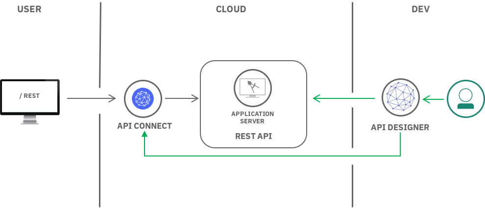

---
copyright:
  years: 2017
lastupdated: "2017-11-29"

---

{:java: #java .ph data-hd-programlang='java'}
{:swift: #swift .ph data-hd-programlang='swift'}
{:ios: #ios data-hd-operatingsystem="ios"}
{:android: #android data-hd-operatingsystem="android"}
{:shortdesc: .shortdesc}
{:new_window: target="_blank"}
{:codeblock: .codeblock}
{:screen: .screen}
{:tip: .tip}
{:pre: .pre}

# Create, Secure and Manage REST APIs
This tutorial is a walkthrough of creating a new REST API in Node.js using the LoopBack framework, and then using the API Connect service to add management, visibility, security and rate limiting.
{:shortdesc}

<p style="text-align: center;">

</p>

## Objectives
* Create a REST API in Node.js
* Deploy Node.js application
* Import API Spec to API Connect
* Secure and Manage API

## Products
This tutorial uses the following products:
* [Loopback](https://loopback.io/)
* [API Connect](https://console.bluemix.net/docs/services/apiconnect/index.html)
* [SDK for Node.js](https://console.bluemix.net/catalog/starters/sdk-for-nodejs) Cloud Foundry App

## Before you begin
Download and install [Node.js](https://nodejs.org/en/download/)

## Create a REST API in Node.js
{: #create_api}
In this section, you will create an API in Node.js using the [LoopBack framework](https://loopback.io/doc/index.html). LoopBack is a highly-extensible, open-source Node.js framework that enables you to create dynamic end-to-end REST APIs with little or no coding.

### Create application
1.  Install IBM API Connect command line tool.
	```bash 
	npm install -g apiconnect
	```
2. Enter the following command to create the application.
	```bash 
	apic loopback
	```
3.  At the prompt, enter `entries-api` as the project name and press **Enter**.
	```bash
	? What's the name of your application? entries-api
	```
4.  Press **Enter** to use a directory with the same name as the project.
5.  Choose the **current** version of LoopBack.
6.  Select **empty-server** for the kind of application.
	```bash
    ? What kind of application do you have in mind? (Use arrow keys)
    ? empty-server (An empty LoopBack API, without any configured models or datasources) 
      hello-world (A project containing a basic working example, including a memory database) 
      notes (A project containing a basic working example, including a memory database)
	```


### Add a data source
Adding a data source allows you to configure where the data should be persisted. Various types of databases are supported, but for the sake of simplicity, we will use an in-memory data store.

1. Change directory to the new project and launch the API Designer.
  ```bash
	cd entries-api
	apic edit
	```
2. Click on **Data Sources > Add**. The New LoopBack Data Source window opens. .
3. Enter `entriesDS` in the **Name** text field and click **New**.
4. Use **in-memory db** for the **Connector** setting. 
5. Click **All Data Sources** on the top left. The data source will appear in the list of data sources, and the editor updates the server/datasources.json file with settings for the new data source.


### Add a model
Models allow you to define and contorl the data structure and schema of your API.

1. Click **Models > Add** and enter `entry` in the **Name** text field
.
2. In the **Data Source** field, select **weatherDS**.
	
5. In the **Properties**, click the **Add property** icon .
6. In the **Property Name** text field, enter `name` and select **Type** of **string**.
7. Repeat with **Property Name** text field `email` and **Type** of **string**.
8. Repeat with **Property Name** text field `comment` and **Type** of **string**.
9. Click the **Save** icon  to save your changes.
10. Click **All Models** to finish editing the model.


## Test your LoopBack application
In this section, you will start a local instance of your Loopback application and test the API by inserting and querying data.

1. Start the local test servers.
	a. In the test console at the bottom of the screen, click the **Start the servers** icon :
	
	b. Wait until the Running message is displayed:
	
2. Click the **Explore** icon  to see the API Designer Explore tool. The sidebar shows all of the REST operations for the LoopBack models in the API.
3. Click the operation **entry.create** in the left pane to display the endpoint.

  The center pane displays summary information about the endpoint, including its parameters, security, model instance data, and response codes. The right pane provides template code to call the endpoint using the curl command, and languages such as Ruby, Python, Java, and Node.
4. On the right pane click **Try it**. Scroll down to **Parameters** and enter the following in **data**
  ```
  {
    "name": "Jane Doe",
    "email": "janedoe@mycompany.com",
    "comment": "Jane likes Blue"
  }
  ```
5. Click **Call operation**.

>![troubleshooting]
>If you see an error message due to an untrusted certificate for localhost, click the link provided in the error message in API Designer Explore tool to accept the certificate, then proceed to call the operations in your web browser. The exact procedure depends on the web browser you are using. If you load the REST endpoints directly in your browser, you will see the message: {"name":"PreFlowError","message":"unable to process the request"}. You must use the API Designer Explore tool to test REST endpoints in your browser because it includes the requisite headers and other request parameters.
>
>![troubleshooting]
>If you get a response code of **422 - Unprocessable Entity** with the following payload:
>
>
>the `id` data element has not been removed from the generated data. Remove the `id` data element and re-run the test.
>![troubleshooting]
>If you get the error **failed to parse request body**, you have to remove the comma following the last `humidity_high` number.
6. Confirm by scrolling down and checking for **Response Code: 200 OK**
7. Click **entry.find > Call operation** to display all entries instances. You should see JSON for **Jane Doe**
8. Add another entry using a curl command. Confirm the port matches your Application port
  ```bash
  curl --request POST \
  --url https://localhost:4002/api/entries \
  --header 'accept: application/json' \
  --header 'content-type: application/json' \
  --header 'x-ibm-client-id: default' \
  --header 'x-ibm-client-secret: SECRET' \
  --data '{"name":"John Doe","email":"johndoe@mycomany.com","comment":"Jane likes Orange"}' \
  --insecure
  ```

## Create API Connect service
To prepare for the next steps, you need to create an **API Connect** service on IBM Cloud which will act as the gateway for your API.

1. Launch [IBM Cloud](https://console.bluemix.net) Dashboard
2. Navigate to **Catalog > APIs > API Connect** and click **Create**

## Publish API to IBM Cloud
{: #publish}

You will use the API Designer to deploy your application to IBM Cloud as a Cloud Foundry application and also publish your API definition to **API Connect**.

1. Back in the API Designer, click **Publish > Add and Manage Targets > Add IBM Bluemix target**.
2. Select the **Region** and **Organization** that you want to publish to.
3. Select the **Sandbox** Catalog and click **Next**.
4. Enter `entries-api-application` under **Type a new application name** and click **+**
5. Click **entries-api-application** in the list and click **Save**.
6.  Click **Publish** again and select the newly created target
7.  Click **Publish**.
8. In the API Designer UI, click **APIs > entries-api > Assemble**
9. In the Assembly editor, click the **Filter policies** icon.
10. Select **DataPower Gateway policies** and click **Save**.
11. Click **Publish** and select your target
12. Select **Publish application** then select **entries-api**
13. Click **Publish** and wait 5 minutes for the application to finish publishing.

The API application is now published to IBM Cloud as a Cloud Foundry application. You can see it by looking at Cloud Foundry applications under [IBM Cloud](https://console.bluemix.net) Dashboard. However, direct access using the URL is not possible as the application is protected.

## API Gateway
Next, you will use the **API Connect** service to test your deployed API on IBM Cloud

1. Launch [IBM Cloud](https://console.bluemix.net) Dashboard
2. Find and select your **API Connect** service under **Cloud Foundry Services**
3. Click on **Explore** and select **Sandbox**
4. Click on **entry.create**
5. On the right pane click **Try it**. Scroll down to **Parameters** and enter the following in **data**
  ```
  {
    "name": "Cloud User",
    "email": "cloud@mycompany.com",
    "comment": "Entry on the cloud!"
  }
  ```
A 200 response should displayed.

Your managed and secure API URL is displayed next to each operation and it should look like 
```
https://us.apiconnect.ibmcloud.com/orgs/ORG-SPACE/catalogs/sb/api/entries**
```
## Rate Limiting
In this section, 

1. Back in the API Designer, click **Products > entries-api**.
2. Select **Default Plan** on the left
3. Expand **Default Plan** and scroll down to **Rate limits** field
4. Set fields to **10** calls / **1** **Minute**
5. Select **Enforce hard limit** and click **Save** icon.
6. Follow steps under [Publish API to IBM Cloud](#publish) section to re-pulish your API

Your API is now rate limited to 10 requests per minute.


## Related information

* [Loopback Documentation](https://loopback.io/doc/index.html)
* [Getting Started with API Connect](https://developer.ibm.com/apiconnect/getting-started/)
