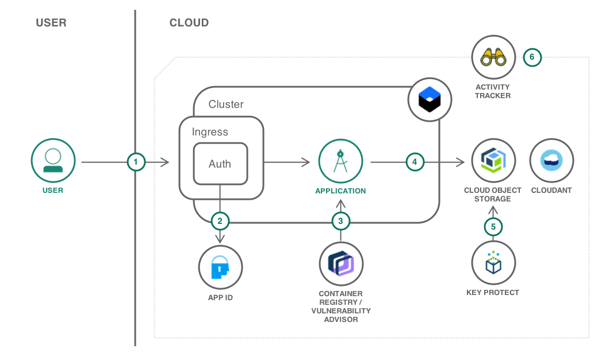

---
copyright:
  years: 2018
lastupdated: "2018-08-02"

---

{:java: #java .ph data-hd-programlang='java'}
{:shortdesc: .shortdesc}
{:new_window: target="_blank"}
{:codeblock: .codeblock}
{:screen: .screen}
{:tip: .tip}
{:pre: .pre}

# Leverage security services for a Kubernetes app

* data is the value, needs to be protected, in flight, at rest.
* bring your own keys, SSL certificates

{:shortdesc}

## Objectives
{: #objectives}

* Encrypt bucket files with your own encryption keys
* Require users to authenticate before accessing an application
* Manage the life cycle of encryption keys and SSL certificates centrally

## Services used
{: #services}

This tutorial uses the following runtimes and services:
* [{{site.data.keyword.containershort_notm}}](https://console.bluemix.net/containers-kubernetes/catalog/cluster)
* [{{site.data.keyword.registryshort}}](https://console.bluemix.net/containers-kubernetes/launchRegistryView)
* [{{site.data.keyword.appid_short}}](https://console.bluemix.net/catalog/services/AppID)
* [{{site.data.keyword.cloudant_short_notm}}](https://console.bluemix.net/catalog/services/cloudantNoSQLDB)
* [{{site.data.keyword.cos_short}}](https://console.bluemix.net/catalog/services/cloud-object-storage)
* [{{site.data.keyword.cloudaccesstrailshort}}](https://console.bluemix.net/catalog/services/activity-tracker)
* [{{site.data.keyword.keymanagementserviceshort}}](https://console.bluemix.net/catalog/services/key-protect)
* [{{site.data.keyword.cloudcerts_short}}](https://console.bluemix.net/catalog/services/certificate-manager)

This tutorial requires a [non-Lite account](https://console.bluemix.net/docs/account/index.html#accounts) and may incur costs. Use the [Pricing Calculator](https://console.bluemix.net/pricing/) to generate a cost estimate based on your projected usage.

## Architecture
{: #architecture}

The tutorial features an app that enables groups of users to upload files to a common storage pool and provide access to those files via shareable links. The app is written in Node.js and deployed as Docker container to the {{site.data.keyword.containershort_notm}}. It leverages several security-related services and features to improve app security.

<p style="text-align: center;">

  
</p>

1. The user connects to the application.
2. The SSL certificate used for the secure connection is defined in {{site.data.keyword.cloudcerts_short}} and used by the Kubernetes Ingress.
3. {{site.data.keyword.appid_short}} secures the application and redirects the user to the authentication page. Users can sign up from there too.
4. The application is running in a Kubernetes cluster from an image stored in the {{site.data.keyword.registryshort}}. The image is scanned for vulnerabilities.
5. Files uploaded by the user are stored in {{site.data.keyword.cos_short}}.
6. The bucket where the files are stored is using a user-provided key to encrypt the data.
7. All activities related to managing the solution are logged by {{site.data.keyword.cloudaccesstrailshort}}.

## Before you begin
{: #prereqs}

1. [Install all the necessary command line (CLI) tools by following](https://console.bluemix.net/docs/cli/index.html#overview)
1. Identify **a region**, **a Cloud Foundry organization and a space**, and **a resource group** where you will deploy the application and its resources.
1. Make sure you have [one private repository](https://console.bluemix.net/containers-kubernetes/registry/private) to push Docker images in the selected region.
  
## Create services
{: #setup}

_to be removed before release_

1. Create Activity Tracker
1. Create cluster, takes a few minutes, do it early (done)

1. Create Key Protect (done)
1. Create root key in Key Protect (done)

1. Create COS (done)
1. Give COS the right to read Key Protect keys (done)
1. Create COS bucket right Key Protect root key (done)

1. Create Cloudant (done)
1. Create database in Cloudant (done)

1. Create App ID (done)
1. Add cluster ingress in App ID redirect_uris (done)

1. Create credentials for COS (done)
1. Create credentials for Cloudant (done)
1. Create .env files with COS/Cloudant credentials
1. Create kubernetes secret in cluster

1. Build Docker image in registry (bx cr build) (done)
1. Update yaml with Docker image and cluster ingress
1. Apply yaml to cluster
1. App is live! Try it

### Capture user and application interactions 
{: #activity-tracker }

what is activity tracker, what does it bring

<!-- * Deploy Activity Tracker (no config necessary..?) -->

1. Go in the catalog and create an instance of [{{site.data.keyword.cloudaccesstrailshort}}](https://console.bluemix.net/catalog/services/activity-tracker)

### Create a cluster for the application

{{site.data.keyword.containershort_notm}} provides an environment to deploy highly available apps in Docker containers that run in Kubernetes clusters.

Skip this section if you have an existing **Standard** cluster you want to reuse with this tutorial.
{: tip}

1. Go to the [cluster creation page](https://console.bluemix.net/containers-kubernetes/catalog/cluster/create).
   1. Set the **Location** to the region you identified in previous steps.
   1. Set **Cluster type** to **Standard**.
   1. Set **Availability** to **Single Zone**.
   1. Select a **Master Zone**.
1. Keep the default **Kubernetes version**, **Hardware isolation**.
1. Optionally, if you plan to only deploy this tutorial on this cluster, use the smallest flavor and set **Worker nodes** to **1**.
1. Set the **Cluster name** to **secure-file-storage-cluster**.
1. **Create Cluster**

While the cluster is being provisioned, you will create the other services required by the tutorial.

### Use your own encryption keys

{{site.data.keyword.keymanagementserviceshort}} helps you provision encrypted keys for apps across {{site.data.keyword.Bluemix_notm}} services. {{site.data.keyword.keymanagementserviceshort}} and {{site.data.keyword.cos_full_notm}} [work together to help you own the security of your at-rest data](https://console.bluemix.net/docs/services/key-protect/integrations/integrate-cos.html#integrate-cos). In this section, you will create one root key for the storage bucket.

1. Create an instance of [{{site.data.keyword.keymanagementserviceshort}}](https://console.bluemix.net/catalog/services/kms)
   * Set the name to **secure-file-storage-kp**
   * Select the resource group where to create the service instance
1. Under **Manage**, add a new key. This key will be used to encrypt the storage bucket content.
   * Set the name to **secure-file-storage-bucket**
   * Set the key type to **Root key**
   * Then **Generate key**

### Setup storage for user files

The application stores the user files in a {{site.data.keyword.cos_short}} bucket and maintain a mapping between the files and the users in a {{site.data.keyword.cloudant_short_notm}} database.

#### A bucket for the content

1. Create an instance of [{{site.data.keyword.cos_short}}](https://console.bluemix.net/catalog/services/cloud-object-storage).
   * Set the **name** to **secure-file-storage-cos**.
   * Use the same **resource group** as for the previous services.
1. Under **Service credentials**, create *New credential*.
   * Set the **name** to **secure-file-storage-cos-key**.
   * Set **Inline Configuration Parameters** to **{"HMAC":true}**.
   * **Add**.
1. Make note of the credentials you will need them in a later step.

Before creating the bucket, you need to grant **secure-file-storage-cos** with access to the root key stored in **secure-file-storage-kp**.

1. Go to [Identity & Access > Authorizations](https://console.bluemix.net/iam/#/authorizations) in the {{site.data.keyword.cloud_notm}} console.
1. Click **Create** authorization.
1. In the **Source service** menu, select **Cloud Object Storage**.
1. In the **Source service instance** menu, select the **secure-file-storage-cos** service previously created.
1. In the **Target service** menu, select **Key Protect**.
1. In the **Target service instance** menu, select the **secure-file-storage-kp** service to authorize.
1. Enable the **Reader** role.
1. Click **Authorize**.

Finally create the bucket.

1. Go to the **secure-file-storage-cos** service dashboard.
1. Click **Create bucket**
   1. Set the **name** to a unique value, such as **&lt;your-initials&gt;-secure-file-upload**.
   1. Set **Resiliency** to **Regional**.
   1. Set **Location** to the same location where you created the **secure-file-storage-kp** service.
   1. Set **Storage class** to **Standard**
1. Check **Add Key Protect Keys**
   1. Select the **secure-file-storage-kp** service.
   1. Select the **secure-file-storage-bucket** key.
1. **Create** the bucket

#### A database to store the mapping between users and their files

The {{site.data.keyword.cloudant_short_notm}} database will contain a document for every file uploaded via the application.

1. Create an instance of [{{site.data.keyword.cloudant_short_notm}}](https://console.bluemix.net/catalog/services/cloudantNoSQLDB)
   * Set the **name** to **secure-file-storage-db**
   * Set the region
   * Use the same **resource group** as for the previous services
   * Set **Available authentication methods** to **Use only IAM**
1. Under **Service credentials**, create *New credential*.
   * Set the **name** to **secure-file-storage-db-key**.
   * **Add**.
1. Make note of the credentials you will need them in a later step.
1. Under **Manage**, launch the Cloudant dashboard.
1. Create a database named **secure-file-storage**.

### Authenticate users

With {{site.data.keyword.appid_short}}, you can secure resources and add authentication to your applications. {{site.data.keyword.appid_short}} provides [an integration](https://console.bluemix.net/docs/containers/cs_annotations.html#appid-auth) with {{site.data.keyword.containershort_notm}} to authenticate users accessing applications deployed in the cluster.

1. Create an instance of [{{site.data.keyword.appid_short}}](https://console.bluemix.net/catalog/services/AppID)
   * Set the **name** to **secure-file-storage-appid**
   * Use the same **region** and **resource group** as for the previous services
1. Under **Identity Providers / Manager**, add a **web redirect URL** pointing to the domain you will use for the application. Assuming your cluster Ingress subdomain is 
_&lt;cluster-name&gt;.us-south.containers.appdomain.cloud_, the redirect URL will be ___https://secure-file-storage.&lt;cluster-name&gt;.us-south.containers.appdomain.cloud/appid_callback___. {{site.data.keyword.appid_short}} requires the web redirect URL to be **https**.

## Deploy the app

All services have been configured. In this section you will deploy the tutorial application to the cluster.

1. Get the application code:
   ```sh
   git clone https://github.com/IBM-Cloud/secure-file-storage
   ```
   {: codeblock}
1. Go to the **secure-file-storage** directory:
   ```sh
   cd secure-file-storage
   ```
   {: codeblock}
1. Build the Docker image in {{site.data.keyword.registryshort_notm}}:
   ```sh
   ibmcloud cr build -t registry.<region>.bluemix.net/<namespace>/secure-file-storage:latest .
   ```
   {: codeblock}
1. Copy `template.env` to `.env`:
   ```sh
   cp template.env .env
   ```
   {: codeblock}
1. Edit `.env` and fill in the blanks with values from the credentials created for **secure-file-storage-cos** and **secure-file-storage-db**.
1. Edit `secure-file-storage.yaml` and replace the placeholders (REGION, NAMESPACE, INGRESS_SUBDOMAIN) with the correct values.
1. export KUBECONFIG=
1. kubectl secret
1. kubectl apply

## Remove resources
{:removeresources}

Steps to take to remove the resources created in this tutorial

* Delete the Kubernetes cluster
* Delete App ID
* Delete Cloudant
* Delete Cloud Object Storage
* Delete Certificate Manager
* Delete Key Protect
* Delete Activity Tracker

## Expand the tutorial

Want to add to or change this tutorial? Here are some ideas:
- idea with [link]() to resources to help implement the idea
- idea with high level steps the user should follow
- avoid generic ideas you did not test on your own
- don't throw up ideas that would take days to implement
- this section is optional

## Related content
{:related}

* [Secure Apps on IBM Cloud with Wildcard Certificates](https://www.ibm.com/blogs/bluemix/2018/07/secure-apps-on-ibm-cloud-with-wildcard-certificates/)
* more blogs
* and some more
