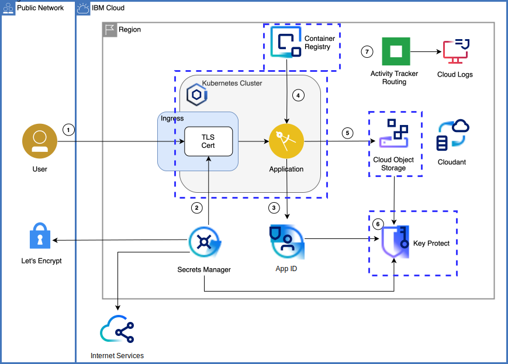

{{site.data.keyword.attribute-definition-list}}

# Use trusted profiles as foundation for secure cloud environments
{: #deployable-architecture-trusted-profile}
{: toc-content-type="tutorial"}
{: toc-services="containers, Cloudant"}
{: toc-completion-time="2h"}

This tutorial may incur costs. Use the [Cost Estimator](/estimator/review) to generate a cost estimate based on your projected usage.
{: tip}

Learn about trusted profiles as building block for secure cloud environments
{: shortdesc}

## Objectives
{: #deployable-architecture-trusted-profile-objectives}

* Learn use cases for trusted profiles
* Create a trusted profile and assign access
* Use a trusted profile for secure enterprise deployment

{: caption="Solution architecture" caption-side="bottom"}

## Before you begin
{: #deployable-architecture-trusted-profile-prereqs}

This tutorial requires:
* An {{site.data.keyword.cloud_notm}} [billable account](/docs/account?topic=account-accounts)

You will find instructions to download and install these tools for your operating environment in the [Getting started with solution tutorials](/docs/solution-tutorials?topic=solution-tutorials-tutorials) guide.

To avoid the installation of these tools you can use the [{{site.data.keyword.cloud-shell_short}}](/shell) from the {{site.data.keyword.cloud_notm}} console.
{: tip}

## Trusted profile use cases
{: #deployable-architecture-trusted-profile-create-da}
{: step}

Learn about trusted profiles
- what is a TP
- what are the supported use cases
- what is needed to use a TP

## Deploy from catalog
{: #deployable-architecture-trusted-profile-deploy-da}
{: step}

deploy the DA from the private catalog
- create the trusted profile
- set up the privileges, what are the best practices
- deploy

[customize a DA](/docs/secure-enterprise?topic=secure-enterprise-customize-from-catalog)

## Manage resources
{: #deployable-architecture-trusted-profile-manage-resources}
{: step}

- What resources are created for all the steps above?
- When and how can they be deleted?

## Remove resources
{: #deployable-architecture-trusted-profile-removeresources}
{: step}

Steps to take to remove the resources created in this tutorial

Depending on the resource it might not be deleted immediately, but retained (by default for 7 days). You can reclaim the resource by deleting it permanently or restore it within the retention period. See this document on how to [use resource reclamation](/docs/account?topic=account-resource-reclamation).
{: tip}

## Related content
{: #deployable-architecture-trusted-profile-related}

some content here