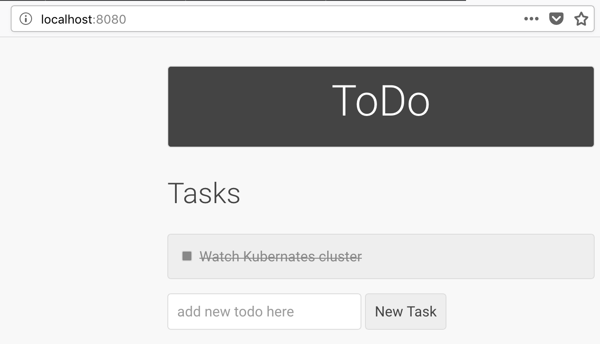
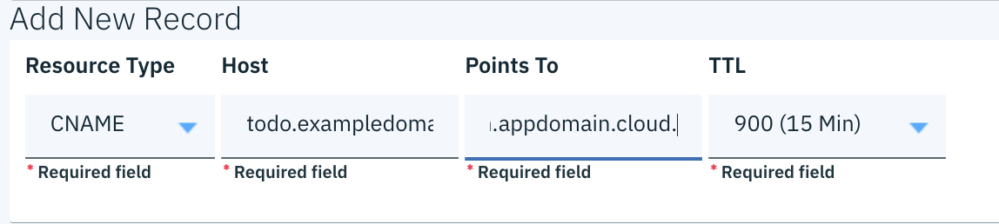

{:shortdesc: .shortdesc}
{:new_window: target="_blank"}
{:codeblock: .codeblock}
{:screen: .screen}
{:tip: .tip}
{:pre: .pre}

# Accelerate a dynamic website using Dynamic Content Acceleration with {{site.data.keyword.cdn_full}}
{: #dynamic-cdn}

In a previous tutorial [Accelerate delivery of static files using a CDN](/docs/tutorials?topic=solution-tutorials-static-files-cdn) you have known how to host and serve static assets (images, videos, and documents) of a website in {{site.data.keyword.cos_full_notm}}, and how to use [{{site.data.keyword.cdn_full}} (CDN)](https://{DomainName}/catalog/infrastructure/cdn-powered-by-akamai) for fast and secure delivery to users around the world.

Web applications are composed of not only static content like text, images, cascading style sheets, and JavaScript files but also personalized and dynamically changing contents that can’t be cached at CDN. A common example of non-cacheable dynamic content is adding an item to a cart in an e-commerce website that might be generated from JavaScript on the base page. Before Dynamic Content Acceleration is available, a CDN will pass every request for a non-cacheable object through to the owner’s origin server, and pass the result back to the user.

To stop these dynamic contents from being a performance bottleneck, you can utilize the new Dynamic Content Acceleration (DCA) capability of [{{site.data.keyword.cdn_full}} (CDN)](https://{DomainName}/catalog/infrastructure/cdn-powered-by-akamai) to optimize the performance of dynamic contents:
* the DCA capability of CDN will choose the optimal routes for requests
* proactively pre-fetch contents from origin servers so that users can access these contents rapidly from the edge
* extend the duration of TCP connections for multiple requests
* automatically compress images for lower latency.

## Objectives
{: #objectives}

* Deploy a starter dynamic web application to a {{site.data.keyword.containershort_notm}} cluster
* Make content globally available with {{site.data.keyword.cdn_full}}
* Enable the Dynamic Content Acceleration (DCA) capability for performance optimization

## Services used
{: #services}

This tutorial uses the following products:

* [{{site.data.keyword.cdn_full}}](https://{DomainName}/catalog/infrastructure/cdn-powered-by-akamai)
* [{{site.data.keyword.containershort_notm}}](https://{DomainName}/kubernetes/catalog/cluster)
* [{{site.data.keyword.registrylong_notm}}](https://{DomainName}/kubernetes/registry/main/start)
* [{{site.data.keyword.dns_notm}}s](https://{DomainName}/classic/network/dns/forwardzones)

This tutorial may incur costs. Use the [Pricing Calculator](https://{DomainName}/estimator/review) to generate a cost estimate based on your projected usage.

## Architecture
{: #architecture}

<p style="text-align: center;">

</p>

1. The developer creates a simple dynamic application and produces a Docker container image.
2. The image is pushed to a namespace in {site.data.keyword.registryshort_notm}. 
3. The application is deployed to {{site.data.keyword.containershort_notm}}.
4. User accesses the application.
5. The application is accelerated through the Dynamic Content Acceleration capability of {{site.data.keyword.cdn_full}}.
5. {{site.data.keyword.cdn_full}} interacts with the application to fetch dynamic contents.

## Before you begin
{: #prereqs}
   * Install [Docker](https://docs.docker.com/engine/installation/)
   * [Install {{site.data.keyword.dev_cli_notm}}](/docs/cli?topic=cloud-cli-getting-started) - Script to install Docker, `kubectl`, IBM Cloud CLI and required plug-ins
   * Create a Kubernetes cluster with {{site.data.keyword.containershort_notm}}
   * Register a new domain for your web application (if not existing), for example from [{{site.data.keyword.domain_notm}}](https://{DomainName}/classic/services/domains)

## Prepare the dynamic web application

Let's consider a simple dynamic web application for collaboration for a team geographically distributed. With this application, team members can create and manage team to-do items together.

This [sample application](https://github.com/IBM-Cloud/cdn-with-cda-todolist) is based on [Beego](https://beego.me/docs/intro/), a RESTful HTTP framework for the rapid development of Go applications including APIs, web apps and backend services.

### Customize the application to include a test object 

{: #customize-test-object}

The Dynamic Content Acceleration (DCA) feature will utilize a test object in about 10KB size on your origin server to determine the optimal routes for real requests. For this purpose, the application has been customized from the [Beego sample](https://github.com/beego/samples) to include the test object `test-object.html`. 

1. Clone the application code from GitHub to local.
   ```bash
   mkdir $GOPATH/src/github.com/IBM-Cloud/
   cd $GOPATH/src/github.com/IBM-Cloud/
   git clone https://github.com/IBM-Cloud/cdn-with-cda-todolist.git
	```
	{: pre}
	
In the cloned application code, the following code changes were made to the [Beego sample](https://github.com/beego/samples):

* An additional router has been added to the `main.go` file:  
   ```
   beego.Router("/test-dca/", &controllers.TaskController{}, "get:TestDca")   ```
* A new function has been added to the `controller/task.go` file to make the test object accessible:
	```
	func (this *TaskController) TestDca() {
	       this.TplName = "detection-test-object.html"
	       this.Render()
	}
	```

### Make a Docker image from the application

1. Before you start to make a Docker image, you must prepare a Dockerfile and a GO dependency file `Gopkg.toml`. Examples of both are already available from your [cloned application code](https://github.com/IBM-Cloud/cdn-with-cda-todolist). 
2. Build a Docker image from the application directly where the Dockerfile and `Gopkg.toml` are stored. At the same time, name and tag the image, for example, with a name `mytodoimage` and a tag `cdn`.
	```bash
	docker build -t <image_name>:<tag_name> .
	```
	{: pre}
5. Run the application inside the container. 
   	```bash
	docker run -d -p 8080:8080 <image_name>:<tag_name>
	```
	{: pre} 
6. Verify that you can access the application `http://localhost:8080/` as well as the test object: `http://localhost:8080/test-dca`.
	
    
## Save the Docker image into {{site.data.keyword.registrylong_notm}}

1. Add a namespace for your image.
	```
	ibmcloud cr namespace-add <namespace>
	```
	{:pre}
2. Log on to the container registry. 
	```
	ibmcloud cr login
	```
	{:pre}
3. Tag your local image before pushing it to {site.data.keyword.registryshort_notm}.
   ```
	docker tag <image_name>:<tag> <region>.icr.io/<namespace>/<image_name>:<tag_name>
	```
	{:pre}

3. Push the image to the {site.data.keyword.registryshort_notm}.
	```
	docker push <region>.icr.io/<namespace>/<image_name>:<tag>
	```
	{:pre}	
	
   
## Deploy the image to the {{site.data.keyword.containershort_notm}} cluster

### Create a {{site.data.keyword.containershort_notm}} cluster

As said in the [Prerequisite](#prereqs) you should have a running cluster on {{site.data.keyword.containershort_notm}}. If yes, move on to the [deployment steps](#deploy-to-cluster).

If not, you can take the following steps to create a cluster on {{site.data.keyword.containershort_notm}}:

1. Create a Kubernetes cluster from the [{{site.data.keyword.Bluemix}} catalog](https://{DomainName}/kubernetes/catalog/cluster/create). A standard cluster is used in this tutorial. 
2. When the cluster is ready, follow the steps described in the **Access** tab of your cluster to gain access to `kubectl`, a command line tool that you use to interact with a {{site.data.keyword.containershort_notm}} cluster. 
3. If not logged in, use `ibmcloud login` to log in interactively, and set the KUBECONFIG environment variable as directed. 

### Deploy the image

{: #deploy-to-cluster}

1. Create a deployment configuration file, for example, `deployment.yaml`. You can find an example in the [cloned application code](https://github.com/IBM-Cloud/cdn-with-cda-todolist/blob/master/deployment.yaml), and replace parameters in angle brackets (<>) with your own. This configuration file contains the following sections:
   * Deployment configuration
   * Service configuration
   * Ingress resource configuration to set an IBM-provided ingress domain and IBM-provided TLS certificate.  
2. Apply the configuration to your {{site.data.keyword.containershort_notm}} cluster.
	```
	kubectl apply -f deployment.yaml --cluster <cluster_name> 
	```
	{:pre}	  

So far your application is available from the following URL: 
```
https://<app_name>.<cluster_name>.<region>.containers.appdomain.cloud
```

For more information about how to deploy an image from {{site.data.keyword.registrylong_notm}}, see [Deploying containers from an {site.data.keyword.registryshort_notm} image to the default Kubernetes namespace](https://{DomainName}/docs/containers?containers?topic=containers-images#namespace).

## Create a CDN instance

Before you create CDN instance, you should have registered a domain name for your application as said in the [Prerequisite](#prereqs). 

2. Go to the cloud catalog, and select [**Content Delivery Network**](https://{DomainName}/catalog/infrastructure/cdn-powered-by-akamai) from the Network section. Click **Create**.
3. On the next dialog, set the hostname for CDN to the custom domain of your application, for example, `todo.exampledomain.net`. 
4. Set the rest of CDN configurations:
	* Set the **Custom CNAME** prefix to a unique value, for example, `todo-sample`. 
	* Go back to your DNS service provider and configure CNAME record. For example, in [{{site.data.keyword.dns_notm}}](https://{DomainName}/classic/network/dns/forwardzones), take the following steps:
	  1. Click the name of your domain. 
	  2. Under **Add a new record**, select **CNAME** as resource type, and map the host `todo.exampledomain.net` to the CNAME `todo-sample.cdn.appdomain.cloud.`
	  3. Click **Add Record**.  
	 
	* Leave **Host header** and **Path** empty. 
	* Use the default **Server** option. Specify the ingress domain as **Origin server address**, for example, `mytodo.<cluster-name>.<region>.containers.appdomain.cloud`.
	* Check both the HTTP and HTTPS protocols. Use the default port numbers.
	* Select **Wildcard** SSL certificate. 
5. Accept the **Master Service Agreement** and click **Create**.

After you have successfully created the CDN mapping, 
* To view your CDN instance, select the CDN instance [in the list](https://{DomainName}/classic/network/cdn). The **Details** panel shows both the **Hostname** and the **CNAME** for your CDN.
* You application is now accessible through the CNAME only: `https://<CNAME>`.

## Enable Dynamic Content Acceleration (DCA)

1. Click the origin from the [Overview](https://{DomainName}/classic/network/cdn) page, and navigate to the **Settings** tab of your origin.
2. Under the **Optimized for** section, select **Dynamic Content Acceleration** from the drop-down list.
3. Under the **Detection path** section, specify the path `/test-dca` as the detection path, and click **Test** to verify the path is set correctly. This detection path will be used periodically by {{site.data.keyword.cdn_full}} to determine the fastest path to the origin. 
4. Make sure **Prefetching** and **Image compression** are both set to **On**.
   
5. Click **Save**. You have successfully accelerated your todo application deployed in {{site.data.keyword.containershort_notm}} cluster with DCA.

## Verify DCA performance

You can use common website performance tools such as [Web Page Test](https://www.webpagetest.org/) to compare the website response time before and after DCA is turned on.  

After enabling DCA for a period, you can view the both static and dynamic traffic bandwidth by clicking on the **View CDN report** on the [CDN Overview](https://{DomainName}/classic/network/cdn) page.

## Conclusion

With DCA turned on and the detection path specified, CDN edge servers periodically fetch the test object from the origin to look for any path between the internal network of CDN edge servers that have lower latency and/or packet loss rate than the default route on the Internet. When a real request comes in, {{site.data.keyword.cdn_full}} consults the most recent data to send that request over the best path to the origin.

With **Prefetching** enabled, DCA also finds which content is required by the application and preemptively fetches content from origin and stores it close to the user by analyzing user behavior data and web sessions. The **Image compression** option serves compressed images to reduces the amount of content required to load a page, especially when end users have slow network speed. DCA also employs TCP-layer optimizations that accelerate connection set-up and reduce round trips.

## Remove resources

* Delete the application from the [{{site.data.keyword.containershort_notm}}](https://{DomainName}/kubernetes/catalog/cluster)
* Delete the image from the [{{site.data.keyword.cregistryshort_notm}}](https://{DomainName}/kubernetes/catalog/registry)
* Delete the [{{site.data.keyword.cdn_full}} service](https://{DomainName}/classic/network/cdn)
* Delete the CNAME record and the zone from [{{site.data.keyword.dns_notm}}](https://{DomainName}/classic/network/dns/forwardzones)

## Related content

* [Getting Started with CDN](https://{DomainName}/docs/infrastructure/CDN?topic=CDN-getting-started#getting-started)
* [IBM Cloud Kubernetes Service](https://{DomainName}/docs/containers?topic=containers-container_index#container_index)
* [IBM Cloud Container Registry](https://{DomainName}/docs/services/Registry?topic=registry-getting-started#getting-started)


