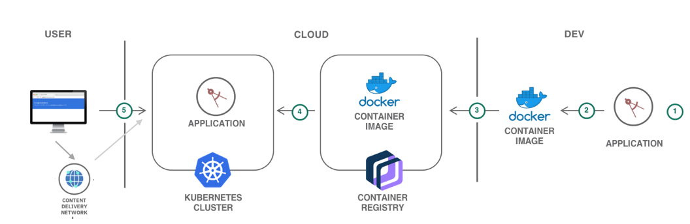
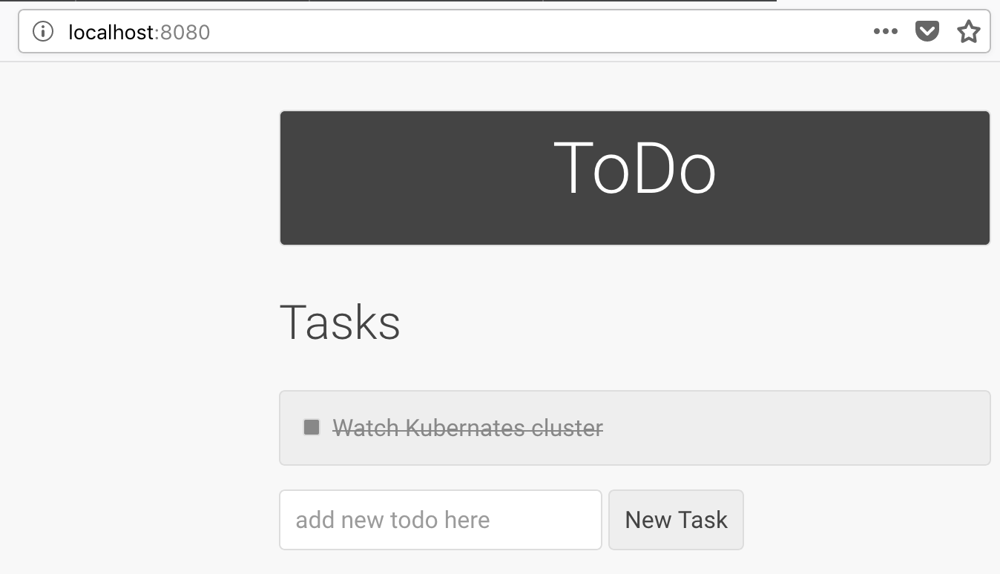

{:shortdesc: .shortdesc}
{:new_window: target="_blank"}
{:codeblock: .codeblock}
{:screen: .screen}
{:tip: .tip}
{:pre: .pre}

# Accelerate a dynamic website using Dynamic Content Acceleration with IBM CDN
{: #dynamic-cdn}

In a previous tutorial [Accelerate delivery of static files using a CDN](/docs/tutorials?topic=solution-tutorials-static-files-cdn) we have known how to host and serve static assets (images, videos, documents) of a website in a {{site.data.keyword.cos_full_notm}}, and how to use a [{{site.data.keyword.cdn_full}} (CDN)](https://{DomainName}/catalog/infrastructure/cdn-powered-by-akamai) for fast and secure delivery to users around the world.

Web applications are composed of not only static content like HTML, images, cascading style sheets, and JavaScript files but also personalized and dynamicly changing contents like streaming videos, live chats, and available quantities in stock. 

To reduce latency for these dynamic contents and improve user experience, you cannot simply cache the contents close to end users, because these contents require interactions with the backend origin servers and/or the end users. 

In these situations, you can utilize the new Dynamic Content Acceleration (DCA) capablity of IBM [{{site.data.keyword.cdn_full}} (CDN)](https://{DomainName}/catalog/infrastructure/cdn-powered-by-akamai) to optimze the performance of dynamic contents:
* the DCA capablity of CDN will choose the optimal routes for requests and responses
* proactively pre-fetch contents from origin servers so that users can access these contents rapidly from the edge
* extend the duration of TCP connections for multiple requests
* automatically compress images for lower latency.

## Objectives
{: #objectives}

* Deploy a starter dynamic web application to a Kubernates cluster
* Make content globally available with a Content Delivery Network (CDN)
* Enable the Dynamic Content Accleration (DCA) capability for performance optimization

## Services used
{: #services}

This tutorial uses the following products:

* [{{site.data.keyword.cdn_full}}](https://{DomainName}/catalog/infrastructure/cdn-powered-by-akamai)
* [{{site.data.keyword.containershort_notm}}](https://{DomainName}/kubernetes/catalog/cluster)
* [{{site.data.keyword.registrylong_notm}}](https://{DomainName}/kubernetes/registry/main/start)

This tutorial may incur costs. Use the [Pricing Calculator](https://{DomainName}/estimator/review) to generate a cost estimate based on your projected usage.

## Architecture
{: #architecture}

<p style="text-align: center;">

</p>

1. The developer creates a simple dynamic application, and deploys the application to the Kubernates cluster on IBM Cloud.
2. The developer creates the CDN and configures DCA. 
3. User accesses the application.
4. This dynamic application is accelerated with the DCA capability of IBM CDN.

## Before you begin
{: #prereqs}
   * Install [Docker](https://docs.docker.com/engine/installation/)
   * [Install {{site.data.keyword.dev_cli_notm}}](/docs/cli?topic=cloud-cli-getting-started) - Script to install docker, kubectl, ibmcloud cli and required plug-ins
   * [GO](https://golang.org/) basis, [Beego](https://beego.me/docs/intro/) framework for application development

## Get the web application code
{: #get_code}

Let's consider a simple dynamic web application for collaboration for a team geographically distributed. With this application, team members can create and manage team to-do items together.

This [sample application](https://github.com/beego/samples) is based on [Beego](https://beego.me/docs/intro/), a RESTful HTTP framework for the rapid development of Go applications including APIs, web apps and backend services. 

```
go get github.com/beego/samples/todo
```
{: pre}

## Build the application locally

1. From your local to-do application directory, for example, `$GOPATH/src/github.com/beego/samples/todo`, run the application locally:
	```bash
	bee run
	```
	{: pre}
2. After the application starts, go to `http://localhost:8080/`.
   

## Make a Docker image from the application

1. From the local to-do application directory, prepare a dockerfile. An example can be download from [this GitHub repository](https://github.com/ying-tang/solution_tutorial).
2. In the same directory, prepare a GO dependency file Gopkg.toml. An example can be download from [this GitHub repository](https://github.com/ying-tang/solution_tutorial).
3. Build a Docker image (*mytodo*) from these files, and tag it, for example, with *cdn*.
	```bash
	docker build -t mytodo:cdn .
	```
	{: pre}
   
## Create a Kubernates cluster

1. Create a Kubernetes cluster from the [{{site.data.keyword.Bluemix}} catalog](https://{DomainName}/kubernetes/catalog/cluster/create). For simplicity of the tutorial, a FREE cluster is used.
2. When the cluster is ready, follow the steps described in the **Access** tab of your cluster to gain access to `kubectl`, a command line tool that you use to interact with a Kubernetes cluster. 
3. Use `ibmcloud login` to log in interactively, and set the KUBECONFIG environment variable as directed.  

For more information about setting the Kubernates cluster and the command line, see [IBM Cloud Kubernetes Service](https://{DomainName}/docs/containers?topic=containers-container_index#container_index).

## Save the Docker image into the IBM Cloud Container Registry

1. Add a namespace for your image, for example, `todo`.
	```
	ibmcloud cr namespace-add todo
	```
	{:pre}
2. Log on to the container registry. 
	```
	ibmcloud cr login
	```
	{:pre}

3. Push the image to the Container Registry.
	```
	docker push us.icr.io/todo/<todo_repo>:cdn
	```
	{:pre}	

   
## Deploy the image to the Kubernates cluster

1. Create a deployment configuration file, for example, `mydeployment.yaml`. For more information about how to prepare this file, see [Building containers from images](https://{DomainName}/docs/containers?topic=containers-images).
2. Before pulling an image from a registry, IBM Cloud Kubernetes Service cluster requires a special type of Kubernetes secret, an `imagePullSecret`. You must prepare a secret YAML and add it to the same namespace of the deployment YAML. The secret YAML may look likt the following:
	```
   apiVersion: v1
	kind: Secret
	metadata:
	  ...
	  name: <secret-name>
	  ...
	data:
	  .dockerconfigjson: ****************
   ```
   {: pre}    
3. Add a section like the following in your deployment YAML, where <secret_name> is your secret file for the container registry. 
   ```
   imagePullSecret:
   -name: <secret-name>
   ```
   {: pre}
2. Apply the configuration to your Kubernates cluster.
	```
	kubectl apply -f mydeployment.yaml
	```
	{:pre}	
3. You will be able to see this application running on `https://<worker_node_IP>:<port>`.
4. Optionaly, if you would like to use a custom domain for your application, [set up ingress](https://{DomainName}/docs/containers?topic=containers-ingress#ingress). 

## Create a CDN instance

1. Go to the catalog in the console, and select [**Content Delivery Network**](https://{DomainName}/catalog/infrastructure/cdn-powered-by-akamai) from the Network section. This CDN is powered by Akamai. Click **Create**.
2. On the next dialog, set the **Hostname** for CDN to your custom domain. If you have set up ingress with your Kubernates cluster, you can specify the  customer domain of the Kubernates application as CDN Hostname. In this example, we will access the CDN contents through the IBM CDN provided CNAME, so the field can be an arbitary name.
3. Set the **Custom CNAME** prefix to a unique value.
4. Leave **Host header** and **Path** empty. 
4. Use the default **Server** option. Type the worker node public IP address as **Origin serer address**.
5. Enable HTTPS only. 
5. Find the TCP **nodePort** from the internal endpoints of your Kubernates service, and specify it as the **HTTPS port**.
8. For **SSL certificate** select the **Wildcard Certificate** option.
9. Accept the **Master Service Agreement** and click **Create**.
10. Configure the CDN CNAME with your DNS provider.
11. To view your CDN instance, select the CDN instance [in the list](https://{DomainName}/classic/network/cdn). The **Details** panel shows both the **Hostname** and the **CNAME** for your CDN.

## Enable Dynamic Content Acceleration (DCA)

1. Click the origin from the [CDN Overview](https://{DomainName}/classic/network/cdn), and navigate to the Settings tab of your origin.
2. Under the **Optimized for** section, select **Dynamic Content Acceleration** from the drop-down list.
3. Download the test object from the **Detection Path** section, and upload it to the Kubernates Pod. In this example, we assume the whole website is dynamic. 
4. Click **Test** to verify the path `/` is set correctly.
5. Click **Save**. You have successfully accelerated your todo application deployed in IBM Cloud Kubernates cluster with IBM CDN DCA.

## Remove resources

* Delete the application from the Kubernates deployment
* Delete the image from the container registry
* Delete the {{site.data.keyword.cdn_full}} service


## Related content

* [Getting Started with CDN](https://{DomainName}/docs/infrastructure/CDN?topic=CDN-getting-started#getting-started)
* [IBM Cloud Kubernetes Service](https://{DomainName}/docs/containers?topic=containers-container_index#container_index)
* [IBM Cloud Container Registry](https://{DomainName}/docs/services/Registry?topic=registry-getting-started#getting-started)


