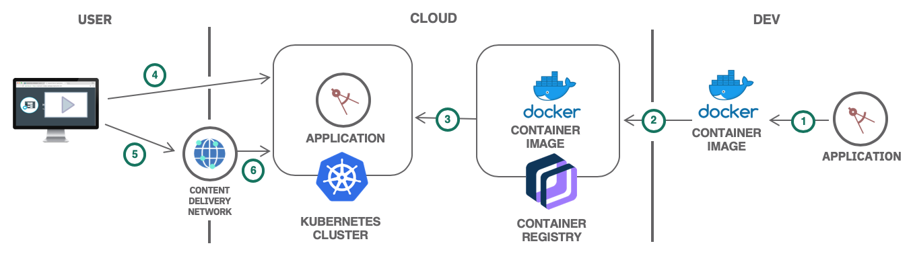
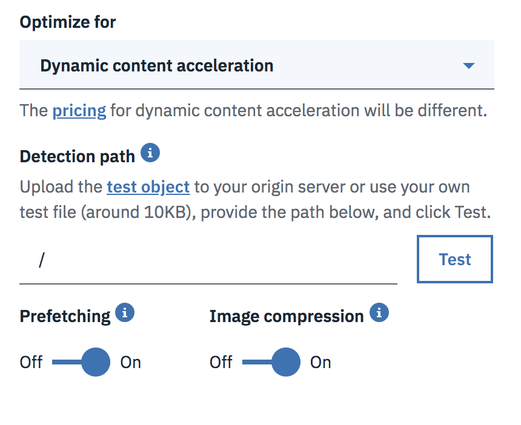

{:step: data-tutorial-type='step'}
{:java: #java .ph data-hd-programlang='java'}
{:swift: #swift .ph data-hd-programlang='swift'}
{:ios: #ios data-hd-operatingsystem="ios"}
{:android: #android data-hd-operatingsystem="android"}
{:shortdesc: .shortdesc}
{:new_window: target="_blank"}
{:codeblock: .codeblock}
{:screen: .screen}
{:tip: .tip}
{:pre: .pre}
{:important: .important}
{:note: .note}

# Accelerate a dynamic website using Dynamic Content Acceleration
{: #dynamic-content-cdn}
{: toc-content-type="tutorial"}
{: toc-services="CDN, containers, Registry, dns"}
{: toc-completion-time="2h"}

<!--##istutorial#-->
This tutorial may incur costs. Use the [Cost Estimator](https://{DomainName}/estimator/review) to generate a cost estimate based on your projected usage.
{: tip}

<!--#/istutorial#-->

Web applications are composed of static content like text, images, cascading style sheets, and JavaScript files. The tutorial [Accelerate delivery of static files using a CDN](/docs/solution-tutorials?topic=solution-tutorials-static-files-cdn) shows how to host and serve static assets (images, videos, and documents) of a website from {{site.data.keyword.cos_full_notm}} with [{{site.data.keyword.cdn_full}} (CDN)](https://{DomainName}/catalog/infrastructure/cdn-powered-by-akamai).
{: shortdesc}

Applications also contain personalized and dynamically changing contents that can’t be cached at CDN. A common example of non-cacheable dynamic content is adding an item to a cart in an e-commerce website that might be generated from JavaScript on the base page. Before Dynamic Content Acceleration is available, a CDN will pass every request for a non-cacheable object through to the owner’s origin server, and pass the result back to the user.

To stop these dynamic contents from being a performance bottleneck, you can utilize the new Dynamic Content Acceleration (DCA) capability of [{{site.data.keyword.cdn_full}} (CDN)](https://{DomainName}/catalog/infrastructure/cdn-powered-by-akamai) to optimize the performance of dynamic contents:
* the DCA capability of CDN will choose the optimal routes for requests
* proactively pre-fetch contents from origin servers so that users can access these contents rapidly from the edge
* extend the duration of TCP connections for multiple requests
* automatically compress images for lower latency.

## Objectives
{: #dynamic-content-cdn-objectives}

* Deploy a starter dynamic web application to a {{site.data.keyword.containershort_notm}} cluster.
* Make static content globally available with {{site.data.keyword.cdn_full}}.
* Enable the Dynamic Content Acceleration (DCA) capability for performance optimization of non-static content.

{: caption="Figure 1. Architecture diagram of the tutorial" caption-side="bottom"}
{: style="text-align: center;"}


1. The developer creates a simple dynamic application and produces a Docker container image.
2. The image is pushed to a namespace in {{site.data.keyword.registryshort_notm}}.
3. The application is deployed to {{site.data.keyword.containershort_notm}}.
4. User accesses the application.
5. The application is accelerated through the Dynamic Content Acceleration capability of {{site.data.keyword.cdn_full}}.
6. {{site.data.keyword.cdn_full}} interacts with the application to fetch dynamic contents.

## Before you begin
{: #dynamic-content-cdn-prereqs}

This tutorial requires:
* {{site.data.keyword.cloud_notm}} CLI,
   * {{site.data.keyword.containerfull_notm}} plugin (`kubernetes-service`),
   * {{site.data.keyword.registryshort_notm}} plugin (`container-registry`),
   * `dev` plugin,
* a Docker engine,
* `kubectl` to interact with Kubernetes clusters,
* `git` to clone source code repository.

<!--##istutorial#-->
You will find instructions to download and install these tools for your operating environment in the [Getting started with solution tutorials](/docs/solution-tutorials?topic=solution-tutorials-tutorials) guide.
<!--#/istutorial#-->

In addition:
- create a Kubernetes cluster with {{site.data.keyword.containershort_notm}}.
   - For Kubernetes on VPC infrastructure, you are required to create a VPC and subnet(s) before creating the Kubernetes cluster. You may follow the instructions provided under the [Creating a standard VPC cluster in the console](https://{DomainName}/docs/containers?topic=containers-cluster-create-vpc-gen2).
   - For Kubernetes on Classic infrastructure follow the [Creating a standard classic cluster](https://{DomainName}/docs/containers?topic=containers-cluster-create-classic) instructions.

## Deploy a dynamic web application to be accelerated
{: #dynamic-content-cdn-2}
{: step}

Let's consider a simple dynamic web application for collaboration for a team geographically distributed. With this application, team members can create and manage team's to-do items together.

This [sample application](https://github.com/IBM-Cloud/cdn-with-cda-todolist) is based on [Beego](https://beego.vip/), a RESTful HTTP framework for the rapid development of Go applications including APIs, web apps and backend services.

### Build the application
{: #dynamic-content-cdn-3}

1. Clone the application
   ```bash
   git clone https://github.com/IBM-Cloud/cdn-with-cda-todolist.git
   ```
   {: pre}

1. Change to the application directory
   ```bash
   cd cdn-with-cda-todolist
   ```
   {: pre}

1. Identify the cluster.
   - `ibmcloud ks cluster ls` will return cluster names.
   ```bash
   ibmcloud ks cluster ls
   ```
   {: pre}

   Set the variable accordingly:
   ```bash
   MYCLUSTER=<cluster_name>
   ```
   {: pre}

1. Identify the {{site.data.keyword.registryshort_notm}} and set a namespace.
   - `ibmcloud cr info` will return the name of the container registry.
   ```bash
   ibmcloud cr info
   ```
   {: pre}

   Set the variable accordingly:
   ```bash
   MYCONTAINERREGISTRY=<us.icr.io_like_value_returned_from_ibmcloud_cr_info>
   ```
   {: pre}

   Set the variable to a name you want to used as a new namespace:
   ```bash
   MYNAMESPACE=<my_container_registry_namespace>
   ```
   {: pre}

1. Create a namespace to store the container image. Feel free to skip this step and use an existing namespace.
   ```bash
   ibmcloud cr namespace-add $MYNAMESPACE
   ```
   {: pre}

1. Build a Docker image using the [Dockerfile](https://github.com/IBM-Cloud/cdn-with-cda-todolist/blob/master/Dockerfile) in {{site.data.keyword.registryshort_notm}} and use **cdn-with-cda-todolist** as the image name:
   ```bash
   docker build -t $MYCONTAINERREGISTRY/$MYNAMESPACE/cdn-with-cda-todolist:latest .
   ```
   {: pre}

1. Log in {{site.data.keyword.registryshort_notm}}:
   ```bash
   ibmcloud cr login
   ```
   {: pre}

1. Push the image to {{site.data.keyword.registryshort_notm}}:
   ```bash
   docker push $MYCONTAINERREGISTRY/$MYNAMESPACE/cdn-with-cda-todolist:latest
   ```
   {: pre}

### Run the application in the cluster
{: #dynamic-content-cdn-4}

1. Run the command below to target the cluster where to deploy the application.
   ```bash
   ibmcloud ks cluster config --cluster $MYCLUSTER
   ```
   {: pre}

1. Retrieve the cluster ingress subdomain and secret name:
   ```bash
   ibmcloud ks cluster get --cluster $MYCLUSTER
   ```
   {: pre}

1. Copy `deployment.sample.yaml` to `deployment.yaml`:
   ```bash
   cp deployment.sample.yaml deployment.yaml
   ```
   {: pre}

1. Edit `deployment.yaml` and replace the placeholders `<image>`, `<ingress-subdomain>` and `<ingress-secret>` with values matching your environment.
1. Deploy the application to the cluster:
   ```bash
   kubectl apply -f deployment.yaml
   ```
   {: pre}
   
1. Access the application at `https://cdn-with-cda-todolist.<ingress-subdomain>`

## Create a CDN instance
{: #dynamic-content-cdn-0}
{: step}

Before you create a {{site.data.keyword.cdn_full}} instance, you should have registered a domain name for your application.

1. Go to the cloud catalog, and select [{{site.data.keyword.cdn_full}}](https://{DomainName}/catalog/infrastructure/cdn-powered-by-akamai) from the Network section. Click **Create**.
   * Set **Hostname** to a custom domain, for this tutorial it is not required to be a domain you own as we will not be using it, you can set it to `todo.example.com`.
   * Leave the **Custom CNAME** prefix empty, it will default to a generated unique name, this is the entry we will use to test the CDN.
   * Leave **Host header** and **Path** empty.
   * Click the **Server** tab and specify the application ingress subdomain as **Origin server address**, for example  `cdn-with-cda-todolist.<ingress-subdomain>`.
   * Uncheck HTTP port.
   * Check HTTPS port and select **Wildcard** SSL certificate.

      With the [**Wildcard** certificate)[https://{DomainName}/docs/CDN?topic=CDN-about-https#wildcard-certificate-support], you will access your app through the Custom CNAME. The Wildcard certificate is the simplest way to deliver web content to your users securely. The Custom CNAME is added to the wildcard certificate maintained on the CDN Edge server and becomes the only way for users to use HTTPS for your CDN (for example, https://cdnakaivlnqidbg4.cdn.appdomain.cloud). 
      {: note}

1. Accept the **Master Service Agreement** and click **Create**.

After you have successfully created the CDN mapping:
* **CNAME configuration required** may display in the Status column, you can ignore it and check the status again by selecting **Get status** from the overflow menu. It should change to *Running* after a few minutes.
* To view your CDN instance, select the CDN instance [in the list](https://{DomainName}/cdn). The **Details** panel shows both the **Hostname** and the **CNAME** for your CDN.
* You application is now accessible through the CNAME only: `https://<CNAME>`. You may need to wait a few minutes for all configuration to complete and for the CNAME to work.

## Enable Dynamic Content Acceleration (DCA)
{: #dynamic-content-cdn-6}
{: step}

At that stage, the static content of the application is cached by the CDN but not the dynamic content.

The Dynamic Content Acceleration (DCA) feature will query a test object in about 10KB size on your origin server to determine the optimal routes for real requests. For this purpose, the application has been customized to include [a test object](https://github.com/IBM-Cloud/cdn-with-cda-todolist/blob/master/views/detection-test-object.html) made available at [`/test-dca`](https://github.com/IBM-Cloud/cdn-with-cda-todolist/blob/master/main.go#L11).

To activate DCA:
1. Select the **Settings** tab in the CDN configuration.
2. Under the **Optimization settings** section, click **Edit** and select **Dynamic Content Acceleration** from the *Optimized for* drop-down list.
3. Under the **Detection path** section, specify the path `/test-dca` as the detection path, and click **Test** to verify the path is set correctly. This detection path will be used periodically by {{site.data.keyword.cdn_full}} to determine the fastest path to the origin.
4. Make sure **Prefetching** and **Image compression** are both set to **On**.

   {: class="center"}
5. Click **Save**. You have successfully accelerated your application deployed in {{site.data.keyword.containershort_notm}} cluster with **Dynamic Content Acceleration**.

## Verify DCA performance
{: #dynamic-content-cdn-5}
{: step}

You can use common website performance tools such as [Web Page Test](https://www.webpagetest.org/) to compare the website response time before and after DCA is turned on.

After enabling DCA for a period, you can view the both static and dynamic traffic bandwidth by clicking on the **View CDN report** on the [CDN Overview](https://{DomainName}/cdn) page.

## Conclusion
{: #dynamic-content-cdn-conclusion}
{: step}

With DCA turned on and the detection path specified, CDN edge servers periodically fetch the test object from the origin to look for any path between the internal network of CDN edge servers that have lower latency and/or packet loss rate than the default route on the Internet. When a real request comes in, {{site.data.keyword.cdn_full}} consults the most recent data to send that request over the best path to the origin.

With **Prefetching** enabled, DCA also finds which content is required by the application and preemptively fetches content from origin and stores it close to the user by analyzing user behavior data and web sessions. The **Image compression** option serves compressed images to reduces the amount of content required to load a page, especially when end users have slow network speed. DCA also employs TCP-layer optimizations that accelerate connection set up and reduce round trips.

## Remove resources
{: #dynamic-content-cdn-7}
{: step}

* Delete the application from the [{{site.data.keyword.containershort_notm}}](https://{DomainName}/kubernetes/catalog/cluster).
* Delete the image from the [{{site.data.keyword.registryshort_notm}}](https://{DomainName}/kubernetes/catalog/registry).
* Delete the [{{site.data.keyword.cdn_full}} service](https://{DomainName}/classic/network/cdn).

## Related content
{: #dynamic-content-cdn-10}

* [Getting Started with CDN](https://{DomainName}/docs/CDN?topic=CDN-getting-started#getting-started)
* [{{site.data.keyword.containerfull_notm}}](https://{DomainName}/docs/containers)
* [{{site.data.keyword.registryfull_notm}}](https://{DomainName}/docs/Registry?topic=Registry-getting-started#getting-started)
