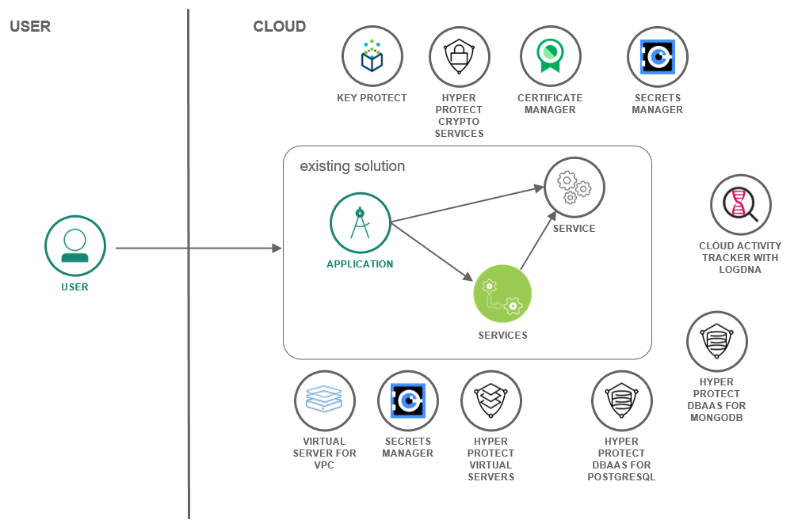
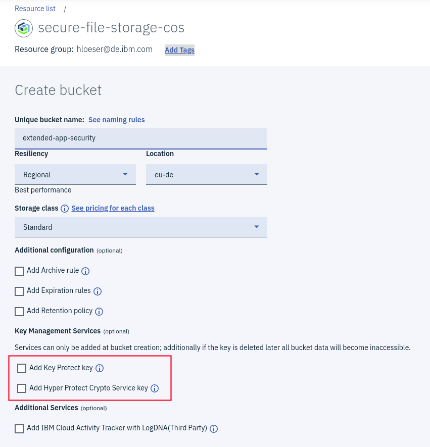
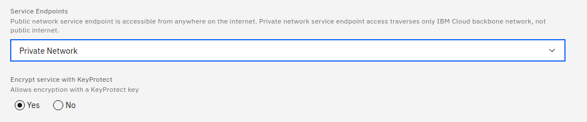

{:shortdesc: .shortdesc}
{:new_window: target="_blank"}
{:codeblock: .codeblock}
{:screen: .screen}
{:tip: .tip}
{:pre: .pre}
{:important: .important}

# Enhance security of your deployed application
{: #extended-app-security}

<!--##istutorial#-->
This tutorial may incur costs. Use the [Cost Estimator](https://{DomainName}/estimator/review) to generate a cost estimate based on your projected usage.
{: tip}

<!--#/istutorial#-->

You already developed and deployed an application on {{site.data.keyword.cloud_notm}}. You already followed the [introductory tutorial on how to apply end to end security to an application](https://{DomainName}/docs/solution-tutorials?topic=solution-tutorials-cloud-e2e-security). Following "security by design", you now start to look into the design of a new application or you need to adapt an older application to new security requirements. This tutorial walks you through options for applications with advanced security requirements. It looks into enhanced data encryption, isolation of compute runtimes and network traffic, and by using activity logs to look for suspicious activities. 
{: shortdesc}

## Objectives
{: #extended-app-security-objectives}

* Learn about enhanced data encryption options.
* Isolate your application runtimes for extended security.
* Evaluate your app to find and address security and compliance issues.

An existing solution with the application and connected (micro-) services is extended for enhanced security.

{: class="center"}
{: style="text-align: center;"}

## Assess your application
{: #extended-app-security-app_properties}

You developed a solution and successfully deployed it to {{site.data.keyword.cloud_notm}}. Now you want to look into how to harden the app environment. This can be part of the regular activities of (agile) development and the next steps towards a fully secure app or by increasing requirements for an app already in production. 

If you tried the tutorial on how to [apply end to end security to a cloud application](https://{DomainName}/docs/solution-tutorials?topic=solution-tutorials-cloud-e2e-security), you already know how to rotate service credentials. But there is far more to app security than regular changes of passwords and access keys. You may want to assess the application, its deployment and usage characteristics to better understand what needs to, could be and should be addressed. It helps you to move towards a [zero trust security model](https://en.wikipedia.org/wiki/Zero_trust_security_model). Moreover, depending on your industry, country and region, etc. there exist different [security and resiliency requirements](https://www.ibm.com/cloud/compliance). It could mean

* to isolate the application, its services, the network traffic and stored data from those of other applications,
* to encrypt data and have control over the management of encryption keys,
* to log all kind of events, regularly analyze logs and keep them for audits or incident forensics,
* to organize devops activities and the related teams with more fine-grained privileges,
* and much more.

To assess your application and its resources, consider the [{{site.data.keyword.compliance_full}}](https://www.ibm.com/cloud/security-and-compliance-center). It allows to govern resource configurations. You can set up and manage security and compliance controls. Checks can be automated. Results are directly compared against defined controls, can be exported and integrated into a customized dashboard. Read how to [getting started with {{site.data.keyword.compliance_short}}](https://{DomainName}/docs/security-compliance?topic=security-compliance-getting-started) for the first steps.

## Isolate runtime environments, networks traffic and data
{: #extended-app-security-isolate_environments}

One of the fundamental principles of Cloud Computing is the sharing of resources. This could be from the sharing of a machine (i.e., the sharing of applications by many users who are running on the same computer) to just sharing the data center and parts of the infrastructure. In the following, you learn how you can isolate runtime environments, network traffic and stored data to increase application security.

### Use dedicated resources and virtual private clouds
{: #extended-app-security-isolate_runtimes}

To isolate application runtime environments and related services, you can provision dedicated machines and enterprise-level service plans. Typically, entry-level, lower-priced plans run on shared infrastructure in a multi-tenant mode. The more advanced plans utilize dedicated environments and provide greater physical separation of data. Here are some considerations for some of the compute options.

Look into running virtual servers or {{site.data.keyword.containershort}} on [{{site.data.keyword.vpc_full}}](https://{DomainName}/vpc-ext) to benefit from isolation of compute and network resources.

Check out the tutorials on [how to deploy isolated workloads across multiple locations and regions](https://{DomainName}/docs/solution-tutorials?topic=solution-tutorials-vpc-multi-region) and [how to securely access remote instances using a bastion host](https://{DomainName}/docs/solution-tutorials?topic=solution-tutorials-vpc-secure-management-bastion-server) to get started with {{site.data.keyword.vpc_full}}.
{: #tip}

* Evaluate the use of [{{site.data.keyword.hpvs}}](https://{DomainName}/docs/hp-virtual-servers?topic=hp-virtual-servers-overview) to run workloads in secure service containers.
* As another option to secure workloads, consider [{{site.data.keyword.datashield_short}}](https://{DomainName}/docs/data-shield?topic=data-shield-about) for guarding applications running in containers.

When working with database systems, consider using service plans with dedicated resources or services with enhanced security. Examples are [dedicated hardware plans for {{site.data.keyword.cloudant}}](https://{DomainName}/docs/Cloudant?topic=Cloudant-ibm-cloud-public#dedicated-hardware-plan) that offers HIPAA compliance or services like [{{site.data.keyword.ihsdbaas_postgresql_full}}](https://{DomainName}/docs/hyper-protect-dbaas-for-postgresql) and [{{site.data.keyword.ihsdbaas_mongodb_full}}](https://{DomainName}/docs/hyper-protect-dbaas-for-mongodb) which offer highly secure database environments for sensitive data.

### Secure and isolate network traffic
{: #extended-app-security-isolate_networks}

In most cases, an application consists of the app itself and one or many (micro-) services. These services are typically reachable over the public internet, but can also be accessed on so-called [service endpoints](https://{DomainName}/docs/account?topic=account-service-endpoints-overview). To increase security by isolating network traffic, follow the [instructions to enable virtual routing and forwarding (VRF)](https://{DomainName}/docs/account?topic=account-vrf-service-endpoint). In the documentation, you can also find a [list of services that support private endpoints](https://{DomainName}/docs/account?topic=account-vrf-service-endpoint#use-service-endpoint).

When your application does not serve public users, but is only accessed from corporate networks, then a method to isolate network traffic is to access {{site.data.keyword.cloud_notm}} using a Virtual Private Network (VPN) or Direct Link. The [catalog has offerings for both types](https://{DomainName}/catalog?search=vpn%20label%3Aibm_created#search_results). A VPN creates a secure, encrypted transmission channel over a public network whereas the Direct Link offers private network access to {{site.data.keyword.cloud_notm}}.

It is important to note that network traffic, i.e., data in transit, is secured by an encrypted transmission channel. Thus, you should use TLS / SSL. For your domains, you should utilize the [{{site.data.keyword.cloudcerts_short}}](https://{DomainName}/docs/certificate-manager?topic=certificate-manager-about-certificate-manager), the [{{site.data.keyword.secrets-manager_short}}](https://{DomainName}/docs/secrets-manager?topic=secrets-manager-getting-started) or similar tools to actively manage encryption certificates and their validity. By setting up notifications you can make sure that certifications do not expire. Note that {{site.data.keyword.cloudcerts_short}} allows you to order certificates and to automate the process.

Consider to implement more stringent access rules to resources. [Context-based restrictions](https://{DomainName}/docs/account?topic=account-context-restrictions-whatis) allow to define access restrictions based on network zones and endpoint types. Thus, it is possible to isolate teams, users and resources by location.

## Evaluate and monitor app security
{: #extended-app-security-evaluate_security}

Events related to {{site.data.keyword.cloud_notm}} account activities, such as logging in or provisioning a service, are logged to {{site.data.keyword.at_short}}. It does not, however, directly integrate any application-related events. But some services have options to enable tracking of security events. Examples are [{{site.data.keyword.cos_short}} which allows both read and write events to be tracked](https://{DomainName}/docs/cloud-object-storage?topic=cloud-object-storage-at) and [{{site.data.keyword.appid_short_notm}} which can track sign-in, sign-up and other runtime events](https://{DomainName}/docs/appid?topic=appid-at-events#at-monitor-runtime-activity) when enabled. Applications can ingest security and diagnostic events into [{{site.data.keyword.la_short}}](https://{DomainName}/docs/log-analysis?topic=log-analysis-getting-started). Moreover, most [services support sending usage logs directly to {{site.data.keyword.loganalysisshort}}](https://{DomainName}/docs/log-analysis?topic=log-analysis-cloud_services).

By sending both application logs, such as general diagnostics and security-related information like failed logins to a single logging facility, you can aggregate the logs and perform security analysis in application context, across the full stack. You can use the queries as foundation for [defining alerts](https://{DomainName}/docs/log-analysis?topic=log-analysis-alerts). Alerts help you to monitor your app and related services. You should [set up notification channels](https://{DomainName}/docs/log-analysis?topic=log-analysis-alerts#alerts_channels), so that once a defined event is detected, you get notified via e.g., email, Slack or PagerDuty.

Both {{site.data.keyword.at_short}} and {{site.data.keyword.la_short}} support further restriction on the data captured using IAM-based groups.  You can have users access the same instances, but only see data that is relevant to the application or services they are responsible for, you can review:
- {{site.data.keyword.la_short}}: [Using groups to control data access](https://{DomainName}/docs/log-analysis?topic=log-analysis-group_data_access)
- {{site.data.keyword.at_short}}: [Using groups to control data access](https://{DomainName}/docs/activity-tracker?topic=activity-tracker-group_data_access)

## Control encryption keys
{: #extended-app-security-control_encryption}

Almost all services on {{site.data.keyword.cloud_notm}} that store data use encryption to protect the data against unauthorized access. When using database services or {{site.data.keyword.cos_short}}, by default the encryption key is system-generated. You can increase data protection by controlling the encryption keys. {{site.data.keyword.keymanagementservicelong_notm}} and {{site.data.keyword.hscrypto}} help you provision encrypted keys for storage services as well as apps. Both services are based on [Hardware Security Modules](https://en.wikipedia.org/wiki/Hardware_security_module) (HSM) to manage and safeguard the encryption keys. {{site.data.keyword.keymanagementservicelong_notm}} allows to bring your own key (BYOK), {{site.data.keyword.hscrypto}} even support KYOK (Keep Your Own Key). When importing your own keys, make sure to [utilize an import token for increased security](https://{DomainName}/docs/hs-crypto?topic=hs-crypto-tutorial-import-keys). Note that you can [organize your keys in key rings](https://{DomainName}/docs/key-protect?topic=key-protect-grouping-keys). By applying access policies based on key rings you achieve more fine granular access control and higher security.

### Integrated services
{: #extended-app-security-7}

Many data services support the integration with either {{site.data.keyword.keymanagementserviceshort}} or {{site.data.keyword.hscrypto}}. To see if they can be used with the services in your deployed solution, check out the list of:

- [integrated services for {{site.data.keyword.keymanagementserviceshort}}](https://{DomainName}/docs/key-protect?topic=key-protect-integrate-services) and the
- [integrated services for {{site.data.keyword.hscrypto}}](https://{DomainName}/docs/hs-crypto?topic=hs-crypto-integrate-services).

Supported services include {{site.data.keyword.cos_short}}, {{site.data.keyword.block_storage_is_short}}, {{site.data.keyword.cloudant}}, {{site.data.keyword.Db2_on_Cloud_long_notm}}, {{site.data.keyword.containershort_notm}}, {{site.data.keyword.vsi_is_full}} and more. The [{{site.data.keyword.secrets-manager_short}}](https://{DomainName}/docs/secrets-manager?topic=secrets-manager-getting-started) allows to create, manage and lease secrets for both cloud services in apps. The secrets can be guarded (encrypted) by your root key.

### Example: Cloud Object Storage
{: #extended-app-security-8}

One of the most often used services is {{site.data.keyword.cos_short}}. After you provisioned either {{site.data.keyword.keymanagementserviceshort}} or {{site.data.keyword.hscrypto}} and created a root key with optionally making use of BYOK or KYOK, you can use that key when creating a new storage bucket. The following screenshot shows the UI to create a bucket with option to use a key from either service.

{: class="center"}
{: style="text-align: center;"}

A similar flow is available for [{{site.data.keyword.block_storage_is_short}}](https://{DomainName}/docs/vpc?topic=vpc-block-storage-vpc-encryption) to encrypt VPC boot and data volumes.

### Example: Watson services
{: #extended-app-security-9}

Many solutions are based on services with artificial intelligence (AI). At IBM they are offered as [Watson services](https://{DomainName}/developer/watson/services). By default, all data is encrypted. In the Premium plans, you can enhance security by [taking control of the encryption keys (BYOK)](https://{DomainName}/docs/watson?topic=watson-keyservice). After authorizing the service type, e.g., {{site.data.keyword.conversationshort}}, to access {{site.data.keyword.keymanagementserviceshort}}, the following additional option is offered when creating an instance with Premium plan.

{: class="center"}
{: style="text-align: center;"}

## Organize and control access
{: #extended-app-security-access-control}

{{site.data.keyword.cloud_notm}} includes many capabilities for fine-grained access control. Depending on your type of application, project, and account, the following features help you to organize who has access to the application resources and with what set of privileges.

- [**Service IDs**](https://{DomainName}/docs/account?topic=account-serviceids): Similar to how a user ID identifies a user, a service ID can identify a specific service or application, even a task. The service ID could be considered a "technical user". You can assign privileges to a service ID. Moreover, a service ID has its own IAM API keys to authenticate. Thus, a service ID can be used instead of a regular user ID, thereby simplifying resource management and increasing security. [To avoid deleting a service ID by mistake, you can lock them](https://{DomainName}/docs/account?topic=account-serviceids&interface=ui#lock_serviceid).
- [**Access groups with access policies**](https://{DomainName}/docs/account?topic=account-groups): To simplify management of privileges (authorization), you can group user IDs and service IDs into access groups. You create an access group for a purpose, e.g., to administrate the application or a component. Then, you create access policies for that group to assign privileges and add the related user IDs and service IDs. 
- [**Trusted profiles**](https://{DomainName}/docs/account?topic=account-create-trusted-profile): Using a trusted profile, you can automatically grant access to your account in a defined context and with a set of defined privileges. You can define such a context for either **federated users** based on properties in the enterprise directory, e.g., for users labeled as administrators or project members. Or you can allow access for [**compute identities**](https://{DomainName}/docs/account?topic=account-create-trusted-profile#create-profile-compute-ui), i.e., specific computing resources like a virtual server instance (VSI).

To learn more about the above concepts and how to use them in your development project, see the tutorial [Best practices for organizing users, teams, applications](https://{DomainName}/docs/solution-tutorials?topic=solution-tutorials-users-teams-applications).

## Conclusions
{: #extended-app-security-5}

In this tutorial, you learned how to increase application security by moving from standard to advanced capabilities. The journey included the isolation of compute, network and data resources, and also included asserting greater control over encryption keys. Security by design is not a hollow phrase, it means to assess security requirements early on and take them into account when designing a solution. As you have seen, {{site.data.keyword.cloud_notm}} provides the building blocks for different security requirements and types of applications. Now you are recommended to combine the blocks for your secure cloud application. And don't forget to check out the next section with links to further security-related resources.

## Related content
{: #extended-app-security-related}

The following resources provide additional insights to security on {{site.data.keyword.cloud_notm}}.

* Tutorial: [Apply end to end security to a cloud application](https://{DomainName}/docs/solution-tutorials?topic=solution-tutorials-cloud-e2e-security)
* Tutorial: [Best practices for organizing users, teams, applications](https://{DomainName}/docs/solution-tutorials?topic=solution-tutorials-users-teams-applications)
* Blog: [Cloud App Security: What Makes a Secure App?](https://www.ibm.com/cloud/blog/cloud-app-security)
* Blog: [Onboarding Cloud Projects: Security and Resource Considerations](https://www.ibm.com/cloud/blog/onboarding-cloud-projects-security-and-resource-considerations)
* Blog: [Use Your FIDO2 Key for 2FA on IBM Cloud Apps](https://www.ibm.com/cloud/blog/use-your-fido2-key-for-2fa-on-ibm-cloud-apps)
* Blog: [Going Passwordless on IBM Cloud Thanks to FIDO2](https://www.ibm.com/cloud/blog/going-passwordless-on-ibm-cloud-thanks-to-fido2)
* Blog: [IBM Cloud Security Hands-On: Share Your Chatbot Project](https://www.ibm.com/cloud/blog/share-your-chatbot-project)
* Blog: [Increase Information Security for Db2 on IBM Cloud](https://www.ibm.com/cloud/blog/increase-information-security-for-db2-on-ibm-cloud)
* IBM Architecture Center: [Security to safeguard and monitor your cloud apps](https://www.ibm.com/devops/method/content/architecture/securityArchitecture)
* [{{site.data.keyword.cloud_notm}} platform service CLIs and APIs](https://{DomainName}/docs/overview?topic=overview-platform-svc-cli-api)
* [IBM Cloud Compliance Programs](https://www.ibm.com/cloud/compliance)

