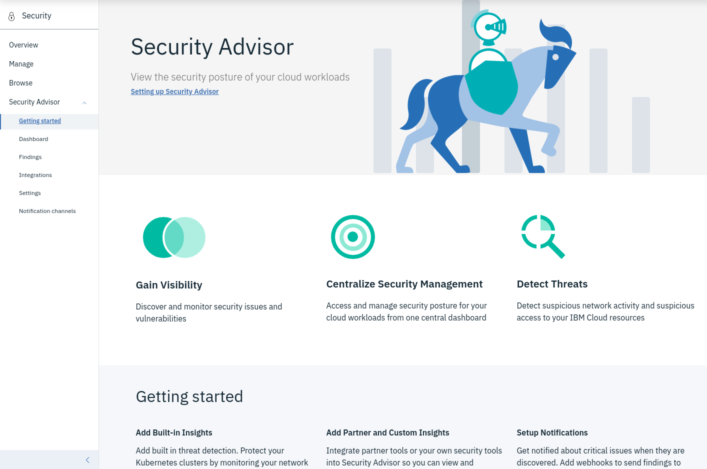

{:shortdesc: .shortdesc}
{:new_window: target="_blank"}
{:codeblock: .codeblock}
{:screen: .screen}
{:tip: .tip}
{:pre: .pre}
{:important: .important}

# Enhance security of your deployed application
{: #extended-app-security}

You already developed and deployed an application on {{site.data.keyword.cloud_notm}}. You already followed the [introductory tutorial on how to apply end to end security to an application]((https://{DomainName}/docs/tutorials?topic=solution-tutorials-cloud-e2e-security). Following "security by design", you now start to look into the design of a new application or you need to adapt an older application to new security requirements. This tutorial walks you through options for applications with advanced security requirements. It looks into enhanced data encryption, isolation of compute runtimes and network traffic, and by using activity logs to look for suspicious activities. 
{:shortdesc}

## Objectives
{: #objectives}

* Learn about enhanced data encryption options.
* Isolate your application runtime for extended security.
* Use activity logs and security advisors to evaluate app security.

## Services used
{: #services}

This tutorial uses the following runtimes and services:
* [{{site.data.keyword.at_short}}](https://{DomainName}/observe/activitytracker/create)
* [{{site.data.keyword.security-advisor_short}}](https://{DomainName}/security-advisor)
* [{{site.data.keyword.keymanagementserviceshort}}](https://{DomainName}/catalog/services/key-protect)
* [{{site.data.keyword.hscrypto}}](https://{DomainName}/catalog/services/hyper-protect-crypto-services)
* [{{site.data.keyword.cloudcerts_full_notm}}](https://{DomainName}/catalog/services/certificate-manager)
* [{{site.data.keyword.hpvs}}](https://{DomainName}/catalog/services/hyper-protect-virtual-servers)
* [{{site.data.keyword.vsi_is_short}}](https://{DomainName}/vpc/provision/vs)
* [{{site.data.keyword.cfee_full_notm}}](https://{DomainName}/cfadmin/create)
* [{{site.data.keyword.datashield_full_notm}}](https://{DomainName}/catalog/infrastructure/ibm-datashield-helm)
* [{{site.data.keyword.ihsdbaas_postgresql_full}}](https://{DomainName}/catalog/services/hyper-protect-dbaas-for-postgresql)
* [{{site.data.keyword.ihsdbaas_mongodb_full}}](https://{DomainName}/catalog/services/hyper-protect-dbaas-for-mongodb)

This tutorial may incur costs. Use the [Pricing Calculator](https://{DomainName}/estimator/review) to generate a cost estimate based on your projected usage.

## Architecture
{: #architecture}

An existing solution with the application and connected (micro-) services is extended for enhanced security.

  

## Assess your application
{: #app_properties}

You developed a solution and successfully deployed it to {{site.data.keyword.cloud_notm}}. Now you want to look into how to harden the app environment. This can be motivated by regular activity as part of (agile) development and the next steps towards a fully secure app or by increasing requirements for an app already in production. 

If you tried the tutorial on how to [apply end to end security to a cloud application](https://{DomainName}/docs/tutorials?topic=solution-tutorials-cloud-e2e-security), you already know how to rotate service credentials. But there is far more to app security than regular changes of passwords and access keys. You may want to assess the application, its deployment and usage  characteristics to better understand what needs to, could be and should be addressed. Depending on your industry, country and region, etc. there exist different [security and resiliency requirements](https://www.ibm.com/cloud/compliance). It could mean

* to isolate the application, its services, the network traffic and stored data from those of other applications,
* to encrypt data and have control over the management of encryption keys,
* to log all kind of events, regularly analyze logs and keep them for audits or incident forensics,
* to organize devops activities and the related teams with more fine-grained privileges
* and much more.

## Isolate runtime environments, networks traffic and data
{: #isolate_environments}

One of the fundamental principles of Cloud Computing is the sharing of resources. This could be the sharing of a machine, i.e., applications from many users running on the same computer, to just sharing the data center and parts of the infrastructure. In the following, you learn how you can isolate runtime environments, network traffic and stored data to increase application security.

### Use dedicated resources and virtual private clouds
{: #isolate_runtimes}

To isolate application runtime environments and related services, you can provision dedicated machines and enterprise-level service plans. Typically, entry-level, lower-priced plans run on shared infrastructure in a multi-tenant mode. The more advanced plans utilize dedicated environments and provide greater physical separation of data. Here are some considerations for some of the compute options.

* When deploying [Cloud Foundry apps](https://{DomainName}/cloudfoundry/overview), consider running them on {{site.data.keyword.cfee_full_notm}} instead of Cloud Foundry public.
* Look into running virtual servers or {{site.data.keyword.containershort}} on [{{site.data.keyword.vpc_full}}](https://{DomainName}/vpc) to benefit from isolation of compute and network resources.

  Check out the tutorials on [how to deploy isolated workloads across multiple locations and regions](https://{DomainName}/docs/tutorials?topic=solution-tutorials-vpc-multi-region) and [how to securely access remote instances using a bastion host](https://{DomainName}/docs/tutorials?topic=solution-tutorials-vpc-secure-management-bastion-server) to get started with {{site.data.keyword.vpc_full}}.
  {: #tip}

* Evaluate the use of [{{site.data.keyword.hpvs}}](https://{DomainName}/docs/services/hp-virtual-servers?topic=hp-virtual-servers-overview) to run workloads in secure service containers.
* As another option to secure workloads, consider [{{site.data.keyword.datashield_short}}](https://{DomainName}/docs/services/data-shield?topic=data-shield-about) for guarding applications running in containers.

When working with database systems, consider using service plans with dedicated resources or services with enhanced security. Examples are [dedicated hardware plans for {{site.data.keyword.cloudant}}](https://{DomainName}/docs/services/Cloudant?topic=cloudant-ibm-cloud-public#dedicated-hardware-plan) that offers HIPAA compliance or services like [{{site.data.keyword.ihsdbaas_postgresql_full}}](https://{DomainName}/docs/services/hyper-protect-dbaas-for-postgresql) and [{{site.data.keyword.ihsdbaas_mongodb_full}}](https://{DomainName}/docs/services/hyper-protect-dbaas-for-mongodb) which offer highly secure database environments for sensitive data.

### Secure network traffic
{: #isolate_networks}

In most cases an application consists of the app itself and one or many services. These services are reachable over the public internet, but can also accessed on so-called [private service endpoints](https://{DomainName}/docs/resources?topic=resources-service-endpoints). To increase security by isolating network traffic, follow the [instructions to enable virtual routing and forwarding (VRF)](https://{DomainName}/docs/account?topic=account-vrf-service-endpoint). In the documentation, you can also find a [list of services that support private endpoints](https://{DomainName}/docs/resources?topic=resources-private-network-endpoints).

When your application does not serve public users, but is only accessed from corporate networks, then a method to isolate network traffic is to access {{site.data.keyword.cloud_notm}} using a Virtual Private Network (VPN) or Direct Link. The [catalog has offerings for both types](https://{DomainName}/catalog?search=label%3Aibm%20vpn). A VPN creates a secure, encrypted transmission channel over a public network whereas the Direct Link offers private network access to {{site.data.keyword.cloud_notm}}.

It is important to note that network traffic, i.e., data in transit, is secured by an encrypted transmission channel. Thus, you should use TLS / SSL. For your domains, you should utilize the [{{site.data.keyword.cloudcerts_short}}](https://{DomainName}/docs/services/certificate-manager?topic=certificate-manager-about-certificate-manager) or similar tools to actively manage encryption certificates and their validity. By setting up notifications you can make sure that certifications do not expire.

## Evaluate and monitor app security
{: #evaluate_security}

Events related to {{site.data.keyword.cloud_notm}} account activities, such as logging in or provisioning a service, are logged to {{site.data.keyword.at_short}}. It does not, however, integrate any application-related events. Applications can ingest security and diagnostic events into [{{site.data.keyword.la_short}}](https://{DomainName}/docs/services/Log-Analysis-with-LogDNA?topic=LogDNA-about). Moreover, several [services support sending usage logs directly to {{site.data.keyword.loganalysisshort}}](https://{DomainName}/docs/services/Log-Analysis-with-LogDNA?topic=LogDNA-cloud_services).

By sending both application logs, such as general diagnostics and security-related information like failed logins to a single logging facility, you can aggregate the logs and perform security analysis in application context, across the full stack. You can use the queries as foundation for [defining alerts](https://{DomainName}/docs/services/Log-Analysis-with-LogDNA?topic=LogDNA-alerts). Alerts help you to monitor your app and related services. You should [set up notification channels](https://{DomainName}/docs/services/Log-Analysis-with-LogDNA?topic=LogDNA-alerts#channels), so that once a defined event is detected, you get notified via e.g., email, Slack or PagerDuty.

The [{{site.data.keyword.security-advisor_full_notm}}](https://{DomainName}/docs/services/security-advisor?topic=security-advisor-about) enables centralized security management through a unified dashboard. It alerts security admins to issues and guides them to understand, prioritize, manage, and resolve security issues that are related to their cloud applications and workloads. [Access the advisor portal](https://{DomainName}/security-advisor#/overview) and explore the offered security services, add plugins to your {{site.data.keyword.containershort_notm}} clusters to gain additional security insights.

  

## Control encryption keys
{: #control_encryption}

Almost all services on {{site.data.keyword.cloud_notm}} that store data use encryption to protect the data against unauthorized access. When using database services or {{site.data.keyword.cos_short}}, by default the encryption key is system-generated. You can increase data protection by controlling the encryption keys. {{site.data.keyword.keymanagementservicelong_notm}} and {{site.data.keyword.hscrypto}} help you provision encrypted keys for storage services as well as apps. Both services are based on [Hardware Security Modules](https://en.wikipedia.org/wiki/Hardware_security_module) (HSM) to manage and safeguard the encryption keys.

### Integrated services

More and more data services support the integration with either {{site.data.keyword.keymanagementserviceshort}} or {{site.data.keyword.hscrypto}}. To see if they can be used with the services in your deployed solution, check out the list of:

- [integrated services for {{site.data.keyword.keymanagementserviceshort}}](https://{DomainName}/docs/services/key-protect?topic=key-protect-integrate-services) and the
- [integrated services for {{site.data.keyword.hscrypto}}](https://{DomainName}/docs/services/hs-crypto?topic=hs-crypto-integrate-services).

Supported services include {{site.data.keyword.cos_short}}, {{site.data.keyword.cloudant}}, {{site.data.keyword.containershort_notm}}, {{site.data.keyword.vsi_is_full}} and more.

### Example: Cloud Object Storage

One of the most often used services is {{site.data.keyword.cos_short}}. After you provisioned either {{site.data.keyword.keymanagementserviceshort}} or {{site.data.keyword.hscrypto}} and created a root key, you can use that key when creating a new storage bucket. The following screenshot shows the UI to create a bucket with option to use a key from either service.

  

## Conclusions

In this tutorial, you learned how to increase application security by moving from standard to advanced capabilities. The journey included the isolation of compute, network and data resources and by asserting even greater control over encryption keys. Security by design is not a hollow phrase, it means to assess security requirements early on and take them into account when designing a solution. As you have seen, {{site.data.keyword.cloud_notm}} provides the building blocks for different security requirements and types of applications. Now it is to you to combine them for your secure cloud application. And don't forget to check out the next section with links to further security-related resources.

## Related content
{: #related}

* Tutorial: [Apply end to end security to a cloud application](https://{DomainName}/docs/tutorials?topic=solution-tutorials-cloud-e2e-security)
* Blog: [Cloud App Security: What Makes a Secure App?](https://www.ibm.com/cloud/blog/cloud-app-security)
* Blog: [Use Your FIDO2 Key for 2FA on IBM Cloud Apps](https://www.ibm.com/cloud/blog/use-your-fido2-key-for-2fa-on-ibm-cloud-apps)
* Blog: [Going Passwordless on IBM Cloud Thanks to FIDO2](https://www.ibm.com/cloud/blog/going-passwordless-on-ibm-cloud-thanks-to-fido2)
* IBM Architecture Center: [Security to safeguard and monitor your cloud apps](https://www.ibm.com/devops/method/content/architecture/securityArchitecture)
* [{{site.data.keyword.cloud_notm}} platform service CLIs and APIs](https://{DomainName}/docs/overview?topic=overview-platform-svc-cli-api)
* [IBM Cloud Compliance Programs](https://www.ibm.com/cloud/compliance)

