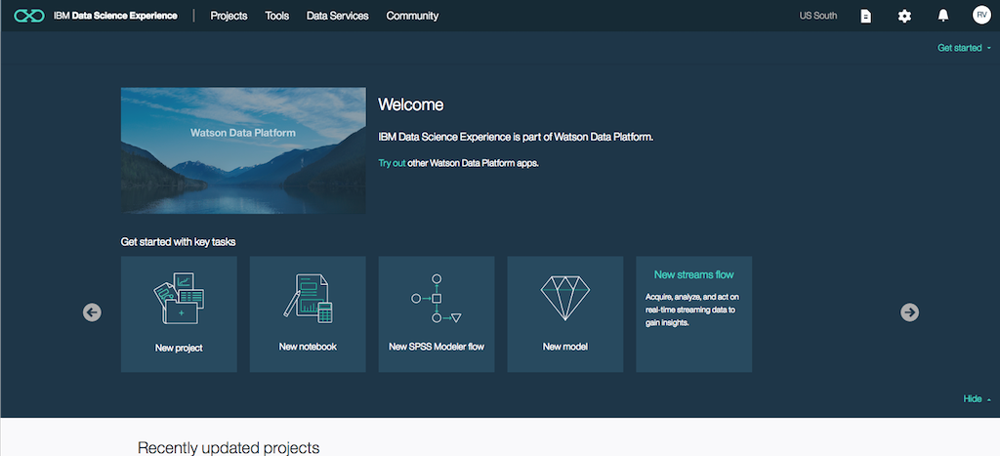
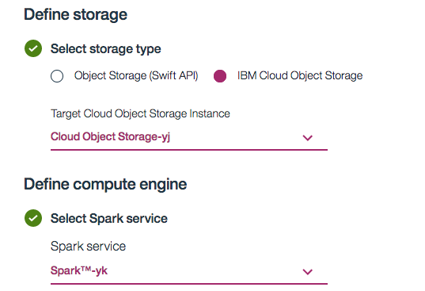

---
copyright:
  years: 2017
lastupdated: "2017-12-19"

---

{:shortdesc: .shortdesc}
{:new_window: target="_blank"}
{:codeblock: .codeblock}
{:screen: .screen}
{:tip: .tip}
{:pre: .pre}

# Gather, Visualize and Analyze IoT data
This tutorial walks you thru setting up an IoT device, gathering data in the Watson IoT Platform, exploring data and creating visualizations and then using advanced machine learning services to analyze data and detect anomalies in the historical data.
{:shortdesc}

## Objectives
{: #objectives}

* Set up IoT Simulator
* Send collection data to Watson IoT Platform
* Create visualizations
* Analyze the device generated data and detect anomalies.

## Products
{: #products}

This tutorial uses the following products:
* [Internet of Things Platform](https://console.bluemix.net/catalog/services/internet-of-things-platform)
* [Node.js Application](https://console.ng.bluemix.net/catalog/)
* [Data Science Experience](https://console.bluemix.net/catalog/services/data-science-experience)
* [Cloudant NoSQL Database](https://console.bluemix.net/catalog/services/cloudant-nosql-db)

<p style="text-align: center;">

</p>

## Create IoT Platform
{: #iot_starter}

To begin, you will create Internet of Things Platform service - The hub which can manage devices, securely connect and **collect data**, and make historical data available for visualizations and applications.

1. Visit **IBM Cloud Dashboard** > **Catalog** and select **Internet of Things Platform** under the **Internet of Things** section.
2. Enter `IoT demo hub` as the service name, click **Create** and **Launch** the dashboard.
3. From the side menu, select **Security > Connection Security** and choose **TLS Optional** under *Default Rule > Security Level** and Click **Save**.
3. From the side menu, select **Devices** > **Add Device** > **Device Types**  and **+ Add Device Type**.
5. Enter `simulator` as the **Name** and click **Next** and **Done**.
6. Next, click on **Register Device **
7. Choose `simulator` for **Select Existing Device Type** and then enter `phone` for **Device ID**.
8. Click **Next** until the **Device Security** (under Security tab) screen is displayed.
9. Enter a value for the **Authentication Token**, for example: `myauthtoken` and click **Next**
10. After clicking **Done**, your connection information is displayed. Keep this tab open.

The IoT platform is now configured to start receiving data. Devices will need to send their data to the IoT Platform with the Device Type, ID and Token specified.

## Create device simulator
{: #confignodered}
Next, you will need to configure the simulator. You will deploy a Node.js web application which you will visit on your phone, which will connect to and send data to the IoT Platform.

1. Clone the Github repository:
   ```bash
   git clone https://github.com/cloud-dach/iotdeviceconnect
   cd iotdeviceconnect
   ```
2. Push the application to the IBM Cloud.
   ```bash
   bx login
   bx target --cf
   bx cf push <PICK_UNIQUE_NAME>
   ```
     
     Before running the above command, Update the **host** and **name** values in manifest.yml file with an unique name.
     {:tip}
3. In a few minutes, your application will be deployed and you should see a URL similar to `<PICK_UNIQUE_NAME>.mybluemix.net`
4. Visit this URL on your phone using a browser.
5. Enter the connection information from your IoT Dashboard tab under **Device Credentials** and click **Connect**.
6. Your phone will start transmitting data. Back in the **IBM Watson IoT Platform tab**, check for new entires in the **Recent Events** section.

  

## Display live data in IBM Watson IoT Platform
{: #createcards}
Next, you will create a board and cards to display device data in the dashboard. For more information about boards and cards, see [Visualizing real-time data by using boards and cards](https://console.ng.bluemix.net/docs/services/IoT/data_visualization.html).

### Create a board
{: #createboard}

1. Open the **IBM Watson IoT Platform dashboard**.
2. Select **Boards** from the left menu, and then click **Create New Board**.
3. Enter a name for the board and click **Next** and then **Create**.  
4. Double-click the board that you just created to open it.

### Create a card to display device data
{: #cardtemp}
1. Click **Add New Card**, and then select the **Line Chart** card type, which is located in the Devices section.
2. Select your device from the list, then click **Next**.
3. Click **Connect new data set**.
4. In the Create Value Card page, select or enter the following values and click **Next**.
   - Event: sensorData
   - Property: ob
   - Name: OrientationBeta
   - Type: Float
   - Min: -180
   - Max: 180
5. In the Card Preview page, select **L** for the line chart size, and click **Next** > **Submit**
6. The  card appears on the dashboard and includes a line chart of the live temperature data.
8. Use your mobile phone browser to launch the simulator again and slowly tilt the phone forward and backward.
8. Back in the **IBM Watson IoT Platform tab**, you should see the chart getting updated.

## Store historical data in Cloudant DB
1. Open the **IBM Watson IoT Platform dashboard**.
2. Select **Extensions** from the left menu, and then click **Setup** under **Historical Data Storage**.
3. Select the Cloudant database that was created by the IoT Starter.
4. Enter `devicedata` for **Database Name** and click **Done**.

## Detect Anomolies using Machine Learning
{: #data_experience}

You will use the Jupyter Notebook that is available in IBM Data Science Experience to load your historical temperature data and detect anomalies using z-score.



### Create a new project
1. Visit **IBM Cloud Dashboard** > **Catalog** and select **Data Science Experience**.
2. **Create** the service and launch it's dashboard by clicking **Get Started**
3. Create a **New Project** and enter `Detect Anomoly` as the **Name**.
4. Create and select **Object Storage** and **Spark** services. **Refresh**
  
5. **Create**.

### Connection to CloudantDB for data

1. Click on **Assets**
2. Click on Add to Project > Connection > Select the CloudantDB where the device data is stored.
3. Check the credentials > Create

### Create a jupyter(ipynb) notebook
1. **New notebook** > **From URL**
2. Enter `Anomoly-detection-sample` for the **Name**.
3. Enter `https://github.com/IBM-Cloud/iot-data-anomaly-detection/blob/master/Anomaly-detection-DSX.ipynb` in the URL.
4. **Create Notebook**.Check that the notebook is created with metadata and code.
5. Select the cell that starts with `!pip install --upgrade pixiedust,` and then click **Play** or **Ctrl+enter** to run the code.
6. When the installation is complete, restart the Spark kernel by clicking the Restart Kernel icon.
7. In the next code cell, Import your Cloudant credentials to that cell by completing the following steps:
  * Click 
  * Select the **Connections** tab.
  * Click **Insert to code**. A dictionary called credentials_1" is created with your Cloudant credentials. If the name is not specified as "credentials_1", rename the dictionary to "credentials_1" because this is the name that is required for the notebook code to run.

8. In the cell with the database name (dbname) enter the name of the Cloudant database that is the source of data, for example, iotp_yourWatsonIoTPorgId_DBName_Year-month-day.

    You can find the exact database by navigating to the CloudantDB instance you created earlier > Launch Dashboard.
    {:tip}
9. Save the notebook and execute each code cell one after another and by end of the notebook you should see anomalies for device movement data (oa,ob, and og).
    
    You should set the time interval of interest by replacing the year, month and day with your desired values.
    {:tip}
