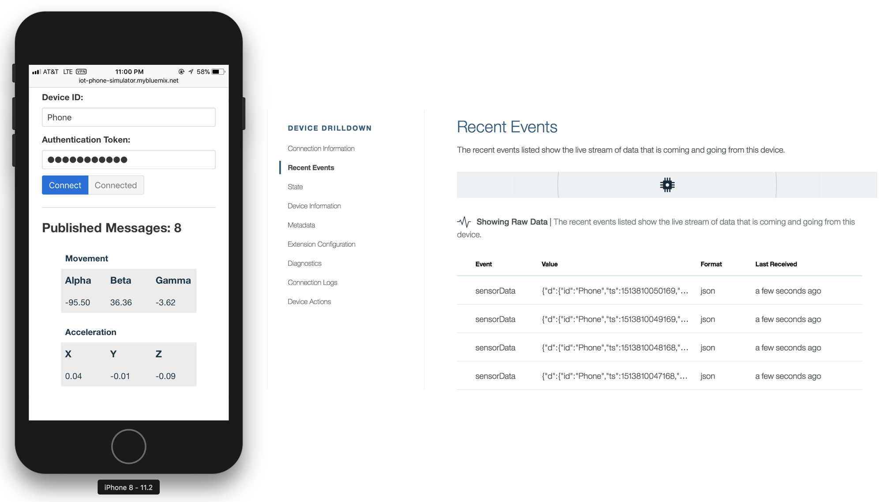
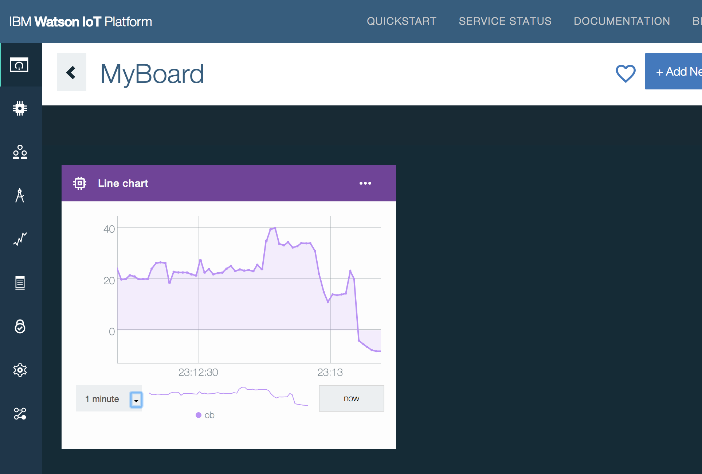
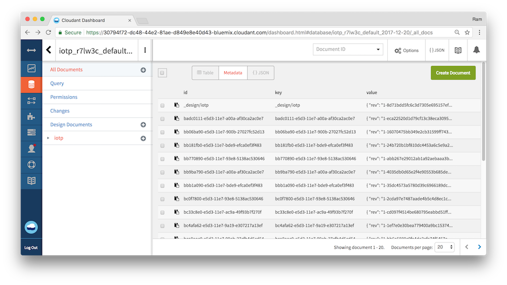
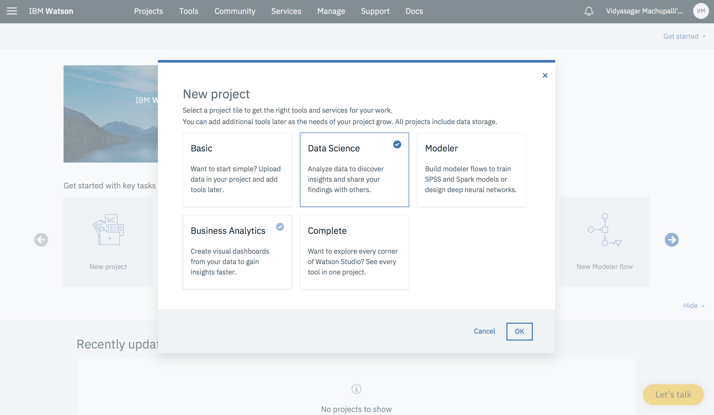
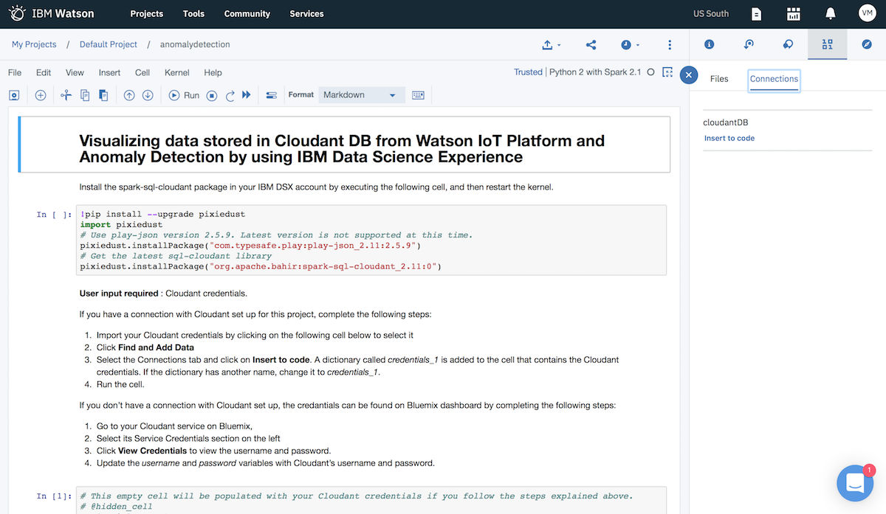
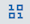
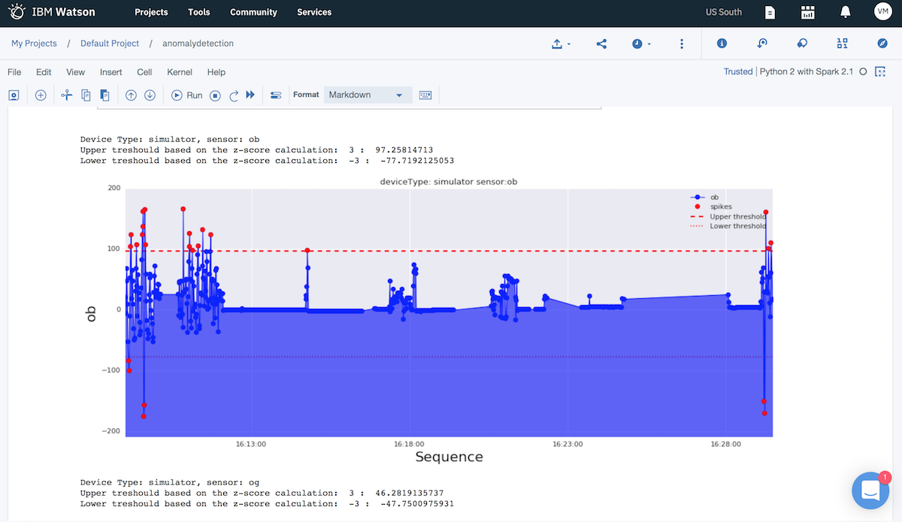
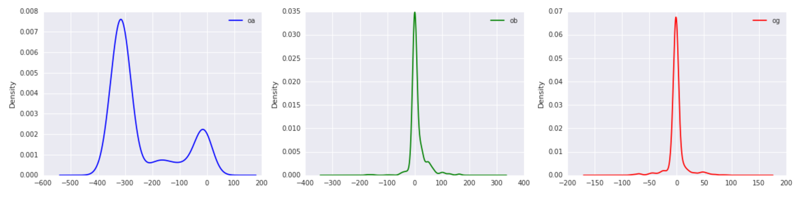

---
copyright:
  years: 2017, 2018
lastupdated: "2018-06-05"

---

{:shortdesc: .shortdesc}
{:new_window: target="_blank"}
{:codeblock: .codeblock}
{:screen: .screen}
{:tip: .tip}
{:pre: .pre}

# Gather, visualize, and analyze IoT data
This tutorial walks you through setting up an IoT device, gathering data in the {{site.data.keyword.iot_short_notm}}, exploring data and creating visualizations and then using advanced machine learning services to analyze data and detect anomalies in the historical data.
{:shortdesc}

## Objectives
{: #objectives}

* Set up IoT Simulator.
* Send collection data to {{site.data.keyword.iot_short_notm}}.
* Create visualizations.
* Analyze the device generated data and detect anomalies.

<p style="text-align: center;">

</p>

## Products
{: #products}

This tutorial uses the following products:
* [{{site.data.keyword.iot_full}}](https://console.bluemix.net/catalog/services/internet-of-things-platform)
* [Node.js Application](https://console.bluemix.net/catalog/starters/sdk-for-nodejs)
* [{{site.data.keyword.DSX_short}}](https://console.bluemix.net/catalog/services/data-science-experience) with Spark service and {{site.data.keyword.Bluemix_notm}} Object Storage
* [Cloudant NoSQL Database](https://console.bluemix.net/catalog/services/cloudant-nosql-db)

## Before you begin
{: #prereqs}

[{{site.data.keyword.Bluemix_notm}} Developer Tools](https://github.com/IBM-Cloud/ibm-cloud-developer-tools) - Run the script to install ibmcloud cli and required plug-ins

## Create IoT Platform
{: #iot_starter}

To begin, you will create Internet of Things Platform service - The hub which can manage devices, securely connect and **collect data**, and make historical data available for visualizations and applications.

1. Go to the [**{{site.data.keyword.Bluemix_notm}} Catalog**](https://console.bluemix.net/catalog/) and select [**Internet of Things Platform**](https://console.bluemix.net/catalog/services/internet-of-things-platform) under the **Internet of Things** section.
2. Enter `IoT demo hub` as the service name, click **Create** and **Launch** the dashboard.
3. From the side menu, select **Security > Connection Security** and choose **TLS Optional** under **Default Rule** > **Security Level** and click **Save**.
4. From the side menu, select **Devices** > **Device Types**  and **+ Add Device Type**.
5. Enter `simulator` as the **Name** and click **Next** and **Done**.
6. Next, click on **Register Devices**
7. Choose `simulator` for **Select Existing Device Type** and then enter `phone` for **Device ID**.
8. Click **Next** until the **Device Security** (under Security tab) screen is displayed.
9. Enter a value for the **Authentication Token**, for example: `myauthtoken` and click **Next**.
10. After clicking **Done**, your connection information is displayed. Keep this tab open.

The IoT platform is now configured to start receiving data. Devices will need to send their data to the IoT Platform with the Device Type, ID and Token specified.

## Create device simulator
{: #confignodered}
Next, you will deploy a Node.js web application and visit it on your phone, which will connect to and send device accelerometer and orientation data to the IoT Platform.

1. Clone the Github repository:
   ```bash
   git clone https://github.com/IBM-Cloud/iot-device-phone-simulator
   cd iot-device-phone-simulator
   ```
2. Open the code in an IDE of your choice and change the `name` and `host` values in the **manifest.yml** file to an unique value.
3. Push the application to the {{site.data.keyword.Bluemix_notm}}.
   ```bash
   ibmcloud login
   ibmcloud target --cf
   ibmcloud cf push
   ```
4. In a few minutes, your application will be deployed and you should see a URL similar to `<UNIQUE_NAME>.mybluemix.net`
5. Visit this URL on your phone using a browser.
6. Enter the connection information from your IoT Dashboard tab under **Device Credentials** and click **Connect**.
7. Your phone will start transmitting data. Back in the **IBM {{site.data.keyword.iot_short_notm}} tab**, check for new entires in the **Recent Events** section.
  

## Display live data in IBM {{site.data.keyword.iot_short_notm}}
{: #createcards}
Next, you will create a board and cards to display device data in the dashboard. For more information about boards and cards, see [Visualizing real-time data by using boards and cards](https://console.ng.bluemix.net/docs/services/IoT/data_visualization.html).

### Create a board
{: #createboard}

1. Open the **IBM {{site.data.keyword.iot_short_notm}} dashboard**.
2. Select **Boards** from the left menu, and then click **Create New Board**.
3. Enter a name for the board, `Simulators` as example,  and click **Next** and then **Create**.  
4. Select the board that you just created to open it.

### Create a card to display device data
{: #cardtemp}
1. Click **Add New Card**, and then select the **Line Chart** card type, which is located in the Devices section.
2. Select your device from the list, then click **Next**.
3. Click **Connect new data set**.
4. In the Create Value Card page, select or enter the following values and click **Next**.
   - Event: sensorData
   - Property: ob
   - Name: OrientationBeta
   - Type: Float
   - Min: -180
   - Max: 180
5. In the Card Preview page, select **L** for the line chart size, and click **Next** > **Submit**
6. The  card appears on the dashboard and includes a line chart of the live temperature data.
7. Use your mobile phone browser to launch the simulator again and slowly tilt the phone forward and backward.
8. Back in the **IBM {{site.data.keyword.iot_short_notm}} tab**, you should see the chart getting updated.
   

## Store historical data in Cloudant DB
1. Go to the [**{{site.data.keyword.Bluemix_notm}} Catalog**](https://console.bluemix.net/catalog/) and create a new [Cloudant NoSQL Database](https://console.bluemix.net/catalog/services/cloudant-nosql-db) named `iot-db`.
2. Open the **IBM {{site.data.keyword.iot_short_notm}} dashboard**.
3. Select **Extensions** from the left menu, and then click **Setup** under **Historical Data Storage**.
4. Select the `iot-db` Cloudant database.
5. Enter `devicedata` for **Database Name** and click **Done**.
6. A new window should load prompting for authorization. If you don't see this window, disable your pop-up blocker and refresh the page.

Your device data is now saved in Cloudant. Launch the Cloudant dashboard to see your data.



## Detect Anomalies using Machine Learning
{: #data_experience}

In this section, you will use the Jupyter Notebook that is available in the IBM {{site.data.keyword.DSX_short}} service to load your historical mobile data and detect anomalies using z-score. *z-score* is a standard score that indicates how many standard deviations an element is from the mean


### Create a new project
1. Go to the [**{{site.data.keyword.Bluemix_notm}} Catalog**](https://console.bluemix.net/catalog/) and under **Watson**, select [**{{site.data.keyword.DSX_short}}**](https://console.bluemix.net/catalog/services/data-science-experience).
2. **Create** the service and launch it's dashboard by clicking **Get Started**
3. Create a **New Project** > Select **Jupyter Notebooks** and enter `Detect Anomaly` as the **Name**.
   
4. Leave the **Restrict who can be a collaborator** checkbox unchecked as there's no confidential data.
5. Under **Define Storage**, Click on **Add** and choose an existing object storage service or create a new one (Select **Lite** plan > Create). Hit **Refresh** to see the created service.
6. Click **Create**. Your new project opens and you can start adding resources to it.

### Connection to CloudantDB for data

1. Click on **Assets** > **+ Add to Project** > **Connection**  
2. Select the **iot-db** Cloudant DB where the device data is stored.
3. Check the **Credentials** then click **Create**

### Create a jupyter(ipynb) notebook
1. Go to the [**{{site.data.keyword.Bluemix_notm}} Catalog**](https://console.bluemix.net/catalog/) and under **Data & Analytics**, select [**Apache Spark**](https://console.bluemix.net/catalog/services/apache-spark?bss_account=3d40d897302501f3391c73e3029701f3&taxonomyNavigation=data) Lite Plan > Click **Create**.
2. Navigate to http://dataplatform.ibm.com, Open the project you created above. Under **Assets** in your project, Click **New notebook** > **From URL**.
3. Enter `Anomaly-detection-sample` for the **Name**.
4. Enter `https://raw.githubusercontent.com/IBM-Cloud/iot-device-phone-simulator/master/anomaly-detection/Anomaly-detection-DSX.ipynb` in the URL.
5. Select the Apache Spark you created above as your runtime.
6. **Create Notebook**.
   Check that the notebook is created with metadata and code.
   

   Recommended version for this notebook is `Python 2 with Spark 2.1`. To update, **Kernel** > Change kernel. To **Trust** the notebook, **File** > Trust Notebook.
   {:tip}

### Run the notebook and detect anomalies   
1. Select the cell that starts with `!pip install --upgrade pixiedust,` and then click **Run** or **Ctrl + Enter** to execute the code.
2. When the installation is complete, restart the Spark kernel by clicking the **Restart Kernel** icon.
3. In the next code cell, Import your Cloudant credentials to that cell by completing the following steps:
  * Click 
  * Select the **Connections** tab.
  * Click **Insert to code**. A dictionary called credentials_1" is created with your Cloudant credentials. If the name is not specified as "credentials_1", rename the dictionary to `credentials_1`. `credentials_1` is used in the remaining cells.
  * name that is required for the notebook code to run.
4. In the cell with the database name (`dbName`) enter the name of the Cloudant database that is the source of data, for example, *iotp_yourWatsonIoTProgId_DBName_Year-month-day*. To visualize data of different devices, change the values of `deviceId` and `deviceType` accordingly.

    You can find the exact database by navigating to your **iot-db** CloudantDB instance you created earlier > Launch Dashboard.
    {:tip}
5. Save the notebook and execute each code cell one after another or run all (**Cell** > Run All) and by end of the notebook you should see anomalies for device movement data (oa,ob, and og).

    You can change the time interval of interest to desired time of the day. Look for `start` and `end` values.
    {:tip}

    
6. Along with anomaly detection, the key findings or takeaways from this section are
    * Usage of Spark to prepare the data for visualization.
    * Usage of Pandas for data visualization
    * Bar charts, Histograms for device data.
    * Correlation between two sensors through Correlation matrix.
    * A box plot for each devices sensor, produced with the Pandas plot function.
    * Density Plots through Kernel density estimation (KDE).
    

## Clean up Resources
1. Navigate to [Dashboard](https://console.bluemix.net/dashboard/) > choose the region, Org and space where you have created the app and services. Under **Cloud Foundry Apps**, delete the Node.JS App your created above.
2. Under **Services**, delete the respective Internet of Things Platform, Apache Spark, Cloudant NoSQL DB and Cloud Object Storage services which you created for this tutorial.

## Related Content

* Solution tutorial - [Build, deploy, test, and retrain a predictive machine learning model](https://console.bluemix.net/docs/tutorials/create-deploy-retrain-machine-learning-model.html#build-deploy-test-and-retrain-a-predictive-machine-learning-model)
* Overview of [IBM {{site.data.keyword.DSX_short}}](https://datascience.ibm.com/docs/content/getting-started/overview-ws.html?context=analytics)
* Anomaly Detection [Jupyter Notebook](https://github.com/IBM-Cloud/iot-device-phone-simulator/blob/master/anomaly-detection/Anomaly-detection-DSX.ipynb)
* Understanding z-score - [wikipedia](https://en.wikipedia.org/wiki/Standard_score)
* Developing cognitive IoT solutions for anomaly detection by using deep learning - [5 post series](https://www.ibm.com/developerworks/analytics/library/iot-deep-learning-anomaly-detection-1/index.html?ca=drs-)
