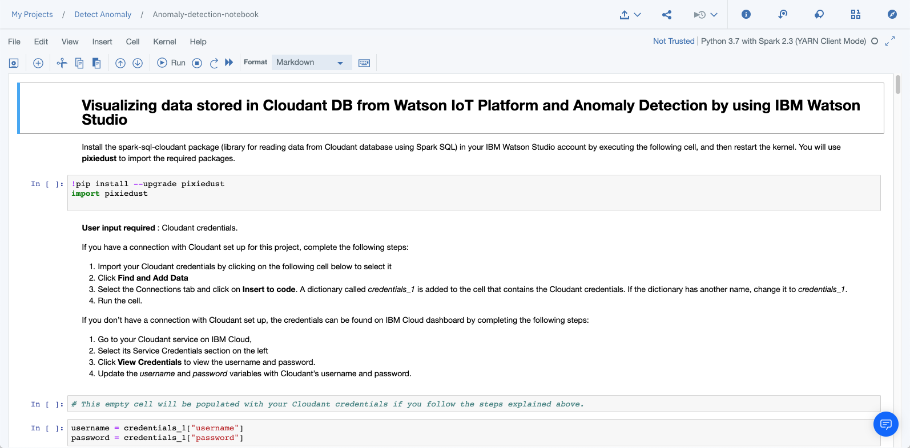

{:shortdesc: .shortdesc}
{:new_window: target="_blank"}
{:codeblock: .codeblock}
{:screen: .screen}
{:tip: .tip}
{:pre: .pre}

# Gather, visualize, analyze and detect anomalies in IoT data
{: #gather-visualize-analyze-iot-data}
This tutorial walks you through setting up an IoT device, gathering data in the {{site.data.keyword.iot_short_notm}}, exploring data and creating visualizations and then using advanced machine learning services to analyze data and detect anomalies in the historical data.
{:shortdesc}
{{site.data.keyword.iot_full}} is a fully managed, cloud-hosted service that makes it simple to derive value from Internet of Things (IoT) devices.

Simply register and connect your device, be it a sensor, a gateway, or something else, to  {{site.data.keyword.iot_short_notm}} and start sending data securely up to the cloud using the open, lightweight MQTT messaging protocol. You can set up and manage your devices using your online dashboard or our secure APIs, so that your apps can access and use your live and historical data.

{{site.data.keyword.DSX_full}} provides you with the environment and tools to solve your business problems by collaboratively working with data. You can choose the tools you need to analyze and visualize data, to cleanse and shape data, to ingest streaming data, or to create and train machine learning models.

## Objectives
{: #objectives}

* Set up IoT Simulator to collect mobile device sensor data.
* Send collected data to {{site.data.keyword.iot_short_notm}}.
* Create visualizations with a Jupyter notebook.
* Analyze the device generated data and detect anomalies.

## Services used
{: #services}

This tutorial uses the following runtimes and services:
* [{{site.data.keyword.iot_full}}](https://{DomainName}/catalog/services/internet-of-things-platform)
* [Node.js Application](https://{DomainName}/catalog/starters/sdk-for-nodejs)
* [{{site.data.keyword.DSX_short}}](https://{DomainName}/catalog/services/data-science-experience) with [{{site.data.keyword.iae_full_notm}}](https://{DomainName}/catalog/services/analytics-engine) and [{{site.data.keyword.cos_full_notm}}](https://{DomainName}/catalog/services/cloud-object-storage)
* [{{site.data.keyword.cloudant_short_notm}}](https://{DomainName}/catalog/services/cloudant)

This tutorial may incur costs. Use the [Pricing Calculator](https://{DomainName}/estimator/review) to generate a cost estimate based on your projected usage.

## Architecture
{: #architecture}

<p style="text-align: center;">

   
</p>

1. User moves the mobile device to generate and send sensor data to {{site.data.keyword.iot_full}} using MQTT protocol.
2. The historical sensor data is then exported into an {{site.data.keyword.cloudant_short_notm}} database.
3. {{site.data.keyword.DSX_short}} pulls data from {{site.data.keyword.cloudant_short_notm}} database.
4. Data is analyzed and visualized through a Jupyter notebook on {{site.data.keyword.DSX_short}}.
5. User can now see the visualizations and check the anomalies in the sensor data.

## Before you begin
{: #prereqs}

[{{site.data.keyword.Bluemix_notm}} Developer Tools](https://github.com/IBM-Cloud/ibm-cloud-developer-tools) - Run the script to install ibmcloud cli and required plug-ins

## Create IoT Platform
{: #iot_starter}

To begin, you will create Internet of Things Platform service - The hub which can manage devices, securely connect and **collect data**, and make historical data available for visualizations and applications.

1. Go to the [**{{site.data.keyword.Bluemix_notm}} Catalog**](https://{DomainName}/catalog/) and select [**Internet of Things Platform**](https://{DomainName}/catalog/services/internet-of-things-platform) under the **Internet of Things** section.
2. Select a region and choose **Lite** as the pricing plan.
3. Enter `IoT demo hub` as the service name.
4. Click **Create** and then **Launch**(under Manage) the dashboard.
5. From the side menu, select **Security** > click Edit icon next to **Connection Security** and choose **TLS Optional** under **Default Rule** > **Security Level** and click **Save**.
6. From the side menu, select **Devices** > **Device Types**  and **Add Device Type**.
7. Enter `simulator` as the **Name** and click **Next** and **Finish**.
8. Next, click on **Register Devices**.
9. Select **simulator** as **Device Type** and enter `phone` for **Device ID**.
10. Click **Next** until the **Security** screen is displayed.
11. Enter a value for the **Authentication Token**, for example: `myauthtoken` and click **Next**.
12. After clicking **Finish**, your connection information is displayed. Keep this tab open.

The IoT platform is now configured to start receiving data. Devices will need to send their data to the IoT Platform with the Device Type, ID and Token specified.

## Create device simulator
{: #create_device_simulator}
Next, you will deploy a Node.js web application and visit it on your phone, which will connect to and send device accelerometer and orientation data to the IoT Platform.

1. Clone the Github repository:
   ```bash
   git clone https://github.com/IBM-Cloud/iot-device-phone-simulator
   cd iot-device-phone-simulator
   ```
   {:pre}
2. Push the application to the {{site.data.keyword.Bluemix_notm}}.
   ```bash
   ibmcloud login
   ibmcloud target --cf
   ibmcloud cf push
   ```
   {:pre}
3. In a few minutes, your application will be deployed and you should see a URL similar to `<random-name>.mybluemix.net`
4. Visit the application URL with HTTPS (`https://<random-name>.mybluemix.net`) on your phone using a browser.
5. Enter the connection information from your IoT Dashboard tab under **Device Credentials** and click **Connect**.
6. Your phone will start transmitting data. Check for new entries in the **Recent Events** section.
  

On iOS 13.x if prompted, Allow the website to access motion and orientation sensor data.
On iOS 12.x, Sensor access is disabled by default in Safari. To enable manually, Open Settings -> Safari -> Motion & Orientation access
{: tip}

## Display live data in IBM {{site.data.keyword.iot_short_notm}}
{: #creat_ecards}
Next, you will create a board and cards to display device data in the dashboard.

### Create a board
{: #create_board}

1. Select **Boards** from the left menu, and then click **Create New Board**.
2. Enter a name for the board, `Simulators` as example,  and click **Next** and then **Submit**.
3. Select the board that you just created to open it.

### Display device data
{: #display_device_data}

1. Click **Add New Card**, and then select the **Line Chart** card type, which is located in the Devices section.
2. Select your device from the list, then click **Next**.
3. Click **Connect new data set**.
4. In the Create Value Card page, select or enter the following values and click **Next**.
   - Event: sensorData
   - Property: ob
   - Name: OrientationBeta
   - Type: Float
   - Unit: &deg;
   - Precision: 1
   - Min: -180
   - Max: 180
5. In the Card Preview page, select **L** for the line chart size, and click **Next** > **Submit**
6. The card appears on the dashboard and includes a line chart of the live OrientationBeta(ob) data.
7. Use your mobile phone browser to launch the simulator again and slowly tilt the phone forward and backward.
8. Back in the **IBM {{site.data.keyword.iot_short_notm}} Boards tab**, you should see the chart getting updated.

## Store historical data in {{site.data.keyword.cloudant_short_notm}}
{: #historical_data_cloudant}

In this section, you will create a {{site.data.keyword.cloudant_short_notm}} service and bind the service to {{site.data.keyword.iot_short_notm}} to store the historical data.

### Create an {{site.data.keyword.cloudant_short_notm}} DB and connect to the app
{: #create_cloudant_db}

1. Go to the [**{{site.data.keyword.Bluemix_notm}} Catalog**](https://{DomainName}/catalog/) and create a new [{{site.data.keyword.cloudant_short_notm}}](https://{DomainName}/catalog/services/cloudant)
   - Select a region and choose **Lite** plan
   - Enter `iot-db` as the service name
   - Select **both legacy credentials and IAM** as the authentication method and click **Create**
2. Go to the [Resource list](https://{DomainName}/resources) and enter `iot-db` in the Name field to check the status of the service.Once the status changes to **Provisioned**, click on the service name to see the Manage page.
   - On the left menu, click **Service credentials**
   - Click **New credential** and then **Add**
   - Expand **View credentials** and save the credentials for future reference
3. Under **Connections**:
   - Click **Create connection**
   - Select the Cloud Foundry location, organization and space where an alias to the {{site.data.keyword.cloudant_short_notm}} service should be created.
   - Expand the space name in the **Connection Location** table and use the **Connect** button next to **iot-solution-tutorial** to create an alias for the {{site.data.keyword.cloudant_short_notm}} service in that space.
   - Connect and restage the app.

### Create a data connector to store the historical data
{:#historical_data_connector}

Setting up a new connection is a four-step process:

* Create a service binding that provides {{site.data.keyword.iot_short_notm}} with the necessary information to connect to the Cloudant service.
* Create a connector instance for the service binding.
* Configure one or more destinations on the connector.
* Set up one or more forwarding rules for each destination.

To setup a new connection,
1. Open the **IBM {{site.data.keyword.iot_short_notm}} dashboard**.
2. Select **Extensions** from the left menu, and then click **Historical Data Storage Extension REST API** under Historical Data Storage. A new tab will be opened showing the **IBM {{site.data.keyword.iot_short_notm}} - Historical Data Storage Extension APIs** Swagger UI.
3. Under **Services**, expand the **POST /s2s/services** endpoint and click **Try it out**. Replace the placeholders in the JSON below with the cloudant service credentials and use it as content for **Example Value** under **Service** body.

   ```json
    {
      "name": "iot-cloudant",
      "type": "cloudant",
      "description": "for IoT solution tutorial",
      "credentials": {
        "username": "CLOUDANT_USERNAME",
        "password": "CLOUDANT_PASSWORD",
        "host": "CLOUDANT_HOST",
        "port": 443,
        "url": "CLOUDANT_URL"
      }
    }
   ```
   {:pre}
4. Click **Execute** to see `HTTP 201` response. Save the `id` (serviceID) from the response for the next API call.
5. Under **HistorianConnectors**, expand the **POST /historianconnectors** endpoint and click **Try it out**. Replace the **Example Value** under **Connector** body with the JSON below. Don't forget to replace the `SERVICE_ID` with the `id` from the response above.
    ```json
    {
      "name": "iot-cloudant-connector",
      "description": "Historian connector connecting IoT platform to cloudant",
      "serviceId": "SERVICE_ID",
      "type": "cloudant",
      "enabled": true
    }
    ```
    {:pre}
6. Click **Execute** to see `HTTP 201` response. Save the `id`(connectorID) from the response for future reference.
7. Under **Destinations**, expand the **POST /historianconnectors/{connectorId}/destinations** endpoint and click **Try it out**. Provide the `id`(connectorID) and replace the **Example Value** under **Destination** body with the JSON below.
   ```json
   {
    "name": "default",
    "type": "cloudant",
    "configuration": {
      "bucketInterval": "DAY"
     }
   }
   ```
   {:pre}
8. Click **Execute** to see `HTTP 201` response.
9. Under **Forwarding Rules**, expand **POST /historianconnectors/{connectorId}/forwardingrules** endpoint and click **Try it out**. Provide the `id`(connectorID) and replace the **Example Value** under **Forwarding Rule** body with the JSON below.
    ```json
    {
    "name": "iot-cloudant-rule",
    "destinationName": "default",
    "type": "event",
    "selector": {
      "deviceType": "simulator",
      "eventId": "sensorData"
     }
    }
    ```
    {:pre}
10. Click **Execute** to see `HTTP 201` response.

By using the Python SDK, you can set up a Cloudant NoSQL DB binding in just a few lines of code.For more information about how to get your IoT data forwarded to Cloudant NoSQL DB, check the [configuration section](https://www.ibm.com/support/knowledgecenter/SSQP8H/iot/platform/reference/dsc/cloudant.html) of data connector documentation.
{:tip}

Your device data will now be saved in {{site.data.keyword.cloudant_short_notm}}. Reconnect the browser app to generate new data. After a few minutes, launch the {{site.data.keyword.cloudant_short_notm}} dashboard to see your data.


## Detect Anomalies using Machine Learning
{: #detect_anomalies}

In this section, you will use the Jupyter Notebook that is available in the IBM {{site.data.keyword.DSX_short}} service to load your historical mobile data and detect anomalies using z-score. *z-score* is a standard score that indicates how many standard deviations an element is from the mean

### Create a new project
{: #create_project}
1. Go to the [**{{site.data.keyword.Bluemix_notm}} Catalog**](https://{DomainName}/catalog/) and under **AI**, select [**{{site.data.keyword.DSX_short}}**](https://{DomainName}/catalog/services/data-science-experience).
2. **Create** the service
   - Select a region and choose **Lite** pricing plan
   - Enter a **Service name** and select a resource group
3. Launch the dashboard by clicking **Get Started** and click **Create project** > Create an empty project and enter `Detect Anomaly` as the **Name** of the project.
4. Leave the **Restrict who can be a collaborator** checkbox unchecked as there's no confidential data.
5. Select an existing **Cloud Object Storage** service under **Define Storage** or create a new one (Select **Lite** plan > Create). Hit **Refresh** to see the created service.
6. Click **Create**. Your new project opens and you can start adding resources to it.

### Connection to {{site.data.keyword.cloudant_short_notm}} for data
{: #connection_cloudant}

1. Click on **+ Add to Project** > **Connection**
2. Select the **iot-db** {{site.data.keyword.cloudant_short_notm}} where the device data is stored.
3. Verify the **Credentials** and then click **Create**.

### Select or Create an {{site.data.keyword.iae_full_notm}} service
{: #analytics_engine}

If you don't have an existing **{{site.data.keyword.iae_full_notm}}** service:
1. Go to {{site.data.keyword.cloud_notm}} catalog, select [{{site.data.keyword.iae_short}}](https://{DomainName}/catalog/services/analytics-engine).
2. Select a region and choose the **Lite** plan
3. Enter a service name, select a resource group and click **Configure**.
4. In the configuration page, set the Software package to **AE 1.2 Spark and Hadoop** and click **Create**.

Once the service is provisioned or if you have an existing service instance you want to use and configured with software package **AE 1.2 Spark and Hadoop**:
1. From the [Resources list](https://{DomainName/resources}), open the created service.
2. Under **Service credentials**, create new credential:
   - Set **Name** to **wdp-writer**
   - Set **Role** to **Writer** and click **Add**
3. Under **Manage**, retrieve the user name and password for the cluster. You may need to reset the cluster password.

In {{site.data.keyword.DSX}},:
1. Select the **Detect Anomaly** project.
1. Click **Settings** on the top navigation bar.
1. Scroll to **Associated Services.**
   - Click **Add service**.
   - Select **{{site.data.keyword.iae_full_notm}}**.
1. Select the **Existing** service instance discussed above.
1. Enter the cluster user name and password.
1. Click **Select**.

### Create a Jupyter (ipynb) notebook
1. Click **+ Add to Project** and add a new **Notebook**.
2. Select **From URL** and Enter `Anomaly-detection-notebook` as your Notebook **Name**.
3. Enter `https://github.com/IBM-Cloud/iot-device-phone-simulator/raw/master/anomaly-detection/Anomaly-detection-watson-studio-python3.ipynb` in the **Notebook URL**.
4. Select the **{{site.data.keyword.iae_full_notm}}** service associated in the above step as the runtime.
5. Create **Notebook**.
6. Set `Python 3.7 with Spark 2.3 (YARN Client Mode)` as your Kernel. Check that the notebook is created with metadata and code.
   
   To update, **Kernel** > Change kernel. To **Trust** the notebook, **File** > Trust Notebook.
   {:tip}

### Run the notebook and detect anomalies
1. Select the cell that starts with `!pip install --upgrade pixiedust,` and then click **Run** or **Ctrl + Enter** to execute the code.
2. When the installation is complete, restart the Spark kernel by clicking the **Restart Kernel** icon.
3. In the next code cell, Import your {{site.data.keyword.cloudant_short_notm}} credentials to that cell by completing the following steps:
   * Click 
   * Select the **Connections** tab.
   * Click **Insert to code** > Insert Credentials. A dictionary called _credentials_1_ is created with your {{site.data.keyword.cloudant_short_notm}} credentials. If the name is not specified as _credentials_1_, rename the dictionary to `credentials_1`. `credentials_1` is used in the remaining cells.
4. In the cell with the database name (`dbName`) enter the name of the {{site.data.keyword.cloudant_short_notm}} database that is the source of data, for example, *iotp_yourWatsonIoTProgId_DBName_Year-month-day*. To visualize data of different devices, change the values of `deviceId` and `deviceType` accordingly.
   You can find the exact database by navigating to your **iot-db** {{site.data.keyword.cloudant_short_notm}} instance you created earlier > Launch Dashboard.
   {:tip}
5. Save the notebook and execute each code cell one after another or run all (**Cell** > Run All) and by end of the notebook you should see anomalies for device movement data (oa,ob, and og).
   You can change the time interval of interest to desired time of the day. Look for `start` and `end` values.
   {:tip}
   
6. Along with anomaly detection, the key findings or takeaways from this section are
    * Usage of Spark to prepare the data for visualization.
    * Usage of Pandas for data visualization
    * Bar charts, Histograms for device data.
    * Correlation between two sensors through Correlation matrix.
    * A box plot for each devices sensor, produced with the Pandas plot function.
    * Density Plots through Kernel density estimation (KDE).
    

## Remove resources
{:#removeresources}

1. Navigate to [Resource List](https://{DomainName}/resources/) > choose the Location, Org and Space where you have created the app and services. Under **Cloud Foundry Apps**, delete the Node.JS App your created above.
2. Under **Services**, delete the respective {{site.data.keyword.iot_full}}, {{site.data.keyword.iae_full_notm}}, {{site.data.keyword.cloudant_short_notm}} and {{site.data.keyword.cos_full_notm}} services which you created for this tutorial.

## Related content
{:related}

* Tutorial - [Build, deploy, test, and retrain a predictive machine learning model](https://{DomainName}/docs/tutorials?topic=solution-tutorials-create-deploy-retrain-machine-learning-model#build-deploy-test-and-retrain-a-predictive-machine-learning-model)
* [Data store connector for {{site.data.keyword.cloudant_short_notm}}](https://www.ibm.com/support/knowledgecenter/SSQP8H/iot/platform/reference/dsc/cloudant.html)
* Overview of [IBM {{site.data.keyword.DSX_short}}](https://dataplatform.cloud.ibm.com/docs/content/wsj/getting-started/overview-ws.html)
* [Understanding z-score](https://en.wikipedia.org/wiki/Standard_score)
* Developing cognitive IoT solutions for anomaly detection by using deep learning - [5 post series](https://developer.ibm.com/series/iot-anomaly-detection-deep-learning/)
