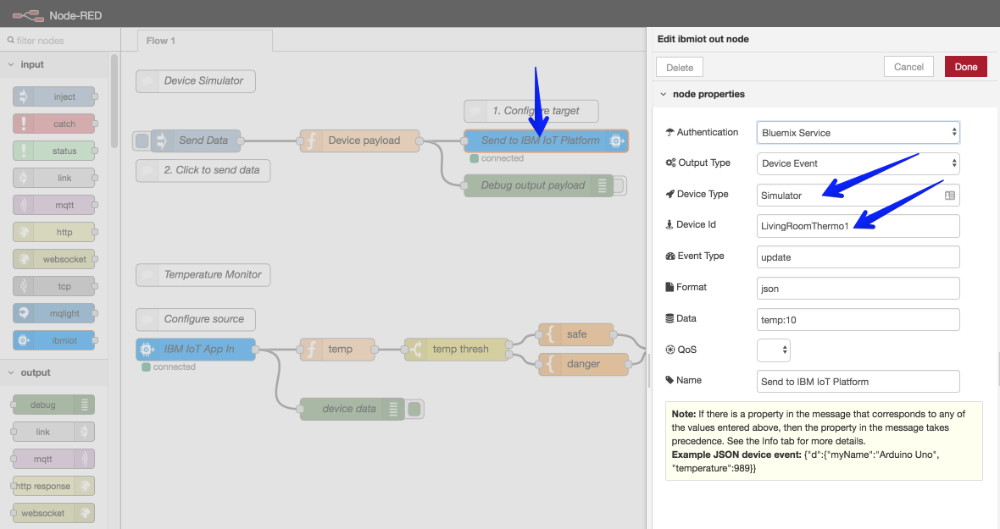
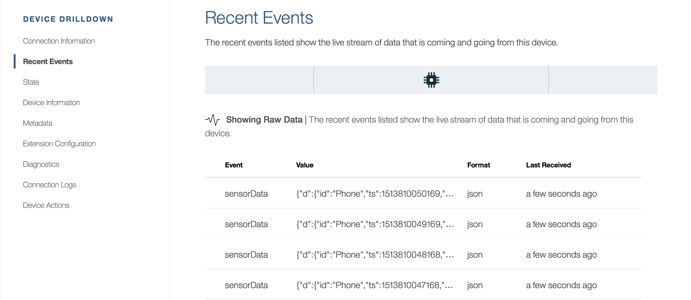

---
copyright:
  years: 2017
lastupdated: "2017-11-22"

---

{:java: #java .ph data-hd-programlang='java'}
{:swift: #swift .ph data-hd-programlang='swift'}
{:ios: #ios data-hd-operatingsystem="ios"}
{:android: #android data-hd-operatingsystem="android"}
{:shortdesc: .shortdesc}
{:new_window: target="_blank"}
{:codeblock: .codeblock}
{:screen: .screen}
{:tip: .tip}
{:pre: .pre}

# Gather, Visualize and Analyze IoT data
This tutorial walks you thru setting up an IoT device, gathering data in the Watson IoT Platform, exploring data and creating visualizations and then using advanced machine learning services to analyze data and detect anomalies in the historical data.
{:shortdesc}

## Objectives
{: #objectives}

* Set up IoT Simulator
* Send collection data to Watson IoT Platform
* Create visualizations
* Analyze [TODO]

## Products
{: #products}

This tutorial uses the following products:
* [Internet of Things Platform](https://console.bluemix.net/catalog/services/internet-of-things-platform)
* [Node-RED Node.js Application](https://console.ng.bluemix.net/catalog/services/ServiceName)
* [Data Science Experience](https://console.bluemix.net/catalog/services/data-science-experience)

## Create IoT Starter
{: #iot_starter}

IBM Cloud comes with an [Internet of Things Platform Starter](https://console.bluemix.net/catalog/starters/internet-of-things-platform-starter) boilerplate to get you up to speed quickly. This  boilerplates comes with:

- Internet of Things Platform - The hub which can manage devices, securely connect and **collect data**, and make historical data available for visulizations and applications.
- Node-RED Node.js Cloud Foundry application - An application with visual tools to **simulate** a device. We will use this application to send data to the hub.
- Cloudant NoSQL DB - To save any changes made to the simulate application.

1. Visit **IBM Cloud Dashboard** > **Catalog** and select **Internet of Things Platform Starter**.
2. Enter a unique **App name**.  For example: `myuserid-iot-starter` and click Create.

## Configure IoT Platform
{: #configure_iot_platform}

1. Click on **Connections**, and then select your `Internet of Things Platform` service.
2. Click **Launch** to open the dashboard in a new browser tab. 
3. From the side menu, select **Devices**, and then click **Add Device**.
4. Then select **Device Types**  and **+ Add Device Type**
5. Enter `Simulator` as the **Name** and click **Next** and **Done**.
6. Next, click on **Register Device **
7. Choose `Simulator` for **Device Type** and then enter `LivingRoomThermo1` for **Device ID**.
8. Finish the wizard by clicking **Next** a few times and then **Done**. Keep this tab open.

The IoT platform is now configured to start receiving data. Devices will need to send their data to the IoT Platform with the Device Type and Device ID specified.

## Configure device simulator
{: #confignodered}
Next, you will need to configure the Node-RED device simulator application. Use the device simulator to send MQTT device messages to IoT Platform. The device simulator sends temperature and humidity information.

  1. In your  IBM Cloud tab, open your Node-RED application by clicking the **Route** link that is listed for your Starter app.  

  2. Click **Go to your Node-RED flow editor** to open the editor.

  3. Double-click the blue **Send to IBM IoT Platform** node in the Device Simulator flow.

  4. Enter the **Device Type** `Simulator` and **Device ID** `LivingRoomThermo1` and click **Done**.

    

  5. Deploy the device by clicking **Deploy**.

  6. Click on the button next to the **Send Data** node to send data to the IoT Platform

  7. Back in the **IBM Watson IoT Platform tab**, check for new entires in the **Recent Events** section.

     

 ## Display live data in IBM Watson IoT Platform
{: #createcards}
Next, you will create a board and cards to display device data in the dashboard. For more information about boards and cards, see [Visualizing real-time data by using boards and cards](https://console.ng.bluemix.net/docs/services/IoT/data_visualization.html).

### Create a board
{: #createboard}

1. Open the **IBM Watson IoT Platform dashboard**.
2. Select **Boards** from the left menu, and then click **Create New Board**.
3. Enter a name for the board and click **Next** and then **Create**.  
4. Double-click the board that you just created to open it.

### Create a card to display temperature
{: #cardtemp}
1. Click **Add New Card**, and then select the **Line Chart** card type, which is located in the Devices section.
2. Select your device from the list, then click **Next**.
3. Click **Connect new data set**.
4. In the Create Value Card page, select or enter the following values and click **Next**.
   - Event: update
   - Property: temp
   - Name: Temperature
   - Type: Float
   - Unit: °C
   - Precision: 2
   - Min: 0
   - Max: 50
 5. In the Card Preview page, select **L** for the line chart size, and click **Next**.
 6. In the Card Information page, change the name of the card to **Temperature** and click **Submit**. The temperature card appears on the dashboard and includes a line chart of the live temperature data.
 7. In your Node-RED device simulator click on the **Send Data** button several times with 2 second intervals between each click.
 8. Back in the **IBM Watson IoT Platform tab**, you should see the chart update with the temperature values.

 ## Store historical data in Cloudant DB
 1. Open the **IBM Watson IoT Platform dashboard**.
 2. Select **Extensions** from the left menu, and then click **Setup** under **Historical Data Storage**.
 3. Select the Cloudant database that was created by the IoT Starter.
 4. Enter `TemperatureData` for **Database Name** and click **Done**

## Detect Anomolies using Machine Learning
{: #data_experience}

You will use the Jupyter Notebook that is available in IBM Data Science Experience to load your historical temperature data and detect anomalies using z-score.

1. Visit **IBM Cloud Dashboard** > **Catalog** and select **Data Science Experience**.
2. **Create** the service and launch it's dashboard by clicking **Get Started**
3. Create a **New Project** and enter `Detect Anomoly` as the **Name**.
4. [TODO] Create and select **Object Storage** and **Spark** services. **Refresh**
5. **Create**.
6. **Assets** > **New notebook** > **From URL**
7. Enter `Anomoly-detection-sample` for the **Name**
8. Enter `https://github.com/ibm-watson-iot/predictive-analytics-samples/raw/master/Notebook/Anomaly-detection-DSX.ipynb` in the URL.
9. **Create Notebook**

