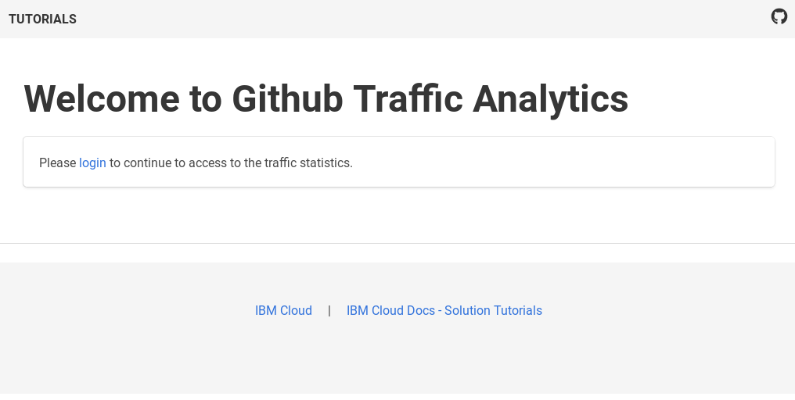

---
copyright:
  years: 2018
lastupdated: "2018-04-04"

---

{:shortdesc: .shortdesc}
{:new_window: target="_blank"}
{:codeblock: .codeblock}
{:screen: .screen}
{:tip: .tip}
{:pre: .pre}

# Github Traffic Analytics
In this tutorial, we are going to create an application to automatically collect Github traffic statistics for repositories. An app manages those repositories and allows view and analyze the traffic data.


## Objectives

* Deploy Python database app with multi-tenant support
* Integrate App ID as openID Connect-based authentication provider
* Set up automated, serverless collection of Github traffic statistics
* Integrate Dynamic Dashboard Embedded for graphical traffic analytics

## Products
This tutorial uses the following products:
   * [{{site.data.keyword.openwhisk_short}}](https://console.bluemix.net/openwhisk/)
   * [{{site.data.keyword.dashdblong}}](https://console.bluemix.net/catalog/services/db2-warehouse)
   * [{{site.data.keyword.appid_long}}](https://console.bluemix.net/catalog/services/app-id)
   * [{{site.data.keyword.dynamdashbemb_notm}}](https://console.bluemix.net/catalog/services/dynamic-dashboard-embedded)

## Before you begin
{: #prereqs}

To complete this tutorial, you need the latest version of the [IBM Cloud CLI](https://console.bluemix.net/docs/cli/index.html#overview) and the {{site.data.keyword.openwhisk_short}} [plugin installed](https://console.bluemix.net/docs/cli/reference/bluemix_cli/extend_cli.html#plug-ins).

## Service and Environment Setup
In this section, we are going to set up the needed services and prepare the environment. Most of this can be accomplished from the command line interface (CLI) using scripts. They are available on Github.

1. Clone the [Github repository](https://github.com/IBM-Cloud/github-traffic-stats) and navigate into the cloned directory and its **backend** subdirectory:

   ```bash
   git clone https://github.com/IBM-Cloud/github-traffic-stats
   cd github-traffic-stats/backend
   ```
   {:codeblock}

2. Use `bx login` to log in interactively into . You can reconfirm the details by running `bx target` command.

3. Create a {{site.data.keyword.dashdbshort}} instance with the **Entry** plan and name it **ghstatsDB**:

   ```
   bx service create dashDB Entry ghstatsDB
   ```
   {:codeblock}
   You can also use another than the **Entry** plan.

4. To access the database service from {{site.data.keyword.openwhisk_short}} later on, we need the authorization. Thus, we create service credentials and label them **ghstatskey**:   
   ```
   bx service key-create ghstatsDB ghstatskey
   ```
   {:codeblock}

5. Create an instance of the {{site.data.keyword.appid_short}} service. We use **ghstatsAppID** as name. Use the offered **Graduated tier** plan.
   ```
   bx service create appID "Graduated tier" ghstatsAppID
   ```
   {:codeblock}
   TODO: May need service key
6. Create an instance of the {{site.data.keyword.dynamdashbemb_short}} service using the **lite** plan.
   ```
   bx service create dynamic-dashboard-embedded lite ghstatsDDE
   ```
   {:codeblock}
   TODO: May need service key

7. Later on, we are collecting traffic statistics for Github repositories. This can be done for repositories which you have **push** privileges for. In order to access your Github account from the program code, we need a **Github access token**. In a browser, visit [Github.com](https://github.com/settings/tokens) and go to **Settings -> Developer settings -> Personal access tokens**. Click on the button **Generate new token**. Enter **GHStats Tutorial** for the **Token description**. Thereafter, enable **public_repo** under the **repo** category and **read:org** under **admin:org**. Now, at the bottom of that page, click on **Generate token**. The new access token is displayed on the next page. You will need it during the following application setup.
   

## Configure App ID
Describe how to configure the App ID service to use the Cloud Directory or social logins. We need to add the redirect URI, too.

## Deploy and configure Python app
After the preparation, we now deploy the management app to the IBM Cloud. The app is written in Python using the popular [Flask](http://flask.pocoo.org/) microframework. Using the application, repositories can be added to and removed from statistics collection. The traffic data can be accessed in a tabular view.

1. In the **backend** directory, push the application to the IBM Cloud. The command uses a random application name.
   ```bash
   bx cf push
   ```
   {:codeblock}
   Wait for the deployment to finish. The application files are uploaded, the runtime environment created, and the services bound to the application. The service information is taken from the file `manifest.yml`. You need to update that file, if you used other service names. Once the process finishes successfully, the application URI is displayed.

   The above command uses a random, but unique application name. If you want to pick one yourself, add it as additional parameter to the command: `bx cf push your-app-name`. You could also edit the file `manifest.yml`, change the **name** and change **random-route** from **true** to **false**.
   {:tip}

2. In a browser, open the URI of the deployed app. You should see a welcome page.
   
   TODO: REPLACE once finalized

3. In the browser, add `/admin/initialize-app` to the URI and access the page. It is used to initialize the application and its data. Click on the button **Start initialization**. This will take you to a password-protected configuration page. The email address you log in with is taken as identification for the system administrator.

4. In the configuration page, enter a name (it is used for greetings), your Github user name and the access token that you generated before. Click on **Initialize**. This creates the database tables and inserts some configuration values. Finally, it creates database records for the system administrator and a tenant.
   
   TODO: REPLACE once finalized

5. Once done, you are taken to the list of managed repositories. You can now add repositories by providing the name of the Github account or organization and the name of the repository. After entering the data, click on **Add repository**. The repository, along with a newly assigned identifier, should appear in the table. You can remove repositories from the system by entering their ID and clicking **Delete repository**.

## Deploy Cloud Function and Trigger
With the management app in place, we now deploy an action, a trigger and a rule to connect the two in for {{site.data.keyword.openwhisk_short}}. These objects are used to automatically collect the Github traffic data on the specified schedule. The action connects to the database, iterates over all tenants and their repositories and obtains the view and cloning data for each repository. Those statistics are merged into the database.

1. Change into the **functions** directory.
   ```bash
   cd ../functions
   ```
   {:codeblock}   
2. Create a new action **collectStats**. It uses a [Python 3 environment](https://console.bluemix.net/docs/openwhisk/openwhisk_reference.html#openwhisk_ref_python_environments) which already includes the required database driver. The source code for the action is provided in the file `ghstats.zip`.
   ```bash
   bx wsk action create collectStats --kind python-jessie:3 ghstats.zip
   ```
   {:codeblock}   

   If you modify the source code for the action (`__main__.py`), then you can repackage the zip archive with `zip -r ghstats.zip  __main__.py github.py` again. See the file `setup.sh` for details.
   {:tip}
3. Bind the action to the database service. We use the instance and the service key that we created during the environment setup.
   ```bash
   bx wsk service bind dashDB collectStats --instance ghstatsDB --key ghstatskey
   ```
   {:codeblock}   
4. Create a trigger based on the [alarms package](https://console.bluemix.net/docs/openwhisk/openwhisk_alarms.html#openwhisk_catalog_alarm). It supports different forms of specifying the alarm. We use the [cron](https://en.wikipedia.org/wiki/Cron)-like style. Starting April 21st and ending December 21st, the trigger fires daily at 6am UTC.
   ```bash
   bx wsk trigger create mydaily --feed /whisk.system/alarms/alarm --param cron "0 6 * * *" --param startDate "2018-04-21T00:00:00.000Z" --param stopDate "2018-12-31T00:00:00.000Z"
   ```
  {:codeblock}   
  You could change the trigger from a daily to a weekly schedule by using "0 6 * * 0". This would fire every Sunday at 6am.
  {:tip}
5. Finally, we create a rule **myStatsRule** that connects the trigger **myDaily** to the **collectStats** action. Now, the trigger causes the action to be executed on the schedule specified in the previous step.
   ```bash
   bx wsk rule create myStatsRule myDaily collectStats
   ```
   {:codeblock}   
6. Invoke the action for an initial test run. The returned **repoCount** should reflect the number of repositories that you configured earlier.
   ```bash
   bx wsk action invoke collectStats  -r
   ```
   {:codeblock}   
   The output will look like this:
   ```
   {
       "repoCount": 18
   }
   ```

## Cleanup
To clean up the resources used for this tutorial, you can delete the related services and app as well as the action, trigger and rule in the reverse order as created:

1. Delete the {{site.data.keyword.openwhisk_short}} rule, trigger and action.
   ```bash
   bx wsk rule delete myStatsRule
   bx wsk trigger delete myDaily
   bx wsk action delete collectStats
   ```
   {:codeblock}   
2. Delete the Python app and its services.
   ```bash
   bx service delete ghstatsAppID
   bx service delete ghstatsDDE
   bx service delete ghstatsDB
   bx cf delete github-traffic-stats
   ```
   {:codeblock}   


## Expand the tutorial
Want to add to or change this tutorial? Here are some ideas:
1. Expand multi-tenant support
2. Add support for Github Enterprise
3. foo
4. bar

# Related Content
Here are links to additional information on the topics covered in this tutorial.

Blogs:
*
*

Documentation and SDKs:
* [{{site.data.keyword.openwhisk_short}} documentation](https://console.bluemix.net/docs/openwhisk/openwhisk_about.html#about-cloud-functions)
* Documentation: [IBM Knowledge Center for {{site.data.keyword.dashdbshort}}](https://www.ibm.com/support/knowledgecenter/en/SS6NHC/com.ibm.swg.im.dashdb.kc.doc/welcome.html)
*
