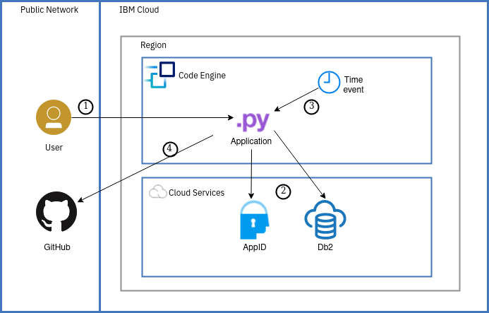

---
copyright:
  years: 2018
lastupdated: "2018-03-27"

---

{:shortdesc: .shortdesc}
{:new_window: target="_blank"}
{:codeblock: .codeblock}
{:screen: .screen}
{:tip: .tip}
{:pre: .pre}

# Github Traffic Analytics

In this tutorial, we are going to build a Slackbot to create and search Db2 database entries for events and conferences. The Slackbot is backed by the {{site.data.keyword.conversationfull}} service. We integrate Slack and {{site.data.keyword.conversationfull}} using the  [Conversation connector](https://github.com/watson-developer-cloud/conversation-connector/) using the serverless approach.

## Objectives

* Set up serverless collection of Github traffic statistics
* Deploy Python app with multi-tenant support
* Integrate App ID as openID Connect-based authentication provider
* Integrate Dynamic Dashboard Embedded for traffic analytics

## Products

This tutorial uses the following products:
   * [{{site.data.keyword.openwhisk_short}}](https://console.bluemix.net/openwhisk/)
   * [{{site.data.keyword.dashdblong}} ](https://console.bluemix.net/catalog/services/db2-warehouse)
   * App ID
   * DDE
   * Cloud Foundry Python runtime

## Before you begin
{: #prereqs}

To complete this tutorial, you need the latest version of the [IBM Cloud CLI](https://console.bluemix.net/docs/cli/index.html#overview) and the {{site.data.keyword.openwhisk_short}} [plugin installed](https://console.bluemix.net/docs/cli/reference/bluemix_cli/extend_cli.html#plug-ins).

## Service and Environment Setup

## Cleanup

## Expand the tutorial
Want to add to or change this tutorial? Here are some ideas:
1. Expand multi-tenant support
2. Add support for Github Enterprise
3.
4.

# Related Content
Here are links to additional information on the topics covered in this tutorial.

Blogs:
*
*

Documentation and SDKs:
* [{{site.data.keyword.openwhisk_short}} documentation](https://console.bluemix.net/docs/openwhisk/openwhisk_about.html#about-cloud-functions)
* Documentation: [IBM Knowledge Center for {{site.data.keyword.dashdbshort}}](https://www.ibm.com/support/knowledgecenter/en/SS6NHC/com.ibm.swg.im.dashdb.kc.doc/welcome.html)
*
