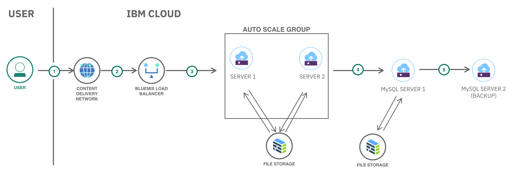

---
copyright:
  years: 2017
lastupdated: "2017-12-05"
---

{:shortdesc: .shortdesc}
{:new_window: target="_blank"}
{:codeblock: .codeblock}
{:screen: .screen}
{:tip: .tip}
{:pre: .pre}

# Deploy a Highly Available and Scalable web application with Load Balancer and Backups

This tutorial walks you through the creation of a load balancer, two application servers running on Ubuntu with NGINX and **P**HP installed, one **M**ySQL database server, and durable file storage to store application files and backups.

## Objectives

- Provision one server for the database
- Install and configure MySQL
- Create a file storage for database backups
- Provision two servers for the PHP application
- Create a file storage to share files between the application servers
- Install and configure the PHP application on the application servers
- Provision one load balancer server in front of the application servers

## Products
{: #products}

This tutorial uses the following products:
* [Load Balancer](https://console.bluemix.net/catalog/infrastructure/ibm-bluemix-load-balancer)
* [Virtual Server](https://console.bluemix.net/catalog/infrastructure/virtual-server-group)
* [File Storage](https://console.bluemix.net/catalog/infrastructure/file-storage)

<p style="text-align: center;">

</p>

TODO - update the digram

1. The user does this
2. Then that
3. TODO - Add steps for each case as per diagram

## Before you begin
{: #prereqs}

### Configure the SoftLayer VPN

In this tutorial, the load balancer is the front door for the application users. The virtual servers will not need to be visible on the public Internet. Thus they will be provisioned with only a private IP address and you will use your SoftLayer VPN connection to work on the servers.

1. [Ensure your VPN Access is enabled](https://knowledgelayer.softlayer.com/procedure/getting-started-softlayer-vpn)
1. Obtain your VPN Access credentials in [your profile page](https://control.softlayer.com/account/user/profile)
1. Log in to the VPN through [the web interface](https://www.softlayer.com/VPN-Access)
1. or use a VPN client for [Linux](https://knowledgelayer.softlayer.com/procedure/ssl-vpn-linux), [macOS](https://knowledgelayer.softlayer.com/procedure/ssl-vpn-mac-os-x-1010) or [Windows](https://knowledgelayer.softlayer.com/procedure/ssl-vpn-windows)

You can choose to skip this step. If so make sure to select **Public and Private Network Uplink** when provisioning virtual servers.
{: tip}

### Check account permissions

Contact your Infrastructure master user to get the following permissions:
- **Network** so that you can create virtual servers with **Public and Private Network Uplink** (this permission is not required if you use the VPN to connect to the servers)


## Provision one server for the database
{: #database_server}

1. Go to the catalog in the {{site.data.keyword.Bluemix}} console, and select the [Virtual Server](https://console.bluemix.net/catalog/infrastructure/virtual-server-group) service from the Infrastructure section.
2. Select **Public Virtual Server** and then click **Create**.
3. Configure the server with the following:
   - Set **Name** to it **db1**
   - Select a location where to provision the server. **All other servers and resources created in this tutorial will need to be created in the same location.**
   - Select the **Ubuntu Minima** image
   - Keep the default compute flavor. You can pick any size, the tutorial has been tested with the smallest flavor.
   - Under **Attached Storage Disks**, select the 25GB boot disk.
   - Under **Network Interface**, select the **100Mbps Private Network Uplink** option.

     If you did not configure the VPN Access, select the **100Mbps Public and Private Network Uplink** option.
     {: tip}

   - Review the other configuration options and click **Provision** to provision the server.
   [Configure virtual server](images/solution14/db-server.png)

   Note: The provisioning process can take 2 to 5 minutes for the server to be ready for use. After the server is created, you'll see the server login credentials. To SSH into the server, you need the server user name, password, and private (when using VPN, public otherwise) IP address.
   {: tip}

## Install and configure MySQL
{: #mysql}

### Install MySQL

1. Connect to the server by using SSH and run the following commands on the server.
   ```sh
   ssh root@<Private-IP-Address>
   ```
1. Install MySQL  
   ```sh
   apt-get update
   apt-get install mysql-server
   ```
1. Run the following script to help secure MySQL database:
   ```sh
   mysql_secure_installation
   ```

### Create a database for the application

1. Login to MySQL and create a database called `wordpress`
   ```sh
   mysql -u root -p
   CREATE DATABASE wordpress;
   ```
1. Grant access to database
   ```
   GRANT SELECT,INSERT,UPDATE,DELETE,CREATE,DROP,ALTER ON wordpress.*
   TO root@'%'
   IDENTIFIED BY '<database-password>';
   FLUSH PRIVILEGES;
   ```

### Make the MySQL server visible to the outside

By default MySQL only listens on the local interface. The application servers will need to connect to the database so the MySQL configuration needs to be changed to listen on the private network interfaces.

1. Edit `/etc/mysql/my.cnf` and add these lines
   ```
   [mysqld]
   bind-address    = 0.0.0.0
   ```
1. Restart MySQL
   ```
   systemctl restart mysql
   ```
1. Confirm MySQL is listening on all interfaces
   ```
   netstat --listen --numeric-ports | grep 3306
   ```

## Create a file storage for database backups
{: database_backup}

There are many ways in which backups can be done and stored when it comes to MySQL. This tutorial uses a crontab entry to dump the database content to disk. The backup files will be stored in a file storage.

### Create the file storage
1. Go to the catalog in the {{site.data.keyword.Bluemix}} console, and select [File Storage](https://console.bluemix.net/catalog/infrastructure/file-storage)
1. Click **Create**
3. Configure the service with the following:
   - Under **Storage Type**, Endurance option.
   - Select the same **Location** as the one where you created the database server.
   - Select a billing method
   - Under **Storage Packages**, select 0.25 IOPS/GB
   - Under **Storage Size**, select 20GB
   - Under **Snapshot Space Size**, select 40GB
   - Click continue to create the service.

### Authorize the database server to use the file storage

1. Select the File Storage from the [list of existing items](https://control.bluemix.net/storage/file)
1. Under **Authorized Hosts**, click **Authorize Host** to authorize the database server to use this file storage

### Mount file storage for database backups

1. Install the NFS client libraries
   ```sh
   apt-get -y install nfs-common
   ```
1. Create a file called `/etc/systemd/system/mnt-database.mount` with the following content, replacing the value of `What` with the **Mount Point** for the file storage (e.g *fsf-lon0601a-fz.adn.networklayer.com:/IBM01SEV12345_100/data01*)
   ```
   [Unit]
   Description = Mount for Container Storage
   
   [Mount]
   What=CHANGE_ME_TO_FILE_STORAGE_MOUNT_POINT
   Where=/mnt/database
   Type=nfs
   Options=vers=3,sec=sys,noauto

   [Install]
   WantedBy = multi-user.target
   ```
1. Create the mount point
  ```sh
  mkdir /mnt/database
  ```
1. Mount the storage
   ```sh
   systemctl enable --now /etc/systemd/system/mnt-database.mount
   ```
1. Check if the mount was successfully done
   ```sh
   mount
   ```
   The last lines should list the File Storage mount. If this is not the case, use `journalctl -xe` to debug the mount operation.
   {: tip}

### Setup a backup at regular interval

1. Create `/root/dbbackup.sh` with this content, replacing `CHANGE_ME` with the database password you specified earlier:
   ```sh
   #!/bin/bash
   mysqldump -u root -pCHANGE_ME --all-databases --routines | gzip > /mnt/datamysql/backup-`date '+%m-%d-%Y-%H-%M-%S'`.sql.gz
   ```
1. Make sure the file is executable
   ```sh
   chmod 700 /root/dbbackup.sh
   ```
1. Edit the crontab
   ```sh
   crontab -e
   ```
1. To have the backup performed every day at 11pm, set the content to the following, save the file and close the editor
   ```
   0 23 * * * /root/dbbackup.sh
   ```

Obviously, this is a simple backup mechanism. If you plan to manage your own MySQL database server in a production environment, you will want to [implement one of the backup strategies described in MySQL documentation](https://dev.mysql.com/doc/refman/5.7/en/backup-and-recovery.html)

## Provision two servers for the PHP application
{: app_servers}

1. Go to the catalog in the {{site.data.keyword.Bluemix}} console, and select the [Virtual Server](https://console.bluemix.net/catalog/infrastructure/virtual-server-group) service from the Infrastructure section.
2. Select **Public Virtual Server** and then click **Create**.
3. Configure the server with the following:
   - Set **Name** to it **app1**
   - Select a location where to provision the server. **Use the same location as the database server.**
   - Select the **Ubuntu Minima** image
   - Keep the default compute flavor. You can pick any size, the tutorial has been tested with the smallest flavor.
   - Under **Attached Storage Disks**, select the 25GB boot disk.
   - Under **Network Interface**, select the **100Mbps Private Network Uplink** option.

     If you did not configure the VPN Access, select the **100Mbps Public and Private Network Uplink** option.
     {: tip}
   - Review the other configuration options and click **Provision** to provision the server.
   [Configure virtual server](images/solution14/db-server.png)
4. Repeat these steps to provision another virtual server named **app2**

## Create a file storage to share files between the application servers
{: shared_storage}

The file storage is going to be used to share the application files between app1 and app2 servers.

### Create the file storage
1. Go to the catalog in the {{site.data.keyword.Bluemix}} console, and select [File Storage](https://console.bluemix.net/catalog/infrastructure/file-storage)
1. Click **Create**
3. Configure the service with the following:
   - Under **Storage Type**, Endurance option.
   - Select the same **Location** as the one where you created the application servers.
   - Select a billing method
   - Under **Storage Packages**, select 2 IOPS/GB
   - Under **Storage Size**, select 20GB
   - Under **Snapshot Space Size**, select 20GB
   - Click continue to create the service.

### Authorize the application servers to use the file storage

1. Select the File Storage from the [list of existing items](https://control.bluemix.net/storage/file)
1. Under **Authorized Hosts**, click **Authorize Host** to authorize the application servers to use this file storage

### Mount file storage

Repeat the following steps on each application server:

1. Install the NFS client libraries
   ```sh
   apt-get update
   apt-get -y install nfs-common
   ```
1. Create a file called `/etc/systemd/system/mnt-www.mount` with the following content, replacing the value of `What` with the **Mount Point** for the file storage (e.g *fsf-lon0601a-fz.adn.networklayer.com:/IBM01SEV12345_100/data01*)
   ```
   [Unit]
   Description = Mount for Container Storage
   
   [Mount]
   What=CHANGE_ME_TO_FILE_STORAGE_MOUNT_POINT
   Where=/mnt/www
   Type=nfs
   Options=vers=3,sec=sys,noauto

   [Install]
   WantedBy = multi-user.target
   ```
1. Create the mount point
   ```sh
   mkdir /mnt/www
   ```
1. Mount the storage
   ```sh
   systemctl enable --now /etc/systemd/system/mnt-www.mount
   ```
1. Check if the mount was successfully done
   ```sh
   mount
   ```
   The last lines should list the File Storage mount. If this is not the case, use `journalctl -xe` to debug the mount operation.
   {: tip}

These steps could be automated using a [provisioning script](https://knowledgelayer.softlayer.com/procedure/add-custom-provisioning-script) or by [capturing an image](https://knowledgelayer.softlayer.com/learning/introduction-image-templates).
{: tip}

## Install and configure the PHP application on the application servers
{: php_application}

This tutorial sets up a Wordpress blog. All Wordpress files will be installed on the shared file storage so that both application servers can access them. Before installing Wordpress, a web server and a PHP runtime need to be configured.

### Install nginx and PHP

Repeat the following steps on each application server:

1. Install nginx
   ```
   apt-get -y install nginx
   ```
2. Install PHP and mysql client
   ```sh
   apt-get -y install php-fpm php-mysql
   ```
3. Stop PHP service and nginx
   ```sh
   systemctl stop php7.0-fpm
   systemctl stop nginx
   ```
4. Replace the content of `/etc/nginx/sites-available/default` with the following:
   ```sh
   server {
          listen 80 default_server;
          listen [::]:80 default_server;

          root /mnt/www/html;

          index index.php;

          server_name _;

          location = /favicon.ico {
                  log_not_found off;
                  access_log off;
          }

          location = /robots.txt {
                  allow all;
                  log_not_found off;
                  access_log off;
          }

          location / {
                  # following https://codex.wordpress.org/Nginx
                  try_files $uri $uri/ /index.php?$args;
          }

          # pass the PHP scripts to the local FastCGI server
          location ~ \.php$ {
                  include snippets/fastcgi-php.conf;
                  fastcgi_pass unix:/run/php/php7.0-fpm.sock;
          }

          location ~* \.(js|css|png|jpg|jpeg|gif|ico)$ {
                  expires max;
                  log_not_found off;
          }

          # deny access to .htaccess files, if Apache's document root
          # concurs with nginx's one
          location ~ /\.ht {
                  deny all;
          }
   }
   ```

### Install and configure WordPress

As Wordpress will be installed on the shared file storage, you only need to do the following steps on one of the servers. Let's pick **app1**.

1. Retrieve and extract Wordpress installation files
   ```sh
   apt-get install curl
   cd /tmp
   curl -O https://wordpress.org/latest.tar.gz
   tar xzvf latest.tar.gz
   ```
1. Prepare the Wordpress files
   ```sh
   cp /tmp/wordpress/wp-config-sample.php /tmp/wordpress/wp-config.php
   mkdir /tmp/wordpress/wp-content/upgrade
   ```
1. Copy the files to the shared file storage
   ```sh
   rsync -av -P /tmp/wordpress/. /mnt/www/html
   ```
1. Set permissions
   ```sh
   chown -R www-data:www-data /mnt/www/html
   find /mnt/www/html -type d -exec chmod g+s {} \;
   chmod g+w /mnt/www/html/wp-content
   chmod -R g+w /mnt/www/html/wp-content/themes
   chmod -R g+w /mnt/www/html/wp-content/plugins
   ```
1. Call the following web service and inject the result into `/mnt/www/html/wp-config.php`
   ```sh
   curl -s https://api.wordpress.org/secret-key/1.1/salt/
   ```
1. Set the database credentials in `/mnt/www/html/wp-config.php`

Wordpress is configured. To complete the installation, you need to access the Wordpress user interface.

On both application servers, start the web server and the PHP runtime:
1. Start the service by running the following commands

   ```sh
   systemctl start php7.0-fpm
   systemctl start nginx
   ```

Access the Wordpress installation at `http://YourAppServerIPAddress/` using either the private IP address (if you are going through the SoftLayer VPN connection) or the public IP address of *app1* or *app2*.

## Provision one load balancer server in front of the application servers
{: load_balancer}

At this point, we have two application servers with separate IP addresses. They might even not be visible on the public Internet if you choose to only provision Private Network Uplink. Adding a Load Balancer in front of these servers will make the application visible to the public Internet. The load balancer will also hide the underlying infrastructure to the application users. The Load Balancer will monitor the health of the application servers and dispatch incoming requests to healthly servers. 

1. Go to the catalog to provision a [Load Balancer](https://console.bluemix.net/catalog/infrastructure/ibm-bluemix-load-balancer)
1. In the **Plan** step, select the same data center as *app1* and *app2*
1. In **Network Settings**,
   1. Select the same subnet as the one where *app1* and *app2* where provisioned
   1. Use the default IBM system pool for the load balancer public IP.
1. In **Basic**,
   1. Name the load balancer, e.g. app-lb-1
   1. Keep the default protocol configuration - by default the load balancer is configured for HTTP.
      SSL protocol is supported with your own certificates. Refer to [Import your SSL certificates in the load balancer](https://knowledgelayer.softlayer.com/procedure/access-ssl-certificates-screen)
      {: tip}
1. In **Server Instances**, add *app1* and *app2* servers
1. Complete the wizard

### Change wordpress configuration to use the load balancer URL

The Wordpress configuration needs to be changed to use the Load Balancer address. Indeed, Wordpress keeps a reference to the blog URL and injects this location in the pages. If you don't change this setting, Wordpress will redirect the users to the backend servers directly, thus bypassing the Load Balancer or not working at all if the servers only have a private IP address.

1. Find the Load Balancer address in its detail page. You can find the Load Balancer you created under [Network / Load Balancing / Local](https://control.bluemix.net/network/loadbalancing/cloud).
   You can also use your own domain name with the Load Balancer by adding a CNAME record pointing to the Load Balancer address in your DNS configuration.
   {: tip}
1. Log as administrator in the Wordpress blog via *app1* or *app2* URL
1. In Settings / General, set the Wordpress Address (URL) and Site Address (URL) to the Load Balancer address
1. Save the settings. Wordpress should redirect to the Load Balancer address
   It may take some time before the Load Balancer address becomes active due to DNS propagation.
   {: tip}

### Test the Load Balancer behavior

The Load Balancer is configured to check the health of the servers and to redirect users only to healthy servers. To understand how the Load Balancer is working, you can 

1. Watch the nginx logs on both *app1* and *app2* with:
   ```sh
   tail -f /var/log/nginx/*.log
   ```

   You should already see the regular ping from the Load Balancer
   {: tip}
1. Access Wordpress through the Load Balancer address and make sure to force a hard reload of the page. Notice in the nginx logs both *app1* and *app2* are serving content for the page. The Load Balancer is redirecting traffic to both servers as expected.
1. Stop nginx on *app1*
   ```sh
   systemctl nginx stop
   ```
1. After a short while reload the Wordpress page, notice all hits are going to *app2*.
1. Stop nginx on *app2*.
1. Reload the Wordpress page. The Load Balancer will return an error as there is no healthy server.
1. Restart nginx on *app1*
   ```sh
   systemctl nginx start
   ```
1. Once the Load Balancer detects *app1* as healthy, it will redirect traffic to this server.

## Related information

- Static content served by your application may benefit from a Content Delivery Network in front of the Load Balancer to reduce the load on your backend servers. Refer to [Accelerate delivery of static files using a CDN - Object Storage](static-files-cdn.html) for a tutorial implementing a Content Delivery Network.
