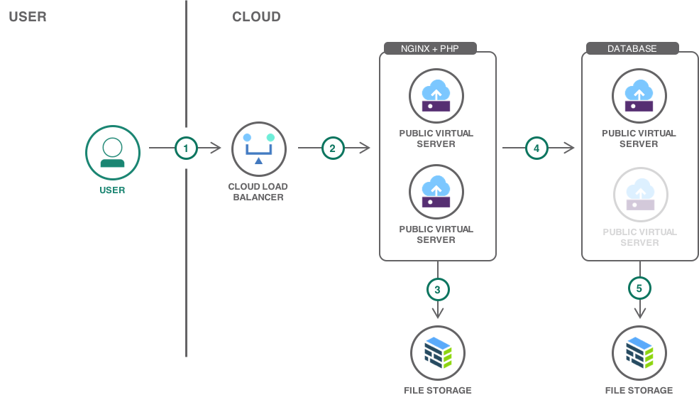
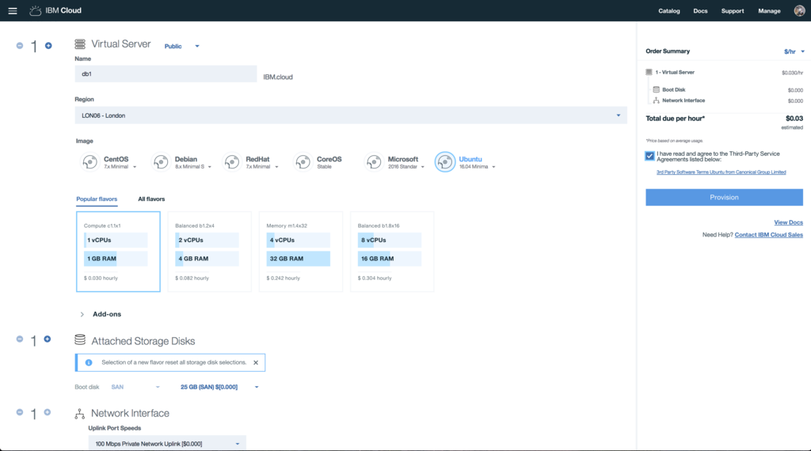
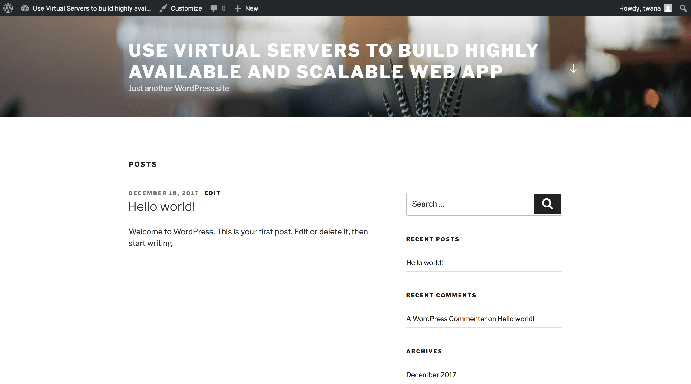
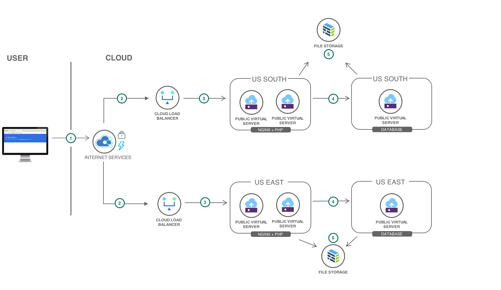

{:shortdesc: .shortdesc}
{:new_window: target="_blank"}
{:codeblock: .codeblock}
{:screen: .screen}
{:tip: .tip}
{:pre: .pre}

# Use Virtual Servers to build highly available and scalable web app
{: #highly-available-and-scalable-web-application}

Adding more servers to an application is a common pattern to handle additional load. Another key aspect to increase an application availability and resiliency is to deploy the application to multiple zones or locations with data replication and load balancing.

This tutorial walks you through a scenario with the creation of:

- Two web application servers.
- {{site.data.keyword.loadbalancer_full}}, to load balance traffic between two servers within a location.
- One MySQL database server.
- A durable file storage to store application files and backups.
- Configure the second location with the same configurations as the first location, then add {{site.data.keyword.cis_full_notm}} to point traffic to the healthy location if one copy fails.

## Objectives
{: #objectives}

* Create {{site.data.keyword.virtualmachinesshort}} to install PHP and MySQL
* Use {{site.data.keyword.filestorage_short}} to persist application files and database backups
* Provision a {{site.data.keyword.loadbalancer_short}} to distribute requests to the application servers
* Extend the solution by adding a second location for better resiliency and higher availability

## Services used
{: #services}

This tutorial uses the following runtimes and services:
* [{{site.data.keyword.loadbalancer_short}}](https://{DomainName}/catalog/infrastructure/load-balancer-group)
* [{{site.data.keyword.virtualmachinesshort}}](https://{DomainName}/catalog/infrastructure/virtual-server-group)
* [{{site.data.keyword.filestorage_short}}](https://{DomainName}/catalog/infrastructure/file-storage)
* [{{site.data.keyword.cis_full_notm}}](https://{DomainName}/catalog/services/internet-services)

This tutorial may incur costs. Use the [Pricing Calculator](https://{DomainName}/estimator/review) to generate a cost estimate based on your projected usage.

## Architecture
{: #architecture}

The application is a simple PHP frontend - a Wordpress blog - with a MySQL database. Several frontend servers handle the requests.

<p style="text-align: center;">
   
   
</p>

1. The user connects to the application.
2. The {{site.data.keyword.loadbalancer_short}} selects one of the healthy servers to handle the request.
3. The elected server accesses the application files stored on a shared file storage.
4. The server also pulls information from the database and finally renders the page to the user.
5. At a regular interval, the database content is backed up. A stand-by database server is available in case the master fails.

## Before you begin
{: #prereqs}

### Configure the VPN access

In this tutorial, the load balancer is the front door for the application users. The {{site.data.keyword.virtualmachinesshort}} do not need to be visible on the public Internet. Thus they can be provisioned with only a private IP address and you will use your VPN connection to work on the servers.

1. [Ensure your VPN Access is enabled](/docs/infrastructure/iaas-vpn?topic=VPN-getting-started#enable-user-vpn-access).

     You should be a **Master User** to enable VPN access or contact master user for access.
     {:tip}
2. Obtain your VPN Access credentials by selecting your user in the [Users list](https://{DomainName}/iam#/users).
3. Log in to the VPN through [the web interface](https://www.softlayer.com/VPN-Access) or use a VPN client for [Linux](/docs/infrastructure/iaas-vpn?topic=VPN-setup-ssl-vpn-connections), [macOS](/docs/infrastructure/iaas-vpn?topic=VPN-connect-ssl-vpn-mac-osx) or [Windows](/docs/infrastructure/iaas-vpn?topic=VPN-connect-ssl-vpn-windows7).

You can choose to skip this step and make all your servers visible on the public Internet (although keeping them private provide an additional level of security). To make them public, select **Public and Private Network Uplink** when provisioning {{site.data.keyword.virtualmachinesshort}}.
{: tip}

### Check account permissions

Contact your Infrastructure master user to get the following permissions:
- **Network** so that you can create {{site.data.keyword.virtualmachinesshort}} with **Public and Private Network Uplink** (this permission is not required if you use the VPN to connect to the servers)

## Provision one server for the database
{: #database_server}

In this section, you configure one server to act as the master database.

1. In the {{site.data.keyword.Bluemix_notm}} catalog, select [**Virtual Server**](https://{DomainName}/gen1/infrastructure/provision/vs) from the **Compute** section.
2. For the type of virtual server, select Public. 
3. Configure the server with the following:
   - Set **Name** to **db1**
   - Select a location where to provision the server. **All other servers and resources created in this tutorial will need to be created in the same location.**
   - Select the **Ubuntu Minimal** image. You can pick any version of the image.
   - Keep the default compute profile. The tutorial has been tested with the smallest profile but should work with any profile.
   - Under **Attached Storage Disks**, select the 25GB boot disk.
   - Under **Network Interface**, select the **100Mbps Private Network Uplink** option.

     If you did not configure the VPN Access, select the **100Mbps Public and Private Network Uplink** option.
     {: tip}
   - Review the other configuration options and click **Provision** to provision the server.

      

   Note: The provisioning process can take 2 to 5 minutes for the server to be ready for use. After the server is created, you'll find the server credentials in the server detail page under **Devices > Device List**. To SSH into the server, you need the server private or public IP address, user name and password (Click the arrow next to the device name).
   {: tip}

## Install and configure MySQL
{: #mysql}

The server does not come with a database. In this section, you install MySQL on the server.

### Install MySQL

1. Connect to the server by using SSH:
   ```sh
   ssh root@<Private-OR-Public-IP-Address>
   ```
   {:pre}

   Remember to connect to the VPN client with the right [site address](https://www.softlayer.com/VPN-Access) based on the **Location** of your virtual-server.
   {:tip}
2. Install MySQL:
   ```sh
   apt-get update
   apt-get -y install mysql-server
   ```
   {:pre}

   You may be prompted for a password. Read through the instructions on the console shown.
   {:tip}
3. Run the following script to help secure MySQL database:
   ```sh
   mysql_secure_installation
   ```
   {:pre}

   You may be prompted with couple of options. Choose wisely based on your requirements.
   {:tip}

### Create a database for the application

1. Login to MySQL and create a database called `wordpress`:
   ```sh
   mysql -u root -p
   CREATE DATABASE wordpress;
   ```
   {:pre}

2. Define a username and a password to use for Wordpress (_wpuser_ and _wppassword_ as example). Grant access to the database to this user by replacing database-username and database-password with your choices.

   ```sql
   GRANT SELECT,INSERT,UPDATE,DELETE,CREATE,DROP,ALTER ON wordpress.* TO database-username@'%' IDENTIFIED BY 'database-password';
   ```
   {:codeblock}

   ```sql
   FLUSH PRIVILEGES;
   ```
   {:codeblock}

3. Check if database created by using:

   ```sql
   show databases;
   ```
   {:codeblock}

4. Exit from the database using:

   ```sql
   exit
   ```
   {:codeblock}

5. Make note of the database name, user and password. You will need them when configuring the application servers.

### Make the MySQL server visible to other servers on the network

By default MySQL only listens on the local interface. The application servers will need to connect to the database so the MySQL configuration needs to be changed to listen on the private network interfaces.

1. Edit the my.cnf file using `nano /etc/mysql/my.cnf` and add these lines:
   ```
   [mysqld]
   bind-address    = 0.0.0.0
   ```
   {:codeblock}

2. Exit and save the file using Ctrl+X.

3. Restart MySQL:

   ```sh
   systemctl restart mysql
   ```
   {:pre}

4. Confirm MySQL is listening on all interfaces by running the following command:
   ```sh
   netstat --listen --numeric-ports | grep 3306
   ```
   {:pre}

## Create a file storage for database backups
{: #database_backup}

There are many ways in which backups can be done and stored when it comes to MySQL. This tutorial uses a crontab entry to dump the database content to disk. The backup files will be stored in a file storage. Obviously, this is a simple backup mechanism. If you plan to manage your own MySQL database server in a production environment, you will want to [implement one of the backup strategies described in MySQL documentation](https://dev.mysql.com/doc/refman/5.7/en/backup-and-recovery.html).

### Create the file storage
{: #create_for_backup}

1. In the {{site.data.keyword.Bluemix_notm}} catalog , and select **[{{site.data.keyword.filestorage_short}}](https://{DomainName}/catalog/infrastructure/file-storage)** in the **Storage** section.
2. Click **Create**
3. Configure the service with the following:
   - Select the same **Location** as the one where you created the database server.
   - Select a billing method.
   - Set **Size** to **20GB**.
   - Under **Endurance**, select **2 IOPS/GB**.
   - Set **Snapshot space** to **0GB**.
4. **Create** the volume.

### Authorize the database server to use the file storage

Before a virtual server can mount a file storage, it needs to be authorized.

1. Select the newly created file storage from the [list of existing items](https://{DomainName}/classic/storage/file).
2. Under **Authorized Hosts**, click **Authorize Host** and select the virtual(database) server (Choose **Devices** > Virtual Server as Device Type > Type the name of the server).

### Mount the file storage for database backups

The file storage can be mounted as an NFS drive into the virtual server.

1. Install the NFS client libraries:
   ```sh
   apt-get -y install nfs-common
   ```
   {:pre}

2. Create a file called `/etc/systemd/system/mnt-database.mount` by running the following command
   ```bash
   touch /etc/systemd/system/mnt-database.mount
   ```
   {:pre}

3. Edit the mnt-database.mount by using:
   ```
   nano /etc/systemd/system/mnt-database.mount
   ```
   {:pre}

4. Add the content below to the mnt-database.mount file and replace `CHANGE_ME_TO_FILE_STORAGE_MOUNT_POINT` of `What` with the **Mount Point** of the file storage (e.g *fsf-lon0601a-fz.adn.networklayer.com:/IBM01SEV12345_100/data01*). You can get the **Mount Point** url under the file storage service created.
   ```
   [Unit]
   Description = Mount for Container Storage

   [Mount]
   What=CHANGE_ME_TO_FILE_STORAGE_MOUNT_POINT
   Where=/mnt/database
   Type=nfs
   Options=vers=3,sec=sys,noauto

   [Install]
   WantedBy = multi-user.target
   ```
   {:codeblock}

   Use Ctrl+X to save and exit the `nano` window
   {: tip}

5. Create the mount point
   ```sh
   mkdir /mnt/database
   ```
   {:pre}

6. Mount the storage
   ```sh
   systemctl enable --now /etc/systemd/system/mnt-database.mount
   ```
   {:pre}

7. Check if the mount was successfully done
   ```sh
   mount
   ```
   {:pre}

   The last lines should list the file storage mount. If this is not the case, use `journalctl -xe` to debug the mount operation.
   {: tip}

### Setup a backup at regular interval

1. Create `/root/dbbackup.sh` shell script (use `touch` and `nano`) with the following commands by replacing `CHANGE_ME` with the database password you specified earlier:
   ```sh
   #!/bin/bash
   mysqldump -u root -p CHANGE_ME --all-databases --routines | gzip > /mnt/datamysql/backup-`date '+%m-%d-%Y-%H-%M-%S'`.sql.gz
   ```
   {:codeblock}
2. Make sure the file is executable
   ```sh
   chmod 700 /root/dbbackup.sh
   ```
   {:pre}
3. Edit the crontab
   ```sh
   crontab -e
   ```
   {:pre}
4. To have the backup performed every day at 11pm, set the content to the following, save the file and close the editor
   ```
   0 23 * * * /root/dbbackup.sh
   ```
   {:codeblock}

## Provision two servers for the PHP application
{: #app_servers}

In this section, you will create two web application servers.

1.  In the {{site.data.keyword.Bluemix_notm}} catalog, select [**Virtual Server**](https://{DomainName}/gen1/infrastructure/provision/vs) from the **Compute** section.
2.  For the type of virtual server, select **Public**.
3.  Configure the server with the following:
   * Set **Quantity** to **2**
   * Set **Name** to **app1**
   * Create a new **Placement Group**.  Placement group ensures the app Virtual Servers are provisioned on different hypervisors.
      * Set **Name** to **app-group**
      * Select **Location** to the same location as the database server.
      * Click **Create**
   * Keep the default compute profile. The tutorial has been tested with the smallest profile but should work with any profile.
   * Select the **Ubuntu Minimal image**. You can choose any version of the image.
   * In the **Network interface** section, select the **100 Mbps Private Network Uplink** option as the uplink port speed. If you did not configure the VPN access, select the **100 Mbps Public and Private Network Uplink** option.
1. Review the other configuration options and click **Create** to provision the server.

## Create a file storage to share files between the application servers
{: shared_storage}

This file storage is used to share the application files between **app1** and **app2** servers.

### Create the file storage
{: #create_for_sharing}

In the {{site.data.keyword.Bluemix_notm}} catalog, and select **[{{site.data.keyword.filestorage_short}}](https://{DomainName}/catalog/infrastructure/file-storage)** in the **Storage** section.
2. Click **Create**
3. Configure the service with the following:
   - Select the same **Location** as the one where you created the application servers.
   - Select a billing method.
   - Set **Size** to **20GB**.
   - Under **Endurance**, select **2 IOPS/GB**.
   - Set **Snapshot space** to **20GB**.
   - Click continue to create the service.

### Configure regular snapshots

[Snapshots](https://{DomainName}/docs/infrastructure/FileStorage?topic=FileStorage-snapshots#working-with-snapshots) give you a convenient option to protect your data with no performance impact. Additionally, you can replicate snapshots to another data center.

1. Select the file storage from the [list of existing items](https://{DomainName}/classic/storage/file).
2. Under **Snapshots**, edit the **snapshot schedule**. The schedule could be defined as follow:
   1. Add a hourly snapshot, set the minute to 30 and keep the last 24 snapshots
   2. Add a daily snapshot, set the time to 11pm and keep the last 7 snapshots
   3. Add a weekly snapshot, set the time to 1am and keep the last 4 snapshots and click Save.

### Authorize the application servers to use the file storage

1. Under **Authorized Hosts**, click **Authorize Host** to authorize the application servers(app1 and app2) to use this file storage.

### Mount file storage

Repeat the following steps on each application server(app1 and app2):

1. Install the NFS client libraries
   ```sh
   apt-get update
   apt-get -y install nfs-common
   ```
   {:pre}
2. Create a file using `touch /etc/systemd/system/mnt-www.mount` and edit using `nano /etc/systemd/system/mnt-www.mount` with the following content by replacing `CHANGE_ME_TO_FILE_STORAGE_MOUNT_POINT` of `What` with the **Mount Point** for the file storage (e.g *fsf-lon0601a-fz.adn.networklayer.com:/IBM01SEV12345_100/data01*). You can find the mount points under [list of file storage volumes](https://{DomainName}/classic/storage/file)
   ```
   [Unit]
   Description = Mount for Container Storage

   [Mount]
   What=CHANGE_ME_TO_FILE_STORAGE_MOUNT_POINT
   Where=/mnt/www
   Type=nfs
   Options=vers=3,sec=sys,noauto

   [Install]
   WantedBy = multi-user.target
   ```
   {:codeblock}
3. Create the mount point
   ```sh
   mkdir /mnt/www
   ```
   {:pre}
4. Mount the storage
   ```sh
   systemctl enable --now /etc/systemd/system/mnt-www.mount
   ```
   {:pre}
5. Check if the mount was successfully done
   ```sh
   mount
   ```
   {:pre}
   The last lines should list the File Storage mount. If this is not the case, use `journalctl -xe` to debug the mount operation.
   {: tip}

Eventually all steps related to the configuration of the servers could be automated using a [provisioning script](https://{DomainName}/docs/vsi?topic=virtual-servers-managing-a-provisioning-script#managing-a-provisioning-script) or by [capturing an image](https://{DomainName}/docs/infrastructure/image-templates?topic=image-templates-getting-started#creating-an-image-template).
{: tip}

## Install and configure the PHP application on the application servers
{: #php_application}

This tutorial sets up a Wordpress blog. All Wordpress files will be installed on the shared file storage so that both application servers can access them. Before installing Wordpress, a web server and a PHP runtime need to be configured.

### Install nginx and PHP

Repeat the following steps on each application server:

1. Install nginx
   ```sh
   apt-get update
   apt-get -y install nginx
   ```
   {:pre}
2. Install PHP and mysql client
   ```sh
   apt-get -y install php-fpm php-mysql
   ```
   {:pre}
3. Stop PHP service and nginx
   ```sh
   systemctl stop php7.2-fpm
   systemctl stop nginx
   ```
   {:pre}
4. Replace the content using `nano /etc/nginx/sites-available/default` with the following:
   ```sh
   server {
          listen 80 default_server;
          listen [::]:80 default_server;

          root /mnt/www/html;

          index index.php;

          server_name _;

          location = /favicon.ico {
                  log_not_found off;
                  access_log off;
          }

          location = /robots.txt {
                  allow all;
                  log_not_found off;
                  access_log off;
          }

          location / {
                  # following https://codex.wordpress.org/Nginx
                  try_files $uri $uri/ /index.php?$args;
          }

          # pass the PHP scripts to the local FastCGI server
          location ~ \.php$ {
                  include snippets/fastcgi-php.conf;
                  fastcgi_pass unix:/run/php/php7.2-fpm.sock;
          }

          location ~* \.(js|css|png|jpg|jpeg|gif|ico)$ {
                  expires max;
                  log_not_found off;
          }

          # deny access to .htaccess files, if Apache's document root
          # concurs with nginx's one
          location ~ /\.ht {
                  deny all;
          }
   }
   ```
   {:codeblock}
5. Create a `html` folder inside the `/mnt/www` directory on one of the two app servers using
   ```sh
   mkdir -p /mnt/www/html
   ```
   {:pre}

### Install and configure WordPress

As Wordpress will be installed on the File Storage mount, you only need to do the following steps on one of the servers. Let's pick **app1**.

1. Retrieve Wordpress installation files

   If your application server has a public network link, you can directly download the Wordpress files from within the virtual server:

   ```sh
   apt-get -y install curl
   cd /tmp
   curl -O https://wordpress.org/latest.tar.gz
   ```
   {:pre}

   If the virtual server has only a private network link, you will need to retrieve the installation files from another machine with Internet access and to copy them to the virtual server. Assuming you have retrieved the Wordpress installation files from https://wordpress.org/latest.tar.gz, you can copy it to the virtual server with `scp`:

   ```sh
   scp latest.tar.gz root@PRIVATE_IP_ADDRESS_OF_THE_SERVER:/tmp
   ```
   {:pre}
   Replace `latest` with the filename you downloaded from wordpress website.
   {: tip}

   then ssh to the virtual server and change to the `tmp` directory

   ```sh
   cd /tmp
   ```
   {:pre}

2. Extract the installation files

   ```sh
   tar xzvf latest.tar.gz
   ```
   {:pre}

3. Prepare the Wordpress files
   ```sh
   cp /tmp/wordpress/wp-config-sample.php /tmp/wordpress/wp-config.php
   mkdir /tmp/wordpress/wp-content/upgrade
   ```
   {:pre}

4. Copy the files to the shared file storage
   ```sh
   rsync -av -P /tmp/wordpress/. /mnt/www/html
   ```
   {:pre}

5. Set permissions
   ```sh
   chown -R www-data:www-data /mnt/www/html
   find /mnt/www/html -type d -exec chmod g+s {} \;
   chmod g+w /mnt/www/html/wp-content
   chmod -R g+w /mnt/www/html/wp-content/themes
   chmod -R g+w /mnt/www/html/wp-content/plugins
   ```
   {:pre}

6. Call the following web service and inject the result into `/mnt/www/html/wp-config.php` using `nano`
   ```sh
   curl -s https://api.wordpress.org/secret-key/1.1/salt/
   ```
   {:pre}

   If your virtual server has no public network link, you can simply open https://api.wordpress.org/secret-key/1.1/salt/ from your web browser.

7. Set the database credentials using `nano /mnt/www/html/wp-config.php`, update the database credentials:

   ```php
   define('DB_NAME', 'wordpress');
   define('DB_USER', 'database-username');
   define('DB_PASSWORD', 'database-password');
   define('DB_HOST', 'database-server-ip-address');
   ```
   {:codeblock}
   Wordpress is configured. To complete the installation, you need to access the Wordpress user interface.

On both application servers, start the web server and the PHP runtime:
7. Start the service by running the following commands

   ```sh
   systemctl start php7.2-fpm
   systemctl start nginx
   ```
   {:pre}

Access the Wordpress installation at `http://YourAppServerIPAddress/` using either the private IP address (if you are going through the VPN connection) or the public IP address of *app1* or *app2*. Complete the Wordpress installation wizard.



If you configured the application servers with only a private network link, you will not be able to install Wordpress plugins, themes or upgrades directly from the Wordpress admin console. You will need to upload the files through the Wordpress user interface.
{: tip}

## Provision one load balancer server in front of the application servers
{: #load_balancer}

At this point, we have two application servers with separate IP addresses. They might even not be visible on the public Internet if you choose to only provision Private Network Uplink. Adding a load balancer in front of these servers will make the application public. The load balancer will also hide the underlying infrastructure to the users. The Load Balancer will monitor the health of the application servers and dispatch incoming requests to healthly servers.

1. Go to the catalog to create a [{{site.data.keyword.loadbalancer_short}}](https://{DomainName}/catalog/infrastructure/ibm-cloud-load-balancer)
1. Set **Name** to **app-lb-1**.
1. Set **Type** to **Public to Private**.
1. Select the same datacenter as *app1* and *app2* servers.
1. Select the same subnet as the one where *app1* and *app2* where provisioned.
1. Select the **IBM system pool** for **Public IPs**.
1. Keep the default protocol configuration - by default the load balancer is configured for HTTP. SSL protocol is supported with your own certificates. Refer to [Import your SSL certificates in the load balancer](https://{DomainName}/docs/infrastructure/ssl-certificates?topic=ssl-certificates-accessing-ssl-certificates#accessing-ssl-certificates)
      {: tip}
5. In **Server Instances**, add *app1* and *app2* servers.
6. Review and **Create** to complete the wizard.

### Change Wordpress configuration to use the load balancer URL

The Wordpress configuration needs to be changed to use the Load Balancer address. Indeed, Wordpress keeps a reference to [the blog URL and injects this location in the pages](https://codex.wordpress.org/Settings_General_Screen). If you don't change this setting, Wordpress will redirect the users to the backend servers directly, thus bypassing the Load Balancer or not working at all if the servers only have a private IP address.

1. Find the Load Balancer address in its detail page. You can find the Load Balancer you created under [Network / Load Balancing / Local](https://{DomainName}/classic/network/loadbalancing/cloud).

   You can also use your own domain name with the Load Balancer by adding a CNAME record pointing to the Load Balancer address in your DNS configuration.
   {: tip}
2. Log as administrator in the Wordpress blog via *app1* or *app2* URL
3. In Settings / General, set both the Wordpress Address (URL) and Site Address (URL) to the Load Balancer address
4. Save the settings. Wordpress should redirect to the Load Balancer address
   It may take some time before the Load Balancer address becomes active due to DNS propagation.
   {: tip}

### Test the Load Balancer behavior

The load balancer is configured to check the health of the servers and to redirect users only to healthy servers. To understand how the Load Balancer is working, you can

1. Watch the nginx logs on both *app1* and *app2* with:
   ```sh
   tail -f /var/log/nginx/*.log
   ```
   {:pre}

   You should already see the regular pings from the Load Balancer to check the server health.
   {: tip}
2. Access Wordpress through the Load Balancer address and make sure to force a hard reload of the page. Notice in the nginx logs both *app1* and *app2* are serving content for the page. The Load Balancer is redirecting traffic to both servers as expected.

3. Stop nginx on *app1*
   ```sh
   systemctl stop nginx
   ```
   {:pre}

4. After a short while reload the Wordpress page, notice all hits are going to *app2*.

5. Stop nginx on *app2*.

6. Reload the Wordpress page. The Load Balancer will return an error as there is no healthy server.

7. Restart nginx on *app1*
   ```sh
   systemctl start nginx
   ```
   {:pre}

8. Once the Load Balancer detects *app1* as healthy, it will redirect traffic to this server.

## Extend the solution with a 2nd location (optional)
{: #secondregion}

To increase resiliency and availability, you can extend the infrastructure setup with a second location and have your application running in two locations.

With a second location deployment, the architecture will look like this.

<p style="text-align: center;">

  
</p>

1. Users access the application through {{site.data.keyword.cis_short}}.
2. {{site.data.keyword.cis_short_notm}} routes traffic to a healthy location.
3. Within a location a load balancer redirects traffic to a server.
4. The application accesses the database.
5. The application stores and retrieves media assets from a file storage.

To implement this architecture, you would need to do the following in location two:

- Repeat all of the above previous steps in the new location.
- Setup a database replication between the two MySQL servers across locations.
- Configure {{site.data.keyword.cis_full_notm}} to distribute traffic between the locations to healthy servers as described in [this other tutorial](https://{DomainName}/docs/tutorials?topic=solution-tutorials-multi-region-k8s-cis#multi-region-k8s-cis).

## Remove resources
{: #removeresources}

1. Delete the Load Balancer
2. Cancel *db1*, *app1* and *app2*
3. Delete the two File Storage services
4. If a second location is configured, then delete all the resources and the {{site.data.keyword.cis_full_notm}} instance.

## Related content
{: #related}

- Static content served by your application may benefit from a Content Delivery Network in front of the Load Balancer to reduce the load on your backend servers. Refer to [Accelerate delivery of static files using a CDN - Object Storage](https://{DomainName}/docs/tutorials?topic=solution-tutorials-static-files-cdn#static-files-cdn) for a tutorial implementing a Content Delivery Network.
- In this tutorial we provision two servers, more servers could be added automatically to handle additional load. [Auto Scale](https://{DomainName}/docs/vsi?topic=virtual-servers-about-auto-scale) provides you with the ability to automate the manual scaling process associated with adding or removing virtual servers to support your business applications.
- To increase availability and disaster recovery options, File Storage can be configured to perform [automatic regular snapshots](https://{DomainName}/docs/infrastructure/FileStorage?topic=FileStorage-snapshots#working-with-snapshots) of the content and [replication](https://{DomainName}/docs/infrastructure/FileStorage?topic=FileStorage-replication#working-with-replication) to another data center.
